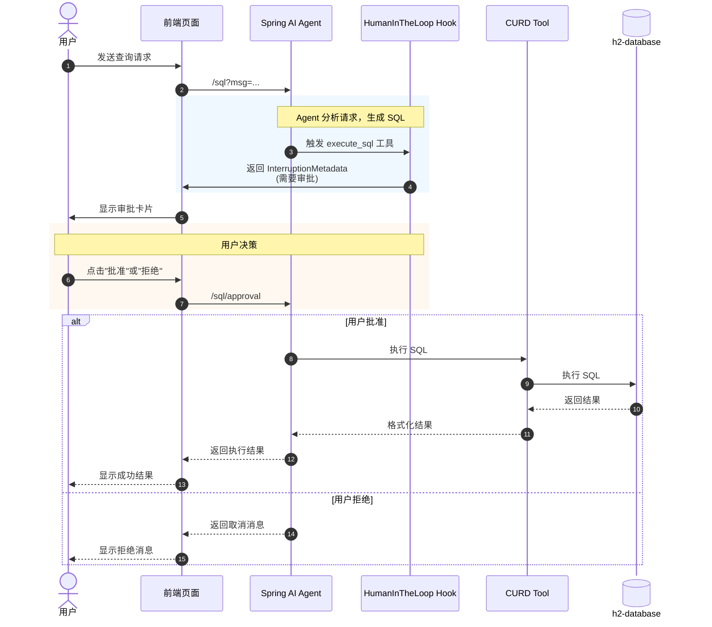

# 从自然语言到SQL，再加一道人工防线：Spring AI Alibaba 实战


## 1. 引言

在 AI 应用开发中，如何让大语言模型（LLM）安全地执行数据库操作是一个核心挑战。直接让 AI 执行 SQL 存在风险——一旦生成错误的 SQL 语句，可能导致数据丢失或泄露。本文将介绍如何基于 Spring AI Alibaba 实现一个带有**人工审批机制**的智能 SQL 查询助手，让 AI 在执行危险操作前必须经过人类确认。

本文涉及的项目完整代码可以在 [/ali/L02-human-in-loop](https://github.com/liuyueyi/spring-ai-demo/tree/master/ali/L02-human-in-loop) 目录下找到。


## 2. 项目概述

本项目实现了一个智能 SQL 查询助手，核心特性包括：

- **自然语言转 SQL**：用户可以用自然语言描述查询需求，AI 自动生成并执行 SQL
- **人工审批机制**：所有 SQL 执行前需要用户确认（Human-in-the-loop）
- **安全防护**：自动拦截危险 SQL 操作（如 DROP、TRUNCATE 等）
- **完整 CRUD 支持**：支持 SELECT、INSERT、UPDATE、DELETE 四种操作
- **对话式交互**：基于 Web 界面提供流畅的用户体验

### 2.1 技术栈

| 组件 | 技术选型 |
|------|----------|
| AI 框架 | Spring AI Alibaba |
| 大模型 | 通义千问 (Qwen/Qwen3-8B) |
| Agent 架构 | Spring AI Graph (ReAct Agent) |
| 数据库 | H2 内存数据库 |
| Web 框架 | Spring Boot + Thymeleaf |

## 3. 核心概念解析

### 3.1 什么是 Human-in-the-loop？

Human-in-the-loop（人在循环中，简称 HITL）是一种人机协作模式，核心思想是在 AI 自动化流程中引入人类决策节点。在本项目中体现为：

```
用户请求 → AI 分析 → 生成 SQL → ⚠️ 暂停等待人类审批 → 执行/拒绝 → 返回结果
```

这种设计适用于以下场景：
- 金融交易需要人工审核
- 数据删除操作需要二次确认
- 敏感数据查询需要授权
- AI 置信度不高时需要人工判断


### 3.2 Spring AI Graph 架构

Spring AI Alibaba 提供了基于 Graph（图结构）的 Agent 架构，核心组件包括：

- **Node（节点）**：Agent 中的处理单元
- **Edge（边）**：节点之间的连接逻辑
- **State（状态）**：整个对话的上下文信息
- **Checkpointer（检查点）**：保存状态快照，支持中断恢复
- **Hook（钩子）**：在特定时机插入自定义逻辑（如人工审批）


## 4. 核心实现

### 4.0. 架构流程图

我们先从整体的交互来看看这个自然语言转sql、并支持sql执行审批的流程是怎么运转的




### 4.1 项目依赖

首先需要在 `pom.xml` 中引入相关依赖：

```xml
<dependencies>
    <!-- Spring AI OpenAI 兼容支持 -->
    <dependency>
        <groupId>org.springframework.ai</groupId>
        <artifactId>spring-ai-starter-model-openai</artifactId>
    </dependency>
    
    <!-- Spring Web -->
    <dependency>
        <groupId>org.springframework.boot</groupId>
        <artifactId>spring-boot-starter-web</artifactId>
    </dependency>
    
    <!-- H2 数据库 -->
    <dependency>
        <groupId>com.h2database</groupId>
        <artifactId>h2</artifactId>
        <scope>runtime</scope>
    </dependency>
    
    <!-- Spring Data JPA -->
    <dependency>
        <groupId>org.springframework.boot</groupId>
        <artifactId>spring-boot-starter-data-jpa</artifactId>
    </dependency>
    
    <!-- Thymeleaf 模板引擎 -->
    <dependency>
        <groupId>org.springframework.boot</groupId>
        <artifactId>spring-boot-starter-thymeleaf</artifactId>
    </dependency>
</dependencies>
```

### 4.2 数据库配置

在 `application.yml` 中配置 H2 数据库和 AI 模型：

```yaml
spring:
  ai:
    openai:
      api-key: ${silicon-api-key}  # 替换为你的 API Key
      base-url: https://api.siliconflow.cn
      chat:
        options:
          model: Qwen/Qwen3-8B
  
  datasource:
    url: jdbc:h2:mem:testdb;DB_CLOSE_DELAY=-1
    driver-class-name: org.h2.Driver
    username: sa
    password:
  
  h2:
    console:
      enabled: true
      path: /h2-console
  
  jpa:
    database-platform: org.hibernate.dialect.H2Dialect
    hibernate:
      ddl-auto: create-drop
```

### 4.3 订单实体类

定义订单表对应的 JPA 实体：

```java
@Entity
@Table(name = "t_order")
public class Order {
    @Id
    @GeneratedValue(strategy = GenerationType.IDENTITY)
    private Long id;
    
    @Column(name = "order_no", length = 64)
    private String orderNo;
    
    @Column(name = "customer_name", length = 128)
    private String customerName;
    
    @Column(name = "product_name", length = 256)
    private String productName;
    
    @Column(name = "quantity")
    private Integer quantity;
    
    @Column(name = "unit_price", precision = 10, scale = 2)
    private BigDecimal unitPrice;
    
    @Column(name = "total_amount", precision = 10, scale = 2)
    private BigDecimal totalAmount;
    
    @Column(name = "status", length = 32)
    private String status;
    
    // ... getters and setters
}
```

### 4.4 CURD 工具实现

这是核心组件之一，负责实际执行 SQL 操作：

```java
@Component
public class CurdTool {
    
    /**
     * 执行 SQL 操作
     */
    public Map<String, Object> execute(JdbcTemplate jdbcTemplate, 
                                        String sql, List<Object> params) {
        // 1. 识别 SQL 类型
        SqlType sqlType = identifySqlType(sql);
        
        // 2. 根据类型执行
        switch (sqlType) {
            case SELECT:
                return executeSelect(sql, params);
            case INSERT:
                return executeInsert(sql, params);
            case UPDATE:
                return executeUpdate(sql, params);
            case DELETE:
                return executeDelete(sql, params);
            default:
                return Map.of("success", false, "message", "不支持的 SQL 操作");
        }
    }
    
    /**
     * SQL 安全性检查
     */
    public boolean isSqlSafe(String sql) {
        String[] dangerousKeywords = {
            "DROP ", "TRUNCATE ", "ALTER ", "GRANT ", "REVOKE ",
            "CREATE ", "EXEC ", "EXECUTE ", "CALL ", "LOAD_FILE"
        };
        
        String upperSql = sql.toUpperCase();
        for (String keyword : dangerousKeywords) {
            if (upperSql.contains(keyword)) {
                return false;
            }
        }
        return true;
    }
}
```

### 4.5 人工审批 Hook

这是实现 Human-in-the-loop 的关键组件(借助HumanInTheLoopHook，要求在执行 execute_sql 工具之前，必须完成人工的确认机制，只有再次接收到用户的反馈之后，才会继续往后面执行动作)

```java
// 创建人工介入 Hook，对 SQL 执行工具添加审批机制
HumanInTheLoopHook humanInTheLoopHook = HumanInTheLoopHook.builder()
        .approvalOn("execute_sql", ToolConfig.builder()
                .description("⚠️ SQL 执行操作需要审批！请确认 SQL 语句的安全性和正确性：")
                .build())
        .build();
```

### 4.6 Agent 初始化与配置

将所有组件组装在一起，创建完整的 Agent：

```java
private ReactAgent initAgent() {
    // 1. 创建 SQL 执行工具
    ToolCallback curdToolCallback = FunctionToolCallback.builder(
        "execute_sql",
        (Map<String, Object> args) -> {
            String sql = (String) args.get("sql");
            
            // 安全检查
            if (!curdTool.isSqlSafe(sql)) {
                return "❌ 错误：SQL 包含危险操作，已被拦截！";
            }
            
            // 执行 SQL
            List<Object> params = (List<Object>) args.getOrDefault("params", null);
            Map<String, Object> result = curdTool.execute(jdbcTemplate, sql, params);
            
            return curdTool.formatResult(result);
        }
    )
    .description("执行 SQL 操作（支持 SELECT/INSERT/UPDATE/DELETE）")
    .inputType(Map.class)
    .build();
    
    // 2. 创建人工审批 Hook
    HumanInTheLoopHook humanInTheLoopHook = HumanInTheLoopHook.builder()
            .approvalOn("execute_sql", ToolConfig.builder()
                    .description("⚠️ SQL 执行操作需要审批！")
                    .build())
            .build();
    
    // 3. 创建检查点保存器（用于中断恢复）
    MemorySaver memorySaver = MemorySaver.builder().build();
    
    // 4. 构建 Agent
    ReactAgent agent = ReactAgent.builder()
            .name("sql_query_agent")
            .model(chatModel)
            .instruction("""
                你是一个智能 SQL 助手，可以访问订单数据库（表名：t_order）。
                
                【表结构】
                - id: 订单 ID
                - order_no: 订单号
                - customer_name: 客户姓名
                - product_name: 产品名称
                - quantity: 数量
                - unit_price: 单价
                - total_amount: 总金额
                - status: 订单状态（已完成/待发货/待支付）
                
                【重要】
                1. 所有 SQL 操作都需要人工审批确认
                2. 禁止使用 DROP、TRUNCATE、ALTER 等危险操作
                3. 建议使用参数化查询
                """)
            .tools(curdToolCallback)
            .hooks(List.of(humanInTheLoopHook))
            .saver(memorySaver)
            .build();
    
    return agent;
}
```

### 4.7 审批流程处理

处理用户的首次请求和审批决策：

> 注意：首次请求，触发审批之后，我们新增了一个接口用于接收用户的审批结果；很容易想到，审批结果的实现中，需要续上第一次的请求，怎么维护这个完整的请求状态呢？
>
> 这就是 `MemorySaver` 的重要作用了，其次就是下面的实现是由后端来维护审批状态；这里也可以将相关状态给前端，让前端在调用 `/sq/approval` 接口时，一并返回给后端，这样后端就可以基于请求参数来恢复上次的请求状态了😊

```java
@GetMapping("/sql")
public Map<String, Object> chat(String msg, String sessionId) {
    RunnableConfig config = RunnableConfig.builder()
            .threadId(sessionId != null ? sessionId : "default-session")
            .build();
    
    // 第一次调用 - 可能触发中断
    Optional<NodeOutput> result = reactAgent.invokeAndGetOutput(msg, config);
    
    // 检查是否需要人工审批
    if (result.isPresent() && result.get() instanceof InterruptionMetadata) {
        InterruptionMetadata interruption = (InterruptionMetadata) result.get();
        
        // 保存待审批状态
        pendingApprovals.put(sessionId, 
            new PendingApproval(interruption, config, msg, toolResultKey));
        
        // 返回审批信息
        return Map.of(
            "status", "pending_approval",
            "toolFeedbacks", convertToolFeedbacks(interruption.toolFeedbacks()),
            "message", "需要您的审批确认"
        );
    }
    
    return Map.of("status", "success", "messages", extractLastMessageText(result.orElse(null)));
}

@PostMapping("/sql/approval")
public Map<String, Object> handleApproval(@RequestBody Map<String, Object> request) {
    String sessionId = (String) request.get("sessionId");
    Boolean approved = (Boolean) request.get("approved");
    
    PendingApproval pending = pendingApprovals.get(sessionId);
    
    // 构建审批反馈
    InterruptionMetadata.Builder feedbackBuilder = InterruptionMetadata.builder()
            .nodeId(pending.interruptionMetadata.node())
            .state(pending.interruptionMetadata.state());
    
    pending.interruptionMetadata.toolFeedbacks().forEach(toolFeedback -> {
        InterruptionMetadata.ToolFeedback approvedFeedback =
            InterruptionMetadata.ToolFeedback.builder(toolFeedback)
                .result(approved 
                    ? InterruptionMetadata.ToolFeedback.FeedbackResult.APPROVED
                    : InterruptionMetadata.ToolFeedback.FeedbackResult.REJECTED)
                .build();
        feedbackBuilder.addToolFeedback(approvedFeedback);
    });
    
    // 继续执行
    RunnableConfig resumeConfig = RunnableConfig.builder()
            .threadId(sessionId)
            .addMetadata(RunnableConfig.HUMAN_FEEDBACK_METADATA_KEY, 
                feedbackBuilder.build())
            .build();
    
    Optional<NodeOutput> finalResult = reactAgent.invokeAndGetOutput("", resumeConfig);
    
    return Map.of(
        "status", approved ? "approved" : "rejected",
        "message", approved ? "SQL 已执行成功" : "操作已取消"
    );
}
```

## 5. 前端交互实现

### 5.1 审批界面

当 Agent 检测到需要执行 SQL 时，会暂停并返回审批信息给前端：

```javascript
async function sendMessage() {
    const response = await fetch(`/sql?msg=${encodeURIComponent(message)}&sessionId=${sessionId}`);
    const data = await response.json();
    
    if (data.status === "pending_approval") {
        // 显示审批卡片
        showApprovalCard(
            data.toolFeedbacks[0].arguments,  // SQL 语句
            data.toolFeedbacks[0].description  // 审批说明
        );
    } else {
        // 直接显示结果
        appendMessage('assistant', data.messages);
    }
}

async function handleApproval(approved) {
    const response = await fetch(`/sql/approval`, {
        method: 'POST',
        body: JSON.stringify({
            sessionId: sessionId,
            approved: approved
        })
    });
    
    // 更新审批状态
    updateApprovalStatus(approved, response.resultMessage);
}
```

### 5.2 界面效果

审批界面包含以下元素：
- SQL 语句预览（代码高亮）
- 操作说明描述
- 批准/拒绝按钮
- 审批状态标签（等待审批/已批准/已拒绝）
- 执行结果展示

## 6. 使用示例

### 6.1 查询数据

```
查询所有已完成状态的订单
```

AI 会生成类似这样的 SQL：
```json
{"sql": "SELECT * FROM t_order WHERE status = ?", "params": ["已完成"]}
```

然后弹出审批卡片，用户确认后执行。


### 6.2 插入数据

```
张三新买了一台macmin 花了3999
```

生成的 SQL：
```json
{
    "sql": "INSERT INTO t_order (order_no, customer_name, product_name, quantity, unit_price, total_amount, status, create_time, update_time) VALUES (?, ?, ?, ?, ?, ?, ?, ?, ?)",
    "params": [
        "ORD20260310002",
        "张三",
        "Mac mini",
        1,
        3999,
        3999,
        "待支付",
        "2026-03-10 10:00:00",
        "2026-03-10 10:00:00"
    ]
}
```


### 6.3 更新数据

```
张三的mac mini已经完成了支付
```

生成的 SQL：
```json
{"sql": "UPDATE t_order SET status = ? WHERE order_no = ?", "params": ["已完成", "ORD20260310002"]}
```


### 6.4 删除数据

```
用户：删除订单号为 ORD20260309008 的订单
```

生成的 SQL：
```json
{"sql": "DELETE FROM t_order WHERE order_no = ?", "params": ["ORD20260310002"]}
```


## 7. 安全机制

### 7.1 SQL 危险操作拦截

系统自动拦截以下危险操作：

| 操作类型 | 示例 | 处理方式 |
|----------|------|----------|
| DROP | DROP TABLE | 直接拒绝 |
| TRUNCATE | TRUNCATE TABLE | 直接拒绝 |
| ALTER | ALTER TABLE | 直接拒绝 |
| GRANT | GRANT ALL | 直接拒绝 |
| REVOKE | REVOKE ALL | 直接拒绝 |
| 读写文件 | INTO OUTFILE | 直接拒绝 |

### 7.2 参数化查询

推荐使用参数化查询防止 SQL 注入：

```sql
-- ✅ 推荐
SELECT * FROM t_order WHERE customer_name = ?

-- ❌ 不推荐（容易导致 SQL 注入）
SELECT * FROM t_order WHERE customer_name = '" + input + "'
```

## 8. 扩展思考

### 8.1 进阶功能

基于当前架构，可以进一步扩展：

1. **多工具审批**：对不同工具设置不同的审批规则
2. **批量审批**：支持一次性审批多个操作
3. **审批历史**：记录所有审批操作用于审计
4. **自动审批**：对安全查询（如只读 SELECT）设置白名单
5. **LLM 预审**：用另一个 AI 模型先做初步风险评估

### 8.2 生产环境注意事项

- 使用生产级数据库（MySQL/PostgreSQL）替换 H2
- 添加完整的日志和审计功能
- 实现超时机制防止审批无限等待
- 添加权限控制，不同用户有不同审批权限
- 考虑使用消息队列实现异步审批

## 9. 总结

本文详细介绍了如何基于 Spring AI Alibaba 实现一个带有 Human-in-the-loop 特性的智能 SQL 查询助手。核心要点包括：

1. **人工审批机制**：通过 `HumanInTheLoopHook` 在危险操作执行前插入人工确认节点
2. **检查点保存**：使用 `MemorySaver` 保存状态，支持中断恢复
3. **安全防护**：多层防护确保只有安全的 SQL 能被执行
4. **用户体验**：前后端配合实现流畅的审批交互流程

这种设计模式不仅适用于 SQL 执行，在任何 AI 执行敏感操作的场景中都可以参考借鉴。

## 参考资料

- [Spring AI Alibaba 官方文档](https://java2ai.com/docs/overview)

零基础入门：

- [LLM 应用开发是什么：零基础也可以读懂的科普文(极简版)](https://mp.weixin.qq.com/s/qCn8x2XO2shA8MheYbHq0w)
- [大模型应用开发系列教程：序-为什么你“会用 LLM”，但做不出复杂应用？](https://mp.weixin.qq.com/s/2GXBNOUq3jlysipftz8TpA)
- [大模型应用开发系列教程：第一章 LLM到底在做什么？](https://mp.weixin.qq.com/s/v-z6EHY300ElOxdGPdzc0w)
- [大模型应用开发系列教程：第二章 模型不是重点，参数才是你真正的控制面板](https://mp.weixin.qq.com/s/t_BuAW9i0npcaJdua3Am2Q)
- [大模型应用开发系列教程：第三章 为什么我的Prompt表现很糟？](https://mp.weixin.qq.com/s/vzt0bGwcfnASOiBa0Kc7VQ)
- [大模型应用开发系列教程：第四章 Prompt 的工程化结构设计](https://mp.weixin.qq.com/s/Nk-N34TLJVCTI5F4k5rGaQ)
- [大模型应用开发系列教程：第五章 从 Prompt 到 Prompt 模板与工程治理](https://mp.weixin.qq.com/s/ZQbztqBq7_PzynG06N4-mg)
- [大模型应用开发系列教程：第六章 上下文窗口的真实边界](https://mp.weixin.qq.com/s/nnKspRO87xbrn4-LBV3RNA)
- [大模型应用开发系列教程：第七章 从 “堆上下文” 到 “管理上下文”](https://mp.weixin.qq.com/s/_5D2tF6CPnafj5mlmlwLNw)
- [大模型应用开发系列教程：第八章 记忆策略的工程化选择](https://mp.weixin.qq.com/s/z5qaLtjChsvjhWNs8Nw05Q)
- [大模型应用开发系列教程：第九章 上下文工程在企业知识库助手中的落地](https://mp.weixin.qq.com/s/MFvE8ahSyIhMZIFeSI91kg)


实战

- [实战 | 两百行实现一个自然语言地址提取智能体](https://mp.weixin.qq.com/s/96rHyp_gBUgmA2dhSbzNww)
- [实战 | 基于SpringAI与大模型的零配置发票智能提取架构](https://mp.weixin.qq.com/s/SnXdTB6tYqAzG7HgbnTSAQ)
- [实战 | 零基础搭建知识库问答机器人：基于SpringAI+RAG的完整实现](https://mp.weixin.qq.com/s/NHqLJbos-_nrxNNmhg7IBQ)
- [告别传统AI开发！SpringAI Agent + Skills重新定义智能应用](https://mp.weixin.qq.com/s/ujxVleNhjxzUgL-rjfFcVA)
- [Spring AI中的多轮对话艺术：让大模型主动提问获取明确需求](https://mp.weixin.qq.com/s/LcvmiIERs6aOIlRAKGGnFg)
- [实战 | 我用SpringAI造了个「微信红包封面设计师」](https://mp.weixin.qq.com/s/QyuWZ4EZ32pbcWn3fVphHQ)
- [实战干货！Spring AI 集成语音识别，实现实时翻译机器人的完整指南](https://mp.weixin.qq.com/s/qF0RfLts-fuMzv-uJZnBig?token=498918922&lang=zh_CN)
- [深入理解 ReAct 模式：基于Spring AI从0到1实现一个ReAct Agent](https://mp.weixin.qq.com/s/mJIibMdAFSDgXZBsM3tuPw?token=498918922&lang=zh_CN)
- [Spring AI工具调用如何对接真实业务？从自动到手动控制的完整链路剖析](https://mp.weixin.qq.com/s/TbTnpPkVPY_bTts_l8ltGQ?token=498918922&lang=zh_CN)
- [告别纯文本聊天：基于Spring AI，打造支持富UI的流式对话系统](https://mp.weixin.qq.com/s/U6ua-dpkVZTYT1n5JXiYDg?token=498918922&lang=zh_CN)
- [拒绝「笨拙」的 AI 对话！用 SpringAI + 自定义协议实现真正的智能交互](https://mp.weixin.qq.com/s/Kr-Va-TOG2uYPlWTW59WAQ?token=498918922&lang=zh_CN)
- [从自然语言到SQL，再加一道人工防线：Spring AI Alibaba 实战](https://mp.weixin.qq.com/s/454LmLMAVDuZfi6t-DgSqg?token=498918922&lang=zh_CN)
- [从零掌握 Spring AI Alibaba Skill：定义、注册与渐进式披露](https://mp.weixin.qq.com/s/TfTfQx1e661s6-cgVP8lwg)


---

**Author**: 一灰
**Date**: 2026-03-09
**Tags**: [Spring AI, Human-in-the-loop, AI Agent, SQL, 通义千问]

---

> 💬 **互动环节**：自然语言转SQL，若有数千张表，大模型如何知道查询哪张表呢？如果涉及到多表联合统计，又应该怎么实现呢？欢迎在评论区留言讨论！
>
> 如果觉得这篇文章有帮助，请点赞 👍 收藏 ⭐ 转发 🔄 支持一下！