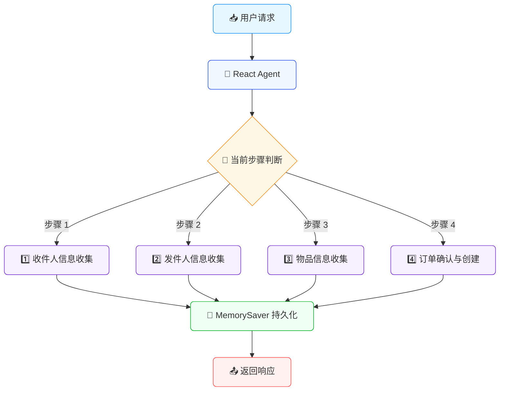
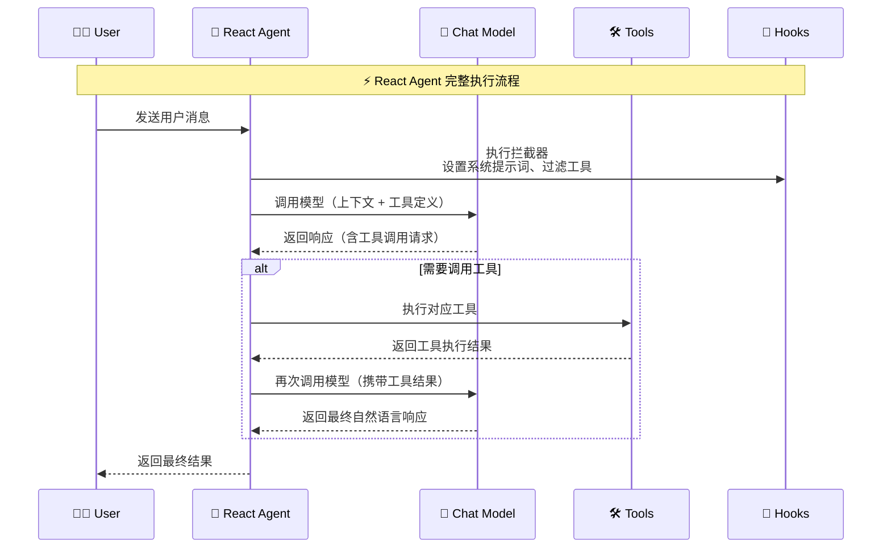

# Spring AI Alibaba 实战：从零实现快递下单多轮对话助手

**Author**: [一灰]  
**Date**: 2026-03-12  
**Tags**: [Spring AI, Alibaba, 多轮对话，Agent, 工具调用]

## 1. 引言

在人工智能应用的开发中，多轮对话交互是一个常见且重要的场景。现在市面上的AI应用，有不少都可以直接在对话框中，执行一些交互动作，比如“帮我买杯奶茶”，作为一个“古老”的研发人员，自然会有些好奇，这个是怎么实现的呢？

怎么就从调用大模型的API接口，进化到可以直接通过多轮对话，完成下单的操作呢？

比如用户想要通过对话完成快递下单，需要依次提供收件人信息、发件人信息、物品信息等。

如何优雅地管理这个分步骤的交互流程？又如何讲这些分步骤的过程数据，最终汇总一个完整的下单请求体呢？

本文将介绍如何使用 **Spring AI Alibaba** 框架，结合 **React Agent** 和 **Model Hook** 机制，实现一个基于对话框进行多次问答，支持分步流程控制的快递下单助手。

通过本文的学习，你将掌握如何基于大模型，如何将一个复杂的业务场景，拆解为一步一步的小任务，然后通过多轮对话，引导用户逐一完成任务，并最终实现业务场景的功能覆盖


- Spring AI Alibaba 的基础使用方法
- React Agent 的创建与配置
- Model Hook 机制实现分步流程控制
- 工具调用（Tool Calling）的最佳实践
- 对话上下文的持久化管理

## 2. 项目背景

### 2.1 业务场景

快递下单是一个典型的多轮对话场景，要想完成寄件工作，我们需要手机收件人、发件人信息、需要寄送的物品信息等，因此我们可以创建一个多轮对话，依次进行收件人信息、发件人信息、物品信息收集，最后确认下单并创建订单。

1. **第一步**：收集收件人信息（姓名、电话、地址）
2. **第二步**：收集发件人信息（姓名、电话、地址）
3. **第三步**：收集物品信息（类型、数量、重量等）
4. **第四步**：确认订单并创建

### 2.2 技术挑战

实现这个场景，作为一个传统的古老java开发，很容易想到的是有下面这些问题

- **状态管理**：如何记录当前收集到哪一步的信息？
- **流程控制**：如何确保用户按顺序提供信息，不能跳跃？
- **上下文记忆**：如何在多轮对话中记住之前收集的信息？
- **工具调用**：如何让 AI 在合适的时机调用正确的工具？

### 2.3 解决方案概述

本项目使用 Spring AI Alibaba 提供的核心能力：




## 3. 环境准备

### 3.1 技术栈

- **JDK**: 17+
- **Spring Boot**: 3.x
- **Spring AI**: 1.1.2
- **Spring AI Alibaba**: 1.1.2.1
- **Maven**: 依赖管理
- **Thymeleaf**: Web 界面展示

### 3.2 创建项目

首先创建 Maven 项目，在 `pom.xml` 中添加必要的依赖：

```xml
<dependencies>
    <!-- Spring AI OpenAI 适配器 -->
    <dependency>
        <groupId>org.springframework.ai</groupId>
        <artifactId>spring-ai-starter-model-openai</artifactId>
    </dependency>
    
    <!-- Spring Boot Web 支持 -->
    <dependency>
        <groupId>org.springframework.boot</groupId>
        <artifactId>spring-boot-starter-web</artifactId>
    </dependency>

    <!-- Thymeleaf 模板引擎 -->
    <dependency>
        <groupId>org.springframework.boot</groupId>
        <artifactId>spring-boot-starter-thymeleaf</artifactId>
    </dependency>
    
    <!-- Lombok 简化代码 -->
    <dependency>
        <groupId>org.projectlombok</groupId>
        <artifactId>lombok</artifactId>
    </dependency>
</dependencies>
```

### 3.3 配置文件

在 `application.yml` 中配置模型连接信息：

```yaml
spring:
  ai:
    openai:
      # 使用 SiliconFlow 作为模型提供商
      api-key: ${silicon-api-key}
      chat:
        options:
          # 选择支持工具调用的模型
          model: Qwen/Qwen2.5-7B-Instruct
      base-url: https://api.siliconflow.cn
  thymeleaf:
    cache: false

server:
  tomcat:
    uri-encoding: UTF-8
```

**说明**：
- 使用 SiliconFlow 平台提供的通义千问模型，使用OpenAI接口风格进行大模型访问
- API Key 通过环境变量注入，保证安全性
- 选择支持 Function Calling 的模型版本

## 4. 核心实现

### 4.1 整体架构设计


项目的核心组件包括：

```
L04-handsoff/
├── src/main/java/com/git/hui/springai/ali/
│   ├── L04Application.java                 # 启动入口
│   ├── express/
│   │   ├── ExpressOrderStateConstants.java # 状态常量定义
│   │   ├── ExpressOrderTools.java           # 工具类（核心）
│   │   ├── HandoffsExpressOrderHook.java    # Hook 配置
│   │   └── StepConfigInterceptor.java       # 步骤拦截器
│   └── mvc/
│       └── ExpressChatController.java       # Web 接口
└── src/main/resources/
    ├── application.yml                      # 配置文件
    └── static/express-chat.html             # 前端页面
```

### 4.2 定义状态常量

首先定义快递下单流程的状态常量，用于管理对话进度：

```java
package com.git.hui.springai.ali.express;

/**
 * 快递下单流程的状态常量定义
 */
public class ExpressOrderStateConstants {

    // ==================== 状态键常量 ====================
    
    /** 当前步骤序号 */
    public static final String KEY_ORDER_STEP = "order_step";
    public static final String KEY_CURRENT_STEP = "current_step";

    /** 收件人信息 */
    public static final String KEY_RECEIVE_INFO = "receive_info";
    
    /** 发件人信息 */
    public static final String KEY_SEND_INFO = "send_info";
    
    /** 快递物品信息 */
    public static final String KEY_EXPRESS_INFO = "express_info";

    // ==================== 步骤常量 ====================
    
    /** 步骤 1: 收件人信息收集 */
    public static final String STEP_RECEIVE_INFO_COLLECTOR = "receive_info_collector";
    
    /** 步骤 2: 发件人信息收集 */
    public static final String STEP_SEND_INFO_COLLECTOR = "send_info_collector";
    
    /** 步骤 3: 快递物品信息收集 */
    public static final String STEP_EXPRESS_INFO_COLLECTOR = "express_info_collector";
    
    /** 步骤 4: 订单确认与创建 */
    public static final String STEP_ORDER_CONFIRMATION = "order_confirmation";

    private ExpressOrderStateConstants() {
        // 防止实例化
    }
}
```

**设计要点**：
- 使用常量管理类统一维护所有状态键和步骤标识
- 当前阶段索引（KEY_ORDER_STEP、KEY_CURRENT_STEP）用于记录当前所处的流程阶段与整体的进度情况
- 状态键（KEY_RECEIVE_INFO、KEY_SEND_INFO、KEY_EXPRESS_INFO）用于在对话上下文中存储和检索数据
- 步骤标识（STEP_RECEIVE_INFO_COLLECTOR、STEP_SEND_INFO_COLLECTOR、STEP_EXPRESS_INFO_COLLECTOR、STEP_ORDER_CONFIRMATION）用于标识当前所处的流程阶段

这里需要重点介绍一下，这几个常量的设计

**point1: 执行阶段**

快递下单的流程是一个多轮对话的过程，那么就必然需要有一个能识别当前进行到哪一个阶段的方式，怎么做呢？

一个朴素的想法就是从第一步开始，每执行一步就往后面+1 ——> 所以就有了 `KEY_ORDER_STEP`，用于记录当前的进度（1/2/3/4）

实际上有这个进度就够了，但是当我们想知道当前的执行进度时，发现这个数字不太直观，所以干脆就把当前的阶段打印出来好了 ——> 所以就有了 `KEY_CURRENT_STEP`，用于记录当前所处的流程阶段

**point2: 数据共享**

所以整个下单被我们显示的拆分成了多个阶段，但是每个阶段的数据都会用于最后的订单创建，那么怎么才能共享数据呢？

这里借助的是 `Spring AI alibaba` 框架 `Graph` 中的 `state` 来实现数据共享的，我们将每个阶段的数据保存到上下文中，对应的每个阶段的数据存储设计一个索引，方便后续的查询和覆盖

所以就有了 `KEY_RECEIVE_INFO`、`KEY_SEND_INFO`、`KEY_EXPRESS_INFO` 分别用于存储 收件人信息、发件人信息、快递物品信息

**point3: 步骤标识**

步骤标识用于标识当前所处的流程阶段，这里定义了 4 个步骤：

- 收件人信息收集: `STEP_RECEIVE_INFO_COLLECTOR`
- 发件人信息收集: `STEP_SEND_INFO_COLLECTOR`
- 快递物品信息收集: `STEP_EXPRESS_INFO_COLLECTOR`
- 订单确认与创建: `STEP_ORDER_CONFIRMATION`


### 4.3 实现工具类

工具类负责具体的业务逻辑处理，包括信息的保存和订单的创建，当然这个demo主要是以模拟的方案进行提供（所以用户传的啥，我们存储啥）

> 在实际的应用场景中，可以借助大模型的能力，将输入的自然语言进行结构化输出，在上下文中直接存储结构化的解析结果

```java
/**
 * 快递下单工具类
 * 通过多轮对话收集收件人信息、发件人信息、快递物品信息，最终完成下单
 */
@Slf4j
public class ExpressOrderTools {
    /**
     * 第一步：接收并保存收件人信息
     */
    @Tool(description = "保存快递下单的收件人信息，用于快递下单场景")
    public String receiveAddress(
            @ToolParam(description = "收件人详细信息，包括姓名、电话、地址等") String receiveInfo,
            ToolContext toolContext) {
        log.info("[快递下单] 收件人信息：{}", receiveInfo);

        // 保存到上下文中
        saveToContext(toolContext, KEY_RECEIVE_INFO, receiveInfo);
        updateStep(toolContext, 2); // 更新到第 2 步

        return "✅ 收件人信息已保存：" + receiveInfo + "\n\n请提供发件人信息（姓名、电话、地址）";
    }

    /**
     * 第二步：接收并保存发件人信息
     */
    @Tool(description = "保存快递下单的发货人信息，用于快递下单场景")
    public String sendAddress(
            @ToolParam(description = "发件人详细信息，包括姓名、电话、地址等") String sendInfo,
            ToolContext toolContext) {
        log.info("[快递下单] 发件人信息：{}", sendInfo);

        // 保存到上下文中
        saveToContext(toolContext, KEY_SEND_INFO, sendInfo);
        updateStep(toolContext, 3); // 更新到第 3 步

        return "✅ 发件人信息已保存：" + sendInfo + "\n\n请描述要寄送的物品（如：五本书、一件衣服等）";
    }

    /**
     * 第三步：接收并保存快递物品信息
     */
    @Tool(description = "保存快递下单的寄送物品信息，如物品重量、体积、特殊要求、类型等，用于快递下单场景")
    public String expressInfo(
            @ToolParam(description = "寄送的快递信息，如 五本书、一件衣服等") String expressInfo,
            ToolContext toolContext
    ) {
        log.info("[快递下单] 快递物品信息：{}", expressInfo);

        // 保存到上下文中
        saveToContext(toolContext, KEY_EXPRESS_INFO, expressInfo);
        updateStep(toolContext, 4); // 更新到第 4 步

        return "✅ 快递物品信息已保存：" + expressInfo + "\n\n所有信息已收集完毕！可以调用 showExpressOrder 查看现在的订单信息";
    }

    /**
     * 第四步：显示当前订单信息
     */
    @Tool(description = "当用户希望查看订单信息时，调用这个工具返回订单信息")
    public String showExpressOrder(ToolContext toolContext) {
        log.info("[快递下单] 显示订单信息");

        String receiveInfo = getFromContext(toolContext, KEY_RECEIVE_INFO);
        String sendInfo = getFromContext(toolContext, KEY_SEND_INFO);
        String expressInfo = getFromContext(toolContext, KEY_EXPRESS_INFO);

        StringBuilder sb = new StringBuilder("📦 当前订单信息:\n");
        sb.append("━━━━━━━━━━━━━━━━━━━━\n");
        sb.append("📮 收件人：").append(receiveInfo != null ? receiveInfo : "未填写").append("\n");
        sb.append("📤 发件人：").append(sendInfo != null ? sendInfo : "未填写").append("\n");
        sb.append("📦 物品：").append(expressInfo != null ? expressInfo : "未填写").append("\n");
        sb.append("━━━━━━━━━━━━━━━━━━━━\n");

        var step = getFromContext(toolContext, KEY_ORDER_STEP);
        sb.append("\n当前进度：第 ").append(step).append("/4 步\n");

        var intStep = Integer.parseInt(step);
        if (intStep < 4) {
            sb.append("\n⚠️ 信息未填写完整，请继续补充");
            if (receiveInfo == null) {
                sb.append("\n→ 请先提供收件人信息");
            } else if (sendInfo == null) {
                sb.append("\n→ 请提供发件人信息");
            } else if (expressInfo == null) {
                sb.append("\n→ 请描述要寄送的物品");
            }
        } else {
            sb.append("\n✅ 所有信息已齐全，可以下单了！");
        }

        return sb.toString();
    }

    /**
     * 第五步：创建订单（模拟）
     */
    @Tool(description = "当用户确认创建订单时，调用这个工具执行创建订单动作")
    public String createOrder(ToolContext toolContext) {
        log.info("[快递下单] 创建订单");

        String receiveInfo = getFromContext(toolContext, KEY_RECEIVE_INFO);
        String sendInfo = getFromContext(toolContext, KEY_SEND_INFO);
        String expressInfo = getFromContext(toolContext, KEY_EXPRESS_INFO);

        // 检查信息是否完整
        if (receiveInfo == null || sendInfo == null || expressInfo == null) {
            return "❌ 订单信息不完整，无法下单！\n\n" + showExpressOrder(toolContext);
        }

        // 模拟生成订单号
        String orderNo = "EXP" + System.currentTimeMillis();

        StringBuilder sb = new StringBuilder("🎉 下单成功！\n");
        sb.append("━━━━━━━━━━━━━━━━━━━━\n");
        sb.append("📝 订单号：").append(orderNo).append("\n");
        sb.append("📮 收件人：").append(receiveInfo).append("\n");
        sb.append("📤 发件人：").append(sendInfo).append("\n");
        sb.append("📦 物品：").append(expressInfo).append("\n");
        sb.append("━━━━━━━━━━━━━━━━━━━━\n");
        sb.append("\n✅ 快递员将尽快上门取件，请耐心等待");

        // 下单完成后重置上下文
        ToolContextHelper.getStateForUpdate(toolContext).ifPresent(state -> {
            state.put(KEY_CURRENT_STEP, ExpressOrderStateConstants.STEP_RECEIVE_INFO_COLLECTOR);
            state.put(KEY_ORDER_STEP, 1);
            state.put(KEY_RECEIVE_INFO, "");
            state.put(KEY_SEND_INFO, "");
            state.put(KEY_EXPRESS_INFO, "");
        });
        return sb.toString();
    }

    // ==================== 辅助方法 ====================

    /**
     * 从上下文中获取数据
     */
    @SuppressWarnings("unchecked")
    private String getFromContext(ToolContext toolContext, String key) {
        return String.valueOf(ToolContextHelper.getState(toolContext).get().data().get(key));
    }

    /**
     * 保存数据到上下文
     */
    @SuppressWarnings("unchecked")
    private void saveToContext(ToolContext toolContext, String key, String value) {
        ToolContextHelper.getStateForUpdate(toolContext).ifPresent(up -> up.put(key, value));
        log.info("保存数据到上下文：{} = {}", key, value);
    }

    /**
     * 更新当前步骤
     */
    @SuppressWarnings("unchecked")
    private void updateStep(ToolContext toolContext, int step) {
        ToolContextHelper.getStateForUpdate(toolContext).ifPresent(context -> {
            context.put(KEY_ORDER_STEP, step);
            switch (step) {
                case 0:
                    // 重置进度
                    context.clear();
                    break;
                case 2:
                    context.put(KEY_CURRENT_STEP, ExpressOrderStateConstants.STEP_SEND_INFO_COLLECTOR);
                    break;
                case 3:
                    context.put(KEY_CURRENT_STEP, ExpressOrderStateConstants.STEP_EXPRESS_INFO_COLLECTOR);
                    break;
                case 4:
                    context.put(KEY_CURRENT_STEP, ExpressOrderStateConstants.STEP_ORDER_CONFIRMATION);
            }

            log.info("更新订单步骤到：{} - {}", step, context.get(KEY_CURRENT_STEP));
        });
    }
}
```

**关键设计**：

1. **工具注解**：使用 `@Tool` 注解标记可被 AI 调用的方法 （这个是SpringAI提供的工具能力）
2. **参数描述**：使用 `@ToolParam` 详细描述参数用途，帮助 AI 理解
3. **上下文管理**：通过 `ToolContext` 在对话过程中传递和保存状态
4. **流程推进**：每个工具执行完成后自动更新步骤状态

> 重点需要注意的是，上下文中数据的更新，需要借助 `ToolContextHelper.getStateForUpdate(toolContext)` 来做增量覆盖，不要直接拿上下文的Map，直接对map的数据的覆盖不会改变原数据。
> 
> 此外，当订单创建成功之后，需要将上下文数据重置，避免数据污染。但是目前对alibaba的框架学习还比较浅陋，没有找到合适的重置上下文策略，这里就实现了一个不优雅的置空操作🤣

### 4.4 实现步骤配置拦截器

这是整个设计的核心，通过拦截器机制实现分步流程控制：


**关键设计**：

在这里，我们借助框架的按需注册方式，结合当前的步骤，给大模型推荐最适合的工具，同样的，不同的步骤、执行的目的也不尽相同，所以为了更好的控制大模型的表现情况，每个阶段我们设置了不同的系统提示词

基于上面这个目的，所以实现了一个 `StepConfig` 类，用于存储不同阶段的相关信息；仔细看下面的实现，你会发现这里还有一个 `requiredKeys` 属性，它是干嘛的呢？

因为我们严格制定了执行步骤，为了简化整体的流程，我们希望是按照顺序进行执行，当前面的步骤没有执行完毕时，不要跳着执行后面的步骤，所以这里就定义了一个 `requiredKeys` 属性，用于记录当前步骤所依赖的前置动作，当前置动作还没有执行时，那就拦截掉，让用户先完成前置的任务

**关键实现**：

```java
package com.git.hui.springai.ali.express;

/**
 * 基于步骤配置的拦截器，根据当前步骤动态配置系统提示词和可用工具
 */
@Slf4j
public class StepConfigInterceptor extends ModelInterceptor {

    private final Map<String, StepConfig> stepConfigMap;

    public StepConfigInterceptor(Map<String, StepConfig> stepConfigMap) {
        this.stepConfigMap = stepConfigMap;
    }

    @Override
    public ModelResponse interceptModel(ModelRequest request, ModelCallHandler handler) {
        Map<String, Object> context = request.getContext();
        
        // 1. 获取当前步骤, 这里就和工具执行之后，更新步骤进度的逻辑进行了联动
        String currentStep = (String) context.getOrDefault(ExpressOrderStateConstants.KEY_CURRENT_STEP, ExpressOrderStateConstants.STEP_RECEIVE_INFO_COLLECTOR);

        // 2. 获取步骤配置 （不同的步骤、激发不同的工具和对应的提示词）
        StepConfig stepConfig = stepConfigMap.get(currentStep);
        if (stepConfig == null) {
            log.warn("未知步骤：{}, 使用默认步骤：{}", currentStep, 
                ExpressOrderStateConstants.STEP_RECEIVE_INFO_COLLECTOR);
            stepConfig = stepConfigMap.get(ExpressOrderStateConstants.STEP_RECEIVE_INFO_COLLECTOR);
        }

        // 3. 检查必需的前置条件是否满足
        for (String required : stepConfig.requiredKeys()) {
            if (context.get(required) == null) {
                throw new IllegalStateException(
                    "在进入 " + currentStep + " 之前必须先提供：" + required
                );
            }
        }

        // 4. 格式化提示词，替换上下文中的变量
        String systemPrompt = formatPrompt(stepConfig.prompt(), context);
        
        // 获取本次调用可用的工具列表
        List<String> toolNames = stepConfig.tools().stream()
                .map(t -> t.getToolDefinition().name())
                .collect(Collectors.toList());

        log.info("【快递下单】currentStep = {}, availableTools = {}, prompt = {}, context = {}", 
            currentStep, toolNames, systemPrompt, JSONObject.toJSON(context));

        // 5. 构建新的请求，应用当前步骤的配置
        ModelRequest overridden = ModelRequest.builder(request)
                .systemMessage(new SystemMessage(systemPrompt))
                // 动态筛选工具，指定本次调用可用的工具名称列表
                .tools(toolNames)
                .build();

        return handler.call(overridden);
    }

    /**
     * 步骤配置记录类
     * 
     * @param prompt       该步骤的系统提示词模板
     * @param tools        该步骤可用的工具列表
     * @param requiredKeys 进入该步骤前必须提供的状态键列表
     */
    public record StepConfig(String prompt, List<ToolCallback> tools, List<String> requiredKeys) {
    }
}
```

**核心功能**：

1. **动态系统提示词**：根据当前步骤注入不同的系统提示词
2. **工具过滤**：只暴露当前步骤需要的工具给 AI
3. **前置条件检查**：确保流程按顺序执行，不能跳跃

### 4.5 实现流程控制 Hook

Hook 是连接各个组件的桥梁，定义每个步骤的具体配置：

```java
package com.git.hui.springai.ali.express;

/**
 * 快递下单流程的 Hook，提供基于步骤的配置：
 * - 定义每个步骤的系统提示词
 * - 配置每个步骤可用的工具
 * - 定义每个步骤所需的前置条件
 */
public class HandoffExpressOrderHook extends ModelHook {

    private static final String RECEIVE_INFO_COLLECTOR_PROMPT = """
            你是一名快递下单助手，负责协助用户完成快递下单。
                        
            CURRENT STEP: receive_info_collector
            ORDER STEP: 1/4
                        
            在这一步，你需要：
            1. 热情地迎接用户
            2. 询问收件人的详细信息（姓名、电话、详细地址）
            3. 用户提供信息后，必须调用 receiveAddress 工具保存收件人信息，然后自动进入下一步
                       
            保持对话式且友好。不要一次问太多问题。如果用户提供的信息不完整，请引导补充。
            """;

    private static final String SEND_INFO_COLLECTOR_PROMPT = """
            你是一名快递下单助手，负责协助用户完成快递下单。
                        
            CURRENT STEP: send_info_collector
            ORDER STEP: 2/4
            COLLECTED INFO: 收件人信息已收集
                        
            在这一步，你需要：
            1. 确认收件人信息已收集
            2. 请用户提供发件人的详细信息（姓名、电话、详细地址）
            3. 用户提供信息后，必须调用 sendAddress 工具记录，并自动进入下一步
            
            如有不清楚之处，请在收集前提出澄清问题。
            """;

    private static final String EXPRESS_INFO_COLLECTOR_PROMPT = """
            你是一名快递下单助手，负责协助用户完成快递下单。
                        
            CURRENT STEP: express_info_collector
            ORDER STEP: 3/4
            COLLECTED INFO: 收件人信息、发件人信息已收集
                        
            在这一步，你需要：
            1. 确认发件人和收件人信息已收集
            2. 请用户描述要寄送的物品（如：五本书、一件衣服等）
            3. 用户提供信息后，必须调用 expressInfo 工具记录，并自动进入下一步
            
            可以询问物品的类型、数量、重量等信息，以便更好地服务。
            """;

    private static final String ORDER_CONFIRMATION_PROMPT = """
            你是一名快递下单助手，负责协助用户完成快递下单。
                        
            CURRENT STEP: order_confirmation
            ORDER STEP: 4/4
            COLLECTED INFO: 收件人信息、发件人信息、物品信息已全部收集
            REQUIRED ACTION: 调用 showExpressOrder 显示订单详情，等待用户确认后调用 createOrder 创建订单
            """;

    private final ModelInterceptor stepConfigInterceptor;

    public HandoffsExpressOrderHook() {
        // 获取所有工具回调
        ToolCallback receiveAddress = ExpressOrderTools.findByName("receiveAddress");
        ToolCallback sendAddress = ExpressOrderTools.findByName("sendAddress");
        ToolCallback expressInfo = ExpressOrderTools.findByName("expressInfo");
        ToolCallback showExpressOrder = ExpressOrderTools.findByName("showExpressOrder");
        ToolCallback createOrder = ExpressOrderTools.findByName("createOrder");

        // 配置每个步骤的提示词、工具和前置条件
        this.stepConfigInterceptor = new StepConfigInterceptor(Map.of(
                ExpressOrderStateConstants.STEP_RECEIVE_INFO_COLLECTOR, 
                new StepConfigInterceptor.StepConfig(
                    RECEIVE_INFO_COLLECTOR_PROMPT, 
                    List.of(receiveAddress), 
                    List.of()
                ),
                ExpressOrderStateConstants.STEP_SEND_INFO_COLLECTOR, 
                new StepConfigInterceptor.StepConfig(
                    SEND_INFO_COLLECTOR_PROMPT, 
                    List.of(sendAddress), 
                    List.of(ExpressOrderStateConstants.KEY_RECEIVE_INFO)
                ),
                ExpressOrderStateConstants.STEP_EXPRESS_INFO_COLLECTOR, 
                new StepConfigInterceptor.StepConfig(
                    EXPRESS_INFO_COLLECTOR_PROMPT, 
                    List.of(expressInfo), 
                    List.of(ExpressOrderStateConstants.KEY_RECEIVE_INFO, 
                            ExpressOrderStateConstants.KEY_SEND_INFO)
                ),
                ExpressOrderStateConstants.STEP_ORDER_CONFIRMATION, 
                new StepConfigInterceptor.StepConfig(
                    ORDER_CONFIRMATION_PROMPT, 
                    List.of(showExpressOrder, createOrder), 
                    List.of(ExpressOrderStateConstants.KEY_RECEIVE_INFO, 
                            ExpressOrderStateConstants.KEY_SEND_INFO, 
                            ExpressOrderStateConstants.KEY_EXPRESS_INFO)
                )
        ));
    }

    @Override
    public String getName() {
        return "HandoffExpressOrder";
    }

    @Override
    public List<ModelInterceptor> getModelInterceptors() {
        return List.of(stepConfigInterceptor);
    }

    @Override
    public Map<String, KeyStrategy> getKeyStrategys() {
        return Map.of(
                ExpressOrderStateConstants.KEY_ORDER_STEP, new ReplaceStrategy(),
                ExpressOrderStateConstants.KEY_CURRENT_STEP, new ReplaceStrategy(),
                ExpressOrderStateConstants.KEY_RECEIVE_INFO, new ReplaceStrategy(),
                ExpressOrderStateConstants.KEY_SEND_INFO, new ReplaceStrategy(),
                ExpressOrderStateConstants.KEY_EXPRESS_INFO, new ReplaceStrategy()
        );
    }
}
```

**设计亮点**：

1. **提示词工程**：为每个步骤精心设计系统提示词，明确 AI 的职责
2. **工具隔离**：每个步骤只能访问特定的工具，避免误用
3. **流程约束**：通过前置条件检查确保流程顺序执行

### 4.6 创建 React Agent

最后，将所有组件组装成一个完整的 Agent：

```java
// 获取快递下单工具
List<ToolCallback> expressTools = ExpressOrderTools.getTOOLS();

// 创建快递下单 Hook，提供分步流程控制
HandoffsExpressOrderHook expressHook = new HandoffsExpressOrderHook();

// 构建 React Agent
ReactAgent expressAgent = ReactAgent.builder()
    .name("express_order_agent")
    .model(chatModel)
    .tools(expressTools) // 注册工具
    .saver(memorySaver) // 保存上下文
    .hooks(expressHook)  // 使用 Hook 进行分步控制
    .enableLogging(true)
    .build();
```

**关键点**：

1. **Agent Builder 模式**：使用流式 API 构建 Agent，代码清晰易读
2. **MemorySaver**：提供对话记忆的持久化能力
3. **Hooks 机制**：注入自定义的流程控制逻辑

## 5. Web 界面集成

为了让用户可以实际使用这个应用，我们提供了一个简单的 Web 聊天界面。

### 5.1 REST 控制器

实现 RESTful API 接口处理聊天请求：

```java
/**
 * 快递下单聊天控制器
 * 提供基于对话的快递下单功能
 */
@Slf4j
@RestController
@RequestMapping("/express")
public class ExpressChatController {
    /**
     * 流式聊天接口（SSE）
     */
    @PostMapping(value = "/chatStream", produces = "text/event-stream")
    public Flux<Map<String, String>> chatStream(@RequestBody Map<String, String> request) {
        String message = request.get("message");
        String sessionId = request.getOrDefault("sessionId", UUID.randomUUID().toString());
        
        try {
            ReactAgent agent = getOrCreateAgent(sessionId);
            RunnableConfig config = RunnableConfig.builder().threadId(sessionId).build();
            
            // 使用流式调用
            return Flux.just(agent.call(new UserMessage(message), config))
                    .map(response -> Map.of(
                        "sessionId", sessionId,
                        "response", response.getText()
                    ));
        } catch (Exception e) {
            log.error("流式聊天处理失败", e);
            return Flux.just(Map.of(
                "sessionId", sessionId,
                "response", "抱歉，处理您的请求时出现错误：" + e.getMessage()
            ));
        }
    }
}
```

### 5.2 HTML 聊天界面

提供一个便于交互的聊天界面（完整代码见 `src/main/resources/static/express-chat.html`）：

主要功能：
- 实时消息显示
- 会话 ID 管理
- 消息发送和接收
- 重置对话功能
- 加载动画提示

## 6. 运行与测试

### 6.1 启动应用

确保已经配置好环境变量 `silicon-api-key`，然后运行：

```bash
cd ali/L04-handsoff
mvn spring-boot:run
```

### 6.2 测试命令行模式

应用启动后会自动执行 `CommandLineRunner` 中定义的测试流程，查看控制台输出：

```
=== Turn 1: 用户发起快递下单请求 ===
Assistant: 您好！我是快递下单助手。请问您需要寄送什么物品？请提供收件人信息（姓名、电话、详细地址）。

=== Turn 2: 用户提供收件人信息 ===
Assistant: ✅ 收件人信息已保存：收件人：张三，电话：13800138000，地址：北京市朝阳区某某街道 1 号

请提供发件人信息（姓名、电话、地址）

=== Turn 3: 用户提供发件人信息 ===
Assistant: ✅ 发件人信息已保存：发件人：李四，电话：13900139000，地址：上海市浦东新区某某路 2 号

请描述要寄送的物品（如：五本书、一件衣服等）

=== Turn 4: 用户提供物品信息 ===
Assistant: ✅ 快递物品信息已保存：我要寄五本书，不用保险，普通快递即可

所有信息已收集完毕！可以调用 showExpressOrder 查看现在的订单信息

=== Turn 5: 查看订单信息 ===
Assistant: 📦 当前订单信息:
━━━━━━━━━━━━━━━━━━━━
📮 收件人：收件人：张三，电话：13800138000，地址：北京市朝阳区某某街道 1 号
📤 发件人：发件人：李四，电话：13900139000，地址：上海市浦东新区某某路 2 号
📦 物品：我要寄五本书，不用保险，普通快递即可
━━━━━━━━━━━━━━━━━━━━

当前进度：第 4/4 步

✅ 所有信息已齐全，可以下单了！

=== Turn 6: 创建订单 ===
Assistant: 🎉 下单成功！
━━━━━━━━━━━━━━━━━━━━
📝 订单号：EXP1741780123456
📮 收件人：收件人：张三，电话：13800138000，地址：北京市朝阳区某某街道 1 号
📤 发件人：发件人：李四，电话：13900139000，地址：上海市浦东新区某某路 2 号
📦 物品：我要寄五本书，不用保险，普通快递即可
━━━━━━━━━━━━━━━━━━━━

✅ 快递员将尽快上门取件，请耐心等待
```

### 6.3 测试 Web 界面

浏览器访问：`http://localhost:8080/express-chat.html`


体验完整的对话流程：

1. 输入"我要寄快递"
2. 按提示依次提供收件人、发件人、物品信息
3. 查看订单详情
4. 确认下单

## 7. 核心原理详解


### 7.1 React Agent 工作原理

React Agent 是基于 ReAct 模式（Reasoning + Acting）实现的智能体，其核心流程：




### 7.2 Hook 机制

Hook 允许我们在 Agent 执行的不同阶段插入自定义逻辑：

- **ModelHook**：在模型调用前后进行拦截
- **ModelInterceptor**：修改模型请求和响应
- **KeyStrategy**：定义状态数据的合并策略

### 7.3 状态管理

对话状态通过 `MemorySaver` 进行持久化：

- **Thread ID**：标识一个对话线程
- **Checkpoint**：保存对话的历史状态
- **State**：存储当前的业务数据（如收件人信息）

每次对话都会：
1. 从 MemorySaver 加载上次的状态
2. 执行对话逻辑
3. 保存新的状态到 MemorySaver

这样即使应用重启，对话也能继续。

## 8. 扩展思考


### 8.1 适用场景

这种"渐进式信息收集"模式适用于：
- 客服对话系统
- 表单填写引导
- 复杂业务流程办理
- 多轮问答系统

### 8.2 优化方向

1. **流式输出**：使用 SSE 实现打字机效果
2. **状态持久化**：从 MemorySaver 改为数据库存储
3. **异常处理**：增强前端错误提示
4. **上下文记忆**：支持更复杂的状态恢复逻辑

### 8.3 与 RAG 结合

可以结合 RAG 技术，让 Agent 能够：
- 查询快递价格表
- 推荐最优快递方案
- 回答常见问题

## 9. 常见问题

### Q1: 如何切换不同的模型？

修改 `application.yml` 中的 `model` 配置：

```yaml
spring:
  ai:
    openai:
      chat:
        options:
          model: THUDM/GLM-Z1-9B-0414  # 更换为其他模型
```

注意：确保新模型支持 Function Calling 功能。

### Q2: 如何实现多会话管理？

每个会话使用不同的 `threadId`：

```java
RunnableConfig config1 = RunnableConfig.builder()
    .threadId("user-session-1")
    .build();
    
RunnableConfig config2 = RunnableConfig.builder()
    .threadId("user-session-2")
    .build();
```

### Q3: 如何清空会话状态？

调用工具的 reset 方法或重新创建 Agent：

```java
@PostMapping("/reset")
public Map<String, String> reset(@RequestBody Map<String, String> request) {
    String sessionId = request.get("sessionId");
    agentMap.remove(sessionId);  // 移除旧的 Agent
    // ... 创建新的会话
}
```

## 10. 总结

本文详细介绍了如何使用 Spring AI Alibaba 实现一个支持分步流程控制的快递下单助手。通过这个项目，我们学习了：

1. **React Agent** 的构建和使用
2. **Model Hook** 机制实现流程控制
3. **Tool Calling** 的设计模式
4. **对话状态管理** 的最佳实践
5. **Web 界面集成** 的完整方案

这种分步式对话交互模式可以应用到很多场景，如：
- 在线预订（餐厅、酒店、机票）
- 客户服务（问题诊断、故障排除）
- 数据录入（表单填写、信息收集）
- 教育培训（问答练习、考试评估）

希望本文能为你在开发 AI 应用时提供有价值的参考！

## 参考文献

1. [Spring AI 官方文档](https://docs.spring.io/spring-ai/reference/)
2. [Spring AI Alibaba 项目仓库](https://github.com/alibaba/spring-ai-alibaba)
3. [ReAct Agent 论文](https://arxiv.org/abs/2210.03629)
4. [SiliconFlow 模型平台](https://siliconflow.cn/)

---

**项目源码**：https://github.com/hui-project/spring-ai-demo/tree/master/ali/L04-handsoff

**作者博客**：[一灰的技术博客](https://ppai.top)

**欢迎交流**：如有问题或建议，欢迎在评论区留言讨论！
