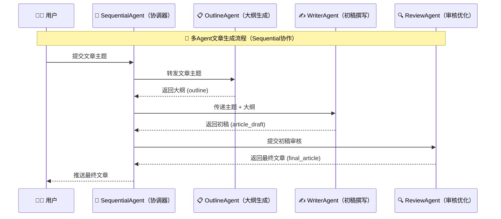

# 多智能体实战|基于 Spring AI Alibaba 实现故事创作的智能体

## 1. 引言

前面介绍了多智能体的相关知识点，相比较于大而全的单智能体，分而治之的多智能体显然更适合真实的业务场景。上一篇文章 [当 Spring AI Alibaba 遇上 Multi-Agent：解锁智能体的团队协作模式](https://mp.weixin.qq.com/s/wrKymQhomKCf9yi-bHbmyg) 介绍了四种多智能体执行模式，接下来我们有必要通过实际的应用场景来体验一下多智能体系统。

本文将通过一个故事创作系统，介绍如何使用 Spring AI Alibaba 的 SequentialAgent 实现一个多智能体系统。

## 2. 背景与动机

### 2.1 为什么需要多智能体？


在实际业务场景中，我们经常遇到需要多个步骤、多种专业能力才能完成的复杂任务。例如：
- 文章创作：需要先构思大纲，再填充内容，最后润色优化
- 代码开发：需要需求分析、架构设计、编码实现、代码审查
- 数据分析：需要数据清洗、特征工程、模型训练、结果解释

单一的大模型虽然功能强大，但在面对这类复杂任务时，往往难以保证每个环节的质量。而多智能体系统通过将任务分解，让每个 Agent 专注于自己最擅长的环节，可以显著提升最终结果的质量。


### 2.2 SequentialAgent 的优势

Spring AI Alibaba 提供了多种多智能体编排方式，其中 SequentialAgent（顺序执行代理）是最基础也是最常用的一种。它的特点包括：
- **线性流程**：按照预设顺序依次执行各个子 Agent
- **数据传递**：前一个 Agent 的输出可以作为后一个 Agent 的输入
- **职责分离**：每个 Agent 专注于单一职责
- **易于理解**：流程清晰，便于调试和维护

## 3. 项目架构与设计

### 3.1 系统架构

我们的故事创作系统包含三个专业 Agent，按顺序执行：


### 3.2 Agent 职责划分

#### OutlineAgent（大纲生成专家）
- **职责**：根据用户提供的主题，生成结构化的文章大纲
- **输入**：文章主题
- **输出**：包含章节和核心要点的大纲
- **能力要求**：逻辑性强，善于结构化思考

#### WriterAgent（专业作家）
- **职责**：根据大纲撰写完整的文章初稿
- **输入**：文章大纲 + 用户主题
- **输出**：完整的文章初稿
- **能力要求**：文笔流畅，善于表达

#### ReviewAgent（资深编辑）
- **职责**：对初稿进行评审和润色优化
- **输入**：文章初稿
- **输出**：优化后的最终文章
- **能力要求**：文字功底深厚，善于发现和修正问题

### 3.3 数据流转




## 4. 技术栈与依赖

### 4.1 核心技术栈
- **JDK 17+**
- **Spring Boot 3.x**
- **Spring AI Alibaba**
- **Alibaba LangGraph4j**
- **Maven**

### 4.2 Maven 依赖配置

```xml
<?xml version="1.0" encoding="UTF-8"?>
<project xmlns="http://maven.apache.org/POM/4.0.0"
         xmlns:xsi="http://www.w3.org/2001/XMLSchema-instance"
         xsi:schemaLocation="http://maven.apache.org/POM/4.0.0 
         http://maven.apache.org/xsd/maven-4.0.0.xsd">
    <modelVersion>4.0.0</modelVersion>
    
    <parent>
        <groupId>com.git.hui.springai.ali</groupId>
        <artifactId>ali</artifactId>
        <version>0.0.1-SNAPSHOT</version>
    </parent>

    <artifactId>L05-multi-agent-sequence</artifactId>

    <properties>
        <maven.compiler.source>17</maven.compiler.source>
        <maven.compiler.target>17</maven.compiler.target>
        <project.build.sourceEncoding>UTF-8</project.build.sourceEncoding>
    </properties>

    <dependencies>
        <!-- Spring AI OpenAI Starter -->
        <dependency>
            <groupId>org.springframework.ai</groupId>
            <artifactId>spring-ai-starter-model-openai</artifactId>
        </dependency>
        
        <!-- Spring Boot Web -->
        <dependency>
            <groupId>org.springframework.boot</groupId>
            <artifactId>spring-boot-starter-web</artifactId>
        </dependency>

        <!-- Thymeleaf 模板引擎 -->
        <dependency>
            <groupId>org.springframework.boot</groupId>
            <artifactId>spring-boot-starter-thymeleaf</artifactId>
        </dependency>
        
        <!-- Lombok -->
        <dependency>
            <groupId>org.projectlombok</groupId>
            <artifactId>lombok</artifactId>
        </dependency>
    </dependencies>
</project>
```

### 4.3 应用配置

```yaml
spring:
  application:
    name: L05-multi-agent-sequence
  
  ai:
    openai:
      api-key: ${OPENAI_API_KEY}  # 替换为你的 API Key
      base-url: https://dashscope.aliyuncs.com/compatible-mode/v1
      chat:
        options:
          model: qwen-max
          temperature: 0.7

server:
  port: 8080
```

## 5. 核心实现

### 5.1 OutlineAgent - 大纲生成专家

```java
package com.git.hui.springai.ali.writer;

import com.alibaba.cloud.ai.graph.agent.ReactAgent;
import org.springframework.ai.chat.model.ChatModel;
import org.springframework.beans.factory.annotation.Autowired;
import org.springframework.stereotype.Service;

/**
 * 大纲创作 agent
 */
@Service
public class OutlineAgent {
    private static final String PROMPT = """
            你是一位经验丰富的文章大纲设计师。请根据用户提供的主题，生成一份清晰、有逻辑的文章大纲。
            大纲应包含主要章节和每个章节的核心要点，以帮助后续写作。
            用户主题：{input}
            请直接返回大纲内容，不要包含额外解释。
            """;
    
    @Autowired
    private ChatModel chatModel;

    public ReactAgent outlineAgent() {
        ReactAgent agent = ReactAgent.builder()
                .name("outline_agent")
                .model(chatModel)
                .description("大纲生成 Agent")
                .instruction(PROMPT)
                .outputKey("outline")
                .includeContents(false)
                .returnReasoningContents(false)
                .enableLogging(true)
                .build();
        return agent;
    }
}
```

**关键参数说明：**
- `name`：Agent 的唯一标识名称
- `model`：使用的大模型
- `instruction`：Agent 的指令提示词
- `outputKey`：输出结果的键名，用于后续 Agent 引用
- `includeContents`：是否包含父流程的上下文（false 表示只基于自己的 instruction）
- `returnReasoningContents`：是否返回推理过程内容

### 5.2 WriterAgent - 专业作家

```java
package com.git.hui.springai.ali.writer;

import com.alibaba.cloud.ai.graph.agent.ReactAgent;
import org.springframework.ai.chat.model.ChatModel;
import org.springframework.beans.factory.annotation.Autowired;
import org.springframework.stereotype.Component;

/**
 * 文章撰写 Agent
 */
@Component
public class WriterAgent {

    private static final String instruction = """
            你是一个知名的作家，擅长用生动、易懂的语言创作文章。
            
            ---
            请根据大纲进行完整的内容创作。大纲内容如下：
            {outline}
            
            ---
            直接返回文章内容，不要包含任何额外说明。
            用户的提问是：
            {input}
            """;
    
    @Autowired
    private ChatModel chatModel;

    public ReactAgent writerAgent() {
        ReactAgent agent = ReactAgent.builder()
                .name("write_agent")
                .model(chatModel)
                .description("专业写作 Agent")
                .instruction(instruction)
                .outputKey("article_draft")
                .includeContents(false)
                .returnReasoningContents(false)
                .enableLogging(true)
                .build();
        return agent;
    }
}
```

**关键点：**
- 使用 `{outline}` 占位符引用 OutlineAgent 的输出
- 使用 `{input}` 占位符接收用户的原始输入
- `outputKey` 设置为 `article_draft`，供 ReviewAgent 使用

### 5.3 ReviewAgent - 资深编辑

```java
package com.git.hui.springai.ali.writer;

import com.alibaba.cloud.ai.graph.agent.ReactAgent;
import org.springframework.ai.chat.model.ChatModel;
import org.springframework.beans.factory.annotation.Autowired;
import org.springframework.stereotype.Component;

/**
 * 文章评审优化 Agent
 */
@Component
public class ReviewAgent {
    private static final String PROMPT = """
            你是一个资深的文章评审专家，负责对文章进行润色和优化。
            请审阅以下文章，修正语法错误、优化表达、确保逻辑清晰，请始终以幽默风趣、
            并结合实际用例进行辅助说明的语气进行扩展
            最终只返回修改后的文章，不要包含评论。
            """;
    
    @Autowired
    private ChatModel chatModel;

    public ReactAgent reviewAgent() {
        ReactAgent agent = ReactAgent.builder()
                .name("review_agent")
                .model(chatModel)
                .description("专业评审 Agent")
                .systemPrompt(PROMPT)
                // 用于在当前 Agent 节点处插入新的问题说明，引导模型和流程运行。
                // 支持使用占位符（如 {input}、{outputKey} 等）来动态引用状态中的数据
                .instruction("用户输入：{input} \nWriteAgent 生成的待审阅的文章初稿:\n {article_draft}")
                .outputKey("final_article")
                // 父流程中可能包含非常多子 Agent 的推理过程、每个子 Agent 的输出等。
                // includeContents 设置为 false 可以让子 Agent 专注于自己的任务，
                // 不受父流程复杂上下文的影响。
                .includeContents(false)
                // 控制子 Agent 的上下文是否返回父流程中。
                // 如果设置为 false，则其他 Agent 不会有机会看到这个子 Agent 内部的推理过程，
                // 它们只能看到这个 Agent 输出的内容（比如通过 outputKey 引用）。
                .returnReasoningContents(false)
                .enableLogging(true)
                .build();
        return agent;
    }
}
```

上面这三个Agent即为完成故事创作的子Agent，各司其职，前者的输出作为后面的输入


接下来则是需要使用`SequentialAgent`来将三个子Agent串联起来

### 5.4 SeqAgent - 顺序执行编排器

```java
package com.git.hui.springai.ali.writer;

import com.alibaba.cloud.ai.graph.agent.flow.agent.SequentialAgent;
import org.springframework.beans.factory.annotation.Autowired;
import org.springframework.stereotype.Component;

import java.util.List;

/**
 * 顺序执行的多智能体编排器
 */
@Component
public class SeqAgent {
    public static final String SEQ_AGENT = "seq_agent";

    @Autowired
    private ReviewAgent reviewAgent;
    @Autowired
    private WriterAgent writerAgent;
    @Autowired
    private OutlineAgent outlineAgent;

    public SequentialAgent seqAgent() {
        SequentialAgent agent = SequentialAgent.builder()
                .name(SEQ_AGENT)
                .description("根据用户给定的主题写一篇文章：先写大纲，然后再协作，最后进行评审和润色")
                .subAgents(List.of(
                    outlineAgent.outlineAgent(), 
                    writerAgent.writerAgent(), 
                    reviewAgent.reviewAgent()
                ))
                .build();
        return agent;
    }
}
```

**核心配置：**
- `subAgents`：按执行顺序排列的子 Agent 列表
- 数据会自动通过 `outputKey` 在 Agent 之间传递

### 5.5 流式接口实现 - WriterController

为了实时展示创作过程，我们提供了一个基于 SSE 的流式接口：

```java
package com.git.hui.springai.ali.controller;

import com.alibaba.cloud.ai.graph.NodeOutput;
import com.alibaba.cloud.ai.graph.agent.flow.agent.SequentialAgent;
import com.alibaba.cloud.ai.graph.streaming.OutputType;
import com.alibaba.cloud.ai.graph.streaming.StreamingOutput;
import com.fasterxml.jackson.core.JsonProcessingException;
import com.fasterxml.jackson.databind.ObjectMapper;
import com.git.hui.springai.ali.writer.SeqAgent;
import lombok.extern.slf4j.Slf4j;
import org.springframework.ai.chat.messages.AssistantMessage;
import org.springframework.ai.chat.messages.Message;
import org.springframework.http.MediaType;
import org.springframework.http.codec.ServerSentEvent;
import org.springframework.web.bind.annotation.*;
import reactor.core.publisher.Flux;

import java.util.HashMap;
import java.util.Map;

/**
 * 文章创作控制器 - 提供流式 SSE 接口
 */
@Slf4j
@RestController
@RequestMapping("/api/writer")
public class WriterController {

    private final SeqAgent seqAgent;
    private final ObjectMapper objectMapper = new ObjectMapper();

    public WriterController(SeqAgent seqAgent) {
        this.seqAgent = seqAgent;
    }

    /**
     * 流式文章创作接口
     * 使用 SSE (Server-Sent Events) 实时返回创作进度
     */
    @GetMapping(value = "/stream", produces = MediaType.TEXT_EVENT_STREAM_VALUE)
    public Flux<ServerSentEvent<String>> createArticleStream(@RequestParam String topic) {
        log.info("开始创作主题：{}", topic);
        
        try {
            SequentialAgent sequentialAgent = seqAgent.seqAgent();
            
            // 获取流式输出
            Flux<NodeOutput> agentStream = sequentialAgent.stream(topic);
            
            return agentStream
                    .filter(nodeOutput -> !(nodeOutput instanceof StreamingOutput<?> so && 
                            so.getOutputType() == OutputType.AGENT_MODEL_FINISHED))
                    .map(nodeOutput -> {
                        String node = nodeOutput.node();
                        String agentName = nodeOutput.agent();
                        
                        // 构建响应数据
                        Map<String, Object> data = new HashMap<>();
                        data.put("node", node);
                        data.put("agent", agentName);
                        
                        StringBuilder contentBuilder = new StringBuilder();
                        boolean hasContent = false;
                        
                        if (nodeOutput instanceof StreamingOutput<?> streamingOutput) {
                            Message message = streamingOutput.message();
                            if (message instanceof AssistantMessage assistantMessage) {
                                if (!assistantMessage.hasToolCalls()) {
                                    String text = assistantMessage.getText();
                                    if (text != null && !text.trim().isEmpty()) {
                                        contentBuilder.append(text);
                                        hasContent = true;
                                    }
                                }
                            }
                        }
                        
                        data.put("content", contentBuilder.toString());
                        data.put("hasContent", hasContent);
                        
                        // 根据 agent 类型设置阶段标识
                        String stage = determineStage(agentName);
                        data.put("stage", stage);
                        
                        String json;
                        try {
                            json = objectMapper.writeValueAsString(data);
                        } catch (JsonProcessingException e) {
                            log.error("JSON 序列化失败", e);
                            json = "{\"error\":true,\"errorMessage\":\"JSON 序列化失败\"}";
                        }
                        
                        return ServerSentEvent.<String>builder()
                                .event("message")
                                .data(json)
                                .build();
                    })
                    .onErrorResume(error -> {
                        log.error("流式创作过程中发生错误", error);
                        
                        Map<String, Object> errorData = new HashMap<>();
                        errorData.put("error", true);
                        errorData.put("errorType", error.getClass().getSimpleName());
                        errorData.put("errorMessage", error.getMessage() != null ? error.getMessage() : "未知错误");
                        
                        String errorJson;
                        try {
                            errorJson = objectMapper.writeValueAsString(errorData);
                        } catch (JsonProcessingException e) {
                            log.error("错误信息 JSON 序列化失败", e);
                            errorJson = "{\"error\":true,\"errorMessage\":\"JSON 序列化失败\"}";
                        }
                        
                        return Flux.just(
                                ServerSentEvent.<String>builder()
                                        .event("error")
                                        .data(errorJson)
                                        .build()
                        );
                    })
                    .doOnComplete(() -> {
                        log.info("流式创作完成");
                    });
                    
        } catch (Exception e) {
            log.error("创建流式接口时发生错误", e);
            
            Map<String, Object> errorData = new HashMap<>();
            errorData.put("error", true);
            errorData.put("errorType", e.getClass().getSimpleName());
            errorData.put("errorMessage", "初始化失败：" + e.getMessage());
            
            String errorJson;
            try {
                errorJson = objectMapper.writeValueAsString(errorData);
            } catch (JsonProcessingException ex) {
                log.error("错误信息 JSON 序列化失败", ex);
                errorJson = "{\"error\":true,\"errorMessage\":\"JSON 序列化失败\"}";
            }
            
            return Flux.just(
                    ServerSentEvent.<String>builder()
                            .event("error")
                            .data(errorJson)
                            .build()
            );
        }
    }
    
    /**
     * 根据 agent 名称确定创作阶段
     */
    private String determineStage(String agentName) {
        if (agentName != null) {
            if (agentName.contains("outline")) {
                return "outline"; // 大纲阶段
            } else if (agentName.contains("write")) {
                return "draft"; // 初稿阶段
            } else if (agentName.contains("review")) {
                return "review"; // 评审优化阶段
            }
        }
        return "unknown";
    }
}
```

**流式处理关键点：**
1. 使用 `sequentialAgent.stream(topic)` 获取流式输出
2. 过滤掉 `AGENT_MODEL_FINISHED` 类型的输出
3. 从 `StreamingOutput` 中提取消息内容
4. 使用 Jackson 的 `ObjectMapper` 进行正确的 JSON 序列化
5. 通过 `determineStage` 方法识别当前创作阶段
6. 完善的错误处理和日志记录

### 5.6 前端页面 - 实时展示创作过程

前端页面位于 `src/main/resources/templates/writer.html`，主要特性：

#### 核心功能
- **三栏布局**：分别展示大纲、初稿、最终稿
- **实时流式更新**：使用 EventSource 接收 SSE 数据
- **动态激活面板**：高亮当前创作阶段
- **Markdown 渲染**：使用 marked.js 解析 Markdown 格式
- **代码高亮**：使用 highlight.js 进行语法高亮

#### SSE 连接处理

```javascript
// 建立 SSE 连接
const url = `/api/writer/stream?topic=${encodeURIComponent(topic)}`;
eventSource = new EventSource(url);

// 监听消息事件
eventSource.addEventListener('message', function(event) {
    const data = JSON.parse(event.data);
    
    if (data.error) {
        handleError(data.errorMessage);
        return;
    }

    // 根据阶段更新对应的面板
    if (data.stage && data.hasContent) {
        updateStageContent(data.stage, data.content);
        activatePanel(data.stage);
    }
});

// 监听连接关闭（正常完成）
eventSource.onerror = function(event) {
    // 关闭连接以防止自动重连
    if (eventSource) {
        eventSource.close();
    }
    
    // 检查是否有内容被生成
    const hasAnyContent = contentAccumulators.outline.length > 0 || 
                         contentAccumulators.draft.length > 0 || 
                         contentAccumulators.review.length > 0;
    
    if (hasAnyContent) {
        // 有内容生成，说明是正常完成
        completeCreation();
    } else {
        // 没有内容，说明是异常断开
        handleError('连接意外断开');
    }
};
```

**关键实现细节：**
1. 使用 `isCreationComplete` 标志追踪创作完成状态
2. 在收到 review 阶段数据时标记为即将完成
3. 连接关闭时智能判断是正常完成还是异常断开
4. 移除独立的 `error` 事件监听器，避免误报错误
5. 内容累加器持续拼接流式返回的文本片段

## 6. 运行与测试

### 6.1 环境准备

1. **配置 API Key**
   ```bash
   export OPENAI_API_KEY=your-api-key-here
   ```

2. **启动应用**
   ```bash
   mvn spring-boot:run
   ```

### 6.2 访问前端页面

浏览器打开：`http://localhost:8080`

操作步骤：
1. 在输入框中输入文章主题，例如："春天的童话故事"
2. 点击"开始创作"按钮
3. 实时观看三个智能体的协作过程

### 6.3 API 调用示例

使用 curl 命令测试流式接口：

```bash
curl -N "http://localhost:8080/api/writer/stream?topic=春天的童话故事"
```

预期输出格式：

```
data: {"node":"seq_agent","agent":"outline_agent","stage":"outline","content":"# 春天的童话\n\n## 第一章：...",hasContent:true}
data: {"node":"seq_agent","agent":"write_agent","stage":"draft","content":"从前...",hasContent:true}
data: {"node":"seq_agent","agent":"review_agent","stage":"review","content":"经过优化...",hasContent:true}
```

web操作体验如下


## 7. 最佳实践与经验总结

### 7.1 Prompt 设计原则

1. **明确职责**：每个 Agent 的 instruction 应该清晰定义其职责范围
2. **输入输出明确**：使用占位符明确标注输入来源和输出去向
3. **格式约束**：明确要求返回内容的格式，避免多余解释
4. **风格统一**：保持相似的任务使用相似的 prompt 结构

### 7.2 数据传递技巧

1. **合理使用 outputKey**：为每个 Agent 的输出设置清晰的键名
2. **最小化上下文**：设置 `includeContents=false` 避免不必要的上下文干扰
3. **保护推理过程**：设置 `returnReasoningContents=false` 减少 token 消耗

### 7.3 错误处理策略

1. **流式错误捕获**：使用 `onErrorResume` 处理流式传输中的错误
2. **友好的错误提示**：将技术错误转换为用户友好的提示信息
3. **状态管理**：在前端维护清晰的状态机，区分正常完成和异常中断

### 7.4 性能优化建议

1. **选择合适的模型**：不同 Agent 可以选择不同能力和成本的模型
2. **控制输出长度**：在 prompt 中明确输出长度要求
3. **并发考虑**：对于不依赖前序结果的 Agent，可以考虑并行执行

## 8. 常见问题解答

### Q1: 如何调整 Agent 的执行顺序？

修改 `SeqAgent` 中的 `subAgents` 列表顺序即可：

```java
.subAgents(List.of(
    writerAgent.writerAgent(),  // 先写作
    outlineAgent.outlineAgent(), // 后大纲（不推荐，仅示例）
    reviewAgent.reviewAgent()
))
```

### Q2: 如何让后一个 Agent 看到前一个 Agent 的推理过程？

设置 `returnReasoningContents=true`：

```java
ReactAgent agent = ReactAgent.builder()
    .returnReasoningContents(true) // 返回推理过程
    .build();
```

### Q3: 如何实现条件分支而不是顺序执行？

可以使用 Spring AI Alibaba 提供的其他编排方式，如：
- **ParallelAgent**：并行执行多个 Agent
- **RouterAgent**：根据条件路由到不同的 Agent
- **LoopAgent**：循环执行直到满足条件

### Q4: 流式输出中出现乱码怎么办？

确保：
1. 后端设置正确的字符编码：`produces = MediaType.TEXT_EVENT_STREAM_VALUE`
2. 前端 HTML 设置 UTF-8 编码：`<meta charset="UTF-8">`
3. 数据库和文件系统都使用 UTF-8 编码

## 9. 总结与展望

### 9.1 核心要点回顾

本文介绍了如何使用 Spring AI Alibaba 的 SequentialAgent 实现一个多智能体故事创作系统：

1. **职责分离**：将复杂的创作任务分解为大纲、写作、评审三个专业环节
2. **顺序执行**：通过 SequentialAgent 按固定顺序编排多个 Agent
3. **数据传递**：利用 outputKey 和占位符实现 Agent 间的数据流转
4. **流式展示**：通过 SSE 实时推送创作进度，提升用户体验
5. **完善的前端**：提供美观的三栏布局和 Markdown 渲染

### 9.2 未来改进方向

1. **引入更多专业 Agent**：
   - 事实核查 Agent：验证文章中的事实准确性
   - SEO 优化 Agent：优化文章以适配搜索引擎
   - 多语言翻译 Agent：支持多语言输出

2. **增强交互性**：
   - 支持用户在创作过程中提供反馈
   - 允许用户对某个环节的结果不满意时重新生成
   - 提供多种风格选项（学术、通俗、幽默等）

3. **质量评估**：
   - 添加质量评分 Agent
   - 对比不同 Agent 组合的效果
   - 收集用户反馈持续优化

4. **性能优化**：
   - 实现 Agent 缓存机制
   - 支持部分结果的复用
   - 优化 token 使用效率

### 9.3 参考资料

- [Spring AI Alibaba 官方文档：https://java2ai.com/](https://java2ai.com/)
- [多智能体框架详解](https://java2ai.com/docs/frameworks/agent-framework/advanced/multi-agent)
- [SequentialAgent API 文档](https://java2ai.com/docs/frameworks/agent-framework/api/sequential-agent)

---

**项目源码**：[GitHub Repository](https://github.com/liuyueyi/spring-ai-demo/tree/master/ali/L05-multi-agent-sequence)

> **作者**：一灰  
**日期**：2026-03-17  
**标签**: #Spring-AI, #Multi-Agent, #SequentialAgent, #人工智能，#Java
