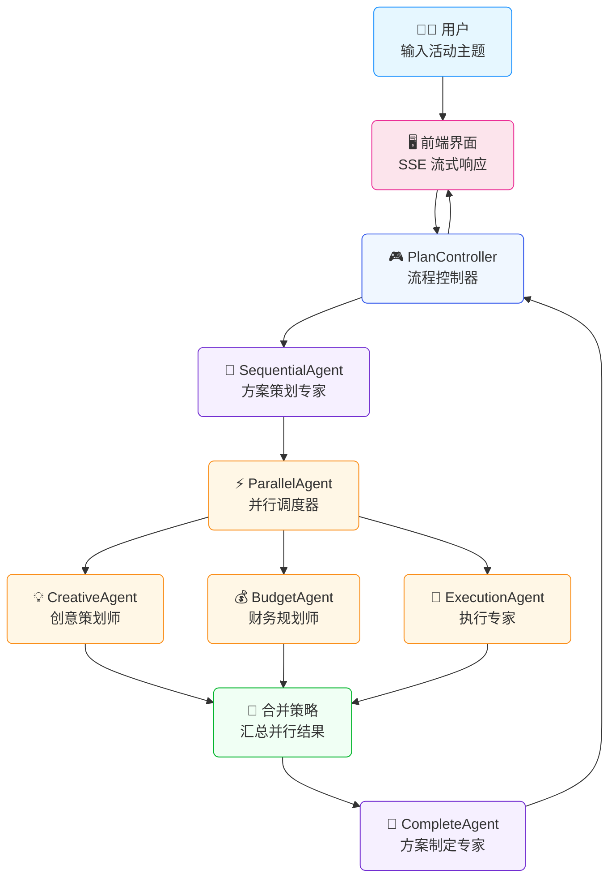
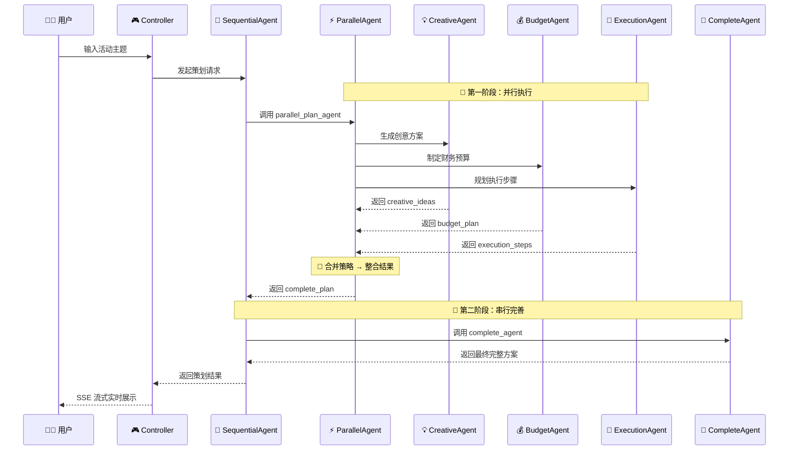

# 多智能体实战 | 基于 Spring AI Alibaba 实现方案策划多智能体

## 1. 引言

这一篇我们将继续之前多智能体介绍中的 [当 Spring AI Alibaba 遇上 Multi-Agent：解锁智能体的团队协作模式](https://mp.weixin.qq.com/s/wrKymQhomKCf9yi-bHbmyg)  并行策略，通过让多个 specialized agent（专业智能体）协同工作，以此构建出能够处理复杂任务的 AI 系统。本文将深入讲解如何使用 Spring AI Alibaba 框架实现一个基于并行多智能体协作的方案策划系统。

本项目通过构建一个"策划智能体"，演示了如何并行调用多个子 agent（创意策划师、财务规划师、执行专家），并通过两种不同的策略整合最终输出方案。


**通过本文的内容，您将会学到**：
- 如何使用 Spring AI Alibaba 的 ParallelAgent 实现并行多智能体调用
- 如何通过自定义合并策略整合多个 agent 的输出
- 如何利用 SequentialAgent 实现"并行 + 串行"的混合协作模式
- 如何构建 SSE 流式接口实时展示 agent 协作过程
- 如何设计现代化的前端界面可视化多智能体工作状态

## 2. 背景与动机

### 2.1 为什么需要多智能体协作？

在现实世界的业务场景中，一个复杂的策划任务往往需要从多个维度进行考量：

- **创意维度**：需要富有创意的点子和灵感
- **财务维度**：需要合理的预算规划和成本控制
- **执行维度**：需要详细的执行步骤和时间节点

传统的单一 agent 方法虽然也能完成这些任务，但存在以下问题：
1. **专业度不足**：一个 agent 很难在所有领域都表现出色
2. **上下文混乱**：过多的指令会让 agent 困惑
3. **可维护性差**：难以单独优化某个维度的能力

多智能体协作系统通过将复杂任务分解为多个子任务，每个子任务由专门优化的 agent 处理，最后整合结果，可以显著提升输出质量和系统可维护性。

### 2.2 技术选型

本项目选择 **Spring AI Alibaba** 框架，主要基于以下考虑：

- **丰富的 Agent 类型支持**：提供 ParallelAgent（并行）、SequentialAgent（串行）、ReactAgent（反应式）等多种 agent 类型
- **灵活的编排能力**：支持自定义合并策略、状态管理等高级功能
- **与 Spring 生态无缝集成**：可以充分利用 Spring Boot 的自动配置、依赖注入等特性
- **流式输出支持**：原生支持 SSE（Server-Sent Events），便于构建实时交互界面

## 3. 系统架构设计

### 3.1 整体架构图




### 3.2 核心组件说明


| 组件名称 | 类型 | 职责 | 输出键 |
|---------|------|------|--------|
| **ParallelPlanAgent** | ParallelAgent | 主协调 agent，并行调用三个子 agent | complete_plan |
| **CreativeAgent** | ReactAgent | 生成创意点子 | creative_ideas |
| **BudgetAgent** | ReactAgent | 制定预算规划 | budget_plan |
| **ExecutionAgent** | ReactAgent | 规划执行步骤 | execution_steps |
| **CompleteAgent** | ReactAgent | 整合所有输出形成最终方案 | complete_plan |
| **SequentialAgent** | SequentialAgent | 串联 ParallelAgent 和 CompleteAgent | - |


### 3.3 数据流转过程

接下来以数据流转的视角，看一下整个策划Agent的工作流程：




## 4. 详细设计与实现

### 4.1 子 Agent 定义

#### 4.1.1 创意策划师 (CreativeAgent)

```java
@Service
public class CreativeAgent {
    private static final String PROMPT = """
            你是一个创意策划师，请为以下活动主题提出至少 3 个富有创意的点子，要求新颖、可行。
            活动主题：{input}
            直接返回创意列表，每一点用简短的话描述。
             """;

    @Autowired
    private ChatModel chatModel;

    public ReactAgent creativeAgent() {
        ReactAgent agent = ReactAgent.builder()
                .name("creative_agent")
                .model(chatModel)
                .description("创意生成 Agent")
                .instruction(PROMPT)
                .outputKey("creative_ideas")  // 输出存储的键名
                .includeContents(false)
                .returnReasoningContents(false)
                .enableLogging(true)
                .build();
        return agent;
    }
}
```

**关键点说明**：
- **instruction**: 定义了 agent 的角色和任务，使用 `{input}` 占位符接收用户输入
- **outputKey**: 指定输出结果在状态中的存储键名，这里是 `creative_ideas`
- **enableLogging**: 启用日志记录，便于调试和观察 agent 行为

#### 4.1.2 财务规划师 (BudgetAgent)

```java
@Service
public class BudgetAgent {
    private static final String PROMPT = """
            你是一个财务规划师，请为以下活动主题制定一个粗略的预算规划，列出主要开支项和预估费用。
            活动主题：{input}
            直接返回预算规划内容。
             """;

    @Autowired
    private ChatModel chatModel;

    public ReactAgent budgetAgent() {
        ReactAgent agent = ReactAgent.builder()
                .name("budget_agent")
                .model(chatModel)
                .description("财务预算规划 Agent")
                .instruction(PROMPT)
                .outputKey("budget_plan")  // 输出存储的键名
                .includeContents(false)
                .returnReasoningContents(false)
                .enableLogging(true)
                .build();
        return agent;
    }
}
```

#### 4.1.3 执行专家 (ExecutionAgent)

```java
@Service
public class ExecutionAgent {
    private static final String PROMPT = """
            你是一个活动执行专家，请为以下活动主题规划关键的执行步骤和时间节点。
            活动主题：{input}
            直接返回执行步骤清单。
              """;

    @Autowired
    private ChatModel chatModel;

    public ReactAgent executionAgent() {
        ReactAgent agent = ReactAgent.builder()
                .name("execution_agent")
                .model(chatModel)
                .description("执行专家 Agent")
                .instruction(PROMPT)
                .outputKey("execution_steps")  // 输出存储的键名
                .includeContents(false)
                .returnReasoningContents(false)
                .enableLogging(true)
                .build();
        return agent;
    }
}
```

### 4.2 并行 Agent (ParallelPlanAgent)

这是本项目的核心组件，负责协调三个子 agent 的并行执行。


#### 4.2.1 ParallelAgent 的基本配置

```java
@Service
public class ParallelPlanAgent {
    
    public static final String PLAN_AGENT = "parallel_plan_agent";

    @Autowired
    private ChatModel chatModel;

    @Autowired
    private BudgetAgent budgetAgent;
    @Autowired
    private CreativeAgent creativeAgent;
    @Autowired
    private ExecutionAgent executionAgent;

    public ParallelAgent planAgent() {
        ParallelAgent agent = ParallelAgent.builder()
                .name(PLAN_AGENT)
                .description("多角度方案策划，可以从创意、财务、执行等各方面进行方案策划，通过并行调用 creative_agent、budget_agent、execution_agent 来生成制定计划所需要的内容，最终输出完整的计划方案给用户")
                .subAgents(List.of(
                    budgetAgent.budgetAgent(), 
                    creativeAgent.creativeAgent(), 
                    executionAgent.executionAgent()
                ))
                // 如果只调用并行策略，我们可以通过自定义的合并策略，拿之前 Agent 的输出，来构建完整的输出
                // .mergeStrategy(new PlanMergeStrategy(chatModel))
                // 默认的合并策略，对于先并行，后串行的使用场景，可以使用默认的策略
                .mergeStrategy(new ParallelAgent.DefaultMergeStrategy())
                .maxConcurrency(3)  // 最大并发数
                .mergeOutputKey("complete_plan")  // 合并后的输出键名
                .build();
        return agent;
    }
}
```

**关键参数说明**：
- **subAgents**: 要并行调用的子 agent 列表
- **mergeStrategy**: 合并策略，决定如何处理多个 agent 的输出
- **maxConcurrency**: 最大并发数，设置为 3 表示三个 agent 同时执行
- **mergeOutputKey**: 合并后的输出在状态中的键名

#### 4.2.2 方案一：自定义合并策略 (PlanMergeStrategy)

```java
public class PlanMergeStrategy implements ParallelAgent.MergeStrategy {
    
    private final ChatModel chatModel;

    public PlanMergeStrategy(ChatModel chatModel) {
        this.chatModel chatModel;
    }

    @Override
    public Object merge(Map<String, Object> mergedState, OverAllState overallState) {
        // 获取各个子 Agent 的输出
        String creativeIdeas = ((AssistantMessage) mergedState.get("creative_ideas")).getText();
        String budgetPlan = ((AssistantMessage) mergedState.get("budget_plan")).getText();
        String executionSteps = ((AssistantMessage) mergedState.get("execution_steps")).getText();

        // 获取用户原始输入
        String userInput = (String) overallState.value("input").orElse("");

        // 构建合并提示词
        String mergePrompt = buildMergePrompt(userInput, creativeIdeas, budgetPlan, executionSteps);

        // 调用大模型生成完整方案
        try {
            String completePlan = chatModel.call(mergePrompt);
            
            // 返回包含所有信息的 Map
            mergedState.put("complete_plan", completePlan);
            return mergedState;
        } catch (Exception e) {
            // 如果合并失败，返回原始结果
            return mergedState;
        }
    }

    /**
     * 构建合并提示词
     */
    private String buildMergePrompt(String userInput, String creativeIdeas, String budgetPlan, String executionSteps) {
        return String.format("""
                你是一位专业的方案策划顾问，请将以下三个方面的内容整合成一份完整、专业的策划方案。
                                    
                【活动主题】
                %s
                                    
                【创意点子】
                %s
                                    
                【预算规划】
                %s
                                    
                【执行步骤】
                %s
                                    
                ---
                请将以上内容整合为一份结构清晰、内容完整的策划方案，要求：
                1. 包含活动背景和目标
                2. 详细列出创意亮点
                3. 清晰的预算分配
                4. 具体的执行计划和时间节点
                5. 使用专业的格式和排版
                6. 语言简洁明了，易于理解
                                    
                直接返回完整的策划方案文档。
                """,
            userInput != null ? userInput : "未知主题",
            creativeIdeas != null ? creativeIdeas : "暂无创意点子",
            budgetPlan != null ? budgetPlan : "暂无预算规划",
            executionSteps != null ? executionSteps : "暂无执行步骤"
        );
    }
}
```

**策略特点**：
- 主动获取三个子 agent 的输出
- 通过 LLM 再次处理，生成结构化的完整方案
- 包含错误处理机制，合并失败时返回原始结果
- 适合**只需要并行执行**的场景

#### 4.2.3 方案二：组合 SequentialAgent

```java
public SequentialAgent seqPlanAgent() {
    SequentialAgent agent = SequentialAgent.builder()
            .name("方案策划专家")
            .description("根据用户给的信息，完成整体的方案策划")
            .subAgents(List.of(planAgent(), completeAgent()))
            .build();
    return agent;
}

public ReactAgent completeAgent() {
    ReactAgent agent = ReactAgent.builder()
            .name("complete_agent")
            .model(chatModel)
            .description("完成方案制定 Agent")
            .instruction("""
                你是一位专业的方案策划顾问，请将以下三个方面的内容整合成一份完整、专业的策划方案。
                                    
                【活动主题】
                {input}
                                    
                【创意点子】
                {creative_ideas}
                                    
                【预算规划】
                {budget_plan}
                                    
                【执行步骤】
                {execution_steps}
                                    
                ---
                请将以上内容整合为一份结构清晰、内容完整的策划方案，要求：
                1. 包含活动背景和目标
                2. 详细列出创意亮点
                3. 清晰的预算分配
                4. 具体的执行计划和时间节点
                5. 使用专业的格式和排版
                6. 语言简洁明了，易于理解
                                    
                直接返回完整的策划方案文档。
                """)
            .outputKey("complete_plan")
            .includeContents(false)
            .returnReasoningContents(false)
            .enableLogging(true)
            .build();
    return agent;
}
```

**策略特点**：
- 使用 SequentialAgent 将流程分为两个阶段
- **第一阶段**：ParallelAgent 并行执行三个子 agent，使用 DefaultMergeStrategy 合并每个agent的结果
- **第二阶段**：CompleteAgent 读取所有中间结果，生成最终方案
- 适合**先并行收集信息，后串行处理**的复杂场景


对于并行执行多Agent时，如何处理多个agent的输出结果，是我们必须考虑的事情，如果每个agent的结构是彼此独立，作为最终结果的一部分，那么简单的合并即可；如果后续还需要使用这些输出，来作为大模型的输入，那么在并行收集之后，再套一个串行Agent的调度策略，无疑是更好的一个选择


### 4.3 控制器实现 (PlanController)

提供 SSE 流式接口，实时推送 agent 协作过程。

```java
@Slf4j
@RestController
@RequestMapping("/api/writer")
public class PlanController {

    private final Agent planAgent;
    private final ObjectMapper objectMapper = new ObjectMapper();

    public PlanController(ParallelPlanAgent planAgent) {
        this.planAgent = planAgent.seqPlanAgent();  // 使用 SequentialAgent 方案
    }

    /**
     * 流式创作接口
     * 使用 SSE (Server-Sent Events) 实时返回创作进度
     */
    @GetMapping(value = "/stream", produces = MediaType.TEXT_EVENT_STREAM_VALUE)
    public Flux<ServerSentEvent<String>> createArticleStream(@RequestParam String topic) {
        log.info("开始创作主题：{}", topic);

        try {
            // 获取流式输出
            Flux<NodeOutput> agentStream = planAgent.stream(topic);

            return agentStream
                    .filter(nodeOutput -> !(nodeOutput instanceof StreamingOutput<?> so &&
                            so.getOutputType() == OutputType.AGENT_MODEL_FINISHED))
                    .map(nodeOutput -> {
                        String node = nodeOutput.node();
                        String agentName = nodeOutput.agent();

                        log.info("收到节点输出 - node: {}, agent: {}", node, agentName);

                        // 构建响应数据
                        Map<String, Object> data = new HashMap<>();
                        data.put("node", node);
                        data.put("agent", agentName);

                        StringBuilder contentBuilder = new StringBuilder();
                        boolean hasContent = false;

                        if (nodeOutput instanceof StreamingOutput<?> streamingOutput) {
                            Message message = streamingOutput.message();
                            if (message instanceof AssistantMessage assistantMessage) {
                                if (!assistantMessage.hasToolCalls()) {
                                    String text = assistantMessage.getText();
                                    if (text != null && !text.trim().isEmpty()) {
                                        contentBuilder.append(text);
                                        hasContent = true;
                                    }
                                }
                            } else {
                                // 表明是 PlanAgent 的输出，将结果输出给前端
                                hasContent = true;
                                nodeOutput.state().value("complete_plan").ifPresent(contentBuilder::append);
                            }
                        }

                        data.put("content", contentBuilder.toString());
                        data.put("hasContent", hasContent);

                        // 根据 agent 类型设置阶段标识
                        String stage = determineStage(agentName);
                        data.put("stage", stage);

                        String json;
                        try {
                            json = objectMapper.writeValueAsString(data);
                        } catch (JsonProcessingException e) {
                            log.error("JSON 序列化失败", e);
                            json = "{\"error\":true,\"errorMessage\":\"JSON 序列化失败\"}";
                        }

                        return ServerSentEvent.<String>builder()
                                .event("message")
                                .data(json)
                                .build();
                    })
                    .onErrorResume(error -> {
                        log.error("流式创作过程中发生错误", error);
                        // 错误处理逻辑
                        return Flux.just(createErrorEvent(error.getMessage()));
                    })
                    .doOnComplete(() -> {
                        log.info("流式创作完成");
                    });

        } catch (Exception e) {
            log.error("创建流式接口时发生错误", e);
            return Flux.just(createErrorEvent("初始化失败：" + e.getMessage()));
        }
    }

    /**
     * 根据 agent 名称确定创作阶段
     */
    private String determineStage(String agentName) {
        if (agentName != null) {
            if (agentName.contains("creative")) {
                return "creative";      // 创意策划
            } else if (agentName.contains("budget")) {
                return "budget";        // 预算评估
            } else if (agentName.contains("execution")) {
                return "execution";     // 执行规划
            } else if (agentName.contains("parallel") || 
                       agentName.contains("plan") || 
                       agentName.contains("complete")) {
                return "final";         // 最终方案
            }
        }
        return "unknown";
    }
}
```

**关键技术点**：
- 使用 `Flux<NodeOutput>` 处理流式数据
- 过滤掉 `AGENT_MODEL_FINISHED` 事件，减少不必要的数据传输
- 通过 `determineStage` 方法识别当前执行的 agent 类型
- 完善的错误处理机制

### 4.4 前端界面设计

前端采用现代化的单页应用设计，实时展示多 agent 协作过程。

对于前端的展现，我们的原型设计为上下两部分，上面为三个子Agent的输出（支持并行输出），下面则用于展示最终的策划方案


#### 4.4.1 界面布局

```html
<div class="container">
    <div class="header">
        <h1>🎯 AI 方案策划</h1>
        <p>基于并行多智能体协作的方案生成系统</p>
    </div>

    <div class="input-section">
        <div class="input-group">
            <input type="text" id="topicInput" 
                   placeholder="请输入策划主题，例如：公司年会策划方案">
            <button id="startBtn" onclick="startPlanning()">开始策划</button>
        </div>
    </div>

    <div class="agents-section">
        <!-- CreativeAgent 面板 -->
        <div class="agent-panel creative" id="creativePanel">
            <div class="agent-header">
                <div class="agent-icon">💡</div>
                <div class="agent-title">创意策划</div>
                <div class="agent-status" id="creativeStatus">等待中</div>
            </div>
            <div class="agent-content" id="creativeContent"></div>
        </div>

        <!-- BudgetAgent 面板 -->
        <div class="agent-panel budget" id="budgetPanel">
            <div class="agent-header">
                <div class="agent-icon">💰</div>
                <div class="agent-title">预算评估</div>
                <div class="agent-status" id="budgetStatus">等待中</div>
            </div>
            <div class="agent-content" id="budgetContent"></div>
        </div>

        <!-- ExecutionAgent 面板 -->
        <div class="agent-panel execution" id="executionPanel">
            <div class="agent-header">
                <div class="agent-icon">⚙️</div>
                <div class="agent-title">执行规划</div>
                <div class="agent-status" id="executionStatus">等待中</div>
            </div>
            <div class="agent-content" id="executionContent"></div>
        </div>
    </div>

    <div class="final-plan-section">
        <div class="final-plan-panel">
            <div class="final-plan-header">
                <div class="final-plan-icon">📋</div>
                <div class="final-plan-title">完整策划方案</div>
                <div class="final-plan-status" id="finalStatus">等待汇总</div>
            </div>
            <div class="final-plan-content" id="finalContent"></div>
        </div>
    </div>
</div>
```

展现的成品如下


#### 4.4.2 SSE 连接与实时更新

```javascript
function startPlanning() {
    const topic = document.getElementById('topicInput').value.trim();
    if (!topic) {
        alert('请输入策划主题！');
        return;
    }

    resetState();
    startBtn.disabled = true;
    startBtn.textContent = '策划中...';

    // 建立 SSE 连接
    const url = `/api/writer/stream?topic=${encodeURIComponent(topic)}`;
    eventSource = new EventSource(url);

    // 监听消息事件
    eventSource.addEventListener('message', function(event) {
        try {
            const data = JSON.parse(event.data);
            
            if (data.error) {
                handleError(data.errorMessage);
                return;
            }

            // 根据 agent 类型更新对应的面板
            if (data.stage && data.hasContent) {
                const mapping = agentMapping[data.agent];
                if (mapping) {
                    updateAgentContent(mapping, data.content);
                    
                    if (mapping.panelId) {
                        activatePanel(mapping.panelId);
                        updateAgentStatus(mapping.statusId, '处理中...');
                    } else {
                        updateFinalStatus('汇总中...');
                    }
                }
            }
        } catch (e) {
            console.error('解析数据失败:', e);
        }
    });

    // 监听连接关闭
    eventSource.onerror = function(event) {
        if (eventSource) {
            eventSource.close();
        }
        
        // 检查是否有内容被生成
        const hasAnyContent = contentAccumulators.creative.length > 0 || 
                             contentAccumulators.budget.length > 0 || 
                             contentAccumulators.execution.length > 0;
        
        if (hasAnyContent) {
            completePlanning();  // 正常完成
        } else {
            handleError('连接意外断开');  // 异常断开
        }
    };
}
```

#### 4.4.3 Markdown 渲染与代码高亮

```javascript
// 配置 marked.js 使用 highlight.js 进行代码解析
if (typeof marked !== 'undefined') {
    marked.setOptions({
        highlight: function(code, lang) {
            if (lang && hljs.getLanguage(lang)) {
                try {
                    return hljs.highlight(code, { language: lang }).value;
                } catch (e) {
                    console.error('代码高亮失败:', e);
                }
            }
            return code;
        },
        breaks: true,  // 启用换行符转换为<br>
        gfm: true      // 启用 GitHub Flavored Markdown
    });
}

function updateAgentContent(mapping, content) {
    // 累加内容
    contentAccumulators[mapping.stage] += content;
    
    // 更新对应面板的内容
    const contentElement = document.getElementById(mapping.contentId);
    
    if (contentElement) {
        // 使用 marked.js 将 Markdown 转换为 HTML
        const htmlContent = marked.parse(contentAccumulators[mapping.stage]);
        contentElement.innerHTML = htmlContent;
        
        // 滚动到底部
        contentElement.scrollTop = contentElement.scrollHeight;
    }
}
```

## 5. 配置与部署

### 5.1 环境准备

**必需的软件和依赖**：
- JDK 17 或更高版本
- Maven 3.6+
- Node.js 14+ (仅前端开发需要)

### 5.2 项目结构

```
L06-multi-agent-paralle/
├── src/main/
│   ├── java/com/git/hui/springai/ali/
│   │   ├── controller/
│   │   │   └── PlanController.java          # REST API 控制器
│   │   ├── planer/
│   │   │   ├── ParallelPlanAgent.java       # 并行策划 Agent
│   │   │   ├── BudgetAgent.java             # 预算 Agent
│   │   │   ├── CreativeAgent.java           # 创意 Agent
│   │   │   └── ExecutionAgent.java          # 执行 Agent
│   │   └── L06Application.java              # 启动类
│   └── resources/
│       ├── templates/
│       │   └── plan.html                    # 前端页面
│       └── application.yml                  # 配置文件
├── pom.xml                                  # Maven 配置
└── readme.md                                # 项目说明
```

### 5.3 配置文件详解

```yaml
spring:
  ai:
    openai:
      # api-key 使用你自己申请的进行替换；如果为了安全考虑，可以通过启动参数进行设置
      api-key: ${silicon-api-key}
      chat:
        options:
          model: Qwen/Qwen2.5-7B-Instruct
          # model: Qwen/Qwen3.5-4B  # 默认启用思考模式，支持工具调用
          # model: Qwen/Qwen3-8B
      base-url: https://api.siliconflow.cn
  thymeleaf:
    cache: false  # 开发环境禁用模板缓存

server:
  tomcat:
    uri-encoding: UTF-8  # 确保中文正常显示
```

**API Key 配置方式**：

方式一：环境变量
```bash
export silicon-api-key=your-api-key-here
```

方式二：启动参数
```bash
java -Dsilicon-api-key=your-api-key-here -jar target/L06-multi-agent-paralle.jar
```

方式三：直接修改配置文件（不推荐用于生产环境）
```yaml
api-key: sk-your-actual-api-key
```

### 5.4 本地运行

1. **克隆项目**
```bash
cd spring-ai-demo/ali/L06-multi-agent-paralle
```

2. **安装依赖**
```bash
mvn clean install
```

3. **配置 API Key**
```bash
export silicon-api-key=your-siliconflow-api-key
```

4. **启动应用**
```bash
mvn spring-boot:run
```

5. **访问界面**

启动成功后，控制台会显示：
```
🎉========================================🎉
✅ L06-multi-agent-paralle example is ready!
🚀 Chat with agents: http://localhost:8080
🎉========================================🎉
```

浏览器访问：`http://localhost:8080`

### 5.5 打包部署

```bash
# 打包
mvn clean package -DskipTests

# 运行 jar
java -Dsilicon-api-key=your-api-key -jar target/L06-multi-agent-paralle-0.0.1-SNAPSHOT.jar
```

## 6. 使用示例

### 6.1 示例 : 一灰灰的小店十周年庆


执行过程动画如下：


## 7. 故障排查

### 7.1 常见问题

#### 问题 1：API Key 无效

**症状**：
```
Error: Invalid API key provided
```

**解决方案**：
1. 检查环境变量是否正确设置
2. 确认 API Key 格式正确（通常以 `sk-` 开头）
3. 验证 API Key 是否已过期或被禁用
4. 查看账户余额是否充足

#### 问题 2：模型调用超时

**症状**：
```
Read timed out
```

**解决方案**：
1. 检查网络连接是否正常
2. 尝试更换其他可用模型
3. 增加超时配置：
```yaml
spring:
  ai:
    openai:
      chat:
        options:
          timeout: 60  # 增加超时时间为 60 秒
```

#### 问题 3：中文乱码

**症状**：
前端页面中文显示为乱码

**解决方案**：
1. 确认 `application.yml` 中配置了 UTF-8 编码
```yaml
server:
  tomcat:
    uri-encoding: UTF-8
```
2. 检查 HTML 页面的 charset 设置
```html
<meta charset="UTF-8">
```

#### 问题 4：SSE 连接中断

**症状**：
前端显示"连接意外断开"，但有部分内容已生成

**解决方案**：
1. 这是正常现象，当所有 agent 执行完成后，SSE 连接会自动关闭
2. 前端代码已经处理了这种情况，会检查是否有内容生成
3. 如果有内容，则判定为正常完成

#### 问题 5：ParallelAgent 不执行

**症状**：
日志中没有看到子 agent 的执行信息

**解决方案**：
1. 检查 `enableLogging(true)` 是否配置
2. 确认 subAgents 列表不为空
3. 查看 mergeStrategy 是否正确配置
4. 检查 maxConcurrency 设置（建议设置为子 agent 数量）

### 7.2 日志级别调整

开发调试时，可以增加日志详细度：

```yaml
logging:
  level:
    com.git.hui.springai.ali: DEBUG
    com.alibaba.cloud.ai: DEBUG
```

## 8. 最佳实践

### 8.1 Agent 设计原则

1. **单一职责**：每个 agent 只负责一个明确的任务
2. **清晰命名**：agent 名称应该反映其职责（如 `creative_agent`）
3. **合理输出**：使用有意义的 outputKey 存储结果
4. **启用日志**：开发阶段始终开启日志记录

### 8.2 合并策略选择

**使用自定义合并策略的场景**：
- 只需要并行执行，不需要后续处理
- 需要在合并时进行复杂的逻辑处理
- 需要调用外部服务或数据库

**使用 SequentialAgent 的场景**：
- 需要先并行收集信息，再统一处理
- 需要多个阶段的流水线处理
- 希望保持代码的简洁性和可维护性

### 8.3 性能优化建议

1. **并发控制**：
   - 根据模型 API 的并发限制设置 maxConcurrency
   - 避免过高的并发导致 API 限流

2. **缓存策略**：
   - 对于常见的主题，可以缓存 agent 的输出结果
   - 使用 Spring Cache 减少对 LLM 的重复调用

3. **超时设置**：
   - 为每个 agent 设置合理的超时时间
   - 避免因单个 agent 卡住导致整个流程阻塞

4. **错误恢复**：
   - 实现重试机制处理临时网络错误
   - 提供降级方案（如使用默认模板）

### 8.4 扩展建议

1. **增加更多子 agent**：
   - 风险评估 agent
   - 市场调研 agent
   - 竞品分析 agent

2. **引入工具调用**：
   - 搜索互联网获取最新信息
   - 查询数据库获取历史数据
   - 调用第三方 API（天气、地图等）

3. **增加审核环节**：
   - 添加一个审核 agent 对最终方案进行评估
   - 检查方案的可行性、完整性

## 9. 总结

本文详细介绍了如何使用 Spring AI Alibaba 框架构建一个基于并行多智能体协作的方案策划系统。通过实际案例，我们展示了以下核心技术：

### 9.1 核心知识点回顾

1. **ParallelAgent 的使用**
   - 如何配置并行执行的子 agent
   - 如何设置并发数和合并策略
   - 自定义合并策略的实现方法

2. **SequentialAgent 的组合使用**
   - 如何将 ParallelAgent 与其他 agent 串联
   - 实现"并行 + 串行"的混合协作模式

3. **流式接口的实现**
   - 使用 SSE 实时推送 agent 执行进度
   - 前端界面的动态更新和状态管理

4. **前后端交互设计**
   - 现代化的单页应用架构
   - Markdown 渲染和代码高亮
   - 错误处理和用户体验优化

### 9.2 技术亮点

- **双策略实现**：提供了自定义合并策略和 SequentialAgent 两种方案
- **实时可视化**：通过 SSE 和现代化 UI 实时展示 agent 协作过程
- **生产级代码**：包含完善的错误处理、日志记录和配置管理
- **可扩展架构**：易于添加新的子 agent 或调整协作流程

### 9.3 后续学习方向

1. **深入学习 Graph**：探索更复杂的状态图和工作流
2. **工具调用进阶**：学习 Function Calling 和 MCP（Model Context Protocol）
3. **记忆管理**：实现对话历史的持久化和上下文管理
4. **多模态处理**：结合图像、音频等多模态输入输出

## 参考文献

1. [Spring AI 官方文档](https://docs.spring.io/spring-ai/reference/)
2. [Spring AI Alibaba 项目地址](https://github.com/alibaba/spring-ai-alibaba)
3. [LangGraph4J 文档](https://langgraph4j.org/)
4. [SiliconFlow API 文档](https://docs.siliconflow.cn/)

---

**项目源码**：[liuyueyi/spring-ai-demo](https://github.com/liuyueyi/spring-ai-demo/tree/master/ali/L06-multi-agent-paralle)

> **作者**: [一灰]  
**日期**: 2026-03-17  
**Tags**: #SpringAI, #Multi-Agent, #ParallelAgent, #SequentialAgent, #智能体协作
