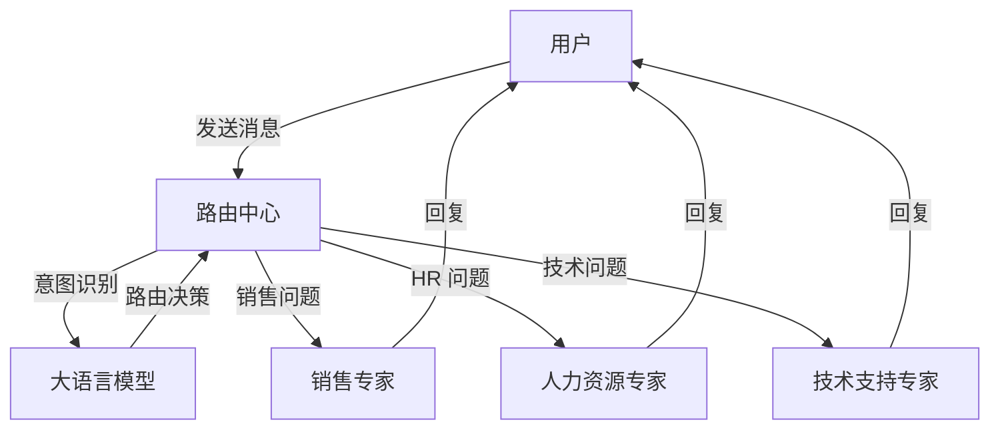
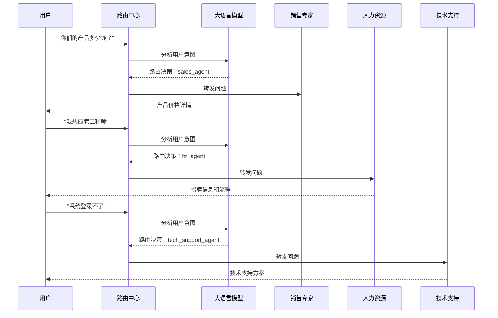

# Spring AI Alibaba 多智能体路由模式实战：构建智能客服系统


## 1. 引言

在当今 AI 应用开发中，单一智能体往往难以应对复杂多变的业务场景。多智能体协作模式应运而生，其中**路由交接模式**是一种高效的任务分发策略。本文将基于 Spring AI Alibaba 框架，详细介绍如何实现一个智能客服系统，该系统能够根据用户意图自动路由到不同的专家 Agent。


### 1.1 什么是多智能体路由模式？

多智能体路由模式（Router Pattern）是一种协作架构，其中：

- **Router Agent**：负责分析用户输入，判断意图，选择合适的专家 Agent
- **Expert Agents**：各领域的专业智能体，处理特定类型的任务
- **自动切换**：用户无感知地在不同专家间切换，获得专业服务

### 1.2 适用场景

这种模式特别适合：
- 智能客服系统（销售、技术支持、HR 等）
- 多领域知识问答
- 任务分发和工作流自动化
- 专家系统集成


## 2. 项目架构概览

### 2.1 技术栈

- **框架**：Spring Boot 3.x + Spring AI Alibaba
- **AI 模型**：Qwen2.5-7B-Instruct（通过 SiliconFlow API）
- **前端**：Thymeleaf + 原生 JavaScript
- **通信**：SSE（Server-Sent Events）实现流式响应

### 2.2 智能体架构




### 2.3 Agent 角色定义

| Agent 名称 | 角色描述 | outputKey |
| --- | --- | --- |
| router_agent | 路由决策者，根据用户意图选择专家 | （不产生输出，仅路由） |
| sales_agent | 销售专家，处理购买、价格等问题 | sales_response |
| hr_agent | 招聘专家，处理招聘、面试等问题 | hr_response |
| tech_support_agent | 技术支持专家，处理产品使用/故障问题 | tech_response |

## 3. 核心实现详解

### 3.1 项目结构

```
src/main/java/com/git/hui/springai/ali/
├── controller/
│   └── CsController.java          # 智能客服 REST 控制器（流式接口）
├── cs/
│   ├── CsRouterAgent.java         # 路由 Agent 配置
│   ├── SalesAgent.java            # 销售 Agent
│   ├── HrAgent.java               # 人力资源 Agent
│   └── TechSupportAgent.java      # 技术支持 Agent
└── L07Application.java            # Spring Boot 启动类

src/main/resources/
├── templates/
│   └── cs-chat.html               # 智能客服对话框页面
└── application.yml                # 应用配置文件
```

### 3.2 路由 Agent 配置

路由 Agent 是整个系统的核心，负责意图识别和任务分发：


```java
@Component
@RequiredArgsConstructor
public class CsRouterAgent {

    private final ChatModel chatModel;
    private final SalesAgent salesAgent;
    private final HrAgent hrAgent;
    private final TechSupportAgent techSupportAgent;

    public LlmRoutingAgent routerAgent() {
        LlmRoutingAgent agent = LlmRoutingAgent.builder()
                .name("router_agent")
                .model(chatModel)
                .description("根据用户输入，将用户问题路由到对应的业务部门")
                .instruction("""
                        根据用户输入，将用户问题路由到对应的业务部门。
                        
                        【业务部门】
                        销售部门：处理销售信息、产品介绍、购买渠道、优惠活动等等销售问题
                        人力资源部门：处理招聘信息、投递简历、面试安排等人力资源问题
                        技术支持部门：处理技术问题、bug修复、代码优化等等技术问题
                        """
                ).subAgents(
                        List.of(salesAgent.salesAgent(),
                                hrAgent.hrAgent(),
                                techSupportAgent.techSupportAgent())
                ).build();
        return agent;
    }
}
```

**关键点解析**：

1. **LlmRoutingAgent**：Spring AI Alibaba 提供的路由智能体，自动处理意图识别
2. **instruction**：定义路由规则的提示词，告诉 LLM 如何分类用户问题
3. **subAgents**：注册所有可用的专家 Agent
4. **description**：每个 Agent 的描述，帮助 LLM 做出路由决策

### 3.3 专家 Agent 实现

每个专家 Agent 使用 `ReactAgent` 构建，专注于特定领域：


#### 销售 Agent

```java
@Component
@RequiredArgsConstructor
public class SalesAgent {
    private final ChatModel chatModel;

    public ReactAgent salesAgent() {
        ReactAgent agent = ReactAgent.builder()
                .name("sales_agent")
                .model(chatModel)
                .description("处理销售信息、产品介绍、购买渠道、优惠活动等等销售问题")
                .instruction("你是一个销售专家，擅长各种销售、产品介绍、购买渠道、优惠活动等等销售问题")
                .outputKey("sales_response")
                .enableLogging(true)
                .build();
        return agent;
    }
}
```

#### 人力资源 Agent

```java
@Component
public class HrAgent {
    @Autowired
    private ChatModel chatModel;

    public ReactAgent hrAgent() {
        ReactAgent hrAgent = ReactAgent.builder()
                .name("hr_agent")
                .model(chatModel)
                .description("处理招聘信息、投递简历、面试安排等人力资源问题")
                .instruction("你是一个专业的人力资源，擅长各种人力相关、招聘、面试、入职等业务流程。请根据用户的提问进行回答。")
                .outputKey("hr_response")
                .enableLogging(true)
                .build();
        return hrAgent;
    }
}
```

#### 技术支持 Agent

```java
@Component
@RequiredArgsConstructor
public class TechSupportAgent {
    private final ChatModel chatModel;

    public ReactAgent techSupportAgent() {
        ReactAgent agent = ReactAgent.builder()
                .name("tech_support_agent")
                .model(chatModel)
                .description("处理产品故障、使用指导、技术咨询等问题。")
                .instruction("你是一个专业Tech Support，擅长各种技术问题，包括产品故障处理、使用指导、技术咨询等，请根据用户的提问进行回答")
                .outputKey("tech_response")
                .enableLogging(true)
                .build();
        return agent;
    }
}
```

**ReactAgent 配置要点**：

- **name**：Agent 的唯一标识符，用于路由和日志
- **model**：使用的 AI 模型
- **description**：简短描述，帮助 Router 识别该 Agent 的职责
- **instruction**：详细的角色定义和行为指导
- **outputKey**：输出键名，用于在多 Agent 协作中标识响应来源
- **enableLogging**：启用日志记录，便于调试


### 3.4 流式接口实现

控制器使用 SSE 技术实现实时流式响应：

```java
@Slf4j
@RestController
@RequestMapping("/api/cs")
public class CsController {
    private final LlmRoutingAgent routerAgent;
    private final ObjectMapper objectMapper = new ObjectMapper();

    public CsController(CsRouterAgent routerAgent) {
        this.routerAgent = routerAgent.routerAgent();
    }

    @GetMapping(value = "/chat", produces = MediaType.TEXT_EVENT_STREAM_VALUE)
    public Flux<ServerSentEvent<String>> chatStream(@RequestParam String message) {
        log.info("收到客服消息：{}", message);

        try {
            Flux<NodeOutput> agentStream = routerAgent.stream(message);

            return agentStream
                    .filter(nodeOutput -> !(nodeOutput instanceof StreamingOutput<?> so &&
                            so.getOutputType() == OutputType.AGENT_MODEL_FINISHED))
                    .map(nodeOutput -> {
                        String node = nodeOutput.node();
                        String agentName = nodeOutput.agent();

                        Map<String, Object> data = new HashMap<>();
                        data.put("node", node);
                        data.put("agent", agentName);

                        StringBuilder contentBuilder = new StringBuilder();
                        boolean hasContent = false;

                        if (nodeOutput instanceof StreamingOutput<?> streamingOutput) {
                            Message msg = streamingOutput.message();
                            if (msg instanceof AssistantMessage assistantMessage) {
                                if (!assistantMessage.hasToolCalls()) {
                                    String text = assistantMessage.getText();
                                    if (text != null && !text.trim().isEmpty()) {
                                        contentBuilder.append(text);
                                        hasContent = true;
                                    }
                                }
                            }
                        }

                        data.put("content", contentBuilder.toString());
                        data.put("hasContent", hasContent);

                        String department = determineDepartment(agentName);
                        data.put("department", department);

                        String json;
                        try {
                            json = objectMapper.writeValueAsString(data);
                        } catch (JsonProcessingException e) {
                            log.error("JSON 序列化失败", e);
                            json = "{\"error\":true,\"errorMessage\":\"JSON 序列化失败\"}";
                        }

                        return ServerSentEvent.<String>builder()
                                .event("message")
                                .data(json)
                                .build();
                    })
                    .onErrorResume(error -> {
                        log.error("流式对话过程中发生错误", error);
                        // 错误处理逻辑
                    })
                    .doOnComplete(() -> {
                        log.info("流式对话完成");
                    });

        } catch (Exception e) {
            log.error("创建流式接口时发生错误", e);
            // 异常处理逻辑
        }
    }

    private String determineDepartment(String agentName) {
        if (agentName != null) {
            if (agentName.contains("sales")) {
                return "sales";
            } else if (agentName.contains("hr")) {
                return "hr";
            } else if (agentName.contains("tech")) {
                return "tech";
            } else if (agentName.contains("router")) {
                return "router";
            }
        }
        return "unknown";
    }
}
```

**流式响应数据结构**：

```json
{
  "node": "节点名称",
  "agent": "当前处理的 agent",
  "content": "回复内容",
  "hasContent": true,
  "department": "sales|hr|tech|router"
}
```

## 4. 前端实现

### 4.1 界面设计特点

- **现代化 UI**：渐变色设计，圆角卡片布局
- **实时状态展示**：四个部门的状态指示器，高亮当前服务部门
- **打字机效果**：SSE 流式响应实现逐字显示
- **部门标识**：不同颜色区分不同部门的回复

### 4.2 核心 JavaScript 逻辑

```javascript
// 发送消息
function sendMessage() {
    const message = messageInput.value.trim();
    if (!message) return;

    // 禁用输入框和按钮
    messageInput.disabled = true;
    sendBtn.disabled = true;

    // 添加用户消息
    addMessage(message, true);
    messageInput.value = '';

    // 显示正在输入动画
    showTypingIndicator();

    // 创建 EventSource 连接到 SSE 接口
    const eventSource = new EventSource(`/api/cs/chat?message=${encodeURIComponent(message)}`);
    currentEventSource = eventSource;

    let lastContentDiv = null;
    let fullContent = '';

    eventSource.onmessage = function(event) {
        try {
            const data = JSON.parse(event.data);
            
            // 如果有内容，更新或创建消息
            if (data.hasContent && data.content) {
                removeTypingIndicator();
                
                // 更新 Agent 状态
                updateAgentStatus(data.department);
                
                if (!lastContentDiv || data.agent !== (lastContentDiv.dataset.agent || '')) {
                    // 新的 agent 回复，创建新消息
                    const msgDiv = document.createElement('div');
                    msgDiv.className = 'message assistant';
                    
                    const deptNames = {
                        'router': '路由中心',
                        'sales': '销售部门',
                        'hr': '人力资源',
                        'tech': '技术支持',
                        'unknown': '客服中心'
                    };
                    
                    const headerDiv = document.createElement('div');
                    headerDiv.className = 'message-header';
                    headerDiv.innerHTML = `<span class="department-badge ${data.department}">${deptNames[data.department] || data.department}</span>`;
                    msgDiv.appendChild(headerDiv);
                    
                    const contentDiv = document.createElement('div');
                    contentDiv.className = 'message-content';
                    contentDiv.textContent = data.content;
                    contentDiv.dataset.agent = data.agent;
                    
                    msgDiv.appendChild(contentDiv);
                    chatMessages.appendChild(msgDiv);
                    lastContentDiv = contentDiv;
                    fullContent = data.content;
                } else {
                    // 同一个 agent 的连续内容，追加
                    fullContent += data.content;
                    lastContentDiv.textContent = fullContent;
                }
                
                chatMessages.scrollTop = chatMessages.scrollHeight;
            }
        } catch (e) {
            console.error('解析消息失败:', e);
        }
    };
}
```

### 4.3 Agent 状态更新

```javascript
// 更新 Agent 状态
function updateAgentStatus(department) {
    // 移除所有激活状态
    document.querySelectorAll('.agent-card').forEach(card => {
        card.classList.remove('active');
    });
    
    // 激活当前 agent
    const activeCard = document.getElementById(`agent-${department}`);
    if (activeCard) {
        activeCard.classList.add('active');
    }
}
```


## 5. 配置与部署

### 5.1 应用配置

在 `application.yml` 中配置 AI 模型：

```yaml
spring:
  ai:
    openai:
      api-key: ${silicon-api-key}
      chat:
        options:
          model: Qwen/Qwen2.5-7B-Instruct
      base-url: https://api.siliconflow.cn
  thymeleaf:
    cache: false

server:
  tomcat:
    uri-encoding: UTF-8
```

### 5.2 启动步骤

1. **配置 API Key**：
   ```bash
   export silicon-api-key=your-api-key-here
   ```

2. **启动应用**：
   ```bash
   mvn spring-boot:run
   ```

3. **访问界面**：
   打开浏览器访问 `http://localhost:8080/`

### 5.3 测试用例


## 6. 工作流程图





## 7. 扩展与优化

### 7.1 添加新 Agent

要添加新的专家 Agent，只需：

1. 创建新的 Agent 类：
```java
@Component
public class NewExpertAgent {
    @Autowired
    private ChatModel chatModel;

    public ReactAgent newExpertAgent() {
        return ReactAgent.builder()
                .name("new_expert_agent")
                .model(chatModel)
                .description("处理特定领域的问题")
                .instruction("你是某某领域的专家...")
                .outputKey("new_expert_response")
                .enableLogging(true)
                .build();
    }
}
```

2. 在 Router 中注册：
```java
.subAgents(List.of(
    salesAgent.salesAgent(),
    hrAgent.hrAgent(),
    techSupportAgent.techSupportAgent(),
    newExpertAgent.newExpertAgent()  // 添加新 Agent
))
```

3. 更新路由提示词和前端显示

### 7.2 为 Agent 添加工具

Agent 可以装配工具来扩展能力：

```java
public ReactAgent hrAgent() {
    return ReactAgent.builder()
            .name("hr_agent")
            .model(chatModel)
            .tools(
                new InterviewScheduleTool(),    // 面试安排工具
                new ResumeQueryTool(),          // 简历查询工具
                new OfferStatusTool()           // Offer 状态工具
            )
            .instruction("你是人力资源专家...")
            .outputKey("hr_response")
            .build();
}
```

### 7.3 性能优化建议

- **缓存路由决策**：对于常见问题，缓存路由结果
- **模型选择**：根据场景选择合适的模型大小
- **异步处理**：对于耗时操作，使用异步处理
- **限流控制**：防止 API 调用过载

## 8. 多智能体模式对比与选型

### 8.1 Spring AI Alibaba 多智能体模式对比

Spring AI Alibaba 提供了多种多智能体协作模式，适用于不同场景：


| 模式 | 工作原理 | 控制流 | 适用场景 |
|------|----------|--------|----------|
| **SequentialAgent** | 按预定义顺序依次执行 | 线性 | 已知工作流程、数据转换 |
| **ParallelAgent** | 多Agent并行处理相同输入 | 并发 | 独立分析、多角度评估 |
| **LlmRoutingAgent** | LLM智能决策单路由 | 单次选择 | 基础任务分类、简单路由 |
| **SupervisorAgent** | LLM监督者多步骤循环路由 | 多步骤循环 | 复杂任务编排、专家接管 |
| **Handoffs（交接）** | 状态驱动Agent切换 | 去中心化 | 客服场景、角色轮换 |

### 8.2 快速选型指南

```
需要的功能                    推荐模式
─────────────────────────────────────────────────
固定流水线                    SequentialAgent
多角度并行分析                ParallelAgent
单次智能分类路由              LlmRoutingAgent
多步骤复杂任务编排            SupervisorAgent
Agent切换+子Agent工具调用     Handoffs + Agent Tool
自定义工作流                  FlowAgent
```

### 8.3 LlmRoutingAgent vs SupervisorAgent

| 特性 | LlmRoutingAgent | SupervisorAgent |
|------|----------------|-----------------|
| 路由次数 | 单次 | 多步骤循环 |
| 子Agent返回 | 直接结束 | 返回监督者继续决策 |
| Instruction占位符 | ❌ | ✅ 支持 |
| 适用场景 | 简单分类 | 复杂多步骤任务 |


### 8.4 最佳实践

#### 优化路由准确性

```java
// 清晰的Agent描述
ReactAgent codeAgent = ReactAgent.builder()
    .name("code_agent")
    .description("专门处理编程问题，擅长Java、Python、JavaScript等主流语言")
    .instruction("你是一个资深软件工程师...")
    .build();

ReactAgent businessAgent = ReactAgent.builder()
    .name("business_agent")
    .description("专门处理商业分析、市场研究，**不处理技术细节**")
    .instruction("你是一个资深商业分析师...")
    .build();
```

#### 使用占位符传递数据

```java
// 前序Agent输出
ReactAgent writerAgent = ReactAgent.builder()
    .name("writer_agent")
    .instruction("根据主题创作：{input}")
    .outputKey("article_content")
    .build();

// 后续Agent引用
ReactAgent translatorAgent = ReactAgent.builder()
    .name("translator_agent")
    .instruction("翻译以下文章：{article_content}")
    .build();
```

## 9. 常见问题

### 9.1 路由不准确

**问题**：Router 错误地将问题路由到不相关的 Agent。

**解决方案**：
- 优化 Router 的 instruction 提示词，更清晰地定义各 Agent 职责
- 为每个 Agent 提供更准确的 description
- 考虑使用更强大的模型做路由决策

### 9.2 响应延迟

**问题**：用户等待时间过长。

**解决方案**：
- 使用 SSE 流式响应，实现边生成边显示
- 优化模型选择，平衡速度和质量
- 考虑使用本地部署模型减少网络延迟

### 9.3 上下文丢失

**问题**：多轮对话中 Agent 丢失上下文。

**解决方案**：
- 实现对话历史管理
- 在 Agent 之间传递上下文信息
- 使用 Redis 等缓存对话状态

## 10. 总结

本文详细介绍了基于 Spring AI Alibaba 框架实现多智能体路由模式的完整流程。


通过构建智能客服系统，我们学习了：

1. **路由模式的核心概念**：Router Agent 负责意图识别，Expert Agents 负责专业处理
2. **Spring AI Alibaba 的关键组件**：LlmRoutingAgent 和 ReactAgent 的使用
3. **流式响应的实现**：SSE 技术实现实时对话体验
4. **前后端协作**：完整的智能客服系统架构

这种模式具有良好的扩展性，可以轻松添加新的专家 Agent，适用于各种需要智能分发任务的场景。

## 11. 参考资料

### 官方文档

| 文档类型 | URL |
|---------|-----|
| **官方文档首页** | https://java2ai.com |
| **中文文档** | https://java2ai.com/docs/overview |
| **多智能体文档** | https://java2ai.com/docs/frameworks/agent-framework/advanced/multi-agent |
| **Agent Tool 文档** | https://java2ai.com/docs/frameworks/agent-framework/advanced/agent-tool |
| **GitHub 仓库** | https://github.com/alibaba/spring-ai-alibaba |
| **示例项目** | https://github.com/liuyueyi/spring-ai-demo |

### 相关资源

- [Spring AI Alibaba 官方文档](https://github.com/alibaba/spring-ai-alibaba)
- [Spring AI 官方文档](https://docs.spring.io/spring-ai/reference/)


## 附录：完整代码清单

项目源码：[https://github.com/liuyueyi/spring-ai-demo](https://github.com/liuyueyi/spring-ai-demo)

完整的项目代码可在 `ali/L07-multi-agent-route` 目录中找到，包括：

- 后端 Java 代码（4 个 Agent + 1 个 Controller）
- 前端模板（cs-chat.html）
- 配置文件（application.yml）
- Maven 配置（pom.xml）


> **Author**: 一灰
**Date**: 2026-03-22
**Tags**: #SpringAI, #多智能体, #路由模式, #智能客服, #Alibaba
