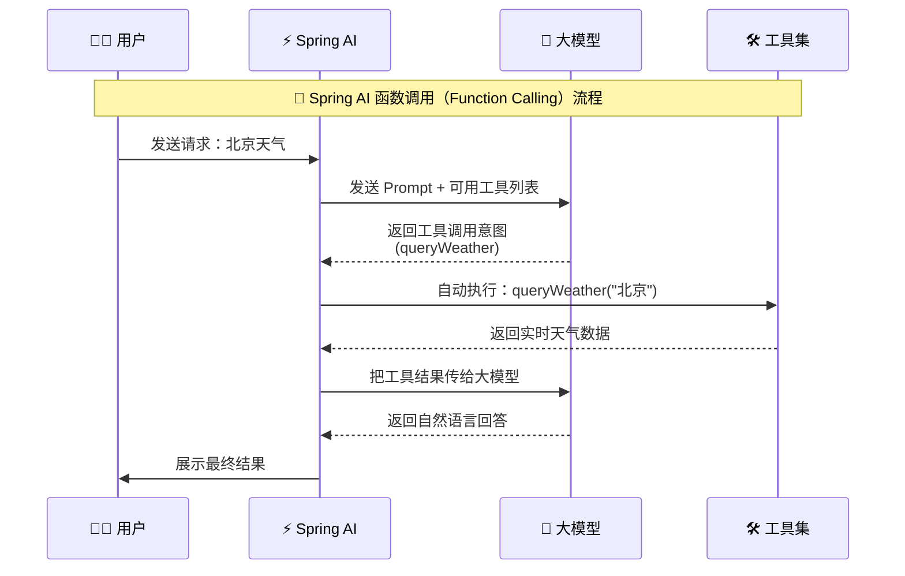
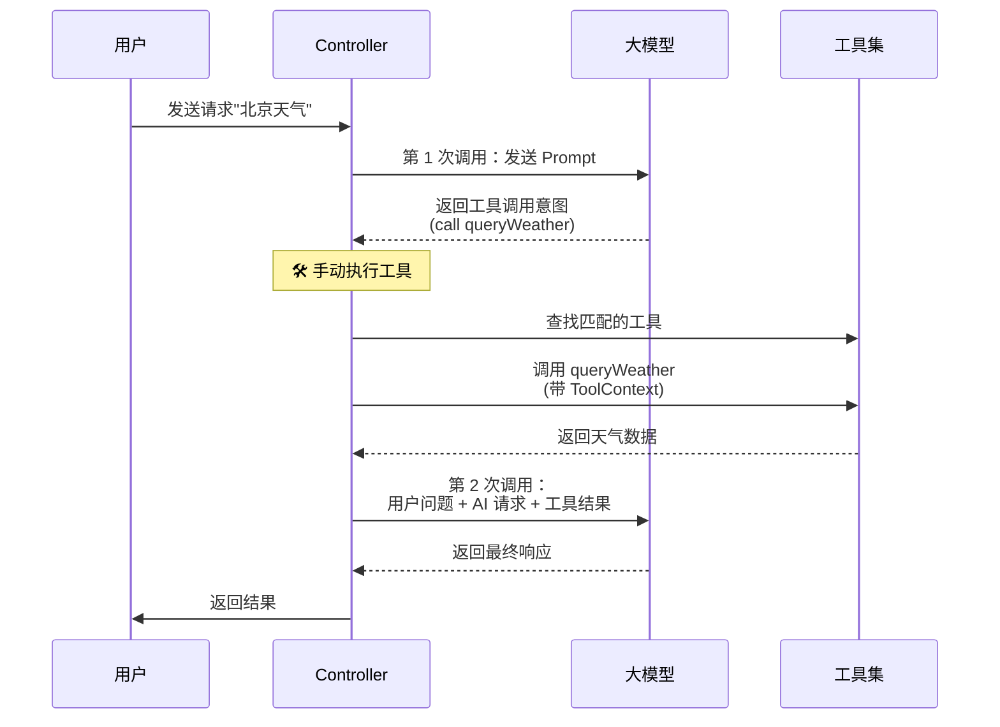

# Spring AI Function Calling 高阶使用：手动控制工具执行与 ToolContext 实战

## 引言

在 Spring AI 的应用开发中，Function Calling（函数调用）是让大模型与外部世界交互的核心机制。大多数教程只展示了基础的自动工具调用，但在实际生产环境中，我们需要更精细地控制工具的执行流程、传递上下文信息、处理复杂的调用场景。

本文通过一个完整的实战项目 `S20-manual-tool-execute`，深入讲解 Spring AI Function Calling 的高阶使用技巧，包括：

- ✅ **ToolContext 的使用**：在工具调用中传递会话、用户等上下文信息
- ✅ **工具命名约束**：避免同名工具导致的启动错误
- ✅ **两种执行模式对比**：Spring AI 自动控制 vs 开发者手动编程控制
- ✅ **完整调用链路**：从用户请求到工具执行再到结果总结的全流程

通过本文的学习，你将掌握企业级 Spring AI 应用中工具调用的核心技能。


---

## 一、项目概述与环境准备

### 1.1 项目结构

```
S20-manual-tool-execute/
├── src/main/java/com/git/hui/springai/
│   ├── S20Application.java          # 启动类
│   ├── mvc/QaController.java        # 核心控制器（演示两种调用方式）
│   ├── tools/
│   │   ├── WeatherTools.java        # 天气查询工具
│   │   └── QuizTools.java           # 知识问答工具
│   │   └── dto/                     # 数据传输对象
│   └── advisor/
│       └── MyLoggingAdvisor.java    # 自定义日志顾问
├── src/main/resources/
│   └── application.yml              # 配置文件
└── pom.xml                          # Maven 依赖
```

### 1.2 核心依赖

```xml
<dependencies>
    <!-- Spring Boot Web -->
    <dependency>
        <groupId>org.springframework.boot</groupId>
        <artifactId>spring-boot-starter-web</artifactId>
    </dependency>
    
    <!-- Spring AI OpenAI Starter -->
    <dependency>
        <groupId>org.springframework.ai</groupId>
        <artifactId>spring-ai-starter-model-openai</artifactId>
    </dependency>
    
    <!-- Lombok 简化代码 -->
    <dependency>
        <groupId>org.projectlombok</groupId>
        <artifactId>lombok</artifactId>
    </dependency>
</dependencies>
```

### 1.3 配置说明

```yaml
spring:
  ai:
    openai:
      # 使用 SiliconFlow API（兼容 OpenAI 协议）
      api-key: ${silicon-api-key}
      base-url: https://api.siliconflow.cn
      
      chat:
        options:
          model: Qwen/Qwen3-8B  # 通义千问 3-8B 模型

server:
  port: 8080

# 日志级别设置
logging:
  level:
    org.springframework.ai.chat.client.advisor.SimpleLoggerAdvisor: debug
    com.git.hui.springai.advisor.MyLoggingAdvisor: debug
```

**启动参数**：
```bash
java -jar S20-manual-tool-execute.jar \
  --silicon-api-key=sk-your-api-key-here
```

---

## 二、工具定义最佳实践

### 2.1 基础工具：WeatherTools

创建一个天气查询工具，演示标准的工具定义方式：

```java
@Slf4j
@Service
public class WeatherTools {
    
    @Tool(name = "queryWeather", 
          description = "查询指定城市的天气信息，返回详细的天气状况、温度、湿度等数据")
    @ToolResponseType("card")  // 声明返回类型为 card
    public WeatherCard queryWeather(
            @ToolParam(description = "城市名称，如北京、上海、广州等") String city,
            ToolContext toolContext) {  // ✅ 添加工具上下文参数
        
        // 从上下文中获取额外信息
        if (toolContext != null && !toolContext.getContext().isEmpty()) {
            log.info("【工具上下文】queryWeather - context: {}", toolContext.getContext());
            
            // 可以从中获取 userId, sessionId, appId 等信息
            String userId = (String) toolContext.getContext().get("userId");
            String sessionId = (String) toolContext.getContext().get("sessionId");
            log.info("用户 {} 在会话 {} 中查询 {} 的天气", userId, sessionId, city);
        }
        
        log.info("[inner-tool] 查询天气：{}", city);
        
        // TODO: 实际场景中应该调用天气 API
        // 这里使用模拟数据演示
        Random random = new Random();
        int temperature = 15 + random.nextInt(20); // 15-35 度
        int humidity = 40 + random.nextInt(40);    // 40-80%
        int aqi = 20 + random.nextInt(80);         // 20-100
        
        String[] conditions = {"晴", "多云", "阴", "小雨", "大雨"};
        String condition = conditions[random.nextInt(conditions.length)];
        
        String[] directions = {"东风", "南风", "西风", "北风", "东南风", "东北风"};
        String windDirection = directions[random.nextInt(directions.length)];
        String windLevel = (random.nextInt(5) + 1) + "级";
        
        String dressAdvice = getDressAdvice(temperature, condition);
        String tips = getWeatherTips(condition, aqi);
        
        return WeatherCard.builder()
                .city(city)
                .condition(condition)
                .temperature(temperature)
                .humidity(humidity)
                .aqi(aqi)
                .windDirection(windDirection)
                .windLevel(windLevel)
                .dressAdvice(dressAdvice)
                .tips(tips)
                .build();
    }
    
    // ... 辅助方法省略
}
```

**关键点解析**：

1. **@Tool 注解**：
   - `name`: 工具的唯一标识符（⚠️ 不能重复）
   - `description`: 工具功能描述，大模型根据此判断何时调用

2. **@ToolResponseType**：
   - 声明返回类型，便于前端渲染
   - 本例为 `"card"` 表示结构化卡片数据

3. **ToolContext 参数**：
   - 可选参数，用于传递会话、用户等上下文信息
   - 在多轮对话或需要认证的场景中非常有用

4. **@ToolParam**：
   - 为参数添加详细描述，帮助大模型理解参数含义

### 2.2 ⚠️ 重要约束：避免同名工具

在 `QuizTools.java` 中，有一段被注释掉的代码，演示了一个常见错误：

```java
@Component
public class QuizTools {
    
    // ❌ 错误示范：与 WeatherTools 中的 queryWeather 同名
    // 如果取消注释，启动时会报错：
    // java.lang.IllegalStateException: Multiple tools with the same name 
    // (queryWeather) found in ToolCallingChatOptions
    
//    @Tool(name = "queryWeather", description = "查询指定国家的天气信息...")
//    @ToolResponseType("card")
//    public WeatherCard fetchWeather(String city, ToolContext toolContext) {
//        // ...
//    }
    
    // ✅ 正确做法：每个工具的名称必须唯一
    @Tool(description = "创建知识问答题目，支持多个主题领域，返回问题和候选项")
    @ToolResponseType("quiz")
    public QuizCard createQuiz(
            @ToolParam(description = "问题主题，如 spring、ai、地理等") String topic) {
        log.info("[inner-tool] 创建知识问答：{}", topic);
        
        // ... 实现逻辑
    }
}
```

**为什么不能同名？**

1. **注册冲突**：Spring AI 在启动时会将所有工具注册到工具表中，同名工具会导致键冲突
2. **调用歧义**：大模型无法区分同名的不同工具，可能导致错误调用
3. **调试困难**：同名工具使得日志追踪和问题定位变得复杂

**解决方案**：
- 使用语义化的唯一名称，如 `queryWeather` vs `fetchWeatherData`
- 按功能模块组织工具类，避免交叉定义
- 在团队开发中建立工具命名规范

---

## 三、核心实现：两种工具执行模式对比

这是本文的重点！我们将对比两种不同的工具执行控制方式。

### 3.1 方案一：Spring AI 自动控制工具执行

**特点**：配置简单，适合标准场景，但缺乏灵活性


```java
@RestController
public class QaController {
    
    private final List<ToolCallback> tools;
    private final ChatClient chatClient;
    
    public QaController(QuizTools quizTools, 
                       WeatherTools weatherTools, 
                       ChatClient.Builder chatClientBuilder) {
        this.quizTools = quizTools;
        this.weatherTools = weatherTools;
        
        this.chatClient = chatClientBuilder
                .defaultAdvisors(new SimpleLoggerAdvisor(),
                        MyLoggingAdvisor.builder()
                                .showSystemMessage(true)
                                .showAvailableTools(true)
                                .build())
                .build();
        
        // 注册工具
        ToolCallback[] t1 = MethodToolCallbackProvider.builder()
                .toolObjects(quizTools).build().getToolCallbacks();
        ToolCallback[] t2 = MethodToolCallbackProvider.builder()
                .toolObjects(weatherTools).build().getToolCallbacks();
        tools = new ArrayList<>();
        tools.addAll(List.of(t1));
        tools.addAll(List.of(t2));
    }
    
    @RequestMapping(path = "executeTools")
    public String aiExecuteTools(String msg) {
        // 工具执行上下文
        Map<String, Object> toolContextData = new HashMap<>();
        toolContextData.put("sessionId", "demo-session-123");
        toolContextData.put("userId", "demo-user-456");
        toolContextData.put("timestamp", System.currentTimeMillis());
        
        // ✅ 关键配置：启用内部自动执行
        ToolCallingChatOptions options = ToolCallingChatOptions.builder()
                .internalToolExecutionEnabled(true)  // 启用自动执行
                .toolContext(toolContextData)
                .build();
        
        Prompt prompt = new Prompt(msg, options);
        
        // 一键调用：Spring AI 全权负责
        return chatClient.prompt(prompt)
                .toolCallbacks(this.tools)
                .call()
                .content();
    }
}
```

**执行流程**（如下图所示）：




**优点**：
- ✅ 代码简洁，一行搞定
- ✅ Spring AI 处理所有细节
- ✅ 适合简单的单次工具调用

**缺点**：
- ❌ 黑盒执行，难以干预
- ❌ 无法在工具执行前后添加自定义逻辑
- ❌ 多个工具并行执行时无法控制顺序
- ❌ 难以记录详细的调用链路

### 3.2 方案二：开发者手动控制工具执行 🌟


**特点**：代码量增加，但完全掌控执行流程，适合复杂场景

```java
@RequestMapping(path = "qa")
public String qa(String msg) {
    // 工具执行上下文
    Map<String, Object> toolContextData = new HashMap<>();
    toolContextData.put("sessionId", "demo-session-123");
    toolContextData.put("userId", "demo-user-456");
    toolContextData.put("timestamp", System.currentTimeMillis());
    
    // ✅ 关键配置：禁用自动执行，由我们手动控制
    ToolCallingChatOptions options = ToolCallingChatOptions.builder()
            .internalToolExecutionEnabled(false)  // 禁用自动执行
            .toolContext(toolContextData)
            .build();
    
    // ✅ 第 1 次调用：获取大模型的工具调用意图
    Prompt prompt = new Prompt(msg, options);
    ChatResponse chatResponse = chatClient.prompt(prompt)
            .toolCallbacks(this.tools)
            .call()
            .chatResponse();
    
    AssistantMessage assistantMessage = chatResponse.getResult().getOutput();
    
    // 检查是否需要调用工具
    if (CollectionUtils.isEmpty(assistantMessage.getToolCalls())) {
        // 非工具调用结果，直接返回
        log.info("非工具调用结果：{}", assistantMessage.getText());
        return assistantMessage.getText();
    }
    
    // ✅ 手动执行工具（核心代码）
    List<ToolResponseMessage.ToolResponse> list = new ArrayList<>();
    for (var call : assistantMessage.getToolCalls()) {
        for (ToolCallback callback : tools) {
            if (callback.getToolDefinition().name().equals(call.name())) {
                // 🔥 关键：手动调用工具，传入参数和上下文
                var toolRsp = callback.call(call.arguments(), 
                                           new ToolContext(toolContextData));
                
                ToolResponseMessage.ToolResponse toolResponse =
                        new ToolResponseMessage.ToolResponse(
                            call.id(),      // 保持调用 ID 一致
                            call.name(),    // 工具名称
                            toolRsp         // 工具执行结果
                        );
                list.add(toolResponse);
            }
        }
    }
    
    // ✅ 第 2 次调用：将工具结果返回给大模型，让它总结
    ToolResponseMessage toolMsg = ToolResponseMessage.builder()
            .responses(list)
            .build();
    
    ChatResponse finalResponse = chatClient.prompt(
                    new Prompt(List.of(
                            new UserMessage(msg),           // 用户原始问题
                            assistantMessage,               // AI 的工具调用请求
                            toolMsg                         // 工具执行结果
                    )))
            .call()
            .chatResponse();
    
    // 返回大模型的最终总结
    return finalResponse.getResult().getOutput().getText();
}
```

**执行流程**（更清晰的分步控制）：





**关键代码解析**：

1. **第一次调用**：
   ```java
   ChatResponse chatResponse = chatClient.prompt(prompt)
           .toolCallbacks(this.tools)
           .call()
           .chatResponse();
   ```
   - 目的：获取大模型的调用意图（要调用哪个工具、参数是什么）
   - 结果：`AssistantMessage` 中包含 `List<ToolCall>` 

2. **手动执行工具**：
   ```java
   for (var call : assistantMessage.getToolCalls()) {
       for (ToolCallback callback : tools) {
           if (callback.getToolDefinition().name().equals(call.name())) {
               var toolRsp = callback.call(call.arguments(), 
                                          new ToolContext(toolContextData));
               // ...
           }
       }
   }
   ```
   - 遍历所有工具调用请求
   - 根据名称匹配对应的 `ToolCallback`
   - **手动传入 `ToolContext`**，携带会话、用户等信息
   - 获得工具执行结果

3. **第二次调用**：
   ```java
   ChatResponse finalResponse = chatClient.prompt(
           new Prompt(List.of(
                   new UserMessage(msg),           // 用户原始问题
                   assistantMessage,               // AI 的工具调用请求
                   toolMsg                         // 工具执行结果
           )))
           .call()
           .chatResponse();
   ```
   - 构建完整的对话历史
   - 让大模型基于工具结果生成自然语言响应
   - 保证上下文的连贯性

---

## 四、两种方案深度对比

### 4.1 代码复杂度对比

| 维度 | Spring AI 自动控制 | 手动控制 |
|------|-------------------|----------|
| **代码行数** | ~5 行 | ~50 行 |
| **配置难度** | 简单 | 中等 |
| **理解成本** | 低 | 较高 |

### 4.2 执行灵活性对比

| 功能 | Spring AI 自动控制 | 手动控制 |
|------|-------------------|----------|
| **工具执行前拦截** | ❌ 不支持 | ✅ 可添加任意逻辑 |
| **工具执行后处理** | ❌ 不支持 | ✅ 可修改结果、记录日志 |
| **工具调用顺序控制** | ❌ 并行执行不可控 | ✅ 可串行、可条件执行 |
| **错误处理** | ❌ 统一异常 | ✅ 细粒度 try-catch |
| **ToolContext 传递** | ⚠️ 批量传递 | ✅ 精确控制每个工具的上下文 |


### 4.3 适用场景

**Spring AI 自动控制** 适合：
- ✅ 快速原型开发
- ✅ 简单的单次工具调用
- ✅ 不需要特殊处理的场景
- ✅ 对执行过程无特殊要求

**手动控制** 适合：
- ✅ 企业级生产环境
- ✅ 需要权限校验的场景
- ✅ 工具调用有先后依赖
- ✅ 需要详细日志和监控
- ✅ 需要限流、熔断等保护机制
- ✅ 多轮对话中的工具调用

### 4.4 实际案例对比

**场景**：用户查询"我和我朋友的北京天气对比一下"

**自动控制的问题**：
```java
// Spring AI 会同时调用两次 queryWeather
// 无法区分两个调用的上下文
// 无法在中间添加"朋友关系验证"逻辑
```

**手动控制的优势**：
```java
// 1. 先验证用户是否有权限查询朋友的天气
if (!friendshipService.areFriends(userId, friendId)) {
    throw new PermissionDeniedException();
}

// 2. 分别调用工具，每个都带上正确的上下文
var myWeather = weatherTools.queryWeather("北京", 
    new ToolContext(Map.of("userId", userId)));
var friendWeather = weatherTools.queryWeather("北京", 
    new ToolContext(Map.of("userId", friendId)));

// 3. 在返回前添加对比分析
String comparison = compareWeather(myWeather, friendWeather);

// 4. 将对比结果交给大模型总结
return llm.summarize(comparison);
```

---

## 五、ToolContext 的实战应用

### 5.1 ToolContext 是什么？

`ToolContext` 是一个轻量级的上下文容器，用于在工具调用链中传递信息：

```java
public class ToolContext {
    private final Map<String, Object> context;
    
    public ToolContext(Map<String, Object> context) {
        this.context = context;
    }
    
    public Map<String, Object> getContext() {
        return context;
    }
    
    public <T> T get(String key) {
        return (T) context.get(key);
    }
}
```

### 5.2 典型使用场景


#### 场景 1：多用户会话隔离

```java
Map<String, Object> toolContextData = new HashMap<>();
toolContextData.put("sessionId", "session-123");
toolContextData.put("userId", "user-456");
toolContextData.put("tenantId", "tenant-789");  // 多租户 ID

// 工具内部可以根据这些信息做数据隔离
@Tool
public WeatherCard queryWeather(String city, ToolContext toolContext) {
    String tenantId = toolContext.get("tenantId");
    String userId = toolContext.get("userId");
    
    // 查询该租户下该用户的天气偏好
    UserPreference preference = preferenceRepository
            .findByTenantAndUser(tenantId, userId);
    
    // ... 使用偏好定制天气报告
}
```

#### 场景 2：审计日志

```java
toolContextData.put("requestId", UUID.randomUUID().toString());
toolContextData.put("timestamp", System.currentTimeMillis());
toolContextData.put("sourceIp", request.getRemoteAddr());

// 工具执行时记录审计日志
@Tool
public QuizCard createQuiz(String topic, ToolContext toolContext) {
    String requestId = toolContext.get("requestId");
    
    log.info("【审计日志】RequestId: {}, 用户：{}, 创建题目：{}", 
             requestId, toolContext.get("userId"), topic);
    
    // ... 业务逻辑
}
```

#### 场景 3：链路追踪

```java
// 在微服务架构中传递追踪信息
toolContextData.put("traceId", MDC.get("traceId"));
toolContextData.put("spanId", UUID.randomUUID().toString());

// 工具调用其他服务时携带这些信息
@Tool
public WeatherCard queryWeather(String city, ToolContext toolContext) {
    String traceId = toolContext.get("traceId");
    
    // 调用天气 API 时传递 traceId
    return weatherApiClient.getWeather(city, traceId);
}
```

### 5.3 在两种模式中的差异

**自动控制模式**：
```java
// 所有工具共享同一个 ToolContext
ToolCallingChatOptions options = ToolCallingChatOptions.builder()
        .toolContext(Map.of("userId", "user-123"))
        .build();

// Spring AI 会自动将这个上下文传递给所有工具
// 但无法针对单个工具定制上下文
```

**手动控制模式**：
```java
// 可以为每个工具单独定制上下文
for (var call : assistantMessage.getToolCalls()) {
    Map<String, Object> customContext = new HashMap<>(baseContext);
    
    // 根据工具类型添加特定信息
    if ("queryWeather".equals(call.name())) {
        customContext.put("locationPermission", true);
    } else if ("createQuiz".equals(call.name())) {
        customContext.put("educationLevel", "university");
    }
    
    var toolRsp = callback.call(call.arguments(), 
                               new ToolContext(customContext));
}
```

---

## 六、高级技巧与注意事项

### 6.1 工具命名的约定

**好的命名**：
- ✅ `queryWeatherByCity` - 清晰表达功能
- ✅ `createKnowledgeQuiz` - 动词 + 名词
- ✅ `getUserProfileFromDB` - 包含数据源信息

**糟糕的命名**：
- ❌ `weather` - 太笼统
- ❌ `handle` - 毫无意义
- ❌ `process` - 不知道处理什么

### 6.2 错误处理最佳实践

```java
@RequestMapping(path = "qa")
public String qa(String msg) {
    try {
        // ... 第一次调用
        
        // 手动执行工具时添加错误处理
        for (var call : assistantMessage.getToolCalls()) {
            try {
                var toolRsp = callback.call(call.arguments(), 
                                           new ToolContext(toolContextData));
                // ... 正常处理
            } catch (ToolExecutionException e) {
                log.error("工具执行失败：{}", call.name(), e);
                
                // 构造友好的错误响应
                ToolResponseMessage.ToolResponse errorResponse =
                        new ToolResponseMessage.ToolResponse(
                            call.id(),
                            call.name(),
                            "{\"error\": \"服务暂时不可用，请稍后重试\"}"
                        );
                list.add(errorResponse);
            }
        }
        
        // ... 第二次调用
        
    } catch (Exception e) {
        log.error("AI 调用失败", e);
        return "系统繁忙，请稍后再试";
    }
}
```

### 6.3 性能优化建议

1. **工具预热**：
   ```java
   @PostConstruct
   public void warmupTools() {
       // 预加载工具依赖的资源
       weatherApiClient.warmup();
       quizRepository.loadCache();
   }
   ```

2. **异步执行**（适用于多个独立工具调用）：
   ```java
   List<CompletableFuture<ToolResponse>> futures = toolCalls.stream()
       .map(call -> CompletableFuture.supplyAsync(() -> {
           return callback.call(call.arguments(), toolContext);
       }))
       .collect(Collectors.toList());
   
   // 等待所有工具执行完成
   CompletableFuture.allOf(futures.toArray(new CompletableFuture[0]))
       .join();
   ```

3. **结果缓存**：
   ```java
   @Tool
   @Cacheable(value = "weather", key = "#city")
   public WeatherCard queryWeather(String city, ToolContext toolContext) {
       // ... 耗时操作
   }
   ```

### 6.4 安全考虑

```java
@Tool
public WeatherCard queryWeather(String city, ToolContext toolContext) {
    // 1. 权限校验
    String userId = toolContext.get("userId");
    if (!permissionService.canQueryWeather(userId)) {
        throw new AccessDeniedException("无权访问天气服务");
    }
    
    // 2. 参数校验
    if (city == null || city.trim().isEmpty()) {
        throw new IllegalArgumentException("城市名称不能为空");
    }
    
    // 3. 限流保护
    rateLimiter.acquire(userId);  // 每秒允许 N 次调用
    
    // 4. 敏感信息脱敏
    log.info("查询天气：city={}, userId={}", 
             maskSensitive(city), maskSensitive(userId));
    
    // ... 业务逻辑
}
```

---

## 七、完整示例与测试

### 7.1 启动项目

```bash
# 1. 克隆代码
git clone https://github.com/liuyueyi/spring-ai-demo
cd spring-ai-demo/S20-manual-tool-execute

# 2. 设置 API Key
export silicon-api-key=sk-your-siliconflow-api-key

# 3. 编译运行
mvn clean install
mvn spring-boot:run
```

### 7.2 测试接口

**测试 1：Spring AI 自动控制**
```bash
curl "http://localhost:8080/executeTools?msg=帮我查一下北京的天气"
```

预期响应：
```
北京今天晴朗，气温 25℃，湿度 60%，空气质量优。
阳光明媚，适合户外活动。穿衣建议：短袖 T 恤，清凉透气。
```

**测试 2：手动控制工具执行**

```bash
curl "http://localhost:8080/qa?msg=出一道关于 Spring 的题目"
```

预期响应：
```
**题目：**  
Spring AI 中，用于构建流式响应的核心接口是？

**选项：**  
A. `ChatClient`  
B. `Flux`  
C. `StreamBuilder`  
D. `ResponseEmitter`

**答案：**  
A. `ChatClient`

**解析：**  
在 Spring AI 中，`ChatClient` 是用于与语言模型进行交互的核心接口。通过调用 `ChatClient.stream()` 方法，可以获取一个流式响应（Stream），用于逐块接收模型的输出结果，从而实现流式处理。  
`Flux` 是 Project Reactor 中用于处理异步数据流的接口，虽然在流式处理中常用，但它并不是 Spring AI 特有的核心接口。  
`StreamBuilder` 和 `ResponseEmitter` 则是其他框架或上下文中可能用到的接口，不直接对应 Spring AI 的流式响应功能。

**难度：** 中等
```

### 7.3 查看日志

启动后访问日志会显示详细的调用过程：


```log
2026-03-06T12:55:40.554+08:00 DEBUG 28504 --- [nio-8080-exec-1] c.g.h.springai.advisor.MyLoggingAdvisor  : [log] before: 
[log] USER INPUT⬇️：
 [log] SYSTEM: 
 [log] TOOLS: ["createQuiz","queryWeather"]
 [log] TEXT: 出一道关于 Spring 的题目
2026-03-06T12:55:42.475+08:00 DEBUG 28504 --- [nio-8080-exec-1] c.g.h.springai.advisor.MyLoggingAdvisor  : [log] after: 	ASSISTANT: 	 [log] TOOL-CALL: createQuiz ({"topic": "Spring"})
2026-03-06T12:55:42.476+08:00  INFO 28504 --- [nio-8080-exec-1] com.git.hui.springai.tools.QuizTools     : [inner-tool] 创建知识问答：Spring
2026-03-06T12:55:42.484+08:00  INFO 28504 --- [nio-8080-exec-1] com.git.hui.springai.mvc.QaController    : 工具方法定义信息：@com.git.hui.springai.tools.ToolResponseType("quiz")
2026-03-06T12:55:42.484+08:00  INFO 28504 --- [nio-8080-exec-1] com.git.hui.springai.mvc.QaController    : 工具定义信息：创建知识问答题目，支持多个主题领域，返回问题和候选项
2026-03-06T12:55:42.485+08:00 DEBUG 28504 --- [nio-8080-exec-1] c.g.h.springai.advisor.MyLoggingAdvisor  : [log] before: 
[log] USER INPUT⬇️：
 [log] SYSTEM: 
 [log] TOOLS: []
 [log] TOOL-RESPONSE: createQuiz: {"question":"Spring AI 中，用于构建流式响应的核心接口是？","description":"考察 Spring AI 基础知识","options":[{"key":"A","value":"ChatClient","description":null},{"key":"B","value":"Flux","description":null},{"key":"C","value":"StreamBuilder","description":null},{"key":"D","value":"ResponseEmitter","description":null}],"correctAnswer":"A","explanation":"ChatClient 是 Spring AI 的核心接口，通过.stream() 方法可以构建流式响应。","difficulty":"MEDIUM"}
2026-03-06T12:55:50.895+08:00 DEBUG 28504 --- [nio-8080-exec-1] c.g.h.springai.advisor.MyLoggingAdvisor  : [log] after: 	ASSISTANT: 	 [log] TEXT: **题目：**  	在 Spring AI 中，用于构建流式响应的核心接口是？		**选项：**  	A. `ChatClient`  	B. `Flux`  	C. `StreamBuilder`  	D. `ResponseEmitter`		**正确答案：** A. `ChatClient`		**解析：**  	`ChatClient` 是 Spring AI 的核心接口之一，它提供了 `.stream()` 方法，用于构建和发送流式响应。流式响应通常用于处理需要逐步输出结果的场景，例如自然语言处理中的实时对话或生成式模型的逐步响应。虽然 `Flux` 是 Reactor 项目中的一个流式处理接口，但它不是 Spring AI 特有的核心接口，而是用于构建响应式流的通用工具。`StreamBuilder` 和 `ResponseEmitter` 也不是 Spring AI 的核心接口，因此正确答案是 A。
```

---

## 八、总结与建议

### 8.1 核心要点回顾

1. **工具命名唯一性**：
   - ⚠️ 同一项目中不能有同名工具
   - 启动时会检查并抛出 `IllegalStateException`
   - 建议建立命名规范

2. **ToolContext 的价值**：
   - ✅ 传递会话、用户、追踪等信息
   - ✅ 支持多租户、权限控制等场景
   - ✅ 手动控制模式下可精细化定制

3. **两种执行模式的选择**：
   - **自动控制**：快速开发、简单场景
   - **手动控制**：生产环境、复杂需求

### 8.2 技术选型建议

| 项目阶段 | 推荐模式 | 理由 |
|---------|---------|------|
| **PoC 验证** | 自动控制 | 快速验证可行性 |
| **MVP 版本** | 自动控制 | 聚焦核心功能 |
| **Beta 版本** | 手动控制 | 开始需要日志、监控 |
| **生产版本** | 手动控制 | 需要权限、限流、审计 |

### 8.3 学习路线建议

1. **入门**：先用自动控制模式理解 Function Calling 的基本概念
2. **进阶**：学习 ToolContext 的使用场景和实现原理
3. **精通**：掌握手动控制模式，能够应对各种复杂场景
4. **专家**：结合 AOP、拦截器等实现企业级工具治理

### 8.4 扩展阅读

- [Spring AI 官方文档 - Tool Calling](https://docs.spring.io/spring-ai/reference/api/tools.html)
- [Function Calling 原理详解](https://platform.openai.com/docs/guides/function-calling)

---

## 附录：完整代码清单

### A.1 QaController 完整代码

参见项目源码：[QaController.java](https://github.com/liuyueyi/spring-ai-demo/blob/master/S20-manual-tool-execute/src/main/java/com/git/hui/springai/mvc/QaController.java)

### A.2 WeatherTools 完整代码

参见项目源码：[WeatherTools.java](https://github.com/liuyueyi/spring-ai-demo/blob/master/S20-manual-tool-execute/src/main/java/com/git/hui/springai/tools/WeatherTools.java)

### A.3 QuizTools 完整代码

参见项目源码：[QuizTools.java](https://github.com/liuyueyi/spring-ai-demo/blob/master/S20-manual-tool-execute/src/main/java/com/git/hui/springai/tools/QuizTools.java)

### A.4 配置文件 application.yml

```yaml
spring:
  ai:
    openai:
      api-key: ${silicon-api-key}
      chat:
        options:
          model: Qwen/Qwen3-8B
      base-url: https://api.siliconflow.cn
  thymeleaf:
    cache: false

server:
  port: 8080

logging:
  level:
    org.springframework.ai.chat.client.advisor.SimpleLoggerAdvisor: debug
    com.git.hui.springai.advisor.MyLoggingAdvisor: debug
```

---

**作者**：一灰  
**版权声明**：本文采用 CC BY-NC-SA 4.0 协议发布，欢迎转载，请注明出处并保持非商业使用和相同方式共享。  
**项目地址**：[https://github.com/liuyueyi/spring-ai-demo](https://github.com/liuyueyi/spring-ai-demo)  
**最后更新**：2026-03-06  
**标签**：#SpringAI #ReAct #Agent #Java #智能体编程
---

