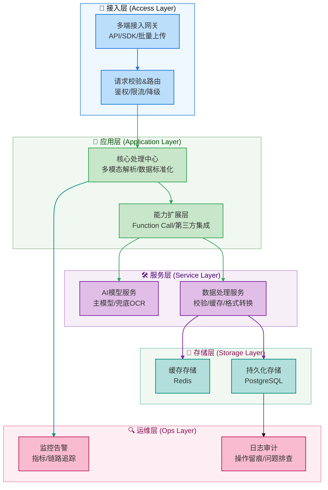

发票的OCR识别对于现今而言，可以说比较成熟了；今天我们来从0到1实现一个基于大模型的发票提取智能体，也基于此看看大模型开发和传统的开发之间，有什么区别

## 一、系统架构设计

### 1.1 设计目标

大模型发票信息提取方案，主要基于SpringAI+多模态大模型，实现零配置、高泛化、端到端的发票智能提取系统，核心优势：

- 无需模板：直接理解任意版式发票
- 语义理解：理解发票内容而非单纯OCR
- 结构化输出：直接生成可入库的数据结构

### 1.2 系统整体架构

对应的系统架构设计如下


从整体的分层结构来看，一个完整的发票提取包含：

- 接入层：负责接收外部请求、做初步流量治理
  - 定位：可以理解为全局网关，承接外部流量并过滤非法请求
- 应用层：做发票的多模态解析（比如识别票据图片、解析文本） + 数据标准化（统一发票信息的格式）；
  - 定位： “业务中枢”，串联下游服务、实现发票提取的核心流程
- 服务层：把具体技术能力封装为独立服务，供应用层调用
  - 定位：能力组件库，解耦业务逻辑与技术实现。
- 存储层：按数据特性分两类存储：缓存存储（Redis）存高频访问的发票信息，提升查询效率  + 持久化存储（PostgreSQL）存全量发票数据，做长期归档。
  - 定位：数据仓库，保障数据的高效访问与长期留存。
- 运维层：监控与审计
  - 定位：运维保障，确保全流程可观测、问题可追溯



### 1.3 业务流程

基于上面的系统架构，我们可以串一下发票信息提取的全流程

- 用户上传发票
- 后端应用接受请求，做一些基本过滤
- 应用层处理发票识别逻辑
- 服务层与大模型交互，提取识别结果，并存储相关的数据


```
graph TD
    %% 样式定义：按架构分层设置配色，适配研发视角
    classDef userLayer fill:#e6f7ff,stroke:#1890ff,stroke-width:2px,color:#000;
    classDef accessLayer fill:#b3e0ff,stroke:#096dd9,stroke-width:2px,color:#000;
    classDef appLayer fill:#b7eb8f,stroke:#52c41a,stroke-width:2px,color:#000;
    classDef serviceLayer fill:#fff7e6,stroke:#fa8c16,stroke-width:2px,color:#000;
    classDef storageLayer fill:#f9e5ff,stroke:#722ed1,stroke-width:2px,color:#000;
    classDef opsLayer fill:#f0f2f5,stroke:#8c8c8c,stroke-width:2px,color:#000;

    %% 流程节点
    A[用户上传发票文件/图片]:::userLayer --> B[接入层：权限校验+限流控制]:::accessLayer
    B --> C[接入层：请求路由分发]:::accessLayer
    C --> D[应用层：接收请求并初始化处理流程]:::appLayer
    D --> E[应用层：调用AI模型服务]:::appLayer
    E --> F[服务层：发票OCR识别+大模型信息提取]:::serviceLayer
    F --> G[服务层：数据校验+格式标准化]:::serviceLayer
    G --> H[存储层：缓存高频发票数据（Redis）]:::storageLayer
    G --> I[存储层：持久化全量发票数据（PG）]:::storageLayer
    H & I --> J[应用层：整合提取结果并封装]:::appLayer
    J --> K[接入层：返回标准化发票信息结果]:::accessLayer
    K --> L[用户接收发票提取结果]:::userLayer

    %% 运维层全流程监控（并行）
    B -.-> M[运维层：请求流量监控]:::opsLayer
    F -.-> N[运维层：模型调用链路追踪]:::opsLayer
    G -.-> O[运维层：数据处理日志审计]:::opsLayer
    K -.-> P[运维层：结果返回延迟统计]:::opsLayer
    M & N & O & P --> Q[运维层：异常告警（如有）]:::opsLayer
```


## 二、数据结构设计

一个完整的应用实现应该包含我们上面提到的六层结构；当然由于篇幅有限，我们这里则只抓重点，主要关注下大模型这一层的交互实现上；对于持久化、运维监控这块就一笔带过

### 2.1 发票核心数据模型

发票本身的类型较多，不同的发票对应的信息也不太一样，这块的专业性有一点高；如果不太熟悉这块业务背景的小伙伴，直接对照发票来验证即可，比如下面这是一张从baidu上找到的专票


从这个票面信息，我们可以定义销售方、购买方信息(核心是名称 + 纳税人识别号)

```java
@JsonClassDescription(value = "发票方信息")
public record PartyInfo(
        @JsonPropertyDescription(value = "名称")
        String name,
        @JsonPropertyDescription(value = "纳税人识别号")
        String taxId,
        @JsonPropertyDescription(value = "地址")
        String address,
        @JsonPropertyDescription(value = "电话")
        String phone,
        @JsonPropertyDescription(value = "开户银行")
        String bank,
        @JsonPropertyDescription(value = "银行账号")
        String account) {
}
```

发票行信息（即商品、服务名称）

```java
@JsonClassDescription(value = "发票商品明细")
public record InvoiceItem(
        @JsonPropertyDescription(value = "商品名称")
        String itemName,
        @JsonPropertyDescription(value = "商品规格")
        String specification,
        @JsonPropertyDescription(value = "单位")
        String unit,
        @JsonPropertyDescription(value = "数量")
        BigDecimal quantity,
        @JsonPropertyDescription(value = "单价")
        BigDecimal unitPrice,
        @JsonPropertyDescription(value = "金额")
        BigDecimal amount,
        @JsonPropertyDescription(value = "税率")
        BigDecimal taxRate,
        @JsonPropertyDescription(value = "税额")
        BigDecimal taxAmount,
        @JsonPropertyDescription(value = "价税合计")
        BigDecimal totalAmount) {
}
```

对应的发票信息

```java
@Data
@JsonClassDescription(value = "发票完整信息")
public class InvoiceInfo {
    // 发票基本信息
    @JsonPropertyDescription(value = "发票类型，如：增值税专用发票")
    private String invoiceType;

    @JsonPropertyDescription(value = "发票代码，如：044001800111")
    private String invoiceCode;

    @JsonPropertyDescription(value = "发票号码，如：12345678")
    private String invoiceNumber;

    // 机器编号
    @JsonPropertyDescription(value = "机器编号，如：66173206007")
    private String machineNumber;

    @JsonPropertyDescription(value = "密码区，如：0-TZ099+/8<0*8+T98Z/<6T</L9>0-260<*L6/6T/S->>00998¥//<L82Z099*+/8<0*8+T9*/Z<¥<696<E9200-896+/8T*8-")
    private String passwordArea;

    @JsonPropertyDescription(value = "开票日期，如：2024-01-15")
    private LocalDate issueDate;

    @JsonPropertyDescription(value = "校验码，如：12345 67890 12345 67890")
    private String checkCode;

    // 购销双方信息
    @JsonPropertyDescription(value = "销售方信息")
    private PartyInfo seller;

    @JsonPropertyDescription(value = "购买方信息")
    private PartyInfo buyer;

    // 金额信息
    @JsonPropertyDescription(value = "不含税金额")
    private BigDecimal amountWithoutTax;

    @JsonPropertyDescription(value = "税额")
    private BigDecimal taxAmount;

    @JsonPropertyDescription(value = "价税合计")
    private BigDecimal totalAmount;

    @JsonPropertyDescription(value = "税率，如：0.13")
    private BigDecimal taxRate;

    @JsonPropertyDescription(value = "备注")
    private String remark;

    @JsonPropertyDescription(value = "收款人")
    private String payee;

    @JsonPropertyDescription(value = "复核人")
    private String reviewer;

    @JsonPropertyDescription(value = "开票人")
    private String issuer;

    // 系统信息
    @JsonPropertyDescription(value = "发票图片MD5")
    private String imageHash;

    @JsonPropertyDescription(value = "提取置信度，如：0.95")
    private Double confidence;

    @JsonPropertyDescription(value = "提取时间")
    private LocalDateTime extractTime;

    @JsonPropertyDescription(value = "商品/服务明细列表")
    private List<InvoiceItem> items;
}
```


### 2.2 请求响应模型

如果我们希望提供一个功能齐全的发票提取服务，那么有必要好好设计一下提供REST API（最好是基于真实的业务诉求来设计），我们先做一个非常基础简单的能力提供


上传方式：

- 传发票文件
- 传base64图格式放票
- 传http格式发票
- 指定是否需要解析发票的商品行


```java
@Data
@Schema(description = "发票提取请求")
public class InvoiceExtractRequest {

    @Schema(description = "发票图片,如果是http开头表示发票访问链接；如果是 data:image/png;base64, 开头表示为base64格式图片")
    private String image;

    @Schema(description = "图片格式", example = "image/jpeg")
    private String imageType;

    @Schema(description = "是否需要商品明细", example = "true")
    private boolean needItems = true;

    @Schema(description = "提示信息")
    private String msg;
}
```

对应的返回比较常见了

```java
// 定义一个枚举状态，用于标记识别结果
public enum ProcessStatus {
    SUCCESS,
    PARTIAL_SUCCESS,
    VALIDATION_FAILED,
    OCR_FAILED,
    TIMEOUT,
    ERROR
}


// 返回的包装结果
@Data
@Accessors(chain = true)
@Schema(description = "发票提取响应")
public class InvoiceExtractResponse {

    @Schema(description = "请求ID")
    private String requestId;

    @Schema(description = "处理状态")
    private ProcessStatus status;

    @Schema(description = "提取结果")
    private InvoiceInfo invoiceInfo;

    @Schema(description = "处理耗时(ms)")
    private Long processTime;

    @Schema(description = "错误信息")
    private String errorMessage;
}

```

## 三、项目搭建

首先我们需要搭建要给SpringAI的项目，不太熟悉的小伙伴可以参照 [01.创建一个SpringAI的示例工程 | 一灰灰的站点](https://hhui.top/tutorial/spring/springai/%E5%9F%BA%E7%A1%80%E7%AF%87/01.%E5%88%9B%E5%BB%BA%E4%B8%80%E4%B8%AASpringAI-Demo%E5%B7%A5%E7%A8%8B.html) 来完成

在下面的实现过程中，我们使用智谱的免费大模型作为我们的实际载体；若希望使用其他的模型的小伙伴，也可以直接替换（SpringAI对不同厂商的大模型集成得相当可以，切换成本较低）

### 3.1 基础环境

我们使用的SpringAI的版本为最新的 `1.1.2` ，此外直接使用 zhipu 的starter来作为大模型的交互客户端

```xml
<!-- pom.xml 关键依赖 -->
<dependencies>
    <dependency>
        <groupId>org.springframework.boot</groupId>
        <artifactId>spring-boot-starter-web</artifactId>
    </dependency>
    <dependency>
        <groupId>org.springframework.ai</groupId>
        <artifactId>spring-ai-starter-model-zhipuai</artifactId>
    </dependency>
    <dependency>
        <groupId>cn.hutool</groupId>
        <artifactId>hutool-http</artifactId>
        <version>5.8.38</version>
    </dependency>
</dependencies>
```

然后在配置文件中，设置对应的配置信息，其中关键点为 

- api-key: 可以通过启动参数、系统环境变量等方式注入key，从而避免硬编码导致的泄露问题
- model: 选择的是免费的 `GLM-4.1V-Thinking-Flash`， 支持图片识别（相比较于 `GLM-4V-Flash` 上下文窗口更大，但是响应也更慢）
- temperature: 0.1 低温度，保证提取的稳定性

```yaml
# application.yml
spring:
  ai:
    zhipuai:
      # api-key 使用你自己申请的进行替换；如果为了安全考虑，可以通过启动参数进行设置
      api-key: ${zhipuai-api-key}
      chat:
        options:
          model: GLM-4.1V-Thinking-Flash  # 视觉理解模型, 这个模型的上下文窗口 64K，比 GLM-4V-Flash 的 4K 可以返回更多的内容
          temperature: 0.1 # 低温度，保证提取的稳定性


# 修改日志级别
logging:
  level:
    org.springframework.ai.chat.client.advisor.SimpleLoggerAdvisor: debug
```

### 3.2 可选的发票提取工具页

为了更好的进行交互体验，我们实现一个网页交互页面，用于上传发票、查看返回结果，直接基于 thymleaf 来实现

因此添加依赖 `spring-boot-starter-thymeleaf`

```xml
<dependency>
    <groupId>org.springframework.boot</groupId>
    <artifactId>spring-boot-starter-thymeleaf</artifactId>
</dependency>
```

如果本地开发，需要修改前端页面的小伙伴，可以考虑关闭缓存 （可选配置）

```yaml
# application.yml
spring:
  thymeleaf:
    cache: false
```


## 四、核心实现代码

### 4.1 提示词管理

首先我们需要制定大模型来提取结构化发票的提示词，区别于 [大模型应用开发实战：两百行实现一个自然语言地址提取智能体](https://mp.weixin.qq.com/s/96rHyp_gBUgmA2dhSbzNww) 中的硬编码实现方式，我们将提示词统一放在资源目录下 `resources/prompt` 命名为 `xxx.pt`的文本中保存提示词模板

一个可用于大模型提取发票的提示词如下

```pt
你是一个专业的发票信息提取专家。请从用户提供的发票图片中提取完整的结构化信息。

必须遵循：
1. 准确识别发票类型（增值税专用发票、增值税普通发票、电子普通发票等）
2. 提取所有关键字段：发票代码、发票号码、开票日期、校验码等
3. 识别购销双方完整信息（名称、纳税人识别号、地址电话、开户行及账号）
4. 提取商品明细，包括商品名称、规格、单位、数量、单价、金额、税率、税额
5. 计算并核对金额：不含税金额、税额、价税合计
6. 识别备注、收款人、复核人、开票人等信息
7. 对于模糊或不清晰或无法识别的字段，请使用null值。
8. 请确保所有金额字段为数字类型，日期为字符串格式。
9. 请务必返回完整内容，不要截断JSON。

输出格式要求：
请严格按照以下JSON格式输出，不要包含任何额外文本：
{
  "invoiceType": "发票类型",
  "invoiceCode": "发票代码",
  "invoiceNumber": "发票号码",
  "issueDate": "YYYY-MM-DD",
  "checkCode": "校验码",
  "seller": {
    "name": "销售方名称",
    "taxId": "纳税人识别号",
    "address": "地址",
    "phone": "电话",
    "bank": "开户行",
    "account": "账号"
  },
  "buyer": {
    "name": "购买方名称",
    "taxId": "纳税人识别号",
    "address": "地址",
    "phone": "电话",
    "bank": "开户行",
    "account": "账号"
  },
  "amountWithoutTax": 1000.00,
  "taxAmount": 130.00,
  "totalAmount": 1130.00,
  "taxRate": 0.13,
  "items": [
    {
      "itemName": "商品名称",
      "specification": "规格型号",
      "unit": "单位",
      "quantity": 1.0,
      "unitPrice": 1000.00,
      "amount": 1000.00,
      "taxRate": 0.13,
      "taxAmount": 130.00,
      "totalAmount": 1130.00
    }
  ],
  "remark": "备注信息",
  "payee": "收款人",
  "reviewer": "复核人",
  "issuer": "开票人",
  "confidence": 0.95
}
```

### 4.2 提示词注入

然后在应用中，对应的提示词可以直接使用 `@Value` 注解进行注入，如提取服务的初始化


```java
@Slf4j
@Service
public class InvoiceExtractionService {

    @Value("classpath:/prompts/invoice-extract.st")
    private Resource invoiceSystemPrompt;

    private final ChatModel chatModel;
    private final ChatClient chatClient;

    public InvoiceExtractionService(ChatModel chatModel) {
        this.chatModel = chatModel;
        this.chatClient = ChatClient.builder(chatModel)
                .defaultAdvisors(new SimpleLoggerAdvisor())
                .build();
    }
}
```

### 4.3 基于大模型的发票信息提取

接下来就是核心的借助SpringAI实现大模型的交互，基于多模态的交互方案，传入系统提示词、用户消息+图片，定义结果化返回，以此来获取响应结果

> 不到十行的代码，就可以实现提取逻辑（属实是有点夸张了啊~）

```java
/**
 * 识别发票内容
 *
 * @param imageBytes 图片字节
 * @param mimeType   图片类型
 * @param msg        识别提示信息
 * @return
 */
public InvoiceInfo extractInvoice(byte[] imageBytes, MimeType mimeType, String msg) {
    long start = System.currentTimeMillis();
    Message systemMsg = new SystemMessage(invoiceSystemPrompt);
    Media media = Media.builder().mimeType(mimeType).data(imageBytes).build();
    Message userMsg = UserMessage.builder().text((msg != null && !msg.isEmpty()) ? msg : "请将发票图片内容进行识别，并返回结构化的发票信息").media(media).build();

    Prompt prompt = new Prompt(List.of(systemMsg, userMsg));
    InvoiceInfo invoiceInfo = chatClient.prompt(prompt).call().entity(InvoiceInfo.class);
    log.info("解析耗时：{} 返回: \n{}", System.currentTimeMillis() - start, toStr(invoiceInfo));
    return invoiceInfo;
}
```

### 4.4 验证接口

接下来为了快速验证效果，我们可以整一个简单的验证接口，接收上传的发票，返回提取结果

```java
@Controller
public class InvoiceExtractionController {
    private final InvoiceExtractionService invoiceExtractionService;

    public InvoiceExtractionController(InvoiceExtractionService invoiceExtractionService) {
        this.invoiceExtractionService = invoiceExtractionService;
    }

    /**
     * 上传发票图片并提取内容
     *
     * @param file 上传的发票图片文件
     * @param msg  识别提示信息
     * @return 识别结果
     */
    @ResponseBody
    @PostMapping(path = "/extractInvoice")
    public InvoiceInfo extractInvoice(@RequestParam("file") MultipartFile file,
                                      @RequestParam(value = "msg", required = false) String msg
    ) throws IOException {
        byte[] imageBytes = file.getBytes();
        MimeType mimeType = MimeType.valueOf(file.getContentType());
        return invoiceExtractionService.extractInvoice(imageBytes, mimeType, msg);
    }


    /**
     * 显示发票识别页面
     *
     * @return HTML页面
     */
    @GetMapping("/invoicePage")
    public String invoicePage(Model model) {
        return "invoice_extraction";
    }
}
```


然后让AI帮我生成一个交互的前端页面， `invoice_extraction.html`，放在 `resources/template` 目录下

```html
<!DOCTYPE html>
<html lang="zh-CN">
<head>
    <meta charset="UTF-8">
    <meta name="viewport" content="width=device-width, initial-scale=1.0">
    <title>发票信息提取</title>
    <style>
        body {
            font-family: Arial, sans-serif;
            max-width: 1600px;
            margin: 0 auto;
            padding: 20px;
            background-color: #f5f5f5;
        }

        .container {
            background-color: white;
            border-radius: 8px;
            padding: 10px;
            box-shadow: 0 2px 10px rgba(0, 0, 0, 0.1);
        }

        h1 {
            text-align: center;
            color: #333;
            margin-bottom: 10px;
        }

        .main-layout {
            display: flex;
            gap: 20px;
            align-items: flex-start;
        }

        .left-panel,  .right-panel {
            flex: 3;
            min-width: 0;
            min-height: 400px;
            border: 1px dashed #ccc;
            text-align: center;
        }
        .center-panel {
            flex: 1;
            text-align: center;
            min-height: 400px;
            border: 1px dashed #ccc;
            padding: 12px;
        }

        .panel {
            background-color: #f9f9f9;
            border-radius: 8px;
            padding: 20px;
            box-shadow: 0 1px 3px rgba(0, 0, 0, 0.1);
        }

        .upload-area {
            border: 2px dashed #ccc;
            border-radius: 8px;
            padding: 20px;
            text-align: center;
            margin-bottom: 20px;
            transition: border-color 0.3s;
        }

        .upload-area.highlight {
            border-color: #007bff;
            background-color: #f0f8ff;
        }

        .upload-area p {
            margin: 0 0 15px 0;
            color: #666;
        }

        .file-input {
            display: none;
        }

        .upload-btn {
            background-color: #007bff;
            color: white;
            padding: 10px 20px;
            border: none;
            border-radius: 4px;
            cursor: pointer;
            font-size: 16px;
            margin: 10px 0;
        }

        .upload-btn:hover {
            background-color: #0056b3;
        }

        .checkbox-container {
            margin: 15px 0;
            text-align: center;
            display: block;
        }

        .checkbox-label-2 {
            display: inline-flex;
            align-items: center;
            cursor: pointer;
            font-size: 14px;
            color: #666;
            user-select: none;
        }

        .checkbox-input {
            margin-right: 8px;
            width: 16px;
            height: 16px;
            cursor: pointer;
            vertical-align: middle;
        }

        .checkbox-text {
            vertical-align: middle;
        }


        .preview-container {
            text-align: center;
            margin-top: 15px;
            display: none;
        }

        .preview-container h3 {
            margin-top: 0;
            margin-bottom: 10px;
            color: #333;
        }

        .preview-image {
            max-width: 100%;
            max-height: 350px;
            border-radius: 4px;
            box-shadow: 0 2px 5px rgba(0, 0, 0, 0.1);
            border: 1px solid #eee;
        }

        .controls {
            text-align: center;
            margin: 20px 0;
        }

        .identify-btn {
            background-color: #28a745;
            color: white;
            padding: 12px 30px;
            border: none;
            border-radius: 4px;
            cursor: pointer;
            font-size: 16px;
            display: block;
            width: 100%;
            margin-bottom: 10px;
        }

        .identify-btn:hover {
            background-color: #218838;
        }

        .clear-btn {
            background-color: #dc3545;
            color: white;
            padding: 12px 30px;
            border: none;
            border-radius: 4px;
            cursor: pointer;
            font-size: 16px;
            display: block;
            width: 100%;
        }

        .clear-btn:hover {
            background-color: #c82333;
        }

        .result-container {
            margin-top: 20px;
        }

        .result-title {
            font-weight: bold;
            margin-bottom: 10px;
            color: #333;
        }

        .result-content {
            white-space: pre-wrap;
            word-wrap: break-word;
            max-height: 500px;
            min-height: 300px;
            overflow-y: auto;
            background-color: white;
            margin: 10px;
            padding: 10px;
            border-radius: 4px;
            border: 1px solid #eee;
        }

        .loading {
            text-align: center;
            padding: 20px;
            display: none;
        }

        .loading-spinner {
            border: 4px solid #f3f3f3;
            border-top: 4px solid #007bff;
            border-radius: 50%;
            width: 40px;
            height: 40px;
            animation: spin 1s linear infinite;
            margin: 0 auto 10px;
        }

        @keyframes spin {
            0% {
                transform: rotate(0deg);
            }
            100% {
                transform: rotate(360deg);
            }
        }

        .paste-area {
            margin-top: 15px;
            padding: 10px;
            border: 1px solid #eee;
            border-radius: 4px;
            background-color: #fafafa;
        }

        .paste-area p {
            margin: 0;
            font-size: 14px;
            color: #666;
        }
    </style>
</head>
<body>
<div class="container">
    <h1>发票信息提取系统</h1>
    <div class="top">
        <h3>选择发票图片</h3>
        <div class="upload-area" id="uploadArea">
            <p>点击下方按钮选择图片，或将图片拖拽到此区域</p>
            <input type="file" id="fileInput" class="file-input" accept="image/*">
            <button class="upload-btn" onclick="document.getElementById('fileInput').click()">选择图片</button>
            <div class="paste-area">
                <p>或者按 Ctrl+V 粘贴剪贴板中的图片</p>
            </div>
        </div>
    </div>
    <div class="main-layout panel">
        <!-- 左侧面板：图片选择和预览 -->
        <div class="left-panel">
            <h3>图片预览</h3>
            <div class="preview-container" id="previewContainer">
                
            </div>
        </div>

        <!-- 中间面板：操作按钮 -->
        <div class="center-panel">
            <div>
                <h3>操作区域</h3>
                <div class="controls" id="controls" style="display:none;">
                    <button class="identify-btn" id="identifyBtn">识别发票信息</button>
                    <div class="checkbox-container">
                        <label class="checkbox-label-2">
                            <input type="checkbox" id="needItemsCheckbox" class="checkbox-input">
                            <span class="checkbox-text">发票行数提取</span>
                        </label>
                    </div>
                    <button class="clear-btn" id="clearBtn">清除</button>
                </div>

                <div class="loading" id="loading">
                    <div class="loading-spinner"></div>
                    <p>正在识别发票信息，请稍候...</p>
                </div>
            </div>
        </div>

        <!-- 右侧面板：识别结果 -->
        <div class="right-panel">
            <div>
                <h3>识别结果</h3>
                <div class="result-container" id="resultContainer">
                    <div id="resultContent" class="result-content"></div>
                </div>
            </div>
        </div>
    </div>
</div>

<script>
    document.addEventListener('DOMContentLoaded', function () {
        const uploadArea = document.getElementById('uploadArea');
        const fileInput = document.getElementById('fileInput');
        const previewContainer = document.getElementById('previewContainer');
        const previewImage = document.getElementById('previewImage');
        const controls = document.getElementById('controls');
        const identifyBtn = document.getElementById('identifyBtn');
        const clearBtn = document.getElementById('clearBtn');
        const loading = document.getElementById('loading');
        const resultContainer = document.getElementById('resultContainer');
        const resultContent = document.getElementById('resultContent');

        // 文件选择事件
        fileInput.addEventListener('change', handleFileSelect);

        // 拖拽事件
        uploadArea.addEventListener('dragover', function (e) {
            e.preventDefault();
            uploadArea.classList.add('highlight');
        });

        uploadArea.addEventListener('dragleave', function (e) {
            e.preventDefault();
            uploadArea.classList.remove('highlight');
        });

        uploadArea.addEventListener('drop', function (e) {
            e.preventDefault();
            uploadArea.classList.remove('highlight');
            if (e.dataTransfer.files.length > 0) {
                handleFiles(e.dataTransfer.files);
            }
        });

        // 粘贴事件
        document.addEventListener('paste', function (e) {
            if (e.clipboardData && e.clipboardData.items) {
                let items = e.clipboardData.items;
                for (let i = 0; i < items.length; i++) {
                    if (items[i].type.indexOf('image') !== -1) {
                        let blob = items[i].getAsFile();
                        handleFiles([blob]);
                        break;
                    }
                }
            }
        });

        // 清除按钮
        clearBtn.addEventListener('click', function () {
            fileInput.value = '';
            previewContainer.style.display = 'none';
            controls.style.display = 'none';
            resultContainer.style.display = 'none';
            uploadArea.classList.remove('highlight');
        });

        // 识别按钮
        identifyBtn.addEventListener('click', identifyInvoice);

        function handleFileSelect(e) {
            if (e.target.files.length > 0) {
                handleFiles(e.target.files);
            }
        }

        function handleFiles(files) {
            const file = files[0];
            if (!file.type.match('image.*')) {
                alert('请选择图片文件！');
                return;
            }

            // 设置fileInput的files属性，以便识别按钮可以访问
            if (fileInput.files !== files) {
                // 创建一个新的FileList对象
                const dataTransfer = new DataTransfer();
                dataTransfer.items.add(file);
                fileInput.files = dataTransfer.files;
            }

            const reader = new FileReader();
            reader.onload = function (e) {
                previewImage.src = e.target.result;
                previewContainer.style.display = 'block';
                controls.style.display = 'block';
            };
            reader.readAsDataURL(file);
        }

        async function identifyInvoice() {
            if (!fileInput.files[0]) {
                alert('请先选择一张图片！');
                return;
            }

            loading.style.display = 'block';
            resultContainer.style.display = 'none';

            const formData = new FormData();
            formData.append('file', fileInput.files[0]);
            formData.append('msg', '请将发票图片内容进行识别，并返回结构化的发票信息');
            // 新增参数：needItems
            const needItemsCheckbox = document.getElementById('needItemsCheckbox');
            formData.append('needItems', needItemsCheckbox.checked);


            try {
                const response = await fetch('/extractInvoice', {
                    method: 'POST',
                    body: formData
                });

                const result = await response.text();

                // 尝试解析JSON并格式化显示
                try {
                    const jsonData = JSON.parse(result);
                    resultContent.innerHTML = formatInvoiceData(jsonData);
                } catch (e) {
                    // 如果不是有效的JSON，则直接显示原始文本
                    resultContent.textContent = result;
                }

                resultContainer.style.display = 'block';
            } catch (error) {
                console.error('识别失败:', error);
                resultContent.textContent = '识别失败: ' + error.message;
                resultContainer.style.display = 'block';
            } finally {
                loading.style.display = 'none';
            }
        }
    });

    // 格式化发票数据的函数
    function formatInvoiceData(data) {
        if (typeof data !== 'object') {
            return '<p>无法解析的数据格式</p>';
        }

        let html = '<div class="formatted-result">';

        // 如果是数组，遍历每个项目
        if (Array.isArray(data)) {
            html += '<h3>发票列表</h3>';
            data.forEach((item, index) => {
                html += `<div class="invoice-item"><h4>发票 ${index + 1}</h4>` + formatSingleInvoice(item) + '</div>';
            });
        } else {
            // 单个发票对象
            html += formatSingleInvoice(data);
        }

        html += '</div>';
        return html;
    }

    function formatSingleInvoice(invoice) {
        if (typeof invoice !== 'object') return '';

        let html = '<table class="invoice-table" style="width: 100%; border-collapse: collapse; margin: 10px 0;">';

        for (const [key, value] of Object.entries(invoice)) {
            html += '<tr style="border-bottom: 1px solid #eee;">' +
                `<td style="padding: 8px; text-align: left; font-weight: bold; width: 30%; background-color: #f8f9fa;">
` +
                `${formatKey(key)}</td>
` +
                `<td style="padding: 8px; text-align: left; width: 70%;">
` +
                `${formatValue(value)}</td></tr>`;
        }

        html += '</table>';
        return html;
    }

    function formatKey(key) {
        const keyMap = {
            'invoiceType': '发票类型',
            'invoiceCode': '发票代码',
            'invoiceNumber': '发票号码',
            'invoiceDate': '开票日期',
            'checkCode': '校验码',
            'machineNumber': '机器编号',
            'purchaserName': '购买方名称',
            'purchaserTaxNumber': '购买方税号',
            'purchaserAddressPhone': '购买方地址电话',
            'purchaserBankAccount': '购买方开户行及账号',
            'sellerName': '销售方名称',
            'sellerTaxNumber': '销售方税号',
            'sellerAddressPhone': '销售方地址电话',
            'sellerBankAccount': '销售方开户行及账号',
            'totalAmountInWords': '合计金额大写',
            'totalAmountInFigures': '合计金额小写',
            'taxTotalAmountInWords': '价税合计大写',
            'taxTotalAmountInFigures': '价税合计小写',
            'remark': '备注',
            'cashier': '收款人',
            'reviewer': '复核',
            'checker': '开票人',
            'goodsList': '货物或应税劳务清单',
            'amount': '金额',
            'taxRate': '税率',
            'taxAmount': '税额'
        };

        return keyMap[key] || key.charAt(0).toUpperCase() + key.slice(1);
    }

    function formatValue(value) {
        if (value === null || value === undefined) {
            return '<span style="color: #999; font-style: italic;">无数据</span>';
        }

        if (typeof value === 'object') {
            if (Array.isArray(value)) {
                if (value.length === 0) return '无数据';

                let listHtml = '<div style="margin: 5px 0;">';
                value.forEach((item, index) => {
                    if (typeof item === 'object') {
                        listHtml += `<div style="border: 1px solid #eee; margin: 5px 0; padding: 8px; border-radius: 4px;"><strong>项目 ${index + 1}:</strong>`;
                        for (const [k, v] of Object.entries(item)) {
                            listHtml += `<div style="margin-left: 10px;"><strong>${formatKey(k)}:</strong> ${formatValue(v)}</div>`;
                        }
                        listHtml += '</div>';
                    } else {
                        listHtml += `<div>${index + 1}. ${formatValue(item)}</div>`;
                    }
                });
                listHtml += '</div>';
                return listHtml;
            } else {
                // 嵌套对象递归处理
                let objHtml = '<div style="margin: 5px 0; padding: 8px; border-left: 3px solid #007bff;">';
                for (const [k, v] of Object.entries(value)) {
                    objHtml += `<div><strong>${formatKey(k)}:</strong> ${formatValue(v)}</div>`;
                }
                objHtml += '</div>';
                return objHtml;
            }
        }

        return String(value);
    }
</script>
</body>
</html>
```

实际体验如下


到这里，发票提取的核心服务层已基本满足要求，关于存储层的缓存和持久化，相对来说属于常见的后端实现技术栈，就不详细展开了； 那么这个实现是否可以直接应用于生产使用呢？

接下来我们看看若用于生产，还需要做哪些优化


## 五、生产优化

### 5.1 发票行数据超过大模型上下文窗口

#### 5.1.1 问题描述

发票上的基本票面信息数据量还算可控，但是开票行（即商品、服务明细）这里可能就非常多了，比如我一单买了五六十个商品、而这些商品全部放在一张发票上，当我们提取发票信息时，会发现大模型无法返回完整的数据结构（超出内容被截断了————即便我的提示词明确要求了，不要截断也没有效果）

如使用`GLM-4V-Flash` 对一张有十个开票行的发票进行提取时：


上面的示例输出中，从大模型的返回也可以看出，返回结果被截断了，导致返回的是一个不完整的数据结构，因此在结构化为java bean对象时，就报错了

那么怎么解决呢？

> 换上下文窗口更大的模型，比如 `GLM-4.1V-Thinking-Flash` ?

这当然是一个解决方案，但是并不彻底，因为大模型的上下文窗口是有限的，但是发票行却是不固定的；简单来说，我没法保证，换一个模型之后，就不会再出现返回结果被截断的情况了

那么有没有更彻底的解决方案呢？

> 分区域、分页提取

怎么理解这个解决方案呢？

我们可以套用一下传统的开发模式，当一次返回的数据太多时，我们很容易想到的解决方法时将一次的返回

- 改为分页返回，一次返回20条，若你需要再返回后20条 ———— 这种适用于列表的返回方式

参照这种思路，那么我们可以先定大模型，不要一次提取所有的开票行信息，而是按照我给他要求的进行分页提取；开票行的信息改成分页提取之后，但是其他的票面信息实际上只需要提取一次，因此我们可以将一次的提取过程，改为

- 只提取票面信息
- 分页提取开票行信息

#### 5.1.2 票面基本信息提取

按照这种方式，我们可以重新设计两个提示词，只提取开票信息的提示词 `prompts/invoice-basic-extract.st`

```tl
你是一个专业的发票信息提取专家。请从用户提供的发票图片中提取完整的结构化信息。

必须遵循：
1. 准确识别发票类型（增值税专用发票、增值税普通发票、电子普通发票等）
2. 提取所有关键字段：发票代码、发票号码、开票日期、校验码等
3. 识别购销双方完整信息（名称、纳税人识别号、地址电话、开户行及账号）
4. 识别备注、收款人、复核人、开票人等信息
5. 对于模糊或不清晰或无法识别的字段，请使用null值。
6. 请确保所有金额字段为数字类型，日期为字符串格式。
7. 请务必返回完整内容，不要截断JSON。

输出格式要求：
请严格按照以下JSON格式输出，不要包含任何额外文本：
```

对应的实现逻辑也比较简单了，因为我们返回不要开票行，所以我们可以将前面定义的数据结构 `InvoiceInfo` 进行改造，向上提取一层`BaseInvoiceInfo`基础类，相比于之前的实现，这个基础类中，不包含`List<InvoiceItem> items`

```java
@Data
@JsonClassDescription(value = "发票基本信息，不包含商品行信息")
public class BaseInvoiceInfo {
  // ...省略
}

@Data
@JsonClassDescription(value = "发票完整信息")
public class InvoiceInfo extends BaseInvoiceInfo {
    @JsonPropertyDescription(value = "商品/服务明细列表")
    private List<InvoiceItem> items;
}
```

然后参照上面的发票提取方案，实现对应的发票基本信息提取核心逻辑

```java
@Slf4j
@Service
public class InvoiceExtractionService {
    @Value("classpath:/prompts/invoice-basic-extract.st")
    private Resource baseInvoiceSystemPrompt;


    /**
     * 识别发票基础内容（不包含商品明细）
     *
     * @param imageBytes 图片字节
     * @param mimeType   图片类型
     * @param msg        识别提示信息
     * @return
     */
    public BaseInvoiceInfo extractBaseInvoice(byte[] imageBytes, MimeType mimeType, String msg) {
        Message systemMsg = new SystemMessage(baseInvoiceSystemPrompt);
        String message = (msg != null && !msg.isEmpty()) ? msg : "请将发票图片内容进行识别，并返回结构化的发票信息";

        Media media = Media.builder()
                .mimeType(mimeType)
                .data(imageBytes)
                .build();
        Message userMsg = UserMessage.builder().text(message).media(media).build();
        Prompt prompt = new Prompt(List.of(systemMsg, userMsg));
        BaseInvoiceInfo invoiceInfo = chatClient.prompt(prompt).call().entity(BaseInvoiceInfo.class);
        log.info("解析的结果: \n{}", toStr(invoiceInfo));
        return invoiceInfo;
    }
}
```

#### 5.1.3 分页提取发票行

分页提取开票行的提示词 `prompts/invoice-items-extract.st`

```tl
你是一个专业的发票信息提取专家。请从发票图片中提取商品明细的第$start$行到第$end$行。

提取要求：
1. 只提取指定行数范围的商品明细
2. 每行需要提取以下字段：
   - 商品名称
   - 规格型号（如有）
   - 单位
   - 数量
   - 单价
   - 金额
   - 税率
   - 税额
   - 价税合计

3. 如果指定范围内没有足够的行数，提取实际存在的行数
4. 如果无法识别某行，则这一行返回一个空对象进行占位，始终保证返回的行数与实际的一致

始终遵循以下规则：
- 严格按照从上到下的顺序计数，并且按照顺序提取，从第0行开始计数
- 只提取第$start$行到第$end$行内容，必须包含第$start$行，不包含第$end$行，不要提取其他行的内容

输出格式要求：
请返回JSON数组格式，每个元素代表一行：
[
  {
    "rowNumber": 1,
    "itemName": "商品名称",
    "specification": "规格型号",
    "unit": "单位",
    "quantity": 1.0,
    "unitPrice": 1000.00,
    "amount": 1000.00,
    "taxRate": 0.13,
    "taxAmount": 130.00,
    "totalAmount": 1130.00,
    "confidence": 0.95
  },
]

如果提取失败或没有找到指定行，返回空数组 []。
```

> 注意上面的提示词，因为返回提示词模板中，提供了`json`示例，如果此时我们依然使用默认的 `{}` 来表示模板变量，就会导致解析异常 (SpringAI的提示词模板解析器会将json样例中{}也认为需要进行变量替换)，为了避免这种问题，在这里，我们使用自定义的 `$$` 来包裹模板变量

一个基础的分页提取发票行实现如

```java
@Slf4j
@Service
public class InvoiceExtractionService {
    @Value("classpath:/prompts/invoice-items-extract.st")
    private Resource invoiceItemPrompt;

    private List<InvoiceItem> extractInvoiceItems(Media media, Integer start, Integer end) {
        PromptTemplate promptTemplate = PromptTemplate.builder()
                // 因为提示词中返回的json对象中，有 {}，所以使用默认的 {} 来替换占位变量，会报错
                .renderer(StTemplateRenderer.builder().startDelimiterToken('$').endDelimiterToken('$').build())
                .resource(invoiceItemPrompt)
                .build();
        String sys = promptTemplate.render(Map.of("start", start, "end", end));
        SystemMessage systemMsg = new SystemMessage(sys);

        UserMessage userMsg = UserMessage.builder().media(media).text("提取" + start + "行到" + end + "行发票商品信息，注意不包含第" + end + "行").build();
        Prompt prompt = new Prompt(List.of(systemMsg, userMsg));
        List<InvoiceItem> items = chatClient.prompt(prompt).call().entity(new ParameterizedTypeReference<List<InvoiceItem>>() {
        });
        return items;
    }
}
```

#### 5.1.4 完整的大发票提取

然后就是提供一个外部的访问入口，直接基于上面的两个基础实现，来获取大发票的完整信息提取

```java
/**
 * 识别发票中商品行较多的发票内容
 * <p>
 * - 图片中的信息，超过窗口上下文的场景，我们需要进行分批处理
 *
 * @param imageBytes 图片字节
 * @param mimeType   图片类型
 * @param msg        识别提示信息
 * @return
 */
public InvoiceInfo extractInvoiceWitInhItems(byte[] imageBytes, MimeType mimeType, String msg) {
    Media media = Media.builder()
            .mimeType(mimeType)
            .data(imageBytes)
            .build();
    // 提取发票基本信息
    CompletableFuture<BaseInvoiceInfo> infoFuture = CompletableFuture.supplyAsync(() -> {
        BaseInvoiceInfo invoiceInfo = extractBaseInvoice(imageBytes, mimeType, msg);
        return invoiceInfo;
    });

    // 分页提取发票行
    CompletableFuture<List<InvoiceItem>> itemFuture = CompletableFuture.supplyAsync(() -> {
        final int step = 5;
        int start = 0, end = step;
        List<InvoiceItem> totalItems = new ArrayList<>();
        while (true) {
            log.info("开始处理：{} - {}", start, end);
            List<InvoiceItem> items = extractInvoiceItems(media, start, end);
            if (CollectionUtils.isEmpty(items)) {
                break;
            }
            totalItems.addAll(items);
            if (items.size() < end - start) {
                break;
            } else {
                start += step;
                end += step;
            }
        }
        return totalItems;
    });

    // 等待两个任务完成
    CompletableFuture.allOf(infoFuture, itemFuture).join();

    // 构建完整的返回结果
    InvoiceInfo invoiceInfo = new InvoiceInfo();
    try {
        BeanUtils.copyProperties(infoFuture.get(), invoiceInfo);
        invoiceInfo.setItems(itemFuture.get());
    } catch (Exception e) {
        throw new RuntimeException(e);
    }
    return invoiceInfo;
}
```

我们使用上下文窗口更小、响应更快的 `GLM-4V-Flash` 模型来演示这个分页提取，如使用项目中的`test/resources/pupiao.jpg`为例，即便这个发票中有十行，也可以一并输出


#### 5.1.5 方案优化

虽然实现了分页的开票行信息提取，但是这个实现是一个明显的串行化方案；对应的当开票行数据越多，整个服务的耗时就会越大

自然，我们就会有一个改进方案，在返回发票基本信息的同时，返回总的开票行数，然后就可以基于这个总数来计算分页，这样就可以通过并行的方案，实现分页开票行提取，一个可行的实现流程图如下


```java
flowchart TB
    %% 全局样式配置：专业简洁，适配技术人员阅读
    classDef base font-size:11px, rounded:8, stroke-width:1.5
    classDef parallel fill:#e6f4ff,stroke:#1976d2,opacity:0.9
    classDef judge fill:#fff3e0,stroke:#f57c00
    classDef process fill:#e8f5e8,stroke:#2e7d32
    classDef state fill:#f3e5f5,stroke:#7b1fa2

    %% 起始节点
    Start[开始]
    GlobalState["初始化全局状态<br/>（记录开票页提取状态）"]
    
    %% 并行执行块
    subgraph "并行执行任务"
        style 并行执行任务 fill:#f8f9fa,stroke:#616161,stroke-width:2
        A["任务A：提取发票基本信息<br/>（包含总开票行数）"]
        B["任务B：提取第一页开票行<br/>（记录第一页已提取）"]
    end
    
    %% 条件判断与处理节点
    JudgeA["判断：任务A是否返回？"]
    CalcPage["计算分页数<br/>（基于总开票行数）"]
    PrepareParallel["准备并行提取每一页开票行"]
    CheckGlobal["判断全局状态：<br/>当前页是否已提取？"]
    Skip["跳过当前页提取"]
    RecordState["记录全局状态：<br/>标记当前页待提取"]
    ExtractPage["执行提取当前页开票行"]
    
    JudgeB["判断：任务B返回且A未返回？"]
    JudgeNext["判断：是否有下一页数据？"]
    PrepareNext["准备提取下一页开票行"]
    
    %% 流程连接
    Start --> GlobalState
    GlobalState --> 并行执行任务
    并行执行任务 --> JudgeA
    
    %% 任务A返回分支
    JudgeA -- 是 --> CalcPage
    CalcPage --> PrepareParallel
    PrepareParallel --> CheckGlobal
    
    %% 全局状态判断分支
    CheckGlobal -- 已提取 --> Skip
    CheckGlobal -- 未提取 --> RecordState
    RecordState --> ExtractPage
    
    %% 任务A未返回（B返回）分支
    JudgeA -- 否 --> JudgeB
    JudgeB -- 是 --> JudgeNext
    JudgeNext -- 有 --> PrepareNext
    PrepareNext --> CheckGlobal
    JudgeNext -- 无 --> End
    
    %% 收尾节点
    Skip --> End
    ExtractPage --> End
    End[结束]

    %% 样式绑定
    class A,B parallel
    class JudgeA,JudgeB,JudgeNext,CheckGlobal judge
    class CalcPage,PrepareParallel,ExtractPage,RecordState process
    class GlobalState state
```

若是觉得上面这个看起来有些复杂的话，也可以看下面这个简版方案，思路实际上是一致的


```java
flowchart TB
%%{init: { "theme": "base", "themeVariables": { "primaryColor": "#ffffff", "secondaryColor": "#f9f9f9", "tertiaryColor": "#eeeeee", "textColor": "#333", "fontSize": "16px", "subgraph_border_color": "#666", "subgraph_fill": "#e0e0e0" } } }%%
graph TB
    subgraph SA["分页提取流程"]
        style SA fill:#f0f8fb,stroke:#1976d2,stroke-width:1,opacity:0.5
        Start[开始] --> Step1[第一次调用<br>提取基本信息]
        Step1 --> Step2{判断明细行数}
        
        Step2 -->|行数≤阈值| Step3[单次提取所有明细]
        Step2 -->|行数>阈值| Step4[计算分页数]
        
        Step4 --> Step5[并行分页提取]
        
        subgraph Step5
            Page1[第一页: 行1-5]
            Page2[第二页: 行6-10]
            PageN[第N页]
        end
        
        Step5 --> Step6[合并分页结果]
        Step3 --> Step7[组装完整发票]
        Step6 --> Step7
        
        Step7 --> End[返回结果]
    end
    
    classDef process fill:#e1f5fe,stroke:#01579b
    classDef decision fill:#f3e5f5,stroke:#4a148c
    classDef parallel fill:#c8e6c9,stroke:#2e7d32
    classDef result fill:#fff3e0,stroke:#e65100
    
    class Start,Step1,Step3,Step4,Step6,Step7,End process
    class Step2 decision
    class Step5 parallel
    class Step7,End result
```


> 具体的实现就省略了，有兴趣的小伙伴可以自行补全🤣


### 5.2 图片预处理

在实际的生产场景中，我们没办法保证用户上传的始终时数电开出来的电子票原件，可能是经过打印、拍照等各种操作之后上传的图片，此时直接拿来解析一般效果较差，通常一个完整可直接商用的发票识别，很大概率会有第一步的图片预处理阶段，当然这一块不是大模型提取的关键点（非大模型的实现中也会有这一步），下面是一个可参考的预处理方案

```java
@Component
@Slf4j
public class ImagePreprocessor {
    
    @Value("${invoice.image.quality.threshold:0.8}")
    private double qualityThreshold;
    
    @Value("${invoice.image.max-size:5242880}")
    private long maxImageSize;
    
    /**
     * 图片预处理流水线
     */
    public ProcessedImage preprocessImage(MultipartFile imageFile) {
        try {
            // 1. 验证图片
            validateImage(imageFile);
            
            // 2. 读取图片
            BufferedImage originalImage = ImageIO.read(imageFile.getInputStream());
            
            // 3. 质量评估
            double qualityScore = assessImageQuality(originalImage);
            if (qualityScore < qualityThreshold) {
                log.warn("图片质量较低: {}", qualityScore);
            }
            
            // 4. 图像增强
            BufferedImage enhancedImage = enhanceImage(originalImage);
            
            // 5. 转换为Base64
            String base64Image = convertToBase64(enhancedImage);
            
            // 6. 生成哈希
            String imageHash = generateImageHash(originalImage);
            
            return ProcessedImage.builder()
                .originalImage(originalImage)
                .enhancedImage(enhancedImage)
                .base64Image(base64Image)
                .imageHash(imageHash)
                .qualityScore(qualityScore)
                .width(originalImage.getWidth())
                .height(originalImage.getHeight())
                .format(getImageFormat(imageFile))
                .build();
                
        } catch (Exception e) {
            throw new ImageProcessingException("图片预处理失败", e);
        }
    }
    
    /**
     * 图像增强：对比度增强、去噪、旋转校正
     */
    private BufferedImage enhanceImage(BufferedImage image) {
        // 转换为灰度图（提高OCR准确率）
        BufferedImage grayImage = convertToGrayscale(image);
        
        // 对比度增强
        BufferedImage contrastImage = enhanceContrast(grayImage);
        
        // 降噪处理
        BufferedImage denoisedImage = applyDenoising(contrastImage);
        
        // 自动旋转校正（基于文本方向）
        BufferedImage rotatedImage = autoRotate(denoisedImage);
        
        return rotatedImage;
    }
    
    /**
     * 自动旋转校正
     */
    private BufferedImage autoRotate(BufferedImage image) {
        try {
            // 使用Tesseract检测文本方向
            ITesseract tesseract = new Tesseract();
            tesseract.setDatapath("tessdata");
            tesseract.setLanguage("chi_sim+eng");
            
            // 设置PSM为自动检测方向
            tesseract.setPageSegMode(ITesseract.PageSegMode.PSM_AUTO_OSD);
            
            // 获取方向信息
            int orientation = tesseract.getOrientations(image);
            
            // 根据方向进行旋转
            return rotateImage(image, orientation);
            
        } catch (Exception e) {
            log.warn("自动旋转失败，使用原图", e);
            return image;
        }
    }
    
    private double assessImageQuality(BufferedImage image) {
        // 1. 清晰度评估（使用拉普拉斯方差）
        double sharpness = calculateSharpness(image);
        
        // 2. 亮度评估
        double brightness = calculateBrightness(image);
        
        // 3. 对比度评估
        double contrast = calculateContrast(image);
        
        // 4. 综合质量评分
        double qualityScore = sharpness * 0.4 + brightness * 0.3 + contrast * 0.3;
        
        return Math.min(Math.max(qualityScore, 0), 1);
    }
}
```

### 5.3 Function Calling实现数据验证

对于大模型的返回，我们可以结合 Functino Calling的机制，来实现数据验证，从而实现 ReAct 的多轮交互，比如一个非常基础的字段合法性校验如下：

```java
@Component
public class InvoiceValidationService {
    @Tool(
            name = "validateInvoiceFields",
            description = "验证发票字段的合法性和一致性"
    )
    public ValidationResult validateInvoice(
            @ToolParam(description = "发票代码") String invoiceCode,
            @ToolParam(description = "发票号码") String invoiceNumber,
            @ToolParam(description = "开票日期") String issueDate,
            @ToolParam(description = "不含税金额") BigDecimal amountWithoutTax,
            @ToolParam(description = "税额") BigDecimal taxAmount,
            @ToolParam(description = "价税合计") BigDecimal totalAmount
    ) {
        ValidationResult result = new ValidationResult();
        List<ValidationError> errors = new ArrayList<>();

        // 1. 验证发票代码格式（12位数字）
        if (invoiceCode != null && !invoiceCode.matches("\\d{12}")) {
            errors.add(new ValidationError("invoiceCode", "发票代码必须是12位数字"));
        }

        // 2. 验证发票号码格式（8位数字）
        if (invoiceNumber != null && !invoiceNumber.matches("\\d{8}")) {
            errors.add(new ValidationError("invoiceNumber", "发票号码必须是8位数字"));
        }

        // 3. 验证日期格式
        if (issueDate != null) {
            try {
                LocalDate.parse(issueDate);
            } catch (Exception e) {
                errors.add(new ValidationError("issueDate", "开票日期格式错误"));
            }
        }

        // 4. 验证金额关系
        if (amountWithoutTax != null && taxAmount != null && totalAmount != null) {
            BigDecimal calculatedTotal = amountWithoutTax.add(taxAmount);
            BigDecimal diff = totalAmount.subtract(calculatedTotal).abs();

            if (diff.compareTo(new BigDecimal("0.01")) > 0) {
                errors.add(new ValidationError("amounts",
                        String.format("金额计算不一致: 不含税(%.2f) + 税额(%.2f) ≠ 合计(%.2f)",
                                amountWithoutTax, taxAmount, totalAmount)));
            }
        }

        // 5. 验证纳税人识别号（15-20位）
        // 这里可以添加更复杂的验证逻辑

        result.setErrors(errors);
        result.setValid(errors.isEmpty());
        result.setValidationTime(LocalDateTime.now());

        return result;
    }

    @Data
    public static class ValidationResult {
        private boolean valid;
        private List<ValidationError> errors;
        private LocalDateTime validationTime;
    }

    public record ValidationError(String field, String message) {
    }
}
```


除了上面这个之外，我们还可以对纳锐人识别号、企业名称进行合法性校验（比如通过内部维护的映射或者外部的企查查之类的接口来实现）

当然这些属于辅助手段，不加貌似也没有太大的问题🤣

### 5.4 降级策略：传统OCR备用方案

最后在生产环境中，难免会有一些突发情况，所以一个健壮的系统，对应的降级方案是不可缺少的，比如加一个ocr的备用方案

```java
@Component
@Slf4j
public class FallbackOCRExtractor {
    
    @Autowired
    private AliYunOCRClient aliYunOCRClient;
    
    @Autowired
    private InvoiceTemplateMatcher templateMatcher;
    
    /**
     * 当大模型提取失败时的降级方案
     */
    public InvoiceInfo extractWithOCR(ProcessedImage processedImage) {
        try {
            // 1. 调用阿里云OCR
            OCRResponse ocrResponse = aliYunOCRClient.analyzeInvoice(
                processedImage.getBase64Image()
            );
            
            // 2. 使用模板匹配提取结构化信息
            Map<String, String> extractedFields = templateMatcher.matchAndExtract(
                ocrResponse.getTextBlocks()
            );
            
            // 3. 转换为InvoiceInfo对象
            InvoiceInfo invoiceInfo = convertToInvoiceInfo(extractedFields);
            
            // 4. 设置较低的置信度
            invoiceInfo.setConfidence(0.6);
            
            return invoiceInfo;
            
        } catch (Exception e) {
            log.error("OCR降级方案也失败", e);
            throw new InvoiceExtractException("所有提取方案均失败");
        }
    }
}
```

### 5.5 监控与指标

如果有必要有条件，基于Prometheus的监控加上可以说是一个`资深程序猿`的基本素养了，同样给一个简单的示例

```java
@Component
@Slf4j
public class InvoiceExtractMetrics {
    
    private final MeterRegistry meterRegistry;
    
    // 提取成功率
    private final Counter successCounter;
    private final Counter failureCounter;
    
    // 处理时间直方图
    private final Timer extractTimer;
    
    // 图片质量分布
    private final DistributionSummary qualitySummary;
    
    public InvoiceExtractMetrics(MeterRegistry meterRegistry) {
        this.meterRegistry = meterRegistry;
        
        this.successCounter = Counter.builder("invoice.extract.success")
            .description("发票提取成功次数")
            .register(meterRegistry);
        
        this.failureCounter = Counter.builder("invoice.extract.failure")
            .description("发票提取失败次数")
            .register(meterRegistry);
        
        this.extractTimer = Timer.builder("invoice.extract.duration")
            .description("发票提取耗时")
            .publishPercentiles(0.5, 0.95, 0.99)
            .register(meterRegistry);
        
        this.qualitySummary = DistributionSummary.builder("invoice.image.quality")
            .description("发票图片质量评分")
            .register(meterRegistry);
    }
    
    public void recordSuccess(long duration, double quality) {
        successCounter.increment();
        extractTimer.record(duration, TimeUnit.MILLISECONDS);
        qualitySummary.record(quality);
    }
    
    public void recordFailure(String errorType) {
        failureCounter.increment();
        meterRegistry.counter("invoice.extract.error." + errorType).increment();
    }
}
```

## 六、部署方案

### 6.1 Docker容器化

```dockerfile
# Dockerfile
FROM openjdk:17-jdk-slim as builder
WORKDIR /D04-invoice-extraction
COPY . .
RUN chmod +x ./mvnw
RUN ./mvnw clean package -DskipTests

FROM openjdk:17-jdk-slim
WORKDIR /D04-invoice-extraction

# 安装Tesseract OCR（用于降级方案）
RUN apt-get update && apt-get install -y \
    tesseract-ocr \
    tesseract-ocr-chi-sim \
    libtesseract-dev \
    && rm -rf /var/lib/apt/lists/*

# 复制应用
COPY --from=builder /D04-invoice-extraction/target/D04-invoice-extraction-0.0.1-SNAPSHOT.jar app.jar
COPY --from=builder /D04-invoice-extraction/tessdata /usr/share/tessdata

# 创建非root用户
RUN useradd -m -u 1000 spring
USER spring

EXPOSE 8080

ENTRYPOINT ["java", "-jar", "app.jar", "--spring.ai.zhipuai.api-key=${ZHIPU_KEY}"]
```

### 6.2 Kubernetes部署

```yaml
# invoice-extract-deployment.yaml
apiVersion: apps/v1
kind: Deployment
metadata:
  name: invoice-extract-service
  namespace: finance
spec:
  replicas: 3
  selector:
    matchLabels:
      app: invoice-extract
  template:
    metadata:
      labels:
        app: invoice-extract
    spec:
      containers:
      - name: invoice-extract
        image: xxx/invoice-extract:1.0.0
        ports:
        - containerPort: 8080
        env:
        - name: ZHIPU_KEY
          valueFrom:
            secretKeyRef:
              name: ai-secrets
              key: zhipu-key
        - name: ALIYUN_ACCESS_KEY_ID
          valueFrom:
            secretKeyRef:
              name: aliyun-secrets
              key: access-key-id
        - name: ALIYUN_ACCESS_KEY_SECRET
          valueFrom:
            secretKeyRef:
              name: aliyun-secrets
              key: access-key-secret
        resources:
          requests:
            memory: "1Gi"
            cpu: "500m"
          limits:
            memory: "2Gi"
            cpu: "1000m"
        readinessProbe:
          httpGet:
            path: /actuator/health
            port: 8080
          initialDelaySeconds: 30
          periodSeconds: 10
        livenessProbe:
          httpGet:
            path: /actuator/health
            port: 8080
          initialDelaySeconds: 60
          periodSeconds: 30
---
apiVersion: v1
kind: Service
metadata:
  name: invoice-extract-service
  namespace: finance
spec:
  selector:
    app: invoice-extract
  ports:
  - port: 80
    targetPort: 8080
  type: ClusterIP
```

## 七、大模型提取方案 VS 传统OCR发票识别方案

最后我们下来看一下，这个大模型的实现方案，与传统的发票识别方案两者之间有什么差异

### 7.1 传统方案技术架构

下面是一个经典的传统发票识别方案

```
%%{init: { "theme": "base", "themeVariables": { "primaryColor": "#ffffff", "secondaryColor": "#f9f9f9", "tertiaryColor": "#eeea", "textColor": "#333", "fontSize": "16px", "subgraph_border_color": "#666", "subgraph_fill": "#f0f0f0"} } }%%
graph TB
    %% 全局样式配置：提升研发视角的专业可读性
    style Input fill:#fafafa,stroke:#333,stroke-width:1.5px,font-weight:bold
    style Output fill:#ececff,stroke:#333,stroke-width:1.5px,font-weight:bold
    linkStyle default stroke:#666,stroke-width:1px,color:#333

    subgraph A1["传统OCR发票识别系统"]
        
        direction TB  // 整体改为自上而下，符合研发对流程的阅读习惯
        
        %% 预处理阶段：视觉强化+命名精准化
        subgraph A2["1. 图像预处理阶段"]
            style A2 fill:#e1f5fe,stroke:#01579b,stroke-width:1px,opacity:0.5
            direction LR
            P1[图像灰度化]
            P2[二值化处理]
            P3[噪声去除]
            P4[倾斜校正]
            P5[版面区域分析]
            %% 流程串联：简化箭头，提升连贯性
            P1 --> P2 --> P3 --> P4 --> P5
        end
        
        %% OCR识别阶段：补充逻辑标注
        subgraph A3["2. OCR字符识别阶段"]
            style A3 fill:#f3e5f5,stroke:#4a148c,stroke-width:1px,opacity:0.5
            direction LR
            O1[字符分割]
            O2[特征提取<small>（轮廓/纹理）</small>]
            O3[字符识别<small>（模板/机器学习）</small>]
            O4[字符合并<small>（行/字段级）</small>]
            O1 --> O2 --> O3 --> O4
        end
        
        %% 模板匹配阶段：命名更精准
        subgraph A4["3. 模板匹配提取阶段"]
            style A4 fill:#fff3e0,stroke:#e65100,stroke-width:1px,opacity:0.5
            direction LR
            T1[加载发票品类预定义模板]
            T2[字段坐标定位]
            T3[目标字段提取]
            T4[正则规则初筛]
            T1 --> T2 --> T3 --> T4
        end
        
        %% 规则处理阶段：补充逻辑闭环提示
        subgraph A5["4. 业务规则校验阶段"]
            style A5 fill:#c8e6c9,stroke:#2e7d32,stroke-width:1px,opacity:0.5
            direction LR
            R1[行业规则引擎]
            R2[关键字精准匹配]
            R3[字段格式验证<small>如税号/金额</small>]
            R4[跨字段逻辑校验<small>价税合计</small>]
            R1 --> R2 --> R3 --> R4
        end
        
        %% 后处理阶段：补充人工核验的闭环逻辑（研发关注的异常流程）
        subgraph A6["5. 结果后处理阶段"]
            style A6 fill:#fce4ec,stroke:#ad1457,stroke-width:1px,opacity:0.5
            direction LR
            H1[数据清洗<small>去重/补空</small>]
            H2[格式标准化<small>统一JSON/DB格式</small>]
            H3{人工核验}
            H4[模板迭代更新]
            
            H1 --> H2 --> H3
            H3 -- 核验通过 --> Output[结构化发票数据]
            H3 -- 核验不通过 --> H4 --> P1  
        end
        
        %% 主流程串联：简化线条，逻辑更顺
        Input[发票图片输入] --> P1
        P5 --> O1
        O4 --> T1
        T4 --> R1
        R4 --> H1
    end
    
    %% 样式优化：保留原有配色体系，增强视觉区分度
    classDef preprocess fill:#e1f5fe,stroke:#01579b,stroke-width:1.5px,font-size:12px
    classDef ocr fill:#f3e5f5,stroke:#4a148c,stroke-width:1.5px,font-size:12px
    classDef template fill:#fff3e0,stroke:#e65100,stroke-width:1.5px,font-size:12px
    classDef rule fill:#c8e6c9,stroke:#2e7d32,stroke-width:1.5px,font-size:12px
    classDef post fill:#fce4ec,stroke:#ad1457,stroke-width:1.5px,font-size:12px

    class P1,P2,P3,P4,P5 preprocess
    class O1,O2,O3,O4 ocr
    class T1,T2,T3,T4 template
    class R1,R2,R3,R4 rule
    class H1,H2,H3,H4 post
```


在传统的方案中，主要分五部分

1. 图像预处理
2. OCR字符识别
3. 模板匹配提取
4. 业务规则校验
5. 结果处理


其中核心的实现会聚焦在 `模板匹配 + 业务规则校验`，同样也因为不同的模板的差异性，导致整个方案的挑战点在于


| 问题类别 |  具体表现 |
| --- | --- |
| 模板依赖 |  每新增一种发票类型需配置新模板 |
| 位置敏感 |  发票版式变化导致提取失败 |
| 泛化能力差 | 无法处理未见过的发票格式 |
| 规则复杂 |  维护大量正则表达式和规则 |
| 容错性差 |  OCR识别错误直接导致提取错误 |
| 语义理解缺失 |  无法理解字段间的关系和含义 |
| 维护成本高 | 需要持续维护模板和规则库 |


### 7.2 大模型方案 VS 传统方案

基于技术方案的对比

| 维度 |  传统OCR方案  | 大模型智能体方案 |
| --- | --- | --- |
| 核心技术 |  图像处理 + 规则引擎  | 多模态大模型 + 语义理解 |
| 处理逻辑 |  "如果-那么"规则链   | 端到端语义理解 |
| 模板依赖 |  强依赖，每款发票需模板  | 零模板，通用处理 |
| 泛化能力 |  差，只能处理已知格式   | 强，能处理未见格式 |
| 语义理解 |  无，仅文本匹配  | 强，理解字段含义和关系 |
| 容错能力 |  差，OCR错误即失败   | 强，能根据上下文纠正 |
| 维护成本 |  高，需持续维护模板规则  | 低，基本无需维护 |
| 扩展性 | 差，新增类型需开发  | 强，通过Prompt调整即可 |
| 准确性 | 高 | 低，相较于传统方案每一次的输出都存在不确定性 |

从性能、实现角度进行对比

|指标 |传统OCR方案  |大模型智能体方案|
| --- | --- | --- |
|首次部署时间 |2-4周（模板开发） |1-3天（Prompt调优）|
|新增模板时间 |1-3天/模板  |几乎为0|
|处理准确率  |70-85%（复杂场景） |90-98%|
|泛化能力 |只能处理已知模板 |可处理未知格式|
|维护人力 |全职1-2人 |兼职0.5人|
|容错能力 |低（严格依赖OCR质量） |高（语义纠错）|
|处理速度 |快（2-5秒）  |中等（3-10秒）|
|硬件成本 |低（CPU即可） |高（需要GPU/API）|


从简单的方案对比，基于大模型的发票提取智能体，其**灵活性、可维护性、未来适应性（如国际业务）**方面明显由于传统的OCR方案，当然在准确度上，若有定向调教的小模型，其准确率完全有可能优于传统的OCR方案，当然它的成本比传统的要高，但若是考虑到维护的员工成本，那显然大模型的优势还是很明显的（当然如果已经有成熟可用的方案，能不改就不要改😊）


## 八、小结

本文以发票提取为切入点，构建了一个可生产使用的基于大模型的发票提取智能体，从具体的路径来看，这个系统的普适性很高，同样可以用于其他基于图片的结构化信息提取场景（比如快递面单的信息提取、身份证信息提取、简历信息提取等）

### 系统的核心功能单元：

1. **多模态理解**：基于大模型准确理解图片内容
2. **智能提取**：零配置提取任意版式发票信息
3. **数据验证**：通过Function Calling实现字段验证
4. **降级策略**：传统OCR备用方案保证服务可用性
5. **生产就绪**：包含缓存、监控、批量处理等企业级功能

### 技术知识点

下面是本文中涉及到的相关技术点（重点在大模型领域）

- 多模态
- 图文识别
- 提示词工程
- 大模型的分页交互如何实现
- Function Call
- 结构化输出
- 上下文窗口


对于大模型应用开发感兴趣的小伙伴，或者对上面提到的知识点有疑惑的小伙伴，不妨看看以下几篇内容（每篇耗时不超过五分钟😊）

- [LLM 应用开发是什么：零基础也可以读懂的科普文(极简版)](https://mp.weixin.qq.com/s/qCn8x2XO2shA8MheYbHq0w)
- [大模型应用开发系列教程：序-为什么你“会用 LLM”，但做不出复杂应用？](https://mp.weixin.qq.com/s/2GXBNOUq3jlysipftz8TpA)
- [大模型应用开发系列教程：第一章LLM到底在做什么？](https://mp.weixin.qq.com/s/v-z6EHY300ElOxdGPdzc0w)
- [大模型应用开发系列教程：第二章 模型不是重点，参数才是你真正的控制面板](https://mp.weixin.qq.com/s/t_BuAW9i0npcaJdua3Am2Q)
- [大模型应用开发系列教程：第三章 为什么我的Prompt表现很糟？](https://mp.weixin.qq.com/s/vzt0bGwcfnASOiBa0Kc7VQ)
- [大模型应用开发系列教程：第四章Prompt 的工程化结构设计](https://mp.weixin.qq.com/s/Nk-N34TLJVCTI5F4k5rGaQ)
- [大模型应用开发系列教程：第五章 从 Prompt 到 Prompt 模板与工程治理](https://mp.weixin.qq.com/s/ZQbztqBq7_PzynG06N4-mg)
- [大模型应用开发系列教程：第六章 上下文窗口的真实边界](https://mp.weixin.qq.com/s/nnKspRO87xbrn4-LBV3RNA)
- [大模型应用开发实战：两百行实现一个自然语言地址提取智能体](https://mp.weixin.qq.com/s/96rHyp_gBUgmA2dhSbzNww)
