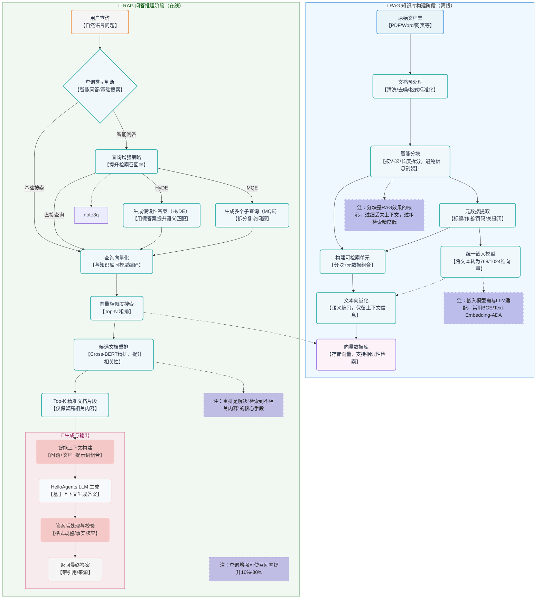
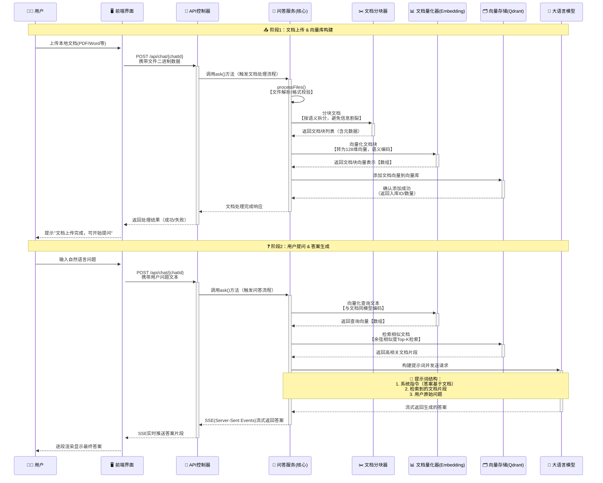

# 基于Spring AI实现RAG知识库问答机器人：从零到一的完整教程

## 一、引言

随着大语言模型的快速发展，RAG（Retrieval-Augmented Generation）技术已成为构建知识库问答系统的核心技术之一。本文将带领大家从零开始，使用Spring AI框架构建一个支持文档上传的知识库问答机器人，帮助大家深入理解RAG技术的核心原理和实践应用。

### 1.1 什么是RAG？

RAG（检索增强生成）是一种结合了信息检索和文本生成的技术。它的基本工作流程是：
1. 用户提出问题
2. 系统从知识库中检索相关信息
3. 大语言模型基于检索到的信息生成答案


从系统设计角度触发，RAG 的核心作用可以被描述为：

> **在LLM调用生成响应之前，由系统动态构造一个“最小且相关的知识上下文”。**

请注意两个关键词：

- **动态**：每次问题都不同，检索的知识也不同（比如用户问 A 产品时找 A 的文档，问 B 产品时找 B 的文档）
- **最小**：只注入必要信息（比如用户问 “A 产品的定价”，就只塞定价相关的片段，而非整份产品手册）

RAG可以有效的弥补上下文窗口的先天不足：不再需要把所有知识塞进窗口，而是只在需要时 “临时调取” 相关部分，既避免了窗口溢出，又减少了注意力竞争。

### 1.2 RAG在交互链路中的位置

接下来我们以RAG的经典应用场景——企业知识库为例，来看一下RAG在这个流程中所处的位置


在这个结构中，RAG主要就是在用户提问与向LLM发起请求这个中间段，用于检索关联的文档构建上下文

### 1.3 RAG工作原理

我们以一张图来介绍RAG的工作原理，具体的RAG详细介绍，请参照文末引用




## 二、核心实现

### 2.1 项目结构概览

项目源码可以在 [https://github.com/liuyueyi/spring-ai-demo](https://github.com/liuyueyi/spring-ai-demo/tree/master/app-projects/D05-rag-qa-bot) 获取，文末有所有相关的参考信息

```
D05-rag-qa-bot/
├── src/main/java/com/git/hui/springai/app/
│   ├── D05Application.java          # 启动类
│   ├── mvc/
│   │   ├── QaApiController.java     # API控制器
│   │   └── QaController.java        # 页面控制器
│   ├── qa/QaBoltService.java        # 问答服务
│   └── vectorstore/
│       ├── DocumentChunker.java       # 文档分块工具
│       ├── DocumentQuantizer.java     # 文档量化器
│       └── TextBasedVectorStore.java  # 文本向量存储
├── src/main/resources/
│   ├── application.yml              # 配置文件
│   ├── prompts/qa-prompts.pt        # 提示词模板
│   └── templates/chat.html          # 前端页面
└── pom.xml                          # 依赖配置
```


### 2.2 项目初始化

#### 2.2.1 Maven依赖配置

首先，我们需要在`pom.xml`中配置必要的依赖：

- 其中关于向量数据库、tika的文档解析属于核心依赖项
- hanlp适用于无法直接使用EmbeddingModel的场景，在我们的示例中，会实现一个基础的文档向量化方案，其中会采用Hanlp来做中文分词
- 使用智谱的免费大模型来体验我们的RAG知识库问答（当然也可以基于OpenAI-Starter来切换其他的大模型，使用层面并没有改变，只需要替换依赖、api配置即可）

```xml
<dependencies>
    <!-- 向量数据库 -->
    <dependency>
        <groupId>org.springframework.ai</groupId>
        <artifactId>spring-ai-advisors-vector-store</artifactId>
    </dependency>
    <!-- 文档提取，使用apache-tika来实现 -->
    <dependency>
        <groupId>org.springframework.ai</groupId>
        <artifactId>spring-ai-tika-document-reader</artifactId>
    </dependency>
    <!-- pdf文档提取，实际也可以用上面的tika来实现 -->
    <dependency>
        <groupId>org.springframework.ai</groupId>
        <artifactId>spring-ai-pdf-document-reader</artifactId>
    </dependency>
    <dependency>
        <groupId>org.springframework.ai</groupId>
        <artifactId>spring-ai-rag</artifactId>
    </dependency>
    <dependency>
        <groupId>org.springframework.boot</groupId>
        <artifactId>spring-boot-starter-web</artifactId>
    </dependency>
    <!-- 使用智谱大模型 -->
    <dependency>
        <groupId>org.springframework.ai</groupId>
        <artifactId>spring-ai-starter-model-zhipuai</artifactId>
    </dependency>
    <!-- 用于前端页面的支持 -->
    <dependency>
        <groupId>org.springframework.boot</groupId>
        <artifactId>spring-boot-starter-thymeleaf</artifactId>
    </dependency>
    <!-- 中文分词，用在文档向量化 -->
    <dependency>
        <groupId>com.hankcs</groupId>
        <artifactId>hanlp</artifactId>
        <version>portable-1.8.4</version>
    </dependency>
</dependencies>
```


这里我们引入了Spring AI的核心依赖，以及用于文档处理的Tika和PDF读取器，还特别加入了HanLP中文分词库来优化中文处理效果。

#### 2.2.2 应用配置

在`application.yml`中配置API密钥和相关参数：

```yaml
spring:
  ai:
    zhipuai:
      api-key: ${zhipuai-api-key}
      chat:
        options:
          model: GLM-4-Flash
          temperature: 0.1
  thymeleaf:
    cache: false
  servlet:
    multipart:
      max-file-size: 10MB
      max-request-size: 50MB

logging:
  level:
    org.springframework.ai.chat.client.advisor.SimpleLoggerAdvisor: debug
    org.springframework.ai.chat.client: DEBUG

server:
  port: 8080
```


### 2.3 自定义向量存储实现

通常RAG会使用一些成熟的向量数据库（如Pinecone、weaviate、qdrant、milvus或者es、redis等），但是考虑到安装、环境配置等成本，我们接下来会实现一个基础的自定义的文本向量库 `TextBasedVectorStore`，基于内存实现，无需额外的外部依赖，单纯的用来体验RAG并没有太大问题

SpringAI原生提供了一个基于内存的向量数据库`SimpleVectorStore`，在它的实现中，向量数据写入，依赖向量模型，因此如果有额度使用大模型厂家提供的EmbeddingModel时，直接用它进行测试即可；

当然如果你现在并没有渠道(💰)使用向量模型的，那也没关系，接下来我们将参照SpringAI的`SimpleVectorStore`实现的一个自定义的向量库`TextBasedVectorStore`，提供一套不依赖向量模型的解决方案，特别适合快速原型开发，核心实现如下（当然你也完全可以忽略它，它不是我们的重点）


#### 2.3.1 TextBasedVectorStore - 文本匹配向量存储

在下面的实现中，重点体现了两个方法

- doAdd: 将文档保存到向量数据库中（文档分片 -> 向量化 -> 存储）
- doSimilaritySearch: 基于相似度的搜索

> 需要注意一点，文档的向量化与搜索时传入文本的向量化，需要采用同一套向量化方案（why?）


```java
public class TextBasedVectorStore extends AbstractObservationVectorStore {
    @Getter
    protected Map<String, SimpleVectorStoreContent> store = new ConcurrentHashMap();
    /**
     * 已经存储到向量库的document，用于幂等
     */
    private Set<String> persistMd5 = new CopyOnWriteArraySet<>();

    /**
     * 添加文档到向量数据库
     *
     * @param documents
     */
    @Override
    public void doAdd(List<Document> documents) {
        if (CollectionUtils.isEmpty(documents)) {
            return;
        }

        // 创建一个新的可变列表副本
        List<Document> mutableDocuments = new ArrayList<>();
        for (Document document : documents) {
            // 过滤掉重复的文档，避免二次写入，浪费空间
            if (!persistMd5.contains((String) document.getMetadata().get("md5"))) {
                mutableDocuments.add(document);
            }
        }

        if (CollectionUtils.isEmpty(mutableDocuments)) {
            return;
        }

        // 文档分片
        List<Document> chunkers = DocumentChunker.DEFAULT_CHUNKER.chunkDocuments(mutableDocuments);
        // 存储本地向量库
        chunkers.forEach(document -> {
            float[] embedding = DocumentQuantizer.quantizeDocument(document);
            if (embedding.length == 0) {
                return;
            }
            SimpleVectorStoreContent storeContent = new SimpleVectorStoreContent(
                document.getId(), 
                document.getText(), 
                document.getMetadata(), 
                embedding
            );
            this.store.put(document.getId(), storeContent);
        });
        mutableDocuments.forEach(document -> persistMd5.add((String) document.getMetadata().get("md5")));
    }

    /**
     * 搜索向量数据库，根据相似度返回相关文档
     *
     * @param request
     * @return
     */
    @Override
    public List<Document> doSimilaritySearch(SearchRequest request) {
        Predicate<SimpleVectorStoreContent> documentFilterPredicate = this.doFilterPredicate(request);
        final float[] userQueryEmbedding = this.getUserQueryEmbedding(request.getQuery());
        return this.store.values().stream()
            .filter(documentFilterPredicate)
            .map((content) -> content.toDocument(
                DocumentQuantizer.calculateCosineSimilarity(userQueryEmbedding, content.getEmbedding())
            ))
            .filter((document) -> document.getScore() >= request.getSimilarityThreshold())
            .sorted(Comparator.comparing(Document::getScore).reversed())
            .limit((long) request.getTopK())
            .toList();
    }

    private float[] getUserQueryEmbedding(String query) {
        return DocumentQuantizer.quantizeQuery(query);
    }
}
```

#### 2.3.2 DocumentChunker - 文档分块器

> 合理地将长文档分块是RAG系统的关键环节，合理的分块大小，可以有效的增加检索效率、提高准确率、减少上下文长度

在真实的RAG应用中，这一块具体的方案挺多的，比如固定尺寸（下面的方案）、地柜拆分、语义拆分、结构化拆分（如结构化的markdown文档就很适合）、延迟拆分、自适应拆分、层级拆分、LLM驱动拆分、智能体拆分等（具体这一块我也没有深入学习，有兴趣的小伙伴问下AI吧~🤣）


```java
public class DocumentChunker {
    private final int maxChunkSize;
    private final int overlapSize;

    public DocumentChunker() {
        this(500, 50); // 默认值：最大块大小500个字符，重叠50个字符
    }

    public List<Document> chunkDocument(Document document) {
        String content = document.getText();
        if (content == null || content.trim().isEmpty()) {
            return List.of(document);
        }

        List<String> chunks = splitText(content);
        List<Document> chunkedDocuments = new ArrayList<>();

        for (int i = 0; i < chunks.size(); i++) {
            String chunk = chunks.get(i);
            String chunkId = document.getId() + "_chunk_" + i;

            Document chunkDoc = new Document(chunkId, chunk, new HashMap<>(document.getMetadata()));
            chunkDoc.getMetadata().put("chunk_index", i);
            chunkDoc.getMetadata().put("total_chunks", chunks.size());
            chunkDoc.getMetadata().put("original_document_id", document.getId());

            chunkedDocuments.add(chunkDoc);
        }

        return chunkedDocuments;
    }

    private List<String> splitText(String text) {
        List<String> chunks = new ArrayList<>();
        // 按多种分隔符分割，优先在语义边界处分割
        String[] sentences = text.split("(?<=。)|(?<=！)|(?<=!)|(?<=？)|(?<=\\?)|(?<=\\n\\n)");

        StringBuilder currentChunk = new StringBuilder();

        for (String sentence : sentences) {
            if (sentence.trim().isEmpty()) {
                continue; // 跳过空句子
            }

            if (currentChunk.length() + sentence.length() <= maxChunkSize) {
               // 如果当前块加上新句子不超过最大大小，就添加到当前块
                if (currentChunk.length() > 0) {
                    currentChunk.append(sentence);
                } else {
                    currentChunk.append(sentence);
                }
            } else {
                // 如果当前块为空，但是单个句子太长，需要强制分割
                if (currentChunk.length() == 0) {
                    List<String> subChunks = forceSplit(sentence, maxChunkSize);
                    for (int i = 0; i < subChunks.size(); i++) {
                        String subChunk = subChunks.get(i);
                        if (i < subChunks.size() - 1) {
                            chunks.add(subChunk);
                        } else {
                            currentChunk.append(subChunk);
                        }
                    }
                } else {
                    chunks.add(currentChunk.toString());
                    currentChunk = new StringBuilder();

                    // 添加重叠部分，如果句子长度大于重叠大小，则只取末尾部分
                    if (sentence.length() > overlapSize) {
                        String overlap = sentence.substring(Math.max(0, sentence.length() - overlapSize));
                        currentChunk.append(overlap);
                        currentChunk.append(sentence);
                    } else {
                        currentChunk.append(sentence);
                    }
                }
            }
        }

        if (currentChunk.length() > 0) {
            chunks.add(currentChunk.toString());
        }

        return chunks;
    }
}
```

#### 2.3.3 DocumentQuantizer - 文档量化器

使用HanLP进行中文分词，实现了一个简单的文档向量化工具类（同样的你也完全可以忽略它的具体实现，因为它的效果显然比使用EmbedingModel要差很多很多，但用于学习体验RAG也基本够用）

```java
public class DocumentQuantizer {
    private static final Segment SEGMENT = HanLP.newSegment();

    public static float[] quantizeText(String text) {
        if (text == null || text.trim().isEmpty()) {
            return new float[0];
        }

        String[] words = preprocessText(text);
        Map<String, Integer> wordFreq = countWordFrequency(words);
        // 生成固定长度的向量表示（这里使用前128个高频词）
        return generateFixedLengthVector(wordFreq, 128);
    }

    /**
     * 将文本转换为数值向量表示（简化版）
     * 使用TF-IDF的基本思想，但简化为词频统计
     *
     * @param text 输入文本
     * @return 数值向量
     */
    private static String[] preprocessText(String text) {
        List<Term> termList = SEGMENT.seg(text);
        return termList.stream()
            .filter(term -> !isStopWord(term.word)) // 过滤停用词
            .filter(term -> !term.nature.toString().startsWith("w")) // 过滤标点符号
            .map(term -> term.word.toLowerCase()) // 转换为小写
            .toArray(String[]::new);
    }

    /**
     * 生成固定长度的向量表示
     *
     * @param wordFreq 词频映射
     * @param length   向量长度
     * @return 固定长度的向量
     */
    private static float[] generateFixedLengthVector(Map<String, Integer> wordFreq, int length) {
        float[] vector = new float[length];

        // 获取频率最高的词汇
        List<Map.Entry<String, Integer>> sortedEntries = wordFreq.entrySet()
                .stream()
                .sorted(Map.Entry.<String, Integer>comparingByValue().reversed())
                .limit(length)
                .collect(Collectors.toList());

        // 将词频填入向量
        for (int i = 0; i < Math.min(sortedEntries.size(), length); i++) {
            vector[i] = sortedEntries.get(i).getValue();
        }

        return vector;
    }

    public static double calculateCosineSimilarity(float[] vectorA, float[] vectorB) {
        if (vectorA == null || vectorB == null || vectorA.length == 0 || vectorB.length == 0) {
            return 0.0;
        }

        int minLength = Math.min(vectorA.length, vectorB.length);
        float[] adjustedA = Arrays.copyOf(vectorA, minLength);
        float[] adjustedB = Arrays.copyOf(vectorB, minLength);

        double dotProduct = 0.0;
        double normA = 0.0;
        double normB = 0.0;

        for (int i = 0; i < minLength; i++) {
            dotProduct += adjustedA[i] * adjustedB[i];
            normA += Math.pow(adjustedA[i], 2);
            normB += Math.pow(adjustedB[i], 2);
        }

        normA = Math.sqrt(normA);
        normB = Math.sqrt(normB);

        if (normA == 0 || normB == 0) {
            return 0.0;
        }

        return dotProduct / (normA * normB);
    }
}
```

#### 2.3.4 注册向量库

接下来就是注册使用这个向量库，在配置类or启动类中，添加下面这个声明即可

```java
@Bean
public VectorStore vectorStore() {
    return TextBasedVectorStore.builder().build();
}
```


### 2.4 SpringAI向量存储

上面2.3适用于无法直接使用大模型厂家的向量模型的场景，如果可以直接使用，那么上面的全部可以直接忽略掉，直接使用下面的方式进行声明向量库即可

```java
@Bean
public VectorStore vectorStore(EmbeddingModel embeddingModel) {
    return SimpleVectorStore.builder(embeddingModel).build();
}
```


### 2.5 问答服务实现

接下来我们进入核心的基于RAG的QA问答机器人的实现

#### 2.5.1 QaBoltService - 核心问答服务

##### Pre. 问答服务流程

我们先从时序的角度来看一下这个问答服务的核心交互流程




在这个时序过程中，为了简化大家的理解，我们将文档的向量化存储与问答进行了拆分

**第一步：文档向量化**

这一部分包含RAG应用数据准备阶段的完整过程

- 数据提取
- 文本分割
- 向量化

**第二步：问答**

- 应用层响应用户提问
- 从向量数据库检索相似度高的文档信息
- 注入提示词
- 访问大模型，获取答案

##### Impl. 核心实现

接下来我们看一下具体的实现（上面的步骤分割得很清楚，但是实际使用时，用户可以在问答中上传附件，这个附件也会作为我们知识库的一部分，因此具体的实现中，你会发现这两部耦合在一起了，请不要惊讶）

**step1: 初始化ChatClient**

在开始之前，我们首先参照SpringAI的官方教程，通过Advisor来初始化支持RAG的`ChatClient`

> 官方文档：[https://docs.spring.io/spring-ai/reference/api/retrieval-augmented-generation.html](https://docs.spring.io/spring-ai/reference/api/retrieval-augmented-generation.html)


```java
@Service
public class QaBoltService {
    private final ChatClient chatClient;
    private final ChatMemory chatMemory;
    private final VectorStore vectorStore;

    @Value("classpath:/prompts/qa-prompts.pt")
    private Resource boltPrompts;

    public QaBoltService(ChatClient.Builder builder, VectorStore vectorStore, ChatMemory chatMemory) {
        this.vectorStore = vectorStore;
        this.chatMemory = chatMemory;
        this.chatClient = builder.defaultAdvisors(
            new SimpleLoggerAdvisor(ModelOptionsUtils::toJsonStringPrettyPrinter, 
                                   ModelOptionsUtils::toJsonStringPrettyPrinter, 0),
            // 用于支持多轮对话
            MessageChatMemoryAdvisor.builder(chatMemory).build(),
            // 用于支持RAG
            RetrievalAugmentationAdvisor.builder()
                .queryTransformers(
                    // 使用大型语言模型重写用户查询，以便在查询目标系统时提供更好的结果。
                    RewriteQueryTransformer.builder().chatClientBuilder(builder.build().mutate()).build()
                )
                .queryAugmenter(
                    // ContextualQueryAugmenter 使用来自所提供文档内容的上下文数据来增强用户查询。
                    // 默认不支持上下文为空的场景，出现之后大模型会不返回用户查询；这里调整为支持为空
                    ContextualQueryAugmenter.builder().allowEmptyContext(true).build()
                )
                .documentRetriever(
                    VectorStoreDocumentRetriever.builder()
                        .similarityThreshold(0.50)
                        .vectorStore(vectorStore)
                        .build()
                )
                .build()
        ).build();
    }
}
```

接下来就是响应问答的实现，这里分两步

**step2: 文档处理**

处理用户上传的附件，即上面时序图中的第一步，解析文档、切分、向量化、保存到向量库;

下面的实现中主要体现的是基于SpringAI封装的tika与pdf文档解析starter，来提取上传的文档，生成供向量数据库使用的`List<Document>`; 而具体的文档切分、向量化等则是在上面的`TextBasedVectorStore`实现

> 注：为了一个文档，重复进行数据处理，我们在元数据中维护了文档的 md5，这样当添加到向量库中时，就可以基于这个md5来进行去重了（一个工程化实现方面的小技巧~）

```java
private ProceedInfo processFiles(String chatId, Collection<MultipartFile> files) {
    StringBuilder context = new StringBuilder("\n\n");
    List<Media> mediaList = new ArrayList<>();
    files.forEach(file -> {
        try {
            var data = new ByteArrayResource(file.getBytes());
            var md5 = calculateHash(chatId, file.getBytes());
            MimeType mime = MimeType.valueOf(file.getContentType());
            if (mime.equalsTypeAndSubtype(MediaType.APPLICATION_PDF)) {
                PagePdfDocumentReader pdfReader = new PagePdfDocumentReader(data,
                        PdfDocumentReaderConfig.builder()
                                .withPageTopMargin(0)
                                .withPageExtractedTextFormatter(ExtractedTextFormatter.builder()
                                        .withNumberOfTopTextLinesToDelete(0)
                                        .build())
                                .withPagesPerDocument(1)
                                .build());
                List<Document> documents = pdfReader.read();
                documents.forEach(document -> {
                    document.getMetadata().put("md5", md5);
                    if (document.getMetadata().containsKey("file_name") && 
                        document.getMetadata().get("file_name") == null) {
                        document.getMetadata().put("file_name", file.getName());
                    }
                });
                vectorStore.add(documents);

                var content = String.join("\n", documents.stream().map(Document::getText).toList());
                context.append(String.format(ATTACHMENT_TEMPLATE, file.getName(), content));
            } else if ("text".equalsIgnoreCase(mime.getType())) {
                List<Document> documents = new TikaDocumentReader(data).read();
                documents.forEach(document -> document.getMetadata().put("md5", md5));
                vectorStore.add(documents);

                var content = String.join("\n", documents.stream().map(Document::getText).toList());
                context.append(String.format(ATTACHMENT_TEMPLATE, file.getName(), content));
            }
        } catch (IOException e) {
            throw new RuntimeException(e);
        }
    });
    return new ProceedInfo(context.toString(), mediaList);
}
```

**step3: 问答实现**

然后就是具体的问答实现，这里主要是借助 `QuestionAnswerAdvisor` 来封装RAG相关的信息

> 说明：在下面的实现中，使用了自定义的提示词模板，当然也可以直接使用SpringAI默认的方案

```java
public Flux<String> ask(String chatId, String question, Collection<MultipartFile> files) {
    processFiles(chatId, files);

    // 自定义的提示词模板，替换默认的检索参考资料的提示词模板
    // 其中 <query> 对应的是用户的提问 question
    // <question_answer_context> 对应的是增强检索的document，即检索到的参考资料
    PromptTemplate customPromptTemplate = PromptTemplate.builder()
        .renderer(StTemplateRenderer.builder().startDelimiterToken('<').endDelimiterToken('>').build())
        .template("""
            <query>

            Context information is below.

             ---------------------
             <question_answer_context>
             ---------------------

             Given the context information and no prior knowledge, answer the query.

             Follow these rules:

             1. If the answer is not in the context, just say that you don't know.
             2. Avoid statements like "Based on the context..." or "The provided information...".
                      """).build();

    var qaAdvisor = QuestionAnswerAdvisor.builder(vectorStore)
        .searchRequest(SearchRequest.builder().similarityThreshold(0.5d).topK(3).build())
        .promptTemplate(customPromptTemplate)
        .build();
    var requestSpec = chatClient.prompt()
        .system(boltPrompts)
        .user(question)
        .advisors(qaAdvisor)
        .advisors(a -> a.param(ChatMemory.CONVERSATION_ID, chatId));
    return requestSpec.stream().content().map(s -> s.replaceAll("\n", "<br/>"));
}
```

到这里，一个基于RAG的问答机器人的核心逻辑，已经全部完成，接下来我们进入体验阶段

#### 2.5.2 控制器实现

QaApiController - API控制器

```java
@RestController
@RequestMapping("/api")
public class QaApiController {
    @Autowired
    private QaBoltService qaBolt;

    @GetMapping(path = "/chat/{chatId}", produces = MediaType.TEXT_EVENT_STREAM_VALUE)
    public Flux<String> qaGet(@PathVariable("chatId") String chatId,
                              @RequestParam("question") String question) {
        return qaBolt.ask(chatId, question, Collections.emptyList());
    }

    @PostMapping(path = "/chat/{chatId}", produces = MediaType.TEXT_EVENT_STREAM_VALUE)
    public Flux<String> qaPost(@PathVariable("chatId") String chatId,
                               @RequestParam("question") String question,
                               @RequestParam(value = "files", required = false) Collection<MultipartFile> files) {
        if (files == null) {
            files = Collections.emptyList();
        }
        return qaBolt.ask(chatId, question, files);
    }
}
```


### 2.6 前端界面

交互式聊天界面，前端界面提供了文件上传和问答交互功能，具体的代码实现请参考文末的项目源码地址，这里就不贴了（主要是太长了~）


## 三、体验与小结

### 3.1 启动类

```java
@SpringBootApplication
public class D05Application {
    @Bean
    public VectorStore vectorStore() {
        return TextBasedVectorStore.builder().build();
    }

    public static void main(String[] args) {
        SpringApplication.run(D05Application.class, args);
        System.out.println("启动成功，前端测试访问地址： http://localhost:8080/chat");
    }
}
```

### 3.2 问答提示词

在 `resources/prompts/qa-prompts.pt` 中维护我们的qa机器人的系统提示词（DeepSeek生成的）

```pt
## 角色设定
你是一个智能问答助手，专门负责根据用户提供的文档内容进行准确的回答和信息提取。

## 核心任务
- 仔细阅读并理解用户上传的文档内容
- 基于文档中的信息回答用户的问题
- 提供准确、相关且基于文档的答案
- 当问题超出文档范围时，明确告知用户该信息未在文档中提及

## 工作流程
1. 首先分析用户上传的文档，提取关键信息
2. 理解用户提出的问题
3. 在文档中查找与问题相关的信息
4. 整合相关信息并形成结构化答案
5. 如无法从文档中找到相关信息，则说明情况

## 回答规范
- 严格基于文档内容作答，不得编造信息
- 引用文档中的具体信息时，请保持原文准确性
- 如果问题涉及多个知识点，在答案中清晰分点说明
- 对于不确定的内容，应诚实表达不确定性，而非猜测
- 保持回答简洁明了，同时确保信息完整

## 注意事项
- 不得脱离文档内容进行回答
- 遇到模糊或不明确的问题时，可以请求用户提供更详细的信息
- 如果文档中没有相关内容，必须明确告知用户
- 保持专业、礼貌的沟通态度
```

### 3.3 运行与测试

1. **启动应用**：运行`D05Application`主类
2. **访问页面**：打开`http://localhost:8080/chat`
3. **上传文档**：选择PDF、Word或文本文件
4. **提问测试**：在输入框中输入关于文档的问题

当然在启动时，可以在启动参数中指定大模型的ApiKey，也可以直接修改`applicatino.yml`，直接维护上apiKey也可以哦


在上面这个示意图中，我上传的是 [像Excel一样选择网页表格 & 支持选中表单生成sql的神器：TableHelper](https://mp.weixin.qq.com/s/1s8NC-dCNIfqTXAHyN2e1g) 的宣传文档，显然是没有被大模型检索、训练过的，从问答来看，效果还是不错的


但是请注意，这个只是给大家用来体验RAG的，用来学习验证还是不错的；但是真实场景显然比我们提到的内容还多很多，比如

- 安全隐私：不同用户的知识库文件需要隔离
- 存储优化：上下文窗口的管理、对话历史的管理
- 检索优化：多路召回、查询语义理解、查询改写等
- 模型优化：成本、效率的权衡
- 监控体系：链路追踪、日志分析、告警等
- DevOps: CI/CD，容器编排
- 体验、性能等


### 3.4 核心技术要点小结

### 1. RAG工作流程
- **检索阶段**：当用户提问时，系统首先将问题转换为向量，然后在文档向量库中查找相似的文档片段
- **生成阶段**：将检索到的相关文档内容与用户问题一起输入大语言模型，生成最终答案

### 2. 文档处理优化
- **中文分词**：使用HanLP进行精确的中文分词，提高语义理解准确性
- **文档分块**：将长文档合理分块，保持语义完整性的同时便于检索
- **去重机制**：通过MD5哈希避免重复上传相同的文档

### 3. 性能优化
- **相似度计算**：使用余弦相似度算法计算文本相似度
- **缓存机制**：对已处理的文档进行缓存，避免重复处理
- **流式响应**：使用SSE实现答案的流式返回，提升用户体验

本文通过一个最小成本（技术和资金成本都很小）的方案，我们实现了一个完整的RAG知识库问答机器人。

通过这个项目，相信对RAG感兴趣，想快速体验一下完成流程的小伙伴，可以有一个动手实操的机会。


