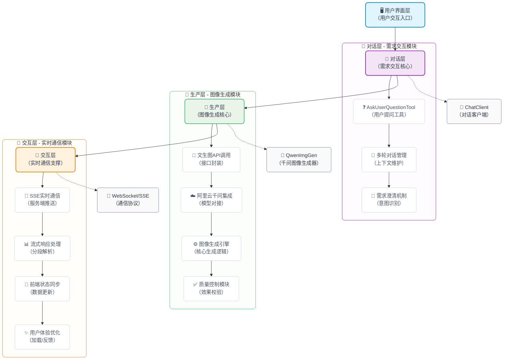
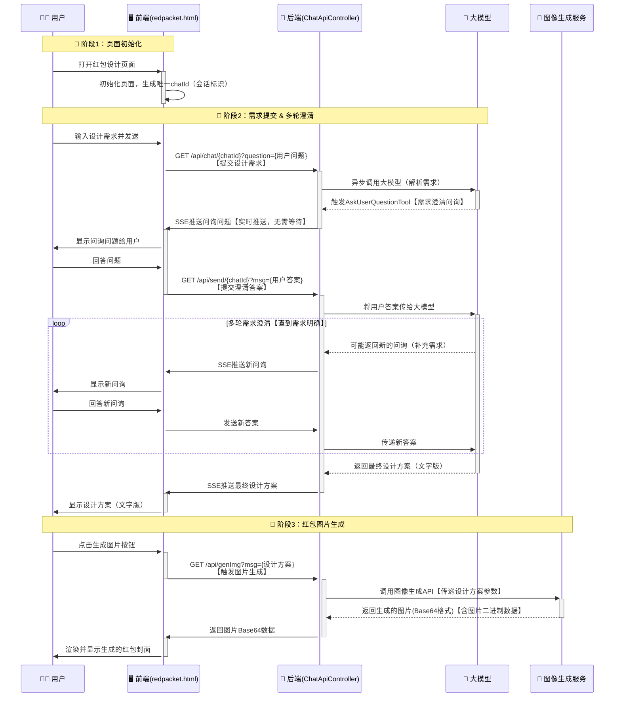

# 我用SpringAI实现了个「微信红包封面设计Agent」

年底收到了微信给公众号免费发的一波红包封面兑换卡，正好上次在学习SpringAI的时候，看到了一个有趣的机制——大模型的响应前问询，这不是就是一个绝佳的应用场景嘛~

让AI来扮演一个设计师，通过与我的对话来敲定我想要的红包封面，然后基于这个设计方案来生成对应的红包封面，来个一站式的微信红包封面生成Agent


## 一、效果体验

线上体验地址： [https://api.ppai.top/](https://api.ppai.top/)

默认进入之后长这样（前端页面由Kimi生成）,通过点击右小角的对话按钮唤出设计框


接下来我们通过对话来演示一下具体的效果

> 公众号查看： [我用SpringAI实现了个「微信红包封面设计Agent」 | 一灰灰blog](https://mp.weixin.qq.com/s/QyuWZ4EZ32pbcWn3fVphHQ)


## 二、智能红包封面设计

### 2.1 整体介绍

这是一个基于Spring AI开发的完整应用，它能让AI像专业设计师一样，通过多轮对话理解你的需求，然后直接生成符合要求的红包封面。整个过程就像和一个懂设计的朋友聊天，你说想法，它来实现。

系统的核心亮点是"会提问的AI"。当你说"帮我做个红包封面"时，它不会盲目猜测，而是主动询问："你想要什么风格？传统国风还是现代简约？""主色调偏向红色还是金色？"通过这些问题，AI能准确把握你的需求。


### 2.2 架构设计

项目采用了三层架构设计：

- 对话层：使用AskUserQuestionTool工具，让AI具备主动提问能力。就像设计师会通过提问了解客户需求一样，我们的AI也会一步步澄清设计要求。
- 生成层：集成阿里云千问的文生图API，将文字描述转换为视觉图像。特别针对微信红包封面的3x4比例(微信红包封面尺寸=957×1278)进行了优化。
- 交互层：通过SSE（服务器发送事件）技术实现实时对话，用户能看到AI思考和回应的完整过程，体验非常流畅。




## 三、核心实现

整体的实现思路基本上和上一篇非常相似，区别是改了交互像是，从控制台模式改成了web方式，具体细节请查看 [Spring AI中的多轮对话艺术：让大模型主动提问获取明确需求](https://mp.weixin.qq.com/s/LcvmiIERs6aOIlRAKGGnFg)  接下来将主要介绍一些核心的技术点

### 3.1 多轮问询机制

如何识别用户的意图？这好像是每个Agent开发必须解决的问题，这里可以说是给出了一个经典的解决方案，那就是主动问询，让用户主动进行澄清，这里的主要实现原理如下图


这一套设计哲学遵循问答式工作流程：

1. AI生成问题
	- 智能体判断需要输入并构建问题（每个问题包含问题文本、标题、2-4个选项和多选标志），然后调用`AskUserQuestionTool`函数
2. 用户提供答案 
	- 由业务代码实现接收这些问题，然后通过合适的形式（控制台/web页面等）展示给用户，然后收集用户的回答，并将答案返回给LLM。
3. 提出更多问题
	- 如有必要，重复步骤1、2，以收集更多用户反馈
4. 人工智能持续关注上下文
	- LLM利用这些答案来提供量身定制的解决方案


需要说明的是，每个问题的回答并不是写死的：

- 支持单选或多选: 选择一个选项或组合多个选项
- 支持选项外的文本输入: 用户可以随时提供超出预定义选项范围的自定义文本
- 丰富的上下文: 每个选项都包含一个描述，解释其含义和权衡

### 3.2 WEB交互方案

对于web层的用户交互，我们采用SSE的交互方式，具体流程是

```
用户开启会话，输入第一次设计要求
	⬇️
后端建立SSE链接，并通过异步方式将设计要求发送给LLM，
	⬇️
大模型返回问询内容
	⬇️
后端逐条将问询内容通过SSE发送给用户
	⬇️
用户回答内容，通过send/{chatId}发送给后端
	⬇️
问询结束，后端组装回答发送给LLM
	⬇️
LLM返回完整设计方案
```


以时序图的视角来看一下完整的交互方案





在这套方案的具体实现中，我们通过上下文来持有 `会话与SSE` 之间的关系，这样才可以将用户的回答内容与之前的大模型会话进行绑定

```java
public class ReqContextHolder {

    private static final ThreadLocal<ReqInfo> reqId = new InheritableThreadLocal<>();

    public static void setReqId(ReqInfo reqId) {
        ReqContextHolder.reqId.set(reqId);
    }

    public static ReqInfo getReqId() {
        return reqId.get();
    }

    public static void clear() {
        reqId.remove();
    }

    public record ReqInfo(String chatId, SseEmitter sse) {
    }
}
```

通过一个临时的Map来存储用户的问询结果，这里借助`BlockingQueue`来实现一个简易的消息驱动模式

```java
private Map<String, BlockingQueue<String>> chatHistory = new ConcurrentHashMap<>();
```

基于上面这两个中间存储管道，所以我们核心的问询回调`WebQuestionHandler`的具体实现如下 (下面的实现给了完整的注释，应该不难理解😊)

```java
public class WebQuestionHandler implements AskUserQuestionTool.QuestionHandler {
        @Override
        /**
         * 处理用户问题列表，向用户发送问题并等待用户回答
         *
         * @param questions 用户问题列表
         * @return 包含问题和对应答案的映射
         */
        public Map<String, String> handle(List<AskUserQuestionTool.Question> questions) {
            // 创建用于存储问题和答案的映射
            Map<String, String> answers = new HashMap<>();
            // 获取当前请求的上下文信息
            ReqContextHolder.ReqInfo req = ReqContextHolder.getReqId();
            // 获取SSE发射器用于向客户端发送消息
            SseEmitter sseEmitter = req.sse();

            // 遍历所有需要询问用户的问题
            for (AskUserQuestionTool.Question q : questions) {
                // 向用户发送问题标题和内容
                sendMsg(sseEmitter, "\n" + q.header() + ": " + q.question());

                // 获取问题的选项列表
                List<AskUserQuestionTool.Question.Option> options = q.options();
                // 遍历选项并发送给用户
                for (int i = 0; i < options.size(); i++) {
                    AskUserQuestionTool.Question.Option opt = options.get(i);
                    sendMsg(sseEmitter, String.format("  %d. %s - %s%n", i + 1, opt.label(), opt.description()));
                }

                // 根据是否支持多选发送不同的提示信息
                if (q.multiSelect()) {
                    sendMsg(sseEmitter, "  (Enter numbers separated by commas, or type custom text)");
                } else {
                    sendMsg(sseEmitter, "  (Enter a number, or type custom text)");
                }

                // 阻塞等待用户输入
                BlockingQueue<String> queue = chatHistory.get(req.chatId());
                // 如果队列不存在，则创建新的队列
                if (queue == null) {
                    queue = new LinkedBlockingQueue<>();
                    chatHistory.put(req.chatId(), queue);
                }
                
                String response = null;
                try {
                    // 等待最多5分钟获取用户响应，超时则返回空字符串
                    response = queue.poll(5, TimeUnit.MINUTES);
                    if (response == null) {
                        response = ""; // 超时情况下的默认响应
                    }
                } catch (InterruptedException e) {
                    // 线程被中断时设置中断状态并返回空字符串
                    Thread.currentThread().interrupt();
                    response = "";
                }

                // 解析用户响应并存入答案映射
                answers.put(q.question(), parseResponse(response, options));
            }

            // 返回包含所有问题和答案的映射
            return answers;
        }

        private void sendMsg(SseEmitter sseEmitter, String msg) {
            try {
                sseEmitter.send(msg);
            } catch (Exception e) {
                e.printStackTrace();
            }
        }
}
```

### 3.3 图片生成

图文生成我们这里给出了两种，一个是基于智谱的一个是基于千问的(因为智谱的免费模型有点拉跨)；

文生图的具体实现没有太多好说的，这里单独指出来是想提醒，这里实际上还可以继续扩展一下，除了生成静态图片之外，还可以考虑支持生成动态的视频；除了生成封面图之外，还可以考虑扩展生成挂件

```java
@GetMapping(path = "/genImg")
public String genImg(@RequestParam String msg) throws IOException {
    if ("true".equals(environment.getProperty("spring.ai.dashboard.enable"))) {
        return QwenImgGen.call(environment.getProperty("spring.ai.dashboard.api-key"), msg);
    } else {
        // 这里使用的是智谱的文生图模型，效果较差
        ImageResponse response = imgModel.call(new ImagePrompt(msg,
                ImageOptionsBuilder.builder()
                        .height(1344)
                        .width(768)
                        .model("CogView-3-Flash")
                        // 返回图片类型
                        .responseFormat("png")
                        // 图像风格，如 vivid 生动风格， natural 自然风格
                        .style("natural")
                        .build())
        );
        Image img = response.getResult().getOutput();
        BufferedImage image = ImageIO.read(new URL(img.getUrl()));

        // 将图片转换为Base64编码
        java.io.ByteArrayOutputStream baos = new java.io.ByteArrayOutputStream();
        ImageIO.write(image, "png", baos);
        byte[] imageBytes = baos.toByteArray();
        return java.util.Base64.getEncoder().encodeToString(imageBytes);
    }
}
```

## 四、小结

这一篇内容可以说是上一篇SpringAI智能体设计中问询机制的具体使用场景，整个系统展现了AI应用开发的新思路：不是让人适应机器，而是让机器理解人的表达方式。通过多轮对话获取准确需求，再通过AI生成能力直接产生成果，真正实现了从想法到作品的转换。当然整体的实现还比较初级，还有不少的挖掘空间，比如一次生成完整的微信红包方案（包括封面简称、封面图、挂件、气泡挂件、封面故事等）欢迎有兴趣的小伙伴进行补全


项目源码：

- [https://github.com/liuyueyi/spring-ai-demo/tree/master/v2/T03-manual-qa-web-robot](https://github.com/liuyueyi/spring-ai-demo/tree/master/v2/T03-manual-qa-web-robot)


零基础入门：

- [LLM 应用开发是什么：零基础也可以读懂的科普文(极简版)](https://mp.weixin.qq.com/s/qCn8x2XO2shA8MheYbHq0w)
- [大模型应用开发系列教程：序-为什么你“会用 LLM”，但做不出复杂应用？](https://mp.weixin.qq.com/s/2GXBNOUq3jlysipftz8TpA)
- [大模型应用开发系列教程：第一章 LLM到底在做什么？](https://mp.weixin.qq.com/s/v-z6EHY300ElOxdGPdzc0w)
- [大模型应用开发系列教程：第二章 模型不是重点，参数才是你真正的控制面板](https://mp.weixin.qq.com/s/t_BuAW9i0npcaJdua3Am2Q)
- [大模型应用开发系列教程：第三章 为什么我的Prompt表现很糟？](https://mp.weixin.qq.com/s/vzt0bGwcfnASOiBa0Kc7VQ)
- [大模型应用开发系列教程：第四章 Prompt 的工程化结构设计](https://mp.weixin.qq.com/s/Nk-N34TLJVCTI5F4k5rGaQ)
- [大模型应用开发系列教程：第五章 从 Prompt 到 Prompt 模板与工程治理](https://mp.weixin.qq.com/s/ZQbztqBq7_PzynG06N4-mg)
- [大模型应用开发系列教程：第六章 上下文窗口的真实边界](https://mp.weixin.qq.com/s/nnKspRO87xbrn4-LBV3RNA)
- [大模型应用开发系列教程：第七章 从 “堆上下文” 到 “管理上下文”](https://mp.weixin.qq.com/s/_5D2tF6CPnafj5mlmlwLNw)
- [大模型应用开发系列教程：第八章 记忆策略的工程化选择](https://mp.weixin.qq.com/s/z5qaLtjChsvjhWNs8Nw05Q)

---

实战

- [实战 | 两百行实现一个自然语言地址提取智能体](https://mp.weixin.qq.com/s/96rHyp_gBUgmA2dhSbzNww)
- [实战 | 基于SpringAI与大模型的零配置发票智能提取架构](https://mp.weixin.qq.com/s/SnXdTB6tYqAzG7HgbnTSAQ)
- [实战 | 零基础搭建知识库问答机器人：基于SpringAI+RAG的完整实现](https://mp.weixin.qq.com/s/NHqLJbos-_nrxNNmhg7IBQ)
- [告别传统AI开发！SpringAI Agent + Skills重新定义智能应用](https://mp.weixin.qq.com/s/ujxVleNhjxzUgL-rjfFcVA)
- [Spring AI中的多轮对话艺术：让大模型主动提问获取明确需求](https://mp.weixin.qq.com/s/LcvmiIERs6aOIlRAKGGnFg)

