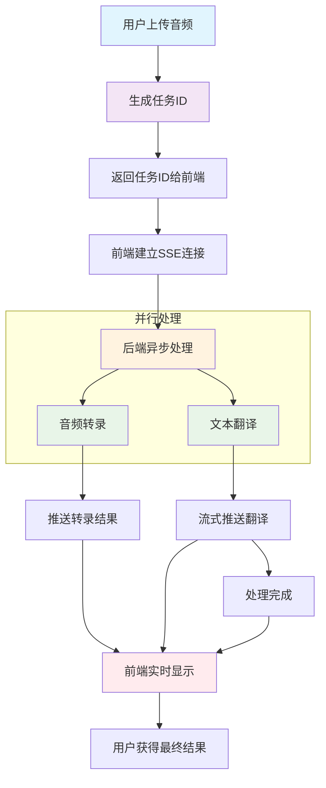
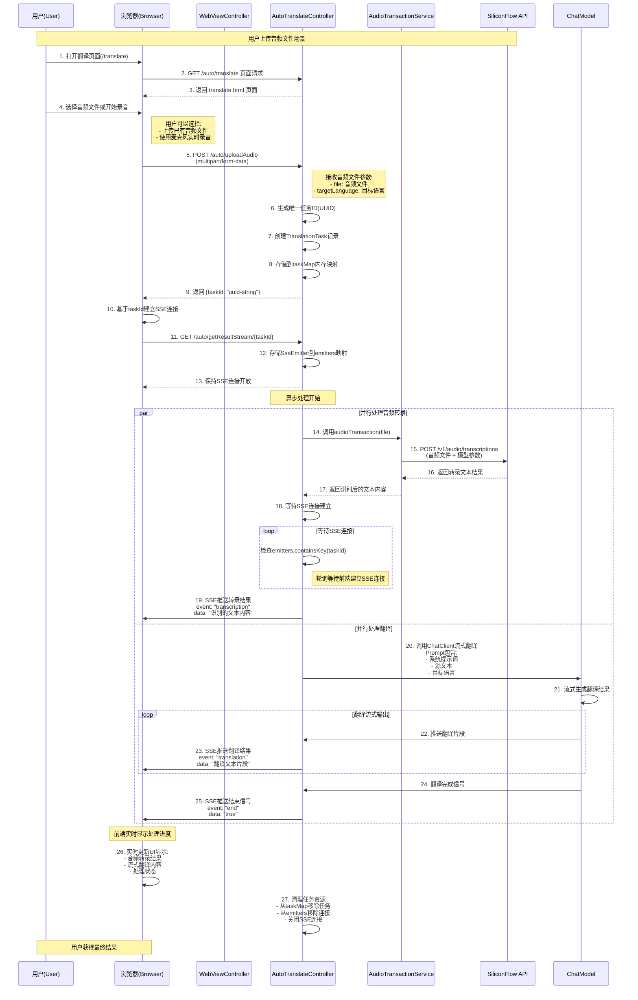

# Spring AI 实战：手把手搭建实时语音翻译机器人

实时翻译的场景可以说应用很久了，当然在以前这个实现还是很有挑战的，不过现如今嘛，在AI的加持下，像我们这种普通的编程人员，可以非常方便的实现一个语音翻译机器人。

今天，我将带你基于 Spring AI 框架，从零搭建一个支持音频转录与翻译的智能机器人。

## 一、环境准备

在开始实战之前，我们需要准备好开发环境。以下是本文所使用的技术栈：

| 组件 | 版本/说明 |
|------|-----------|
| JDK | 17 及以上 |
| Spring Boot | 3.x |
| Spring AI | 1.1.2 |
| 音频转录模型 | `FunAudioLLM/SenseVoiceSmall` |
| 对话大模型 | `Qwen/Qwen2.5-7B-Instruct` |
| API 平台 | SiliconFlow（需自行申请 API Key） |

### 1.1 APIKey申请

你需要 SiliconFlow 平台申请 API Key，并在 `application.yml` 中配置：

```yaml
spring:
  ai:
    openai:
      api-key: ${silicon-api-key}  # 替换为你的API Key
```

> 这里选择SiliconFlow的主要原因是它的免费模型，对于想要复刻体验本项目的小伙伴最友好😊
> 
> 注册地址: [https://cloud.siliconflow.cn/i/ge3VpPHH](https://cloud.siliconflow.cn/i/ge3VpPHH)
> 
> 也可以直接通过二维码注册：

### 1.2 核心依赖

直接使用`openai-starter`来实现大模型的交互，在这个项目的实现中，主要包含两类的大模型交互过程

- 音频识别：识别语音文件的内容
- 文字翻译：将语音内容翻译为目标语言

有需要的小伙伴也可以在实现 `文字转语音` TTS的实现，从而获取更好的使用体验

对应的pom核心依赖如下

```xml
<dependencies>
    <!-- 大模型交互的核心依赖 -->
    <dependency>
        <groupId>org.springframework.ai</groupId>
        <artifactId>spring-ai-starter-model-openai</artifactId>
    </dependency>
    <!-- 提供web页面 + 接口交互的实现支撑 -->
    <dependency>
        <groupId>org.springframework.boot</groupId>
        <artifactId>spring-boot-starter-web</artifactId>
    </dependency>
    <dependency>
        <groupId>org.springframework.boot</groupId>
        <artifactId>spring-boot-starter-thymeleaf</artifactId>
    </dependency>
</dependencies>
```

### 1.3 配置

我们在配置文件 `resources/application.yml` 维护上模型和apikey

```yaml
spring:
  thymeleaf:
    cache: false
  ai:
    openai:
      # api-key 使用你自己申请的进行替换；如果为了安全考虑，可以通过启动参数进行设置
      api-key: ${silicon-api-key}
      transcription:
        api-key: ${silicon-api-key}
        base-url: https://api.siliconflow.cn/v1
        transcription-path: /audio/transcriptions
        options:
          model: FunAudioLLM/SenseVoiceSmall
          response-format: text
      chat: # 聊天模型
        options:
          model: Qwen/Qwen2.5-7B-Instruct
      base-url: https://api.siliconflow.cn
```


## 二、核心实现

### 2.0 整体方案设计

在具体的实现之前，我们先看一下这个实时翻译功能可以怎么设计，下面是一个简单的业务流程图




**为什么采用异步？**

考虑到交互体验，同步阻塞一直等待后端返回全部结果的方案不可取（因为耗时可能很久）；因此实时的交互必然是首选，因此异步的原因如下：

- 音频处理耗时较长（通常几秒到几十秒）
- 同步等待会让用户界面卡顿
- 用户体验差，容易误认为系统无响应

**解决方案：**
```
用户上传音频
    ↓
立即返回任务ID（100ms内）
    ↓
后台异步处理
    ↓
实时推送处理进度
    ↓
用户获得最终结果
```

**SSE (Server-Sent Events) 选择理由：**
- 🔸 单向推送，服务端主动
- 🔸 HTTP协议，兼容性好
- 🔸 自动重连机制
- 🔸 比WebSocket轻量

> 请注意SSE不支持POST请求，因此用户通过POST上传音频，拿到的是tastId，然后再基于taskId发起一个sse的请求，用户实时获取后端处理结果

**推送时机设计：**

```
转录完成 → 立即推送识别文本
翻译进行中 → 流式推送翻译片段
翻译完成 → 发送结束信号
```

接下来也可以根据下面的超详细的时序图，来看看这个实时语音翻译的实现思路





### 2.1 音频转录服务

> 对于SpringAI如何使用音频模型的，有兴趣的小伙伴可以查看 - [18.语音模型之语音识别 | Helllo LLM Guides](https://www.ppai.top/ai-guides/ai-dev/%E5%9F%BA%E7%A1%80%E7%AF%87/18.%E8%AF%AD%E9%9F%B3%E6%A8%A1%E5%9E%8B%E4%B9%8B%E8%AF%AD%E9%9F%B3%E8%AF%86%E5%88%AB.html)


首先，我们创建音频转录服务，利用 Spring AI 的 `TranscriptionModel` 接口调用 SenseVoiceSmall 模型：

```java
@Service
public class AudioTransactionService {
    @Autowired
    private TranscriptionModel transcriptionModel;

    public String audioTransaction(MultipartFile file) throws IOException {
        // 配置转录选项
        AudioTranscriptionOptions options = OpenAiAudioTranscriptionOptions.builder()
                .responseFormat(OpenAiAudioApi.TranscriptResponseFormat.JSON)
                .model("FunAudioLLM/SenseVoiceSmall")
                .build();

        // 将上传文件转为 Resource 对象
        Resource resource = new ByteArrayResource(file.getBytes()) {
            @Override
            public String getFilename() {
                return file.getOriginalFilename();
            }
        };

        // 调用转录服务
        AudioTranscriptionPrompt prompt = new AudioTranscriptionPrompt(resource, options);
        AudioTranscriptionResponse response = transcriptionModel.call(prompt);
        return response.getResult().getOutput();
    }
}
```

**为什么要这样设计？**

Spring AI 统一了 AI 模型的调用接口，`TranscriptionModel` 屏蔽了底层 API 的差异，我们只需关注业务逻辑即可。

上面这个service实现识别音频文件内容，并直接返回结果给调用方（我们现在选中的模型主要支持中英文内容的识别）

### 2.2 翻译服务 + SSE 实时推送

为了提供更好的用户体验，我们采用异步处理 + SSE（Server-Sent Events）实现实时推送：

```java
// 存储任务状态的内存映射
private final Map<String, TranslationTask> taskMap = new ConcurrentHashMap<>();
private Map<String, SseEmitter> emitters = new ConcurrentHashMap<>();
// 翻译任务记录类
private record TranslationTask(String taskId, MultipartFile file, String targetLanguage) {
}

@PostMapping(path = "uploadAudio")
public Map<String, String> uploadAudio(
        @RequestParam("file") MultipartFile file, 
        String targetLanguage) {
    // 生成唯一任务ID
    String taskId = UUID.randomUUID().toString();
    taskMap.put(taskId, new TranslationTask(taskId, file, targetLanguage));
    
    // 异步处理任务
    processTranslationTask(taskId);
    return Map.of("taskId", taskId);
}

@GetMapping(path = "getResultStream/{taskId}")
public SseEmitter getResultStream(@PathVariable String taskId) {
    SseEmitter emitter = new SseEmitter();
    emitters.put(taskId, emitter);
    return emitter;
}
```

关键的处理逻辑如下：

```java
private void processTranslationTask(String taskId) {
    new Thread(() -> {
        // 第一步：音频转录
        String transcription = audioTransactionService.audioTransaction(task.file());
        sseEmitter.send(SseEmitter.event().name("transcription").data(transcription));

        // 第二步：流式翻译
        PromptTemplate promptTemplate = new PromptTemplate(TRANS_SYSTEM_PROMPT);
        Prompt prompt = promptTemplate.create(Map.of(
                "lan", task.targetLanguage,
                "content", transcription));
        
        Flux<String> res = chatClient.prompt(prompt).stream().content();
        res.subscribe(txt -> {
            sseEmitter.send(SseEmitter.event().name("translation").data(txt));
        });
    }).start();
}
```

> 注：上面的代码主要显示核心的业务体现，真实的实现中还包含资源回收（sseEmitter关闭，清除缓存信息等）,详情请参考文末的项目源码


### 2.3 前端交互

前端通过 EventSource 接收 SSE 推送，实现实时显示：

```javascript
// 建立SSE连接
const eventSource = new EventSource(`/auto/getResultStream/${taskId}`);

eventSource.addEventListener('transcription', (e) => {
    console.log('转录结果:', e.data);
    document.getElementById('transcription').innerText = e.data;
});

eventSource.addEventListener('translation', (e) => {
    // 流式显示翻译结果
    document.getElementById('translation').innerHTML += e.data;
});

eventSource.addEventListener('end', () => {
    eventSource.close();
});
```

## 三、常见问题与解决方案

### Q1：长音频解析较慢问题

**问题**：现在大模型的语音识别为同步调用，对于长音频解析较慢

**解决**：对音频进行切割，并行调用大模型接口，按照顺序返回给前端用户

```java
/**
 * 并行处理音频文件（智能分割）
 * 
 * @param file 音频文件
 * @param useParallel 是否使用并行处理
 * @return 转录结果
 */
public String audioTransactionParallel(MultipartFile file, boolean useParallel) throws IOException {
    if (!useParallel) {
        return audioTransactionSingle(file);
    }
    
    long startTime = System.currentTimeMillis();
    
    try {
        // 智能分割音频
        List<AudioSegmentationService.AudioSegment> segments = segmentationService.smartSegment(file);
        
        if (segments.size() <= 1) {
            log.info("音频文件较小，直接处理");
            return audioTransactionSingle(file);
        }
        
        // 并行处理所有片段
        List<CompletableFuture<String>> futures = segmentationService.processSegmentsParallel(
            segments,
            this::transcribeSegment
        );
        
        // 收集结果
        List<String> results = segmentationService.collectResults(futures);
        
        // 合并结果
        String finalResult = mergeTranscriptionResults(results);
        
        long endTime = System.currentTimeMillis();
        log.info("并行处理完成，总耗时: {}ms，片段数: {}，结果长度: {}字符",  endTime - startTime, segments.size(), finalResult.length());
        
        return finalResult;
        
    } catch (Exception e) {
        log.error("并行处理音频文件失败，回退到单线程处理", e);
        return audioTransactionSingle(file);
    }
}
```

### Q2：转录结果为空

**问题**：音频文件格式不被支持。

**解决**：确保音频格式为 MP3、WAV 或 M4A，且音频质量清晰。

### Q3: 翻译结果朗读

**问题**：现在翻译的结果是以文字的方式进行显示，我希望以语音播报的方式来呈现

**解决**：项目原型中提供了一个基于浏览器的语音合成来实现，如果有需要的话，也可以借助一些模型厂家提供的TTS模型来完成这个功能


## 四、测试小结

启动应用后，访问 `http://localhost:8080/translate`，上传音频文件，整个过程延迟控制在秒级，体验还是比较流畅的


除了上面的传输音频之外，还是支持语音录入翻译的，如下


本文中所有的源码，都可以在下面仓库中获取

- [https://github.com/liuyueyi/spring-ai-demo/tree/master/v2/T05-voice-chat-robot](https://github.com/liuyueyi/spring-ai-demo/tree/master/v2/T05-voice-chat-robot)


整体实现下来基本上没有太大的难度，对于熟练调用API的小伙伴，会惊人的发现，这AI应用看起来和调接口没有什么太大的区别啊，为啥还会有专门的大模型开发岗？和传统的后端开放到底有啥不一样的？如果有此疑问的话，不妨花个几分钟看看下面的内容，相信会有不一样的感触😊

零基础入门：

- [LLM 应用开发是什么：零基础也可以读懂的科普文(极简版)](https://mp.weixin.qq.com/s/qCn8x2XO2shA8MheYbHq0w)
- [大模型应用开发系列教程：序-为什么你“会用 LLM”，但做不出复杂应用？](https://mp.weixin.qq.com/s/2GXBNOUq3jlysipftz8TpA)
- [大模型应用开发系列教程：第一章 LLM到底在做什么？](https://mp.weixin.qq.com/s/v-z6EHY300ElOxdGPdzc0w)
- [大模型应用开发系列教程：第二章 模型不是重点，参数才是你真正的控制面板](https://mp.weixin.qq.com/s/t_BuAW9i0npcaJdua3Am2Q)
- [大模型应用开发系列教程：第三章 为什么我的Prompt表现很糟？](https://mp.weixin.qq.com/s/vzt0bGwcfnASOiBa0Kc7VQ)
- [大模型应用开发系列教程：第四章 Prompt 的工程化结构设计](https://mp.weixin.qq.com/s/Nk-N34TLJVCTI5F4k5rGaQ)
- [大模型应用开发系列教程：第五章 从 Prompt 到 Prompt 模板与工程治理](https://mp.weixin.qq.com/s/ZQbztqBq7_PzynG06N4-mg)
- [大模型应用开发系列教程：第六章 上下文窗口的真实边界](https://mp.weixin.qq.com/s/nnKspRO87xbrn4-LBV3RNA)
- [大模型应用开发系列教程：第七章 从 “堆上下文” 到 “管理上下文”](https://mp.weixin.qq.com/s/_5D2tF6CPnafj5mlmlwLNw)
- [大模型应用开发系列教程：第八章 记忆策略的工程化选择](https://mp.weixin.qq.com/s/z5qaLtjChsvjhWNs8Nw05Q)
- [大模型应用开发系列教程：第九章 上下文工程在企业知识库助手中的落地](https://mp.weixin.qq.com/s/MFvE8ahSyIhMZIFeSI91kg)


---

实战

- [实战 | 两百行实现一个自然语言地址提取智能体](https://mp.weixin.qq.com/s/96rHyp_gBUgmA2dhSbzNww)
- [实战 | 基于SpringAI与大模型的零配置发票智能提取架构](https://mp.weixin.qq.com/s/SnXdTB6tYqAzG7HgbnTSAQ)
- [实战 | 零基础搭建知识库问答机器人：基于SpringAI+RAG的完整实现](https://mp.weixin.qq.com/s/NHqLJbos-_nrxNNmhg7IBQ)
- [告别传统AI开发！SpringAI Agent + Skills重新定义智能应用](https://mp.weixin.qq.com/s/ujxVleNhjxzUgL-rjfFcVA)
- [Spring AI中的多轮对话艺术：让大模型主动提问获取明确需求](https://mp.weixin.qq.com/s/LcvmiIERs6aOIlRAKGGnFg)
- [实战 | 我用SpringAI造了个「微信红包封面设计师」](https://mp.weixin.qq.com/s/QyuWZ4EZ32pbcWn3fVphHQ)
