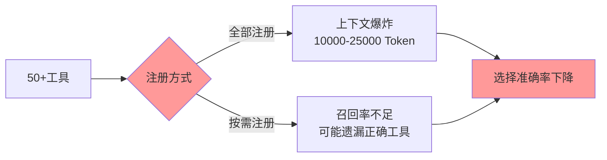
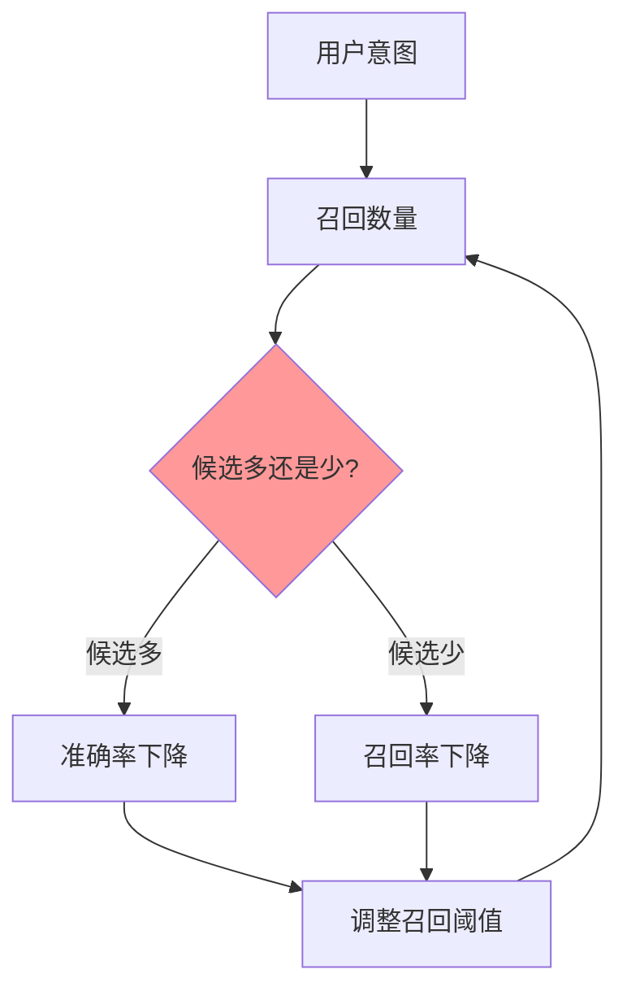

# Agent工具注册策略：面试高频问题详解

## 1. 引言

在Agent开发岗位的面试中，**工具注册策略**是一个高频考察点。当面试官问起“你在Agent开发中遇到过什么挑战”时，工具注册几乎是必问的话题。

本文将从面试角度，系统梳理这个问题的高频考察方式、回答思路以及多个方案的对比分析，帮助求职者在面试中更好地展示对这个问题的深度理解。

## 2. 面试高频问题

### 2.1 典型面试问题


在Agent开发岗位的面试中，面试官通常会通过以下方式考察这个问题：

**初级问题**：
- “如果Agent接入了几十个工具，你会怎么设计？”
- “工具多了之后，模型选错工具怎么办？”

**进阶问题**：
- “全部注册和按需注册各有什么优缺点？”
- “如何平衡召回率和选择准确率？”
- “工具描述应该怎么写才能让模型选对？”

**深度问题**：
- “如果让你设计一个工具召回系统，你会怎么做？”
- “模型选错工具后，如何让它快速纠错？”
- “如何评估工具注册策略的效果？”

### 2.2 面试官的考察点

| 考察维度 | 面试官想看到的 |
|----------|----------------|
| 问题理解 | 能否清晰描述问题（上下文爆炸、选择困难、准确率下降） |
| 方案设计 | 能否提出多个可行方案并分析利弊 |
| 工程实现 | 能否给出具体的代码设计和实现思路 |
| 权衡思维 | 能否认识到没有完美方案，需要权衡取舍 |
| 业务理解 | 能否结合实际业务场景给出建议 |

## 3. 问题本质

### 3.1 核心矛盾




**核心矛盾**：如何在保证召回率的前提下，减少上下文长度，提高模型的选择准确率。

### 3.2 问题量化分析

| 指标 | 全部注册(50工具) | 按需注册(5工具) |
|------|------------------|-----------------|
| 工具描述Token | 10000-25000 | 1000-2500 |
| 模型选择范围 | 50选1 | 5选1 |
| 首次选择正确率 | ~50% | ~80% |
| 召回率 | 100% | ~70-90% |

## 4. 方案对比

### 4.1 方案一：全部注册


**思路**：一次性把所有工具描述发送给模型，让模型自己选择。

**优点**：
- 实现简单，无需额外逻辑
- 召回率100%，不会遗漏正确工具
- 适合工具数量较少的场景（<20个）

**缺点**：
- 上下文急剧膨胀，Token消耗大
- 模型在大量选项中容易选错
- 长上下文可能导致模型"迷失"

**适用场景**：
- 工具数量少（<20个）
- 工具功能差异明显，不易混淆
- 对召回率要求极高的场景

### 4.2 方案二：按需注册


**思路**：根据用户意图，从50+工具中选出最相关的几个，再发送给模型。

**核心模块：工具召回**

```python
class ToolRetriever:
    def __init__(self, tools: list[Tool]):
        self.tools = tools
    
    def retrieve(self, query: str, top_k: int = 5) -> list[Tool]:
        # 多级召回策略
        keyword_results = self._keyword_match(query)      # 关键词匹配
        semantic_results = self._semantic_match(query)    # 语义匹配
        rule_results = self._rule_match(query)            # 规则匹配
        
        # 融合排序
        return self._fusion_ranking(
            keyword_results, 
            semantic_results, 
            rule_results,
            top_k
        )
```

**优点**：
- 显著减少上下文长度
- 候选工具少，模型选择更精准
- 可以根据场景动态调整

**缺点**：
- 实现复杂，需要额外召回逻辑
- 召回率可能不足，可能遗漏正确工具
- 召回不准确时会导致整体失败

**适用场景**：
- 工具数量多（>20个）
- 工具功能有重叠，容易混淆
- 对Token消耗敏感的场景

### 4.3 方案三：混合注册（推荐）


**思路**：核心工具（高频、通用）始终注册，其他工具按需召回。

```python
class HybridToolRegistry:
    def __init__(self):
        # 核心工具始终注册（约5-10个）
        self.core_tools = self._load_core_tools()
        
        # 按需工具池（40+个）
        self.tool_pool = self._load_tool_pool()
        
        # 召回器
        self.retriever = ToolRetriever(self.tool_pool)
    
    def get_tools_for_query(self, query: str) -> list[Tool]:
        # 核心工具必选
        result = list(self.core_tools)
        
        # 按需补充
        context_tools = self.retriever.retrieve(query, top_k=3)
        result.extend(context_tools)
        
        return self._deduplicate(result)
```

**优点**：
- 平衡召回率和准确率
- 核心工具保证基础能力
- 按需工具保证覆盖度
- 实现复杂度适中

**缺点**：
- 需要持续维护核心工具列表
- 核心工具的选择需要数据支撑

**适用场景**：**推荐用于生产环境**，大部分场景都适用。

### 4.4 方案对比总结


| 维度 | 全部注册 | 按需注册 | 混合注册 |
|------|----------|----------|----------|
| 实现复杂度 | 低 | 高 | 中 |
| 上下文占用 | 高 | 低 | 中 |
| 召回率 | 100% | 70-90% | 90-95% |
| 首次选择准确率 | 低 | 高 | 高 |
| 维护成本 | 低 | 中 | 中 |
| 适用场景 | 工具少 | 工具多且杂 | **通用推荐** |

## 5. 深入问题解析

### 5.1 工具描述怎么写？


**常见问题**：描述太长占Token，描述太短选不准。

**解决方案：分层描述**

```python
class ToolDescriptor:
    def __init__(self):
        self.short_desc = "获取天气"      # 列表展示 <20字
        self.medium_desc = "根据城市名称获取实时天气"  # 召回匹配 <50字
        self.full_desc = """获取指定城市的天气信息
    
    支持城市：北京、上海、广州、深圳等
    返回：温度、湿度、风力、空气质量
    示例：get_weather(city="北京")"""  # 深度理解 <200字
```

**面试话术**：
> “我通常会为每个工具准备三个版本的描述：短描述用于快速展示，中描述用于语义召回，完整描述用于模型深度理解。这样可以在召回阶段用短描述节省Token，在最终选择时用完整描述提高准确率。”

### 5.2 工具分类怎么设计？

**常见问题**：工具杂乱的，如何组织？

**解决方案：多维分类**

```python
class ToolCategory:
    # 业务域分类
    BUSINESS_DOMAIN = ["电商", "社交", "出行", "工具"]
    
    # 操作类型分类
    OPERATION_TYPE = ["查询", "创建", "更新", "删除"]
    
    # 敏感性分类
    SENSITIVITY = ["公开", "隐私", "敏感"]
```

**设计原则**：
- 互斥：每个工具在同一维度只有一个分类
- 完备：覆盖所有工具类型
- 可扩展：预留新增分类接口

### 5.3 如何评估效果？


**关键指标**：

| 指标 | 目标值 | 测量方式 |
|------|--------|----------|
| 工具选择准确率 | > 85% | 日志统计 |
| 首次选择正确率 | > 70% | 埋点统计 |
| 平均候选工具数 | 3-8个 | 运行时统计 |
| Token消耗 | 降低 50%+ | 成本监控 |

**面试话术**：
> “我会在系统中埋点，统计三个关键指标：首次选择正确率（模型第一次就选对的比例）、工具选择准确率（最终选对的比例）、以及Token消耗。通过这些指标持续优化召回策略和工具描述。”

### 5.4 召回率与准确率如何平衡？



**解决方案**：
- 初始召回候选稍多（top 10），由模型最终选择
- 引入“意图澄清”机制，当不确定时询问用户
- 基于历史使用数据，动态调整各工具的召回权重

## 6. 面试加分项

### 6.1 展示深度理解

**差异化表达**：
> “我认为按需注册的核心难点在于召回质量。很多同学可能只想到用关键词匹配，但我会引入语义向量匹配和业务规则匹配三层召回，用加权融合的方式提高召回准确性。”

### 6.2 展示工程思维

**代码能力**：
> “我实现了一个多级召回器，第一级用关键词精确匹配保证召回速度，第二级用向量相似度匹配理解意图，第三级用业务规则兜底。三级结果用加权排序融合，top_k可配置。”

### 6.3 展示业务敏感

**场景化回答**：
> “具体选择哪种策略，要看业务场景。如果是客服场景，工具数量少但对准确率要求高，我会用全部注册；如果是助手类场景，工具可能几十个，我会用混合注册，核心工具始终注册，按需工具动态补充。”

### 6.4 展示复盘总结

**数据驱动**：
> “上线后我们监控发现，首次选择正确率只有60%，分析发现是几个相似工具描述太接近导致混淆。我们重新梳理了工具描述，增加差异化表述，并引入工具分类体系，最终把首次选择正确率提升到80%。”


## 7. 常见面试追问

### Q1：模型选错工具后怎么办？

**思路**：让模型有自我纠错能力。

**回答要点**：
- 执行后检查结果是否符合预期
- 引入结果验证机制
- 允许模型重新选择（但要限制次数，防止无限循环）

### Q2：如何处理工具描述的更新？

**思路**：版本管理和热更新。

**回答要点**：
- 工具描述纳入配置中心管理
- 支持热更新，无需重启服务
- 记录历史版本，便于回溯

### Q3：新增工具如何快速接入？

**思路**：标准化接入流程。

**回答要点**：
- 定义工具描述模板
- 自动生成描述（结合代码注释）
- 自动化测试验证描述质量

## 8. 总结


| 考察维度 | 核心要点 |
|----------|----------|
| 问题描述 | 上下文爆炸 + 选择困难 + 准确率下降 |
| 方案对比 | 全部注册 vs 按需注册 vs 混合注册 |
| 工程实现 | 多级召回 + 分层描述 + 多维分类 |
| 效果评估 | 准确率 + 召回率 + Token消耗 |
| 面试话术 | 场景化 + 数据化 + 工程化 |

**一句话总结**：
> “工具注册策略的核心是平衡，没有最优解，只有最适合业务场景的解。面试时，要展示你对问题的完整理解、对多个方案的对比分析、以及在实际项目中的工程落地能力。”

## 参考资料

| 参考资料 | 访问地址 |
| --- | --- |
| OpenAI Function Calling 最佳实践 | https://platform.openai.com/docs/guides/function-calling |
| Claude 工具使用指南 | https://docs.anthropic.com/en/docs/build-with-claude/tool-use |
| LangChain 工具定义 | https://python.langchain.com/docs/how_to/#tools |

> **作者**：一灰  
**日期**：2026-04-24  
**标签**： #Agent #面试 #工具注册 #FunctionCalling