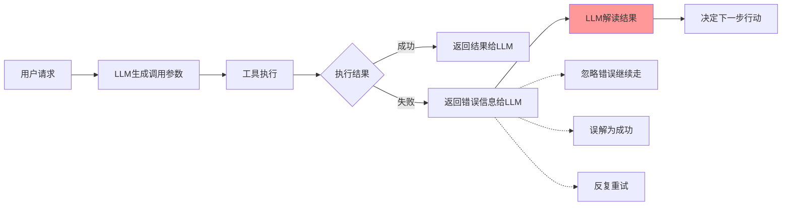

# Agent 高频面试·第二篇：工具执行失败，你能答到第几层？


## 1. 引言

在 Agent 系统开发的面试中，**工具执行失败的处理**是一个极高频的考察点。这道题看似简单——不就是 try-catch 吗？——但实际上，传统编程的错误处理思路在 Agent 场景下完全不适用。


本文从面试官视角，系统性地解析这道题的考察层次、问题本质、解决方案，以及如何在面试中展现自己的深度。

## 2. 面试高频问题

### 2.1 典型面试问题

在 Agent 开发岗位的面试中，面试官通常会通过以下方式考察这个问题：


**初级问题**：
- “如果工具调用返回了 500 错误，Agent 应该如何处理？”
- “LLM 收到错误信息后，它会怎么行动？”

**进阶问题**：
- “为什么模型会把错误结果解读成成功？”
- “参数格式不匹配时，LLM 修复参数为什么会越修越错？”
- “重试策略应该由模型控制还是系统控制？”

**深度问题**：
- “连续失败多少次后应该终止流程？为什么是这个数字？”
- “如何设计错误信息，让 LLM 能正确理解并做出合理决策？”
- “多工具组合时，其中一个工具失败了，整个任务应该如何处理？”

### 2.2 面试官的考察点


| 考察维度 | 面试官想看到的 |
|----------|----------------|
| 问题理解 | 能否清晰描述 Agent 场景下错误处理的特殊性 |
| 方案设计 | 能否提出分层解决方案（工具层、系统层、LLM层） |
| 工程实现 | 能否给出具体的重试策略、错误校验代码设计 |
| 权衡思维 | 能否认识到用户体验与系统资源的权衡 |
| 边界考虑 | 能否考虑到连续失败、多工具组合等边界情况 |

## 3. 问题本质

### 3.1 核心矛盾




**核心矛盾**：传统编程中，代码明确知道失败并可预测处理；而在 Agent 场景中，LLM 需要"理解"错误文本后决定下一步，这个过程不可预测。


### 3.2 问题量化分析

| 维度 | 传统编程 | Agent 场景 |
|------|----------|------------|
| 失败感知确定性 | 代码明确知道失败 | LLM 收到的只是文本 |
| 失败处理可预测性 | try-catch 明确捕获 | LLM 可能忽略、误解、或过度重试 |
| 重试控制 | 开发者完全控制 | 模型控制或系统控制 |

## 4. 方案对比


### 4.1 方案一：参数自动转换

在工具层实现参数标准化，减少 LLM 的猜测空间。

```python
class WeatherTool:
    def __init__(self):
        self.param_mapping = {
            "city": "city_name",
            "c": "city_name"
        }
        self.city_normalization = {
            "北京": "beijing",
            "上海": "shanghai"
        }
    
    def normalize_params(self, params: dict) -> dict:
        normalized = {}
        for key, value in params.items():
            mapped_key = self.param_mapping.get(key, key)
            if key == "city" and value in self.city_normalization:
                value = self.city_normalization[value]
            normalized[mapped_key] = value
        return normalized
```

**优点**：
- 减少 LLM 的参数生成负担
- 提升工具调用成功率
- 实现相对简单

**缺点**：
- 增加工具层的复杂性
- 可能掩盖 API 设计问题
- 需要维护映射表

**适用场景**：工具参数格式不统一、LLM 生成参数容易出错的场景。

### 4.2 方案二：强化结果校验层

在工具返回和 LLM 输入之间增加校验层，明确区分成功与失败。

```python
class ToolResultValidator:
    def validate(self, result: ToolResult) -> ValidationResult:
        if result.is_success:
            return ValidationResult(valid=True, action="continue")
        
        if self.is_retryable_error(result.error):
            return ValidationResult(
                valid=False,
                action="retry",
                reason=result.error.message
            )
        
        return ValidationResult(
            valid=False,
            action="fail",
            error_message=self.format_error(result.error)
        )
    
    def is_retryable_error(self, error: Error) -> bool:
        return error.code in [500, 502, 503, 504]
```

**优点**：
- 明确区分成功与失败状态
- 减少 LLM 误解错误的可能性
- 可根据错误类型决定重试策略

**缺点**：
- 需要为每个工具定义错误处理逻辑
- 可能无法覆盖所有错误类型

**适用场景**：需要明确错误状态、避免 LLM 误解错误的场景。

### 4.3 方案三：重试策略系统控制（推荐）


系统层控制重试策略，LLM 只负责决定是否重试已经修复过的问题。

```python
class RetryableToolExecutor:
    def __init__(self, max_retry: int = 2):
        self.max_retry = max_retry
    
    async def execute_with_retry(self, tool: Tool, params: dict):
        for attempt in range(self.max_retry + 1):
            result = await tool.execute(params)
            if result.is_success:
                return result
            
            if not self.is_retryable(result.error):
                return self.format_failure_result(result.error)
        
        return self.format_failure_result(
            f"工具执行失败，已重试 {self.max_retry} 次"
        )
```

**优点**：
- 重试行为确定、可控
- 可精确限制重试次数
- 避免 LLM 反复重试失败操作

**缺点**：
- 灵活性差，可能错过可恢复的错误
- 需要为不同错误类型定义不同策略

**适用场景**：**推荐用于生产环境**，需要确定性强、重试行为可控的场景。

### 4.4 方案四：连续失败终止机制


```python
class FailureTracker:
    def __init__(
        self,
        max_consecutive_failures: int = 3,
        failure_window: int = 300
    ):
        self.max_consecutive_failures = max_consecutive_failures
        self.failure_history: list[FailureRecord] = []
    
    def should_terminate(self) -> bool:
        recent_failures = self.get_recent_failures()
        return len(recent_failures) >= self.max_consecutive_failures
    
    def get_recent_failures(self) -> list[FailureRecord]:
        return [
            f for f in self.failure_history
            if f.timestamp > time.time() - self.failure_window
        ]
```

**为什么是 3 次**：
- **用户体验**：用户等待时间不宜超过合理范围（网络请求通常 ms 级，3 次重试意味着数秒到十数秒的等待）
- **资源保护**：防止无限重试被滥用，消耗系统资源
- **统计意义**：连续 3 次失败通常意味着系统性问题，单次重试难以解决

### 4.5 方案对比总结

| 维度 | 参数自动转换 | 结果校验层 | 系统控制重试 | 失败终止机制 |
|------|------------|----------|-------------|-------------|
| 解决位置 | 工具层 | 系统层 | 系统层 | 系统层 |
| 解决对象 | 参数错误 | 状态误判 | 过度重试 | 无限循环 |
| 实现复杂度 | 中 | 低 | 中 | 低 |
| 重要性 | 高 | 高 | **高** | 高 |

## 5. 深入入问题解析

### 5.1 错误信息的结构化设计

为了让 LLM 正确理解错误，错误信息应该结构化：

```python
class ToolError:
    def __init__(
        self,
        error_type: str,
        error_message: str,
        error_code: int,
        fix_suggestion: str | None = None,
        can_retry: bool = False
    ):
        self.error_type = error_type
        self.error_code = error_code
        self.fix_suggestion = fix_suggestion
        self.can_retry = can_retry
    
    def to_message(self) -> str:
        parts = [
            f"错误类型: {self.error_type}",
            f"错误代码: {self.error_code}"
        ]
        if self.fix_suggestion:
            parts.append(f"修复建议: {self.fix_suggestion}")
        parts.append(
            "可重试" if self.can_retry else "不建议重试"
        )
        return " | ".join(parts)
```

**错误类型分类处理**：

| 错误类型 | 可重试 | LLM 应该如何处理 |
|---------|--------|------------------|
| 网络超时 | 是 | 重试一次，可能网络波动 |
| 503 服务不可用 | 是 | 等待后重试，服务可能暂时过载 |
| 401 认证失败 | 否 | 提示用户检查 API 配置 |
| 422 参数错误 | 否 | 尝试使用正确的参数格式 |
| 429 频率限制 | 是 | 等待一段时间后再重试 |
| 500 服务器错误 | 是 | 可以重试 |

### 5.2 重试策略的决策权归属

**核心问题**：重试应该由模型控制还是系统控制？

| 控制方式 | 优点 | 缺点 |
|---------|------|------|
| 模型控制 | 灵活，可根据错误类型做决策 | 不可预测，可能反复重试失败操作 |
| 系统控制 | 确定性强，可以精确限制重试次数 | 灵活性差，可能错过可恢复错误 |

**推荐答案**：系统层控制重试策略。因为 LLM 的行为不可预测，可能在某些情况下反复重试一个注定失败的调用，或者因为一次失败就放弃整个任务。系统层控制可以确保重试行为确定、可控。

### 5.3 典型失败场景解析

**场景一：假装没看到失败**
- 现象：LLM 收到错误信息后，忽略它并继续往下走
- 根因：模型可能把错误信息当作噪声过滤掉了，或者把错误码误解为某种响应内容

**场景二：把失败解读成成功**
- 现象：模型在错误信息中提取了看似合理的内容并当作成功结果
- 根因：训练数据中存在带 "error" 字段但实际返回正常结果的 API，导致模型学会忽略上下文

**场景三：无效参数导致失败，越修越错**
- 现象：LLM 尝试"修复"参数，但越修越离谱
- 根因：模型缺乏对工具 schema 的准确理解，修复往往适得其反

## 6. 面试加分项


### 6.1 展示分层设计思维

**差异化表达**：
> “我认为工具执行失败的处理需要分层：工具层负责参数适配和标准化，系统层负责重试策略和错误校验，LLM 层负责根据结构化错误信息做决策——各层职责清晰，避免职责混乱。”

### 6.2 展示用户体验考虑

**场景化回答**：
> “除了技术上正确处理错误，还要考虑用户体验。当工具执行失败时，用户期望看到明确的状态告知，比如'天气服务暂时不可用，可以稍后再试'，而不是一个随机的错误码。”

### 6.3 展示边界情况考虑

**全面性回答**：
> “需要考虑不同错误类型的不同策略：5xx 错误通常可重试，4xx 错误通常不可重试；还要考虑失败窗口期，比如 5 分钟内连续 3 次失败才终止，防止频繁触发失败终止。”

### 6.4 展示多工具组合场景

**深入思考**：
> “如果是多工具任务，其中一个失败了，需要考虑：是直接返回失败，还是尝试其他工具？如何让 LLM 理解部分成功的情况？这涉及到工具���错���的传递机制设计。”

## 7. 常见面试追问


### Q1：为什么模型会把错误当成成功？

**参考答案**：训练数据中存在大量带 "error" 字段但实际返回正常结果的 API（如错误码在 error 字段但数据在 data 字段），导致模型学会了看到 "error" 字段就提取其中内容，忽略上下文。

### Q2：参数自动转换的方案有什么优缺点？

**参考答案**：优点是减少 LLM 的参数生成负担，提升成功率；缺点是增加了工具层的复杂性，可能掩盖 API 设计问题。

### Q3：为什么要设置失败次数上限而不是无限重试？

**参考答案**：无限重试会导致两个问题：一是用户体验极差，用户等半天得到一个失败结果；二是可能被恶意利用，不断触发重试消耗系统资源。

### Q4：重试应该由模型控制还是系统控制？

**参考答案**：推荐系统层控制重试策略。因为 LLM 的行为不可预测，系统层控制可以确保重试行为确定、可控。

## 8. 总结

| 考察维度 | 核心要点 |
|----------|----------|
| 问题描述 | 传统 try-catch 不适用，LLM 需要"理解"错误 |
| 典型场景 | 忽略错误、误解错误、参数修复越修越错 |
| 解决方案 | 参数转换 + 结果校验 + 系统重试 + 失败终止 |
| 工程实现 | 分层设计 + 结构化错误信息 + 多级重试策略 |
| 面试话术 | 场景化 + 数据化 + 工程化 |

**一句话总结**：
> “工具执行失败处理的核心是分层——工具层减少错误，系统层控制行为，LLM 层做最终决策。面试时，要展示你对 Agent 架构中各层职责的理解，以及在实际项目中的工程落地能力。”

## 参考资料

| 参考资料 | 访问地址 |
| --- | --- |
| Anthropic Tool Use Guidelines | https://docs.anthropic.com/en/docs/tool-use |
| Agent开发专栏 | https://ppai.top |
| Agent工具注册策略：面试高频问题详解 | https://mp.weixin.qq.com/s/aqSWTUuLaN_mBnuP5q8Pbw |

> **作者**：一灰  
> **日期**：2026-04-25  
> **标签**： #Agent #面试 #工具执行 #FunctionCalling