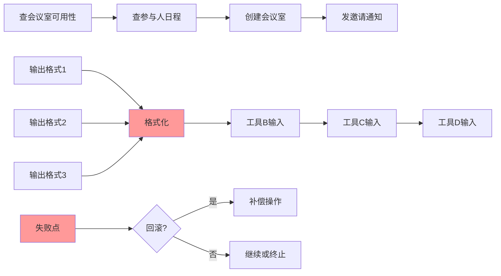

# Agent 高频面试·第三篇：工具编排，你能答到第几层？


## 1. 引言

在 Agent 系统开发的面试中，**工具编排**同样也是一个极高频的考察点。当面试官问起"如果让 Agent 完成一个复杂任务，比如'帮我订会议室'，需要调用多个工具串行执行，这个过程应该怎么设计？"时，工具编排就是必考的内容。

本文从面试官视角，系统性地解析这道题的考察层次、问题本质、解决方案，以及如何在面试中展现自己的深度。

## 2. 面试高频问题

### 2.1 典型面试问题

在 Agent 开发岗位的面试中，面试官通常会通过以下方式考察这个问题：


**初级问题**：
- "如果要让 Agent 完成一个复杂任务，比如订会议室，需要调用查可用性、查日程、创建会议室、发通知这四个工具，怎么实现？"
- "多工具调用时，工具之间的数据怎么传递？"

**进阶问题**：
- "工具输出格式不统一怎么办？比如查可用性返回列表，查日程返回另一种格式，Agent 要如何理解并转换？"
- "中间某一步失败了怎么处理？要不要回滚？回滚的边界在哪里？"
- "编排逻辑应该写在 Agent Prompt 里还是独立的工作流引擎？"
- "ReAct 模式和 Workflow/DAG 编排各有什么优缺点？"
- "如何保证工具编排的幂等性？"

**深度问题**：
- "工具间数据传递是走 Agent 的上下文还是独立的状态存储？"
- "补偿/回滚机制怎么设计？"
- "如何设计一个可扩展的工具编排框架？"
- "工作流执行中断后如何实现断点恢复？"
- "如何处理工具编排中的并发冲突？"

### 2.2 面试官的考察点


| 考察维度 | 面试官想看到的 |
|----------|----------------|
| 问题理解 | 能否清晰描述工具编排的挑战（状态传递、依赖管理、格式转换、失败处理） |
| 方案设计 | 能否提出分层解决方案（工作流层、状态管理层、数据转换层） |
| 工程实现 | 能否给出具体的编排逻辑、数据流转、错误处理代码设计 |
| 权衡思维 | 能否认识到灵活性与确定性的权衡 |
| 边界考虑 | 能否考虑到部分成功、补偿机制、状态一致性等边界情况 |

## 3. 问题本质

### 3.1 核心矛盾




**核心矛盾**：多工具串行调用时，如何管理状态传递、格式转换和失败处理，同时保持系统的灵活性和可维护性。

### 3.2 问题量化分析


| 维度 | 挑战描述 |
|------|----------|
| 状态传递 | 每一步的输出需要正确传递给下一步，4个工具就需要3次传递 |
| 格式转换 | 不同工具输出格式不同，需要理解并转换 |
| 依赖管理 | 工具B依赖工具A的输出，工具C依赖工具B的输出 |
| 失败处理 | 中间任何一步失败，是否回滚？如何回滚？ |
| 编排位置 | 逻辑放在 Prompt 还是独立引擎？ |

## 4. 方案对比


### 4.1 方案一：Prompt 驱动编排（最初级）

将编排逻辑直接写在 Agent 的提示词中，让 LLM 决定下一步调用什么。

```python
ORCHESTRATION_PROMPT = """
你是一个会议预订助手，需要完成以下步骤：
1. 首先调用 check_room_availability 查询会议室可用时间
2. 然后调用 check_attendee_schedule 查询参与人日程
3. 接着调用 create_meeting 创建会议室
4. 最后调用 send_invite 发送邀请

每一步的输出会影响下一步的输入，请确保正确传递数据。
如果某一步失败，请尝试恢复或告知用户。
"""
```

**优点**：
- 实现简单，无需额外逻辑
- 灵活性高，LLM 可以根据情况调整执行顺序
- 适合快速验证和简单场景

**缺点**：
- 不可预测，LLM 可能跳过步骤或顺序错误
- 调试困难，难以追踪状态
- 格式转换依赖 LLM，容易出错
- 失败处理不确定

**适用场景**：工具数量少（<3个）、流程简单、对准确性要求不高的探索阶段。

### 4.2 方案二：ReAct 模式（主流基础方案）

ReAct（Reasoning + Acting）是一种让 LLM 在推理过程中决定下一步行动的模式。Agent 在每一步都会"思考"当前状态，然后决定调用哪个工具。

```python
class ReActAgent:
    def __init__(self, tools: list[Tool]):
        self.tools = {t.name: t for t in tools}
    
    async def execute(self, user_request: str, max_steps: int = 10):
        observation = None
        thought = f"用户请求：{user_request}，我需要完成订会议室的任务"
        
        for step in range(max_steps):
            # LLM 推理下一步应该做什么
            action = await self.llm.think(thought, observation, self.available_tools())
            
            if action.type == "tool_call":
                # 执行工具
                result = await self.tools[action.tool_name].execute(action.parameters)
                observation = f"工具 {action.tool_name} 返回：{result}"
                thought += f"\n上一步：{observation}"
            elif action.type == "finish":
                return action.final_response
        
        return "任务超时，未能完成"
```

**核心流程**：
1. **Thought**：LLM 分析当前状态和目标，决定下一步
2. **Action**：调用工具或完成响应
3. **Observation**：获取工具返回结果
4. 循环直到任务完成

**优点**：
- 实现相对简单，有成熟框架支持（LangChain、AutoGen 等）
- 灵活性高，能处理动态变化的情况
- 支持动态工具选择

**缺点**：
- 执行路径不确定，难以预测下一步
- 状态管理依赖上下文，可能膨胀
- 失败处理仍不可控，可能无限循环

**适用场景**：中小规模生产环境、需要一定灵活性的场景。

### 4.3 方案三：Workflow / DAG 编排（工程级方案）

使用独立的工作流引擎来控制工具调用顺序、状态传递和错误处理。基于 DAG（有向无环图）定义工具执行依赖关系。

```python
class WorkflowEngine:
    def __init__(self):
        self.steps = []
        self.state = {}
    
    def add_step(self, tool: Tool, input_map: dict, output_key: str, depends_on: list[str] = None):
        self.steps.append(WorkflowStep(
            tool=tool,
            input_map=input_map,
            output_key=output_key,
            depends_on=depends_on or []
        ))
    
    async def execute(self) -> WorkflowResult:
        # 按依赖顺序执行
        executed = set()
        while len(executed) < len(self.steps):
            ready_steps = [s for s in self.steps if s.name not in executed 
                          and all(d in executed for d in s.depends_on)]
            
            for step in ready_steps:
                inputs = self._prepare_inputs(step.input_map)
                result = await step.tool.execute(inputs)
                
                if result.is_success:
                    self.state[step.output_key] = result.data
                    executed.add(step.name)
                else:
                    return self._handle_failure(step, result)
        
        return WorkflowResult(success=True, state=self.state)
```

**优点**：
- 执行顺序确定可控
- 状态管理清晰可见
- 失败处理机制完善
- 支持并行执行（DAG 天然支持）
- 便于调试和监控

**缺点**：
- 实现复杂度较高
- 灵活性较差，修改流程需要改代码
- 需要维护状态存储

**适用场景**：生产环境、需要确定性执行、复杂流程、可靠性的场景。

### 4.4 方案四：LLM + Workflow 混合编排（推荐方案）

结合工作流引擎和 LLM 决策的优势，引擎控制流程，LLM 处理细节。

```python
class HybridOrchestrator:
    def __init__(self):
        self.workflow = self._build_workflow()
        self.llm = LLMAgent()
    
    def _build_workflow(self):
        return WorkflowBuilder() \
            .add_step("check_availability", tool=check_room) \
            .add_step("check_schedule", tool=check_calendar) \
            .add_step("create_meeting", tool=create_room) \
            .add_step("send_invite", tool=send_notification) \
            .build()
    
    async def execute(self, user_request: str):
        # LLM 理解用户请求，填充初始参数
        initial_params = await self.llm.analyze(user_request)
        
        # 工作流引擎执行确定性流程
        result = await self.workflow.execute(initial_params)
        
        # LLM 处理最终响应
        response = await self.llm.format_response(result)
        
        return response
```

**优点**：
- 结合确定性和灵活性
- 流程可控，细节灵活
- 适合复杂业务场景
- 失败处理可精确控制

**缺点**：
- 实现复杂度最高
- 需要协调两个系统

**适用场景**：大型复杂系统、需要流程标准化同时保持一定灵活性的场景。**推荐用于生产环境**。

### 4.5 方案对比总结

| 维度 | Prompt驱动 | ReAct模式 | Workflow/DAG | 混合编排 |
|------|-----------|----------|--------------|---------|
| 实现复杂度 | 低 | 中 | 中 | 高 |
| 执行确定性 | 低 | 低 | 高 | 高 |
| 状态管理 | 依赖上下文 | 依赖上下文 | 独立存储 | 独立存储 |
| 失败处理 | 不可控 | 不可控 | 可控 | 可控 |
| 灵活性 | 高 | 高 | 低 | 中 |
| 支持并行 | 否 | 否 | 是 | 是 |
| 适用场景 | 探索阶段 | 中小规模生产 | 生产环境 | 复杂系统 |

**面试话术**：
> "工具编排有四种主流方案：Prompt 驱动适合快速验证；ReAct 是目前最主流的方案，有完善的框架支持；Workflow/DAG 适合生产环境，对流程确定性要求高的场景；混合编排是工程落地的推荐方案，结合了两者优势。实际选择要看业务场景的复杂度和对确定性的要求。"

## 5. 深入问题解析

### 5.1 工具间数据传递机制

**核心问题**：工具间数据传递是走 Agent 的上下文还是独立的状态存储？


```python
# 方案A：上下文传递（通过Prompt）
class ContextPassingOrchestrator:
    def __init__(self):
        self.context = []
    
    async def execute_step(self, tool: Tool, context: list):
        # 将历史步骤的结果拼接到Prompt中
        prompt = self._build_prompt(tool, context)
        result = await tool.execute(prompt)
        context.append(result)
        return context

# 方案B：独立状态存储
class StateBasedOrchestrator:
    def __init__(self):
        self.state = {}  # 独立状态存储
    
    async def execute_step(self, tool: Tool):
        # 从状态存储中取数据
        inputs = self._prepare_inputs(tool.required_params)
        
        result = await tool.execute(inputs)
        
        # 存到状态存储
        self.state[tool.name] = result.data
        
        return result
```

| 方式 | 优点 | 缺点 |
|------|------|------|
| 上下文传递 | 实现简单 | 上下文膨胀、难以追踪 |
| 独立状态存储 | 清晰可控、可调试 | 需要额外存储层 |


**推荐**：生产环境使用独立状态存储，开发简单场景可用上下文传递。

### 5.2 格式转换层设计

不同工具输出格式不统一，需要一个转换层来处理：

```python
class DataTransformer:
    def __init__(self):
        self.transformers = {
            "check_room_availability": self._transform_room_list,
            "check_attendee_schedule": self._transform_calendar,
            "create_meeting": self._transform_meeting,
        }
    
    def transform(self, tool_name: str, output: Any) -> dict:
        transformer = self.transformers.get(tool_name)
        if transformer:
            return transformer(output)
        return output
    
    def _transform_room_list(self, output: list) -> dict:
        # 统一转换为标准格式
        return {
            "available_rooms": [
                {
                    "room_id": room["id"],
                    "room_name": room["name"],
                    "available_slots": room["time_slots"]
                }
                for room in output
            ]
        }
    
    def _transform_calendar(self, output: dict) -> dict:
        return {
            "busy_times": output.get("events", []),
            "preferred_times": self._find_available_slots(output)
        }
```

### 5.3 失败处理与补偿机制

**核心问题**：中间某一步失败了，要不要回滚？


```python
class CompensationManager:
    def __init__(self):
        self.compensations = {
            "create_meeting": self._undo_create_meeting,
            "send_invite": self._undo_send_invite,
        }
    
    async def handle_failure(self, failed_step: str, state: dict):
        # 已执行的步骤需要补偿
        executed_steps = self._get_executed_steps(failed_step)
        
        for step in reversed(executed_steps):
            compensation = self.compensations.get(step)
            if compensation:
                await compensation(state[step])
    
    async def _undo_create_meeting(self, meeting_data: dict):
        # 取消创建的会议室
        await meeting_api.cancel(meeting_data["meeting_id"])
    
    async def _undo_send_invite(self, invite_data: dict):
        # 撤回已发送的邀请
        await notification_api.revoke(invite_data["invite_id"])
```

**回滚边界设计**：


| 场景 | 处理方式 |
|------|----------|
| 查可用性失败 | 无需回滚，直接返回失败 |
| 查日程失败 | 无需回滚，重新尝试或返回失败 |
| 创建会议室失败 | 补偿：取消已创建的会议室（如有） |
| 发送邀请失败 | 补偿：撤回邀请 + 取消会议室 |

### 5.4 幂等性设计

**核心问题**：如果同一个工作流因为网络超时等原因被执行了两次，会产生什么后果？


幂等性是指同一操作执行多次的结果与执行一次相同。在工具编排中，幂等性设计至关重要。

```python
class IdempotencyManager:
    def __init__(self):
        self.execution_records = {}
    
    async def execute_with_idempotency(
        self, 
        step: WorkflowStep, 
        idempotency_key: str
    ) -> StepResult:
        # 检查是否已经执行过
        if idempotency_key in self.execution_records:
            cached_result = self.execution_records[idempotency_key]
            # 返回缓存结果而不是重新执行
            return cached_result
        
        # 首次执行
        result = await step.tool.execute(step.inputs)
        
        # 只有成功才缓存
        if result.is_success:
            self.execution_records[idempotency_key] = result
        
        return result
```

**幂等性级别**：

| 级别 | 描述 | 示例 |
|------|------|------|
| 天然幂等 | 同一操作多次执行结果相同 | 查询类操作（GET）、删除操作（DELETE） |
| 条件幂等 | 满足特定条件时幂等 | 创建操作（CREATE IF NOT EXISTS） |
| 非幂等 | 每次执行结果不同 | 计数器递增、发送通知 |

**幂等性设计策略**：

```python
class MeetingScheduler:
    async def create_meeting_idempotent(self, params: dict) -> Meeting:
        # 方案1：使用业务幂等键
        idempotency_key = f"meeting_{params['room_id']}_{params['start_time']}"
        
        # 检查是否已存在
        existing = await self.meeting_repo.find_by_idempotency_key(idempotency_key)
        if existing:
            return existing
        
        # 创建新会议
        meeting = await self.meeting_repo.create(params)
        
        # 记录幂等键
        await self.meeting_repo.save_idempotency_key(idempotency_key, meeting.id)
        
        return meeting
    
    async def send_invite_idempotent(self, meeting_id: str, user_id: str) -> Invite:
        # 方案2：先检查是否已发送
        existing = await self.invite_repo.find(meeting_id, user_id)
        if existing:
            return existing  # 已发送，直接返回
        
        # 发送新邀请
        return await self.invite_repo.create(meeting_id, user_id)
```

**面试话术**：

> "幂等性是生产环境必须考虑的问题。我的设计原则是：
> 1. 查询类操作天然幂等，不需要额外处理
> 2. 创建类操作使用业务幂等键（如 meeting_room_time）防止重复创建
> 3. 发送类操作先查询是否已发送，避免重复通知
> 4. 工作流层面记录执行状态，支持从断点恢复"

### 5.5 编排逻辑应该放在哪里？

**问题**：编排逻辑写在 Agent Prompt 里还是独立的工作流引擎？

| 位置 | 优点 | 缺点 |
|------|------|------|
| Prompt 内 | 灵活、可动态调整 | 不可预测、难以调试 |
| 工作流引擎 | 确定性、可监控 | 灵活性差、修改成本高 |

**推荐答案**：生产环境使用工作流引擎，开发阶段可用 Prompt 快速迭代。

> "我推荐将编排逻辑放在独立的工作流引擎中，因为多工具协作需要确定性执行、清晰的状态管理和完善的失败处理。但如果场景简单，也可以先用 Prompt 快速验证，后期再迁移到工作流引擎。"

## 6. 面试加分项


### 6.1 展示分层设计思维

**差异化表达**：
> "我认为工具编排需要分层：数据层负责格式转换，状态层负责数据传递，工作流层负责流程控制，LLM 层负责理解用户意图——各层职责清晰，便于维护和扩展。"

### 6.2 展示状态管理考虑

**场景化回答**：
> "工具间的数据传递，我会用独立的状态存储而不是依赖上下文。这样做的好处是：状态可追溯（每个工具的输入输出都清晰可见）、可重试（失败后可以从任意步骤恢复）、可调试（出问题能快速定位）。"

### 6.3 展示补偿机制设计

**全面性回答**：
> "关于失败回滚，我认为需要分级处理：查询类操作失败不需要回滚；创建类操作失败需要补偿（比如取消已创建的会议室）；发送类操作失败需要先补偿创建再返回失败。回滚的边界是：只补偿本次会话内的操作，不涉及外部系统。"

### 6.4 展示实际项目经验

**数据驱动**：
> "上线后我们发现，用纯 Prompt 编排时，约 30% 的多工具任务会出现步骤跳过或顺序错误。迁移到工作流引擎后，成功率提升到 95%，同时通过状态追踪将平均调试时间从 30 分钟降到 2 分钟。"

## 7. 常见面试追问


### Q1：工具输出格式不统一，LLM 经常转换错误怎么办？

**参考答案**：应该在工具层或系统层增加格式转换逻辑，而不是依赖 LLM 理解不同格式。我会设计一个 DataTransformer 层，将不同工具的输出统一转换为标准格式，再传递给下一步。

### Q2：工作流引擎如何处理"部分成功"的情况？

**参考答案**：需要引入"补偿机制"。对于已经成功的步骤，执行反向操作回滚。比如创建会议室成功但发送邀请失败，需要先取消会议室，再返回失败。

### Q3：如何设计可扩展的工具编排框架？

**参考答案**：我倾向于使用"声明式"配置。用 YAML 或 JSON 定义工作流：包含步骤顺序、每个步骤依赖的前置步骤、输入输出映射、失败处理策略。这样新增工具只需要声明式配置，不需要改代码。

### Q4：如果某个工具超时怎么办？

**参考答案**：超时应该视为可重试的错误。工作流引擎应该支持配置超时时间和重试策略。对于关键步骤，可以设置熔断机制：连续超时 N 次后终止流程，避免资源浪费。


## 8. 总结

| 考察维度 | 核心要点 |
|----------|----------|
| 问题描述 | 状态传递 + 格式转换 + 依赖管理 + 失败处理 |
| 方案对比 | Prompt编排 vs 工作流引擎 vs 混合编排 |
| 工程实现 | 数据转换层 + 状态管理层 + 工作流控制 + 补偿机制 |
| 效果评估 | 执行确定性 + 状态可追溯 + 失败可恢复 |
| 面试话术 | 场景化 + 数据化 + 工程化 |

**一句话总结**：

面试时，要展示你对复杂系统设计的理解，以及在实际项目中如何平衡灵活性与确定性。

> "Agent 的工具编排，本质不是 AI 问题，而是一个 Workflow + 分布式系统设计问题，LLM 只是其中的决策组件。工具编排的核心是分层——数据层转换格式、状态层管理传递、工作流层控制流程。"

## 参考资料

| 参考资料 | 访问地址 |
| --- | --- |
| LangChain Agent 架构 | https://python.langchain.com/docs/how_to/#agents |
| Agent开发专栏 | https://ppai.top |

- [Agent工具注册策略：面试高频问题详解](https://mp.weixin.qq.com/s/aqSWTUuLaN_mBnuP5q8Pbw)

> **作者**：一灰  
> **日期**：2026-04-26  
> **标签**： #Agent #面试 #工具编排 #工作流