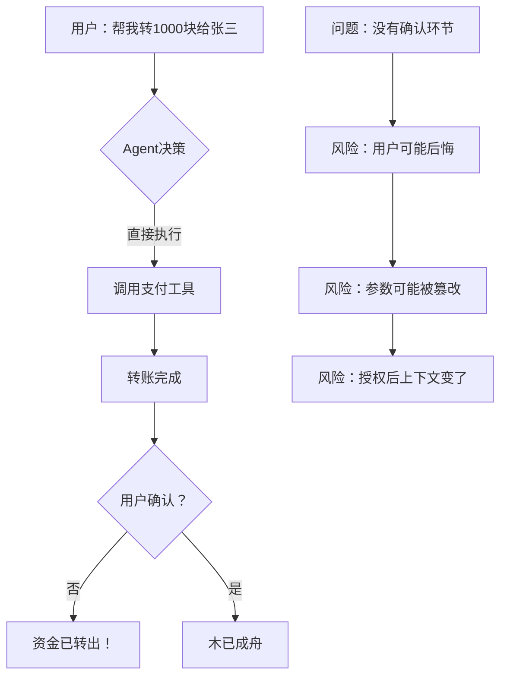

# 面试官：Agent 直接调支付接口转钱，有什么问题？——敏感授权怎么答出深度


## 1. 引言

在 Agent 系统开发的面试中，**敏感工具授权**是一个极其重要但又常被忽视的考察点。当面试官问起"如果用户让 Agent 转账 1000 块钱，Agent 直接就调用支付工具把钱转走了，连确认环节都没有，你覺得这个设计有什么问题？"时，敏感工具授权就是必考的内容。

本文从面试官视角，系统性地解析这道题的考察层次、问题本质、解决方案，以及如何在面试中展现自己的深度。

## 2. 面试高频问题

### 2.1 典型面试问题

在 Agent 开发岗位的面试中，面试官通常会通过以下方式考察这个问题：


**初级问题**：
- "如果用户说'帮我转1000块给张三'，Agent 直接就调用支付工具转钱，这个流程有什么问题？"
- "敏感操作需不需要用户确认？怎么加确认环节？"
- "Agent 自动执行和人工确认之间怎么平衡？"

**进阶问题**：
- "敏感工具的安全等级怎么定义？哪些算敏感操作？"
- "授权通过后的上下文怎么和 Agent 的执行上下文同步？"
- "如果用户授权后，参数变了怎么办？"
- "批量敏感操作（比如一次订10张机票）怎么处理？"
- "授权有有效期的概念吗？过期了怎么处理？"

**深度问题**：
- "授权应该发生在哪个环节？是 Agent 决定调用工具之前，还是工具实际执行之前？"
- "如果之前授权，授权通过后 Agent 的上下文已经变了怎么办？"
- "如果之后授权，授权通过后 Agent 可能已经忘记自己要干什么了，怎么办？"
- "如何设计一个可扩展的敏感工具授权框架？"
- "如何平衡自动化和安全性之间的矛盾？"

### 2.2 面试官的考察点

| 考察维度 | 面试官想看到的 |
|----------|----------------|
| 安全意识 | 能否意识到敏感操作的潜在风险 |
| 方案设计 | 能否提出分级的授权方案 |
| 工程实现 | 能否给出具体的授权流程设计代码 |
| 权衡思维 | 能否认识到自动化和安全性的矛盾 |
| 边界考虑 | 能否考虑到授权上下文同步、批量操作等边界情况 |

## 3. 问题本质

### 3.1 核心矛盾




**核心矛盾**：Agent 的优势是"自动化"，但自动化和"安全"天然矛盾。完全让 Agent 自主执行，涉及资金、隐私数据的操作就有风险。

### 3.2 问题量化分析

| 维度 | 挑战描述 |
|------|----------|
| 时机选择 | 授权应该在决策前还是执行前？两个时机各有难题 |
| 上下文同步 | 授权通过后上下文变了，参数还是原来那个吗？ |
| 安全等级 | 敏感工具的"敏感"程度怎么定义？ |
| 批量操作 | 10个敏感操作需要10次授权吗？ |
| 有效期 | 授权有有效期吗？过期了怎么办？ |

## 4. 方案对比

### 4.1 方案一：无授权（最初级）

直接让 Agent 执行敏感操作，没有任何授权环节。

```python
# 最简方案：直接执行
async def execute_transfer(amount: int, to: str):
    await payment_api.transfer(amount, to)
    return "转账成功"
```

**现状**：很多 Agent 原型就是这样实现的，确实"自动化"，但也确实危险。

**适用场景**：内部 AI 助手、完全可信的环境、测试用途。

### 4.2 方案二：执行前授权（主流方案）

在工具实际执行之前，需要用户确认。

```python
class PreExecutionAuthenticator:
    def __init__(self):
        self.sensitive_tools = {
            "transfer": AuthLevel.HIGH,
            "delete_account": AuthLevel.HIGH,
            "send_email": AuthLevel.MEDIUM,
            "book_ticket": AuthLevel.LOW,
        }
    
    async def check_auth(self, tool_name: str, params: dict) -> AuthResult:
        auth_level = self.sensitive_tools.get(tool_name, AuthLevel.LOW)
        
        if auth_level == AuthLevel.HIGH:
            # 高敏感：需要显式确认
            confirmed = await self.request_user_confirmation(tool_name, params)
            if not confirmed:
                return AuthResult(rejected=True, reason="用户拒绝")
        
        return AuthResult(approved=True)
    
    async def execute_with_auth(self, tool: Tool, params: dict) -> ToolResult:
        # 执行前检查授权
        auth_result = await self.check_auth(tool.name, params)
        
        if auth_result.rejected:
            return ToolResult(success=False, error=auth_result.reason)
        
        # 授权通过，执行工具
        return await tool.execute(params)
```

**流程**：
1. Agent 决定调用支付工具
2. 系统拦截，弹窗让用户确认
3. 用户确认后，执行转账
4. 返回结果

#### 补充说明

**问题一**：授权时用的参数，和执行时的参数可能不一样了。

**解决**：授权时锁定参数，执行时校验。

```python
class ParameterLockingAuthenticator:
    def __init__(self):
        self.pending_auths = {}
    
    async def request_confirmation(self, tool_name: str, params: dict) -> str:
        # 生成授权令牌
        auth_token = generate_token()
        
        # 锁定当前参数
        self.pending_auths[auth_token] = {
            "tool_name": tool_name,
            "params": params,
            "locked_at": datetime.now(),
            "expires_in": 300,  # 5分钟有效期
        }
        
        # 返回给用户确认
        return auth_token
    
    async def execute_with_auth(self, auth_token: str) -> ToolResult:
        auth = self.pending_auths.get(auth_token)
        
        if not auth:
            return ToolResult(success=False, error="授权已失效")
        
        if datetime.now() - auth["locked_at"] > timedelta(seconds=auth["expires_in"]):
            return ToolResult(success=False, error="授权已过期")
        
        # 使用锁定时的参数执行
        tool = self.get_tool(auth["tool_name"])
        return await tool.execute(auth["params"])
```


**问题二**：上面的实现中，对于授权时锁定参数，但遗漏了关键的防重设计，如果auth_token被重复使用了怎么办？

当前 token：

可以被重复使用
没有标记“已消费”

**解决**：在auth中维护使用状态


```python
if auth["used"]:
    reject()

auth["used"] = True
```

**问题三**：没有绑定用户身份，任何人拿到token都能执行

**解决**： 在实际的生产环境中，需要绑定用户身份

```python
"user_id" = xxx
```

#### 小结

这种方案可以说是比较常见也比较容易想到的实现了，当然在实际项目中要用好时，还需要搭配会话状态来使用，避免出现这一轮问答要求用户进行授权，但是用户完全不按照你的操作，开始了其他的新话题


**适用场景**：大多数生产环境，**推荐使用**

虽然本文将这个方案标记为主流方案，但是你需要清楚一点，现实世界并不是单一方案，通常是一事一议，一个严谨的生产系统中，更推荐的是

- 预授权（策略层）
- 执行前授权（交互层）
- 工具侧校验（强制层）

| 层级 |   作用|
| --- | --- |
| Agent 层  | 决策控制|
| 授权层 | 用户确认|
| Tool 层  | 最终兜底（必须有）|


### 4.3 方案三：决策前授权（保守方案）

在 Agent 决定调用敏感工具之前就获取授权。

```python
class PreDecisionAuthenticator:
    def __init__(self):
        self.user_preferences = {}
    
    async def check_pre_auth(self, user_id: str, tool_category: str) -> bool:
        # 检查用户是否预授权了这类操作
        pref = self.user_preferences.get(user_id, {})
        return pref.get(f"allow_{tool_category}", False)
    
    async def execute_with_pre_auth(self, agent: Agent, user_request: str) -> AgentResult:
        # 分析用户请求的意图
        intent = await agent.analyze_intent(user_request)
        
        # 检查是否需要预授权
        if intent.requires_pre_auth:
            has_pre_auth = await self.check_pre_auth(intent.user_id, intent.tool_category)
            
            if not has_pre_auth:
                # 需要引导用户先授权
                await self.request_pre_auth(intent.user_id, intent.tool_category)
                return AgentResult(needs_auth=True)
        
        # 执行 Agent
        return await agent.execute(user_request)
```

**适用场景**：高安全要求环境、企业级应用。

### 4.4 方案四：分级授权体系


根据敏感级别设计不同的授权策略。

```python
from enum import IntEnum

class AuthLevel(IntEnum):
    NONE = 0      # 无需授权
    Low = 1         # 静默授权（如记录日志）
    MEDIUM = 2     # 简单确认（如点个按钮）
    HIGH = 3        # 显式确认（如输入密码）
    CRITICAL = 4    # 多重验证（如密码 + 人脸）

class SensitiveToolConfig:
    @staticmethod
    def get_tool_config() -> dict:
        return {
            # 资金相关：高敏感
            "transfer": AuthLevel.HIGH,
            "refund": AuthLevel.HIGH,
            "purchase": AuthLevel.HIGH,
            
            # 数据相关：中敏感
            "delete_data": AuthLevel.MEDIUM,
            "export_data": AuthLevel.MEDIUM,
            "send_email": AuthLevel.MEDIUM,
            
            # 权限相关：最高敏感
            "delete_account": AuthLevel.CRITICAL,
            "change_password": AuthLevel.CRITICAL,
            "grant_permission": AuthLevel.CRITICAL,
            
            # 查询类：无需授权
            "query_balance": AuthLevel.NONE,
            "search": AuthLevel.NONE,
            "get_profile": AuthLevel.NONE,
        }

class分级授权器:
    async def request_auth(self, tool_name: str, params: dict) -> AuthResult:
        level = SensitiveToolConfig.get_tool_config().get(tool_name, AuthLevel.LOW)
        
        match level:
            case AuthLevel.NONE:
                return AuthResult(approved=True)
            
            case AuthLevel.LOW:
                # 静默授权，记录日志即可
                await self.log_action(tool_name, params)
                return AuthResult(approved=True)
            
            case AuthLevel.MEDIUM:
                # 简单确认
                return await self.request_simple_confirmation(tool_name, params)
            
            case AuthLevel.HIGH:
                # 显式确认
                return await self.request_explicit_confirmation(tool_name, params)
            
            case AuthLevel.CRITICAL:
                # 多重验证
                return await self.request_multi_factor_confirmation(tool_name, params)
            
            case _:
                return AuthResult(rejected=True, reason="未知敏感级别")
```

**分级标准设计**：

| 级别 | 敏感操作示例 | 授权方式 | 用户感知 |
|------|-------------|---------|---------|
| L0 无需授权 | 查询余额、搜索 | 直接执行 | 无感知 |
| L1 静默授权 | 查看记录 | 记录日志即可 | 无感知 |
| L2 简单确认 | 删除数据、发送邮件 | 点击确认 | 1次点击 |
| L3 显式确认 | 转账、付款 | 输入密码 | 1次输入 |
| L4 多重验证 | 删除账号、授权 | 密码+人脸 | 2次验证 |

**适用场景**：大型复杂系统、需要精细化安全控制的企业。**推荐用于生产环境**。


### 4.5 方案对比总结


| 维度 | 无授权 | 执行前授权 | 决策前授权 | 分级授权 |
|------|-------|----------|----------|---------|
| 安全性 | 低 | 中 | 高 | 高 |
| 用户体验 | 最好 | 一般 | 较差 | 可配置 |
| 实现复杂度 | 无 | 低 | 中 | 高 |
| 灵活性 | 高 | 中 | 低 | 中 |
| 适用场景 | 测试 | 普通生产 | 高安全 | 企业级 |

**面试话术**：
> "敏感工具授权有四种方案：无授权适合测试环境；执行前授权是主流方案，能在关键操作前拦截；决策前授权适合高安全要求；分级授权是工程落地的最优方案，根据敏感层级自动选择授权方式。"


**扩展**：

上面提到的工具授权，默认工具都是信赖执行者；为了体现我们的考虑问题的完备性（Agent -> Pre Auth -> Tool -> Execute），你也在Tool的执行层进行扩展，如

- Tool 默认不信任Agent
- Tool 内部执行时，需要进行安全校验：
    - 用户身份
    - 权限
    - 风控规则
- Tool 内部执行前，需要做好幂等控制（防止重复操作，多次转账）


## 5. 深入问题解析

### 5.1 授权时机问题：之前还是之后？


**核心问题**：授权应该发生在哪个环节？

| 时机 | 优点 | 缺点 |
|------|------|------|
| Agent 决策前 | 可以在最早期拦截 | 上下文可能还不确定 |
| Agent 决策后、执行前 | 参数已确定 | 授权通过后上下文可能变了 |
| 工具执行中 | 可以实时拦截 | 侵入性强，可能中断 |

**推荐答案**：执行前授权 + 参数锁定。

```python
class HybridAuthenticator:
    async def authenticate_and_execute(
        self, 
        tool: Tool, 
        params: dict,
        context: AgentContext
    ) -> ToolResult:
        # 1. Agent 决策后，锁定当前参数
        locked_params = self.lock_params(params)
        
        # 2. 执行前请求授权（使用锁定参数）
        auth_result = await self.request_auth(tool.name, locked_params)
        
        if not auth_result.approved:
            return ToolResult(success=False, error="授权被拒绝")
        
        # 3. 执行时校验参数未被篡改
        if not self.verify_params(params, locked_params):
            return ToolResult(success=False, error="参数已被篡改")
        
        # 4. 执行工具
        return await tool.execute(locked_params)
```

### 5.2 上下文同步问题

**核心问题**：授权通过后，Agent 的上下文已经变了，参数还是原来那个吗？

```python
class ContextSyncManager:
    def __init__(self):
        self.auth_contexts = {}
    
    async def create_auth_context(
        self, 
        tool_name: str, 
        params: dict, 
        agent_context: AgentContext
    ) -> str:
        # 捕获授权时的完整上下文
        auth_token = generate_token()
        
        self.auth_contexts[auth_token] = {
            "tool_name": tool_name,
            "params_hash": hash_params(params),
            "agent_snapshot": {
                "conversation": agent_context.conversation[:5],
                "user_intent": agent_context.inferred_intent,
                "plan": agent_context.current_plan,
            },
            "created_at": datetime.now(),
        }
        
        return auth_token
    
    async def verify_context(
        self, 
        auth_token: str, 
        current_context: AgentContext
    ) -> ContextVerification:
        auth = self.auth_contexts.get(auth_token)
        
        # 检查意图是否一致
        intent_changed = (
            auth["agent_snapshot"]["user_intent"] 
            != current_context.inferred_intent
        )
        
        # 检查计划是否一致
        plan_changed = (
            auth["agent_snapshot"]["plan"] 
            != current_context.current_plan
        )
        
        return ContextVerification(
            consistent=not intent_changed and not plan_changed,
            intent_changed=intent_changed,
            plan_changed=plan_changed,
        )
```

**处理策略**：


| 变化情况 | 处理方式 |
|----------|----------|
| 参数变了 | 重新授权 |
| 意图变了 | 拒绝执行，重新开始 |
| 计划变了 | 提示用户，重新授权 |


### 5.3 批量敏感操作处理

**核心问题**：如果一次订 10 张机票，需要 10 次授权吗？


```python
class BatchAuthHandler:
    async def handle_batch_operation(
        self, 
        tool: Tool, 
        batch_params: list[dict]
    ) -> ToolResult:
        # 1. 判断是否为批量操作
        if len(batch_params) > 1:
            # 2. 批量操作统一授权
            confirmed = await self.request_batch_confirmation(
                tool.name,
                len(batch_params),
                batch_params[0]  # 显示第一个作为示例
            )
            
            if not confirmed:
                return ToolResult(success=False, error="用户拒绝")
            
            # 3. 执行所有操作
            results = []
            for params in batch_params:
                result = await tool.execute(params)
                results.append(result)
            
            return ToolResult(success=True, results=results)
        
        # 单个操作，正常授权
        return await self.handle_single_operation(tool, batch_params[0])
```

**批量授权策略**：


| 批量大小 | 授权方式 |
|----------|----------|
| 1-3 个 | 逐个确认 |
| 4-10 个 | 批量确认（显示示例） |
| 10+ 个 | 需要高级确认 |

**批量授权示例：**

通过显示批量授权摘要，让用户一次性确认，如

```
你将执行：
- 转账 A 100 元
- 转账 B 200 元
总金额 300 元
是否确认？
```


### 5.4 授权有效期设计

**核心问题**：用户授权后，有效期内可以重复执行吗？

```python
class AuthExpiryManager:
    def __init__(self):
        self_auth_tokens = {}
    
    async def create_auth_token(
        self, 
        tool_name: str, 
        params: dict, 
        duration_seconds: int = 300
    ) -> str:
        token = generate_token()
        
        self_auth_tokens[token] = {
            "tool_name": tool_name,
            "params_hash": hash_params(params),
            "created_at": datetime.now(),
            "duration": duration_seconds,
            "max_uses": 1,  # 默认一次
            "used_count": 0,
        }
        
        return token
    
    async def use_auth_token(self, token: str, current_params: dict) -> bool:
        auth = self_auth_tokens.get(token)
        
        if not auth:
            return False
        
        # 检查是否过期
        if auth["created_at"] + auth["duration"] < datetime.now():
            return False
        
        # 检查使用次数
        if auth["used_count"] >= auth["max_uses"]:
            return False
        
        # 检查参数是否一致
        if auth["params_hash"] != hash_params(current_params):
            return False
        
        auth["used_count"] += 1
        return True
```

**有效期设计原则**：

| 操作类型 | 推荐有效期 | 推荐使用次数 |
|----------|-----------|-------------|
| 转账 | 5分钟 | 1次 |
| 查看数据 | 30分钟 | 无限 |
| 发送消息 | 10分钟 | 1次 |
| 订票 | 1小时 | 批量次数 |

### 5.5 敏感工具定义框架

**核心问题**：怎么判断一个工具是否"敏感"？

一个最简单的方案是根据业务归属来确定工具的安全等级，如下


```python
class ToolSensitivityAnalyzer:
    def __init__(self):
        self.sensitivity_rules = [
            # 资金相关
            (r"transfer|refund|purchase", Sensitivity.HIGH, "涉及资金"),
            (r"payment|recharge", Sensitivity.HIGH, "涉及充值"),
            
            # 数据相关
            (r"delete|remove|drop", Sensitivity.MEDIUM, "涉及删除"),
            (r"export|dump", Sensitivity.MEDIUM, "涉及导出"),
            (r"send|publish", Sensitivity.MEDIUM, "涉及发布"),
            
            # 权限相关
            (r"grant|revoke|admin", Sensitivity.CRITICAL, "涉及权限"),
            (r"password|credential", Sensitivity.CRITICAL, "涉及凭证"),
            
            # 安全相关
            (r"oauth|login|auth", Sensitivity.CRITICAL, "涉及认证"),
        ]
    
    def analyze(self, tool_name: str, tool_docs: str) -> SensitivityResult:
        combined = f"{tool_name} {tool_docs}"
        
        for pattern, sensitivity, reason in self.sensitivity_rules:
            if re.search(pattern, combined, re.IGNORECASE):
                return SensitivityResult(
                    level=sensitivity,
                    reason=reason,
                    requires_auth=sensitivity >= Sensitivity.MEDIUM,
                )
        
        return SensitivityResult(level=Sensitivity.LOW, reason="默认")
```

## 6. 面试加分项


### 6.1 展示安全意识

**差异化表达**：
> "敏感工具授权的本质矛盾是：Agent 的优势是自动化，但自动化意味着减少用户干预；而安全意味着增加用户确认。这两者天然矛盾。我的设计思路是分级——低敏感操作放行，高敏感操作拦截，在保证安全的前提下最大化自动化。"

### 6.2 展示工程化思维

**全面性回答**：
> "我的设计包含五个核心组件：敏感级别定义器（定义哪些工具需要授权）、授权策略选择器（根据级别选择授权方式）、参数锁定器（锁定授权时的参数）、上下文同步器（同步授权时的状态）、有效期管理器（管理授权有效期）。每个组件独立可配置，便于扩展。"

### 6.3 展示实际项目经验

**数据驱动**：
> "我们上线后发现，80% 的操作是查询类（无需授权），15% 是普通操作（简单确认），只有 5% 是高敏感操作（显式确认）。通过分级授权，既保证了安全，又避免了过度干扰用户体验。"

### 6.4 展示权衡思维

**场景化回答**：
> "自动化和安全性是 Trade-off 关系。如果安全要求高，就增加授权环节，用户体验下降；如果追求用户体验，就减少授权环节，安全风险增加。我的方案是通过分级授权让用户选择：低敏感操作快速执行，高敏感操作强制确认。"

## 7. 常见面试追问

### Q1：授权通过后，参数被人篡改了怎么办？

**参考答案**：应该在授权时锁定参数，执行时校验参数哈希。如果参数变了，不仅要拒绝执行，还要记录安全事件。

### Q2：如果用户连续点击授权会很烦怎么办？

**参考答案**：可以设计"本次授权"和"本次会话授权"两种模式。本次授权只对当前操作有效，本次会话授权在会话期间内对同类操作有效。让用户选择。

### Q3：紧急情况下需要跳过授权吗？

**参考答案**：不应该跳过，但可以设计"紧急模式"——紧急模式下记录更详细的审计日志，事后可以追溯和审核。

### Q4：授权可以代理吗？比如让管理员统一授权？

**参考答案**：可以设计授权代理机制，但需要限制代理范围、代理时间、记录代理操作。敏感操作不建议代理。

### Q5: 在上面的设计中，还有什么需要补充的吗？

**参考答案**：敏感工具授权的本质是一个多层的安全机制的设计问题，不能只靠Agent层来解决，在上面的设计中，分别介绍了 策略层（预授权），交互层（执行前授权），执行层（Tool执行校验），但是还有一些安全审计、监控相关的实现同样也是生产环境中不可缺少的部分，如（日志记录+防重放幂等设计+最小权限原则+上下文隔离限制+动态风险评估）等，也是我们在实现的过程中需要考虑的因素

## 8. 总结

| 考察维度 | 核心要点 |
|----------|----------|
| 问题识别 | 自动化 vs 安全性的矛盾 |
| 方案设计 | 分级授权体系 |
| 工程实现 | 参数锁定 + 上下文同步 + 有效期管理 |
| 效果评估 | 安全与体验的平衡 |
| 面试话术 | 场景化 + 分级化 + 工程化 |

**一句话总结**：

面试时，要展示你对安全工程的理解，以及如何在保证安全的前提下最大化用户体验。

> "敏感工具授权的本质不是拦截用户，而是信任分级——低敏感操作信任用户，高敏感操作验证用户。我的设计思路是：把安全留给高风险场景，把便捷留给日常操作。"

## 参考资料

| 参考资料 | 访问地址 |
| --- | --- |
| Human-in-the-Loop 设计模式 | https://arxiv.org/abs/2310.02989 |
| OAuth 2.0 授权框架 | https://oauth.net/2/ |
| AWS IAM 权限管理最佳实践 | https://aws.amazon.com/iam/ |

> **作者**：一灰  
> **日期**：2026-04-27  
> **标签**： #Agent #面试 #敏感工具授权 #安全