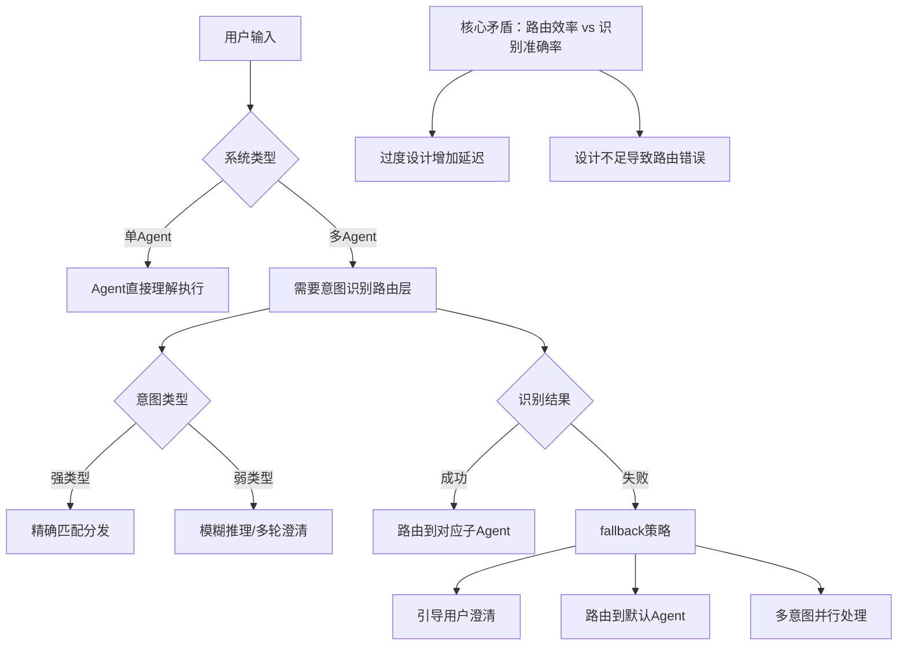

# 面试官：HR助手有四个Agent，用户说“帮我看看”怎么办？——意图识别怎么回答到点上


## 1. 引言

在 Agent 系统开发的面试中，**意图识别**是构建多 Agent 系统的核心考察点。当面试官问起"做一个 HR 智能助手，支持岗位发布、简历筛选、面试安排、薪资查询四个子 Agent，用户说'帮我看看'，怎么知道他想要什么？"时，意图识别就是必考内容。


本文从面试官视角，系统性地解析意图识别的适用场景、核心矛盾、解决方案，以及如何在面试中展现系统性思维。

## 2. 面试高频问题

### 2.1 典型面试问题

在 Agent 开发岗位的面试中，面试官通常会通过以下方式考察这个问题：

**初级问题**：
- "什么是意图识别？什么时候需要意图识别？"
- "单 Agent 和多 Agent 系统对意图识别的需求有什么不同？"
- "如果用户输入'帮我看看'，你有几种方式判断他的意图？"

**进阶问题**：
- "如何设计一个意图识别路由层，把用户输入分发到 4 个不同的 HR 子 Agent？"
- "强类型意图和弱类型意图的处理方式有什么区别？"
- "用户说'发布岗位顺便筛一下简历'，怎么处理多意图场景？"
- "意图识别失败时的 fallback 策略有哪些？"

**深度问题**：
- "意图识别应该放在 Agent 系统的哪个环节？是用户输入后直接路由，还是让 Agent 先理解再路由？"
- "如何平衡意图识别的准确率和系统延迟？"
- "如何设计一个可扩展的意图识别框架，支持动态增加新的业务 Agent？"
- "上下文感知的意图识别和多轮对话怎么结合？"

### 2.2 面试官的考察点

| 考察维度 | 面试官想看到的 |
|----------|----------------|
| 概念理解 | 能否说清单 Agent 和多 Agent 对意图识别的不同需求 |
| 方案设计 | 能否设计分层、可扩展的意图路由架构 |
| 边界处理 | 能否考虑到强/弱意图、多意图、识别失败等边界情况 |
| 权衡思维 | 能否认识到准确率、延迟、扩展性之间的 Trade-off |
| 工程实践 | 能否给出可落地的代码示例和架构设计 |

## 3. 问题本质

### 3.1 核心矛盾



多 Agent 意图路由流程，核心点在后台有多个Agent时，需要找到一个合适的Agent为用户服务，那么怎么服务呢？

一个通用的实现流程如下：

1. 第一步：接收用户输入指令，进入系统类型分支判断。
2. 第二步：判断系统架构模式
   - 若为**单Agent**架构：由单个Agent直接理解需求并执行任务；
   - 若为**多Agent**架构：必须依赖**意图识别路由层**完成分发调度。
3. 第三步：多Agent架构下，并行开展两类逻辑判断
   - 判断一：识别用户意图类型
     - 强类型意图：采用精确匹配规则，完成定向分发；
     - 弱类型意图：通过模糊推理、多轮对话澄清，收敛模糊需求。
   - 判断二：校验意图识别结果
     - 识别成功：精准路由分发至对应子Agent执行；
     - 识别失败：触发系统Fallback兜底策略。
4. 第四步：执行兜底补偿策略，包含三种处理方案
   - 引导用户二次澄清需求；
   - 自动路由至默认Agent统一处理；
   - 开启多意图并行解析与协同处理。
5. 第五步：提炼架构设计核心矛盾
   整套多Agent路由体系，长期面临**路由执行效率**与**意图识别准确率**的博弈平衡：
   - 路由规则过度设计，会增加链路复杂度，引发响应延迟；
   - 路由能力设计不足，易造成意图错分、路由异常，影响业务稳定性。


**核心矛盾**：多 Agent 系统的优势是职责分离，但引入意图识别层会增加系统复杂度和延迟。完全不设路由层，多 Agent 无法协同；路由层设计过度，又会损失用户体验。

### 3.2 问题量化分析

| 维度 | 挑战描述 |
|------|----------|
| 时机选择 | 意图识别在用户输入后立刻执行，还是让 Agent 初步理解后再执行？ |
| 意图强度 | 强类型意图（明确指令）和弱类型意图（模糊表述）的处理差异 |
| 多意图处理 | 用户同时提出多个需求时的分发策略 |
| 失败处理 | 识别失败时的 fallback 机制设计 |
| 扩展性 | 新增业务 Agent 时，意图识别层需要多少改动？ |

**面试话术**：
> "意图识别的本质是'用户输入'到'Agent 执行'的映射问题。单 Agent 系统不需要，因为映射是 1:1；多 Agent 系统必须设计路由层，因为映射是 1:N。我的设计思路是分层：先快速匹配强意图，再模糊处理弱意图，最后兜底处理失败场景。"


### 3.3 定性描述

严格来说，意图识别只是路由系统的一部分，本文讨论的是Intent-driven Routing System（基于意图的路由系统）。

## 4. 方案对比


### 4.1 方案一：规则匹配（最简单）

基于关键词或正则表达式的硬编码规则，适合意图明确、变更少的场景。

```python
from enum import Enum
from typing import Optional, Dict, List

class IntentType(Enum):
    JOB_POSTING = "job_posting"
    RESUME_SCREENING = "resume_screening"
    INTERVIEW_SCHEDULING = "interview_scheduling"
    SALARY_QUERY = "salary_query"
    UNKNOWN = "unknown"

class RuleBasedIntentRecognizer:
    """基于规则的意图识别器"""
    
    def __init__(self):
        # 关键词映射规则
        self.rules = {
            IntentType.JOB_POSTING: ["发布岗位", "招人", "招聘", "发布职位"],
            IntentType.RESUME_SCREENING: ["筛简历", "看简历", "筛选候选人"],
            IntentType.INTERVIEW_SCHEDULING: ["面试安排", "约面试", "安排面试"],
            IntentType.SALARY_QUERY: ["薪资", "薪水", "工资", "查工资"],
        }
        
        # 子Agent映射
        self.agent_mapping = {
            IntentType.JOB_POSTING: "JobPostingAgent",
            IntentType.RESUME_SCREENING: "ResumeScreeningAgent",
            IntentType.INTERVIEW_SCHEDULING: "InterviewSchedulingAgent",
            IntentType.SALARY_QUERY: "SalaryQueryAgent",
        }
    
    async def recognize(self, user_input: str) -> List[IntentType]:
        """
        识别用户意图
        
        Args:
            user_input: 用户输入文本
            
        Returns:
            识别到的意图列表（支持多意图）
        """
        matched_intents = []
        
        for intent_type, keywords in self.rules.items():
            for keyword in keywords:
                if keyword in user_input:
                    matched_intents.append(intent_type)
                    break  # 每个意图类型只匹配一次
        
        return matched_intents if matched_intents else [IntentType.UNKNOWN]
    
    async def route(self, user_input: str) -> Dict[str, List[str]]:
        """
        路由用户请求到对应Agent
        
        Args:
            user_input: 用户输入
            
        Returns:
            路由结果：{agent_name: [intents]}
        """
        intents = await self.recognize(user_input)
        routing = {}
        
        for intent in intents:
            if intent == IntentType.UNKNOWN:
                routing["DefaultAgent"] = ["unknown"]
            else:
                agent = self.agent_mapping[intent]
                if agent not in routing:
                    routing[agent] = []
                routing[agent].append(intent.value)
        
        return routing

# 使用示例
# recognizer = RuleBasedIntentRecognizer()
# result = await recognizer.route("帮我发布岗位，顺便筛一下简历")
# print(result)  # {'JobPostingAgent': ['job_posting'], 'ResumeScreeningAgent': ['resume_screening']}
```

**流程说明**：
1. 用户输入文本
2. 遍历关键词规则，匹配对应意图
3. 根据意图映射找到目标 Agent
4. 返回路由结果

**适用场景**：意图固定、变更少、团队小的项目，快速原型验证。

**面试话术**：
> "规则匹配是最简单的实现，适合启动阶段。优点是延迟极低、实现简单；缺点是维护成本高，新增意图需要改代码，无法处理模糊表述。"

### 4.2 方案二：机器学习分类器（传统方案）

使用预训练的文本分类模型，适合有标注数据、意图较多的场景。

```python
from sklearn.feature_extraction.text import TfidfVectorizer
from sklearn.linear_model import LogisticRegression
import numpy as np

class MLIntentRecognizer:
    """基于机器学习的意图识别器"""
    
    def __init__(self):
        self.vectorizer = TfidfVectorizer()
        self.classifier = LogisticRegression()
        self.intent_labels = [e.value for e in IntentType if e != IntentType.UNKNOWN]
        self.agent_mapping = {
            IntentType.JOB_POSTING: "JobPostingAgent",
            IntentType.RESUME_SCREENING: "ResumeScreeningAgent",
            IntentType.INTERVIEW_SCHEDULING: "InterviewSchedulingAgent",
            IntentType.SALARY_QUERY: "SalaryQueryAgent",
        }
        self.is_trained = False
    
    def train(self, training_data: List[Dict[str, str]]):
        """
        训练分类器
        
        Args:
            training_data: [{"text": "用户文本", "intent": "job_posting"}, ...]
        """
        texts = [item["text"] for item in training_data]
        labels = [item["intent"] for item in training_data]
        
        # 向量化
        X = self.vectorizer.fit_transform(texts)
        
        # 训练
        self.classifier.fit(X, labels)
        self.is_trained = True
    
    async def recognize(self, user_input: str, threshold: float = 0.6) -> List[IntentType]:
        """
        识别意图（带置信度阈值）
        
        Args:
            user_input: 用户输入
            threshold: 置信度阈值
            
        Returns:
            意图列表
        """
        if not self.is_trained:
            raise ValueError("分类器未训练，请先调用 train()")
        
        # 向量化输入
        X = self.vectorizer.transform([user_input])
        
        # 获取预测概率
        probabilities = self.classifier.predict_proba(X)[0]
        intent_classes = self.classifier.classes_
        
        matched_intents = []
        for intent_str, prob in zip(intent_classes, probabilities):
            if prob >= threshold:
                matched_intents.append(IntentType(intent_str))
        
        return matched_intents if matched_intents else [IntentType.UNKNOWN]
    
    async def route(self, user_input: str) -> Dict[str, List[str]]:
        """路由到对应Agent"""
        intents = await self.recognize(user_input)
        routing = {}
        
        for intent in intents:
            if intent == IntentType.UNKNOWN:
                routing["DefaultAgent"] = ["unknown"]
            else:
                agent = self.agent_mapping[intent]
                if agent not in routing:
                    routing[agent] = []
                routing[agent].append(intent.value)
        
        return routing
```

**流程说明**：
1. 收集标注数据（用户文本 + 对应意图）
2. 训练 TF-IDF + 逻辑回归分类器
3. 用户输入向量化后预测
4. 根据置信度阈值过滤结果
5. 路由到对应 Agent

**适用场景**：有历史数据、意图中等规模（10-50 类）、需要一定泛化能力的场景。

**面试话术**：
> "ML 方案比规则更灵活，能处理同义词和简单变体。优点是支持增量训练，新增意图只需补充数据；缺点是需要标注成本，无法处理完全未见过的表述。"

**局限性分析**：
现实中 ML 方案经常被直接淘汰，原因有三：
1. **标注成本高**：需要大量人工标注数据，且意图变更时需要重新标注
2. **泛化能力有限**：TF-IDF 无法理解语义相似度，只能匹配字面特征
3. **冷启动问题**：新意图上线初期没有足够数据训练

**更好的替代**：借助大模型 Embedding 能力，采用 `Embedding + 向量检索` 方案（见 4.3 节），实现更简单、效果更优。

### 4.3 方案三：Embedding + 向量检索（推荐方案）


利用大模型 Embedding 能力，将意图描述转化为向量，通过向量相似度检索实现意图识别。适合快速上线、少样本场景。

```python
import numpy as np
from typing import List, Dict, Tuple

class EmbeddingVectorRecognizer:
    """基于Embedding + 向量检索的意图识别器"""
    
    def __init__(self, embedding_client):
        self.embedding_client = embedding_client
        
        # 意图定义（含描述文本）
        self.intent_definitions = [
            {
                "intent": "job_posting",
                "description": "发布岗位、招聘、招人、发布职位、创建招聘信息",
                "agent": "JobPostingAgent",
                "examples": ["发布岗位", "招一个前端", "发布新的职位"],
            },
            {
                "intent": "resume_screening",
                "description": "筛选简历、查看简历、简历筛选、候选人筛选",
                "agent": "ResumeScreeningAgent",
                "examples": ["筛一下简历", "看看有哪些候选人", "筛选符合条件的简历"],
            },
            {
                "intent": "interview_scheduling",
                "description": "安排面试、约面试、面试时间、面试邀请",
                "agent": "InterviewSchedulingAgent",
                "examples": ["安排明天的面试", "约一下候选人", "发送面试邀请"],
            },
            {
                "intent": "salary_query",
                "description": "查询薪资、工资、薪水、薪资结构、查工资",
                "agent": "SalaryQueryAgent",
                "examples": ["查一下我的工资", "薪资结构是什么", "这个岗位薪水多少"],
            },
        ]
        
        # 预计算的意图向量（初始化时计算）
        self.intent_vectors = []
        self._precompute_vectors()
    
    def _precompute_vectors(self):
        """预计算所有意图描述向量的平均值"""
        for intent_def in self.intent_definitions:
            # 合并描述和示例
            texts = [intent_def["description"]] + intent_def["examples"]
            vectors = [self.embedding_client.embed(text) for text in texts]
            # 平均池化
            avg_vector = np.mean(vectors, axis=0)
            self.intent_vectors.append({
                "intent": intent_def["intent"],
                "agent": intent_def["agent"],
                "vector": avg_vector,
            })
    
    async def recognize(self, user_input: str, threshold: float = 0.7) -> List[Tuple[str, float]]:
        """
        识别意图（返回意图+置信度）
        
        Args:
            user_input: 用户输入
            threshold: 相似度阈值
            
        Returns:
            [(意图, 置信度), ...]
        """
        # 用户输入向量化
        input_vector = self.embedding_client.embed(user_input)
        
        matched_intents = []
        for intent_data in self.intent_vectors:
            # 计算余弦相似度
            similarity = self._cosine_similarity(input_vector, intent_data["vector"])
            
            if similarity >= threshold:
                matched_intents.append((intent_data["intent"], similarity))
        
        # 按相似度降序排序
        matched_intents.sort(key=lambda x: x[1], reverse=True)
        
        return matched_intents if matched_intents else [("unknown", 0.0)]
    
    def _cosine_similarity(self, v1: np.ndarray, v2: np.ndarray) -> float:
        """计算余弦相似度"""
        dot_product = np.dot(v1, v2)
        norm1 = np.linalg.norm(v1)
        norm2 = np.linalg.norm(v2)
        return dot_product / (norm1 * norm2)
    
    async def route(self, user_input: str) -> Dict[str, List[str]]:
        """路由到对应Agent"""
        intents = await self.recognize(user_input)
        
        routing = {}
        for intent, confidence in intents:
            if intent == "unknown":
                routing["DefaultAgent"] = ["unknown"]
            else:
                # 找到对应的 agent
                agent = next(
                    (item["agent"] for item in self.intent_definitions if item["intent"] == intent),
                    "DefaultAgent"
                )
                if agent not in routing:
                    routing[agent] = []
                routing[agent].append(intent)
        
        return routing
```

**流程说明**：
1. 初始化时，将所有意图的描述文本和示例转化为 Embedding 向量
2. 用户输入时，将其转化为 Embedding 向量
3. 计算用户输入向量与所有意图向量的余弦相似度
4. 返回相似度超过阈值的意图（支持多意图）
5. 路由到对应 Agent

**优势分析**：
| 维度 | ML 分类器 | Embedding + 向量检索 |
|------|-----------|-------------------|
| 训练数据 | 需要大量标注 | 只需少量示例（甚至 0-shot） |
| 冷启动 | 差（需要数据） | 好（直接使用描述） |
| 语义理解 | 字面匹配 | 语义相似度 |
| 扩展性 | 需重新训练 | 配置化，热更新 |
| 实现复杂度 | 中 | 低 |

**适用场景**：快速上线、少样本/零样本场景、需要频繁变更意图定义的系统。**推荐用于生产环境**。

**面试话术**：
> "Embedding + 向量检索方案比传统 ML 分类器更实用：用意图描述就能工作，无需标注数据；新增意图只需加配置，支持热更新；语义相似度比字面匹配更智能。这是当前业界主流的意图识别方案之一。"

### 4.4 方案四：LLM 提示工程（高精度方案）


利用大模型的语义理解能力，适合复杂语义、少样本场景。**但需注意：LLM 输出结构不稳定，需要架构级约束和重试机制。**

```python
import json
import asyncio
from typing import List, Dict, Optional, Tuple

class LLMIntentRecognizer:
    """基于LLM的意图识别器（含输出约束和重试）"""
    
    def __init__(self, llm_client):
        self.llm = llm_client
        self.intent_definitions = {
            "job_posting": "岗位发布：用户想发布新职位、编辑职位信息",
            "resume_screening": "简历筛选：用户想筛选简历、查看候选人",
            "interview_scheduling": "面试安排：用户想安排面试时间、发送面试邀请",
            "salary_query": "薪资查询：用户想查询工资、薪资结构",
        }
        
        self.agent_mapping = {
            "job_posting": "JobPostingAgent",
            "resume_screening": "ResumeScreeningAgent",
            "interview_scheduling": "InterviewSchedulingAgent",
            "salary_query": "SalaryQueryAgent",
        }
        
        # 架构级配置
        self.max_retries = 3  # 最大重试次数
        self.retry_delay = 1.0  # 重试延迟（秒）
        self.confidence_threshold = 0.5  # 置信度阈值
    
    async def recognize(self, user_input: str, context: Optional[Dict] = None) -> Tuple[List[str], float]:
        """
        使用LLM识别意图（含重试机制）
        
        Args:
            user_input: 用户输入
            context: 多轮对话上下文（可选）
            
        Returns:
            (意图列表, 置信度)
        """
        for attempt in range(self.max_retries):
            try:
                # 构建提示词
                prompt = self._build_prompt(user_input, context)
                
                # 调用LLM（使用 JSON mode 约束输出格式）
                response = await self.llm.generate(
                    prompt,
                    response_format={"type": "json_object"}  # 架构约束：强制JSON输出
                )
                
                # 解析LLM输出
                intents, confidence = self._parse_response(response)
                
                # 校验结果
                if self._validate_result(intents, confidence):
                    return intents, confidence
                else:
                    print(f"Attempt {attempt + 1}: 输出校验失败，重试...")
                    
            except json.JSONDecodeError as e:
                print(f"Attempt {attempt + 1}: JSON解析失败 - {e}，重试...")
            except Exception as e:
                print(f"Attempt {attempt + 1}: 未知错误 - {e}，重试...")
            
            # 重试前等待
            if attempt < self.max_retries - 1:
                await asyncio.sleep(self.retry_delay)
        
        # 所有重试失败，返回 unknown
        print("所有重试失败，返回 unknown")
        return ["unknown"], 0.0
    
    def _build_prompt(self, user_input: str, context: Optional[Dict]) -> str:
        """构建LLM提示词（含输出格式强约束）"""
        context_str = f"\n对话上下文：{context}" if context else ""
        
        return f"""你是一个HR智能助手的意图识别模块。请根据用户输入，判断属于以下哪个意图类别（可多选）：

{self._format_intent_definitions()}

用户输入：{user_input}{context_str}

重要要求：
1. 你必须严格按照以下JSON格式输出，不要有任何其他文字
2. 如果用户输入模糊无法判断，intents 设为 ["unknown"]，confidence 设为 0.1
3. confidence 表示你对该判断的置信度（0.0-1.0）

输出格式（必须严格遵守）：
{{
    "intents": ["意图1", "意图2"],
    "confidence": 0.9,
    "reason": "匹配理由"
}}"""
    
    def _format_intent_definitions(self) -> str:
        """格式化意图定义"""
        lines = []
        for intent, desc in self.intent_definitions.items():
            lines.append(f"- {intent}：{desc}")
        return "\n".join(lines)
    
    def _parse_response(self, response: str) -> Tuple[List[str], float]:
        """解析LLM返回的JSON（含异常处理）"""
        try:
            result = json.loads(response)
            intents = result.get("intents", [])
            confidence = result.get("confidence", 0.0)
            
            # 校验字段类型
            if not isinstance(intents, list):
                raise ValueError("intents 字段必须是数组")
            if not isinstance(confidence, (int, float)):
                raise ValueError("confidence 字段必须是数字")
            
            return intents, confidence
        except (json.JSONDecodeError, ValueError) as e:
            print(f"解析失败: {e}")
            raise
    
    def _validate_result(self, intents: List[str], confidence: float) -> bool:
        """校验识别结果是否合理"""
        # 检查置信度
        if confidence < self.confidence_threshold:
            return False
        
        # 检查意图合法性
        valid_intents = list(self.intent_definitions.keys()) + ["unknown"]
        for intent in intents:
            if intent not in valid_intents:
                return False
        
        return True
    
    async def route(self, user_input: str, context: Optional[Dict] = None) -> Dict[str, any]:
        """路由到对应Agent（含元数据）"""
        intents, confidence = await self.recognize(user_input, context)
        
        routing = {}
        for intent in intents:
            if intent == "unknown":
                routing["DefaultAgent"] = ["unknown"]
            else:
                agent = self.agent_mapping.get(intent)
                if agent:
                    if agent not in routing:
                        routing[agent] = []
                    routing[agent].append(intent)
        
        return {
            "routing": routing,
            "intents": intents,
            "confidence": confidence,
        }
```

**架构风险点：LLM 输出不稳定问题**

| 风险类型 | 表现 | 架构级解决方案 |
|----------|------|----------------|
| 输出格式错误 | 返回非 JSON、缺少字段 | 1) 使用 JSON mode（如 OpenAI response_format）；2) 输出后校验 + 重试机制 |
| 幻觉意图 | 返回不存在的意图 | 白名单校验：只接受预定义的意图列表 |
| 置信度虚高 | confidence=0.9 但实际错了 | 多级校验：格式校验 + 意图白名单 + 业务逻辑校验 |
| 超时/限流 | API 调用失败 | 重试机制（指数退避）+ 降级策略（切换到 Embedding 方案） |

**面试话术**：
> "LLM 方案的优势是语义理解能力强，能处理模糊表述和上下文关联。但必须注意：LLM 输出结构不稳定是生产环境的大忌。我的设计包含三层防护：1) 架构约束（JSON mode 强制格式）；2) 输出校验（白名单 + 类型检查）；3) 重试机制（最多 3 次 + 降级）。这样才能在生产环境放心使用。"

**适用场景**：语义复杂、需要理解上下文、少样本或零样本场景，对准确率要求高的生产环境。配合 Embedding 方案作为降级，可大幅提升系统鲁棒性。


### 4.5 方案五：混合分层架构（生产级方案）

结合规则、Embedding、LLM 的优势，分层处理不同复杂度的意图。

```python
from typing import List, Dict, Optional, Tuple

class HybridIntentRouter:
    """混合分层意图路由架构（规则 + Embedding + LLM）"""
    
    def __init__(self, rule_recognizer, embedding_recognizer, llm_recognizer):
        self.rule_recognizer = rule_recognizer
        self.embedding_recognizer = embedding_recognizer
        self.llm_recognizer = llm_recognizer
        
        # 分层阈值
        self.rule_confidence = 0.9        # 规则匹配置信度
        self.embedding_threshold = 0.75   # Embedding相似度阈值
        self.llm_confidence = 0.5         # LLM判断置信度
        
        # 策略优先级（决策清晰化）
        self.strategy_priority = [
            ("rule", self._try_rule),
            ("embedding", self._try_embedding),
            ("llm", self._try_llm),
            ("fallback", self._try_fallback),
        ]
    
    async def recognize(self, user_input: str, context: Optional[Dict] = None) -> Tuple[List[str], str, float]:
        """
        分层意图识别（含置信度）
        
        Returns:
            (意图列表, 使用的识别层, 置信度)
        """
        # 按优先级依次尝试各层
        for layer_name, handler in self.strategy_priority:
            intents, confidence = await handler(user_input, context)
            
            if intents and intents[0] != "unknown":
                return intents, layer_name, confidence
        
        # 全部失败，返回未知
        return ["unknown"], "fallback", 0.0
    
    async def _try_rule(self, user_input: str, context: Optional[Dict]) -> Tuple[List[str], float]:
        """第一层：规则快速匹配（强类型意图）"""
        rule_intents = await self.rule_recognizer.recognize(user_input)
        if rule_intents and rule_intents[0] != IntentType.UNKNOWN:
            return [i.value for i in rule_intents], self.rule_confidence
        return ["unknown"], 0.0
    
    async def _try_embedding(self, user_input: str, context: Optional[Dict]) -> Tuple[List[str], float]:
        """第二层：Embedding向量检索（中频意图）"""
        embedding_results = await self.embedding_recognizer.recognize(user_input)
        if embedding_results and embedding_results[0][0] != "unknown":
            intents = [item[0] for item in embedding_results]
            confidence = embedding_results[0][1]  # 取最高置信度
            return intents, confidence
        return ["unknown"], 0.0
    
    async def _try_llm(self, user_input: str, context: Optional[Dict]) -> Tuple[List[str], float]:
        """第三层：LLM理解（弱类型意图/上下文相关）"""
        intents, confidence = await self.llm_recognizer.recognize(user_input, context)
        if intents and intents[0] != "unknown":
            return intents, confidence
        return ["unknown"], 0.0
    
    async def _try_fallback(self, user_input: str, context: Optional[Dict]) -> Tuple[List[str], float]:
        """第四层：Fallback策略（按优先级执行）"""
        fallback_priority = [
            ("context_infer", self._fallback_context_infer),
            ("popular_intent", self._fallback_popular_intent),
            ("default_agent", self._fallback_default_agent),
            ("clarify", self._fallback_clarify),
        ]
        
        for strategy_name, handler in fallback_priority:
            result = await handler(user_input, context)
            if result:
                return result
        
        return ["unknown"], 0.0
    
    async def _fallback_context_infer(self, user_input: str, context: Optional[Dict]) -> Optional[Tuple[List[str], float]]:
        """Fallback优先级1：上下文推断"""
        if context and "last_intent" in context:
            return [context["last_intent"]], 0.4
        return None
    
    async def _fallback_popular_intent(self, user_input: str, context: Optional[Dict]) -> Optional[Tuple[List[str], float]]:
        """Fallback优先级2：热门意图猜测"""
        # 实际项目中从统计日志获取
        popular_intent = "job_posting"  # 示例
        return [popular_intent], 0.3
    
    async def _fallback_default_agent(self, user_input: str, context: Optional[Dict]) -> Optional[Tuple[List[str], float]]:
        """Fallback优先级3：路由到默认Agent"""
        return ["unknown"], 0.2
    
    async def _fallback_clarify(self, user_input: str, context: Optional[Dict]) -> Tuple[List[str], float]:
        """Fallback优先级4：引导用户澄清（最后手段）"""
        return ["unknown"], 0.1
    
    async def route(self, user_input: str, context: Optional[Dict] = None) -> Dict[str, any]:
        """
        完整路由流程（含多意图处理和结果合成）
        
        Returns:
            路由结果 + 元数据
        """
        intents, layer, confidence = await self.recognize(user_input, context)
        
        # 处理多意图
        if len(intents) > 1:
            routing_result = await self._handle_multi_intent(intents, layer)
            # 多Agent结果需要合成最终回复
            routing_result["needs_synthesis"] = True
            return routing_result
        
        # 处理单意图
        if intents[0] == "unknown":
            return await self._handle_fallback(user_input, context)
        
        # 正常路由
        agent_mapping = {
            "job_posting": "JobPostingAgent",
            "resume_screening": "ResumeScreeningAgent",
            "interview_scheduling": "InterviewSchedulingAgent",
            "salary_query": "SalaryQueryAgent",
        }
        
        agent = agent_mapping.get(intents[0], "DefaultAgent")
        return {
            "routing": {agent: intents},
            "layer_used": layer,
            "confidence": confidence,
            "intents": intents,
            "needs_clarification": False,
            "needs_synthesis": False,
        }
    
    async def _handle_multi_intent(self, intents: List[str], layer: str) -> Dict[str, any]:
        """处理多意图场景（含结果合成逻辑）"""
        agent_mapping = {
            "job_posting": "JobPostingAgent",
            "resume_screening": "ResumeScreeningAgent",
            "interview_scheduling": "InterviewSchedulingAgent",
            "salary_query": "SalaryQueryAgent",
        }
        
        routing = {}
        for intent in intents:
            agent = agent_mapping.get(intent)
            if agent:
                if agent not in routing:
                    routing[agent] = []
                routing[agent].append(intent)
        
        return {
            "routing": routing,
            "layer_used": layer,
            "intents": intents,
            "needs_clarification": False,
            "is_multi_intent": True,
        }
    
    async def synthesize_results(self, agent_results: Dict[str, any]) -> str:
        """
        合成多个Agent的返回结果（关键功能！）
        
        Args:
            agent_results: {agent_name: result_dict}
            
        Returns:
            合成后的最终回复文本
        """
        if not agent_results:
            return "抱歉，处理过程中出现错误。"
        
        # 如果只有一个Agent有结果
        if len(agent_results) == 1:
            agent_name, result = list(agent_results.items())[0]
            return result.get("response", "处理完成。")
        
        # 多个Agent结果需要合成
        responses = []
        for agent_name, result in agent_results.items():
            agent_label = self._get_agent_label(agent_name)
            response_text = result.get("response", "")
            if response_text:
                responses.append(f"【{agent_label}】\n{response_text}")
        
        # 使用分隔符组合
        final_response = "\n\n---\n\n".join(responses)
        
        # 添加总结（可选：如果结果过长，可用LLM生成摘要）
        if len(final_response) > 500:
            summary = await self._generate_summary(responses)
            return f"{summary}\n\n详细结果：\n{final_response}"
        
        return final_response
    
    def _get_agent_label(self, agent_name: str) -> str:
        """获取Agent的显示名称"""
        labels = {
            "JobPostingAgent": "岗位发布",
            "ResumeScreeningAgent": "简历筛选",
            "InterviewSchedulingAgent": "面试安排",
            "SalaryQueryAgent": "薪资查询",
        }
        return labels.get(agent_name, agent_name)
    
    async def _generate_summary(self, responses: List[str]) -> str:
        """生成多Agent结果的摘要（可选：调用LLM）"""
        # 简化实现：统计各Agent返回的关键信息
        summary_parts = []
        for resp in responses:
            # 提取第一行作为摘要
            first_line = resp.split("\n")[0][:50]
            summary_parts.append(first_line)
        
        return "已为您完成以下操作：" + "；".join(summary_parts)
    
    async def _handle_fallback(self, user_input: str, context: Optional[Dict]) -> Dict[str, any]:
        """处理意图识别失败（含策略优先级）"""
        # 按优先级执行fallback策略
        for strategy_name, handler in [
            ("context_infer", self._fallback_context_infer),
            ("popular_intent", self._fallback_popular_intent),
            ("default_agent", self._fallback_default_agent),
            ("clarify", self._fallback_clarify),
        ]:
            result = await handler(user_input, context)
            if result:
                intents, confidence = result
                if intents[0] != "unknown":
                    agent_mapping = {
                        "job_posting": "JobPostingAgent",
                        "resume_screening": "ResumeScreeningAgent",
                        "interview_scheduling": "InterviewSchedulingAgent",
                        "salary_query": "SalaryQueryAgent",
                    }
                    agent = agent_mapping.get(intents[0], "DefaultAgent")
                    return {
                        "routing": {agent: intents},
                        "layer_used": f"fallback_{strategy_name}",
                        "confidence": confidence,
                        "intents": intents,
                        "needs_clarification": False,
                    }
        
        # 最后手段：引导澄清
        clarification_prompt = "抱歉，我不太确定您的需求，请问您想：\n1. 发布岗位\n2. 筛选简历\n3. 安排面试\n4. 查询薪资"
        return {
            "routing": {"DefaultAgent": ["unknown"]},
            "layer_used": "fallback_clarify",
            "confidence": 0.1,
            "intents": ["unknown"],
            "needs_clarification": True,
            "clarification_prompt": clarification_prompt,
        }
```

**分层逻辑（含策略优先级）**：
1. **规则层**：处理高频、明确的强类型意图（延迟 <10ms，置信度 0.9）
2. **Embedding层**：处理中频、语义清晰的中等意图（延迟 ~50ms，置信度 0.75）
3. **LLM层**：处理低频、模糊的弱类型意图（延迟 ~500ms，置信度 0.5）
4. **Fallback层**：按优先级执行（上下文推断 → 热门猜测 → 默认Agent → 引导澄清）

**Fallback策略优先级设计（决策清晰化）**：

| 优先级 | 策略 | 置信度 | 适用场景 | 决策依据 |
|--------|------|---------|----------|----------|
| 1 | 上下文推断 | 0.4 | 多轮对话中，有历史意图 | 用户可能继续上次的话题 |
| 2 | 热门意图猜测 | 0.3 | 有明确用户行为统计数据 | 概率最高的意图（如40%的人查薪资） |
| 3 | 默认Agent路由 | 0.2 | 无上下文、无统计数据 | 兜底方案，转为通用助手处理 |
| 4 | 引导用户澄清 | 0.1 | 所有策略都失败 | 最后手段，确保用户需求不被忽略 |

**适用场景**：大型生产系统，对性能、准确率、扩展性都有要求的企业级应用。**推荐用于生产环境**。

### 4.6 方案对比总结

| 维度 | 规则匹配 | Embedding+向量检索 | LLM提示 | 混合分层 |
|------|---------|-------------------|---------|----------|
| 准确率 | 低（仅关键词） | 中高（语义相似度） | 高（语义理解） | 最高（分层优化） |
| 延迟 | <10ms | ~50ms | ~500ms | 10ms-500ms（动态） |
| 实现复杂度 | 低 | 中 | 中 | 高 |
| 扩展性 | 差（改代码） | 好（配置化） | 好（改prompt） | 最好（模块化） |
| 冷启动 | 好 | 好（0-shot可用） | 好（0-shot） | 最好（分层覆盖） |
| 成本 | 低 | 中（Embedding API） | 高（LLM API） | 中（按需调用） |
| 适用场景 | 原型验证 | 快速上线/少样本 | 复杂语义场景 | 生产级系统 |

**面试话术**：
> "五种方案各有适用场景：规则匹配适合快速启动，Embedding+向量检索适合快速上线和少样本场景（推荐替代传统ML分类器），LLM适合复杂语义理解但需要架构约束输出稳定性，混合分层是生产环境的最优解——用规则处理高频强意图（<10ms），用Embedding处理中频意图（~50ms），用LLM处理低频弱意图（~500ms），最后按优先级兜底。这样既能保证性能，又能最大化准确率，还有完善的fallback策略。"

## 5. 深入问题解析

### 5.1 强类型 vs 弱类型意图处理

**核心问题**：用户说"发布岗位"（强类型，明确）和"帮我看看"（弱类型，模糊）的处理方式有什么不同？


```python
class IntentStrengthHandler:
    """强/弱意图处理器"""
    
    def __init__(self):
        self.strong_intent_patterns = {
            r"发布(岗位|职位)": "job_posting",
            r"筛选(简历|候选人)": "resume_screening",
            r"(安排|约)(面试)": "interview_scheduling",
            r"查询(薪资|工资)": "salary_query",
        }
        
        self.weak_intent_clarifiers = {
            "帮我看看": ["您想查看什么？1.岗位列表 2.简历库 3.面试安排 4.薪资条"],
            "帮我处理": ["请问您需要处理什么业务？"],
        }
    
    async def handle_strong_intent(self, intent: str, user_input: str) -> Dict:
        """处理强类型意图：直接路由"""
        agent_mapping = {
            "job_posting": "JobPostingAgent",
            "resume_screening": "ResumeScreeningAgent",
            "interview_scheduling": "InterviewSchedulingAgent",
            "salary_query": "SalaryQueryAgent",
        }
        
        return {
            "action": "direct_route",
            "agent": agent_mapping[intent],
            "intent": intent,
            "needs_confirmation": False,
        }
    
    async def handle_weak_intent(self, user_input: str, context: Dict) -> Dict:
        """处理弱类型意图：多轮澄清或上下文推断"""
        # 尝试从上下文推断
        if context and "last_intent" in context:
            # 上下文中有最近意图，优先沿用
            return {
                "action": "context_infer",
                "agent": context["last_agent"],
                "intent": context["last_intent"],
                "needs_confirmation": True,  # 需要用户确认
                "confirm_prompt": f"您是想继续处理{context['last_intent']}相关的事务吗？"
            }
        
        # 无上下文，引导澄清
        clarifier = self.weak_intent_clarifiers.get(user_input, "请问您需要什么帮助？")
        return {
            "action": "clarify",
            "clarification_prompt": clarifier,
            "needs_clarification": True,
        }
```

**处理策略**：

| 意图类型 | 特征 | 处理方式 | 用户体验 |
|----------|------|----------|----------|
| 强类型 | 关键词明确、意图单一 | 直接路由，无需确认 | 最佳（无感知） |
| 弱类型（有上下文） | 模糊表述、有历史对话 | 上下文推断 + 确认 | 较好（一次确认） |
| 弱类型（无上下文） | 模糊表述、无历史 | 引导澄清，列出选项 | 一般（需要选择） |

**面试话术**：
> "强类型意图的核心是'快速通道'——关键词匹配后直接路由，最大化用户体验；弱类型意图的核心是'上下文利用'——先看历史对话有没有线索，没有再引导用户澄清，避免无意义的追问。"

### 5.2 多意图场景处理与结果合成

**核心问题**：用户说"帮我发布岗位，顺便筛一下简历"，怎么同时路由到两个子 Agent？多个 Agent 返回结果后，怎么合成最终回复？


```python
class MultiIntentHandler:
    """多意图处理器（含结果合成）"""
    
    def __init__(self):
        self.agent_mapping = {
            "job_posting": "JobPostingAgent",
            "resume_screening": "ResumeScreeningAgent",
            "interview_scheduling": "InterviewSchedulingAgent",
            "salary_query": "SalaryQueryAgent",
        }
        
        # 意图优先级（可配置）
        self.intent_priority = {
            "job_posting": 1,
            "resume_screening": 2,
            "interview_scheduling": 3,
            "salary_query": 4,
        }
    
    async def handle_multi_intent(self, intents: List[str], user_input: str) -> Dict:
        """
        处理多意图
        
        Args:
            intents: 识别到的意图列表
            user_input: 原始用户输入
            
        Returns:
            处理结果（含执行模式和合成需求）
        """
        if len(intents) <= 1:
            return {"action": "single_intent", "intents": intents}
        
        # 按优先级排序
        sorted_intents = sorted(intents, key=lambda x: self.intent_priority.get(x, 99))
        
        # 构建路由（每个意图对应一个Agent）
        routing = {}
        for intent in sorted_intents:
            agent = self.agent_mapping.get(intent)
            if agent:
                if agent not in routing:
                    routing[agent] = []
                routing[agent].append(intent)
        
        # 判断是并行执行还是顺序执行
        if self._can_parallel(intents):
            return {
                "action": "parallel_route",
                "routing": routing,
                "execution_mode": "parallel",
                "needs_summary": True,  # 需要汇总结果
                "synthesis_strategy": "merge",  # 合并策略
            }
        else:
            return {
                "action": "sequential_route",
                "routing": routing,
                "execution_mode": "sequential",
                "order": sorted_intents,
                "needs_summary": True,
                "synthesis_strategy": "concat",  # 拼接策略
            }
    
    def _can_parallel(self, intents: List[str]) -> bool:
        """判断多个意图是否可以并行执行"""
        # 无依赖关系的意图可以并行
        # 例如：发布岗位和筛选简历无依赖，可以并行
        # 例如：发布岗位后安排面试有依赖，需要顺序
        dependent_pairs = [
            ("job_posting", "interview_scheduling"),  # 先有岗位才能安排面试
        ]
        
        for intent1, intent2 in dependent_pairs:
            if intent1 in intents and intent2 in intents:
                return False
        return True


class ResultSynthesizer:
    """多Agent结果合成器"""
    
    def __init__(self, llm_client=None):
        self.llm = llm_client
        
        # Agent显示名称映射
        self.agent_labels = {
            "JobPostingAgent": "岗位发布",
            "ResumeScreeningAgent": "简历筛选",
            "InterviewSchedulingAgent": "面试安排",
            "SalaryQueryAgent": "薪资查询",
        }
    
    async def synthesize(self, agent_results: Dict[str, Dict], strategy: str = "auto") -> str:
        """
        合成多个Agent的返回结果
        
        Args:
            agent_results: {agent_name: {"response": str, "status": str}}
            strategy: 合成策略（merge/concat/summary/auto）
            
        Returns:
            合成后的最终回复文本
        """
        if not agent_results:
            return "抱歉，处理过程中出现错误。"
        
        # 如果只有一个Agent有结果
        if len(agent_results) == 1:
            agent_name, result = list(agent_results.items())[0]
            return result.get("response", "处理完成。")
        
        # 多个Agent结果需要合成
        strategy = strategy if strategy != "auto" else self._detect_strategy(agent_results)
        
        if strategy == "merge":
            return await self._merge_results(agent_results)
        elif strategy == "concat":
            return self._concat_results(agent_results)
        elif strategy == "summary":
            return await self._summary_results(agent_results)
        else:
            return self._concat_results(agent_results)
    
    def _detect_strategy(self, agent_results: Dict[str, Dict]) -> str:
        """自动检测合成策略"""
        total_length = sum(
            len(r.get("response", "")) 
            for r in agent_results.values()
        )
        
        if total_length > 800:
            return "summary"  # 结果过长，生成摘要
        elif len(agent_results) >= 3:
            return "merge"  # 多个Agent，合并展示
        else:
            return "concat"  # 默认拼接
    
    async def _merge_results(self, agent_results: Dict[str, Dict]) -> str:
        """合并结果（带Agent标签）"""
        responses = []
        for agent_name, result in agent_results.items():
            agent_label = self.agent_labels.get(agent_name, agent_name)
            response_text = result.get("response", "")
            if response_text:
                responses.append(f"【{agent_label}】\n{response_text}")
        
        return "\n\n---\n\n".join(responses)
    
    def _concat_results(self, agent_results: Dict[str, Dict]) -> str:
        """简单拼接结果"""
        parts = []
        for agent_name, result in agent_results.items():
            response_text = result.get("response", "")
            if response_text:
                parts.append(response_text)
        
        return "\n\n".join(parts)
    
    async def _summary_results(self, agent_results: Dict[str, Dict]) -> str:
        """使用LLM生成摘要（可选）"""
        if not self.llm:
            return self._concat_results(agent_results)
        
        # 构建摘要提示词
        all_responses = "\n\n".join([
            f"{self.agent_labels.get(agent, agent)}: {r.get('response', '')}"
            for agent, r in agent_results.items()
        ])
        
        prompt = f"""请对以下多个Agent的返回结果生成一个简洁的摘要（100字以内）：

{all_responses}

摘要："""
        
        summary = await self.llm.generate(prompt)
        
        return f"{summary}\n\n详细结果：\n{self._concat_results(agent_results)}"
```

**处理策略**：

| 多意图场景 | 处理方式 | 结果合成策略 | 示例 |
|------------|----------|--------------|------|
| 无依赖关系 | 并行路由到多个Agent | merge（带标签合并） | "发布岗位+筛简历" → 两个Agent同时处理 → 按Agent标签合并结果 |
| 有依赖关系 | 按优先级顺序路由 | concat（简单拼接） | "发布岗位+安排面试" → 先发布，再安排 → 拼接两个结果 |
| 结果过长 | 任意 | summary（LLM摘要） | 3个以上Agent → 生成摘要+详细结果 |
| 意图冲突 | 提示用户冲突 | 不合成，返回冲突提示 | "删除岗位+发布岗位" → 冲突，需用户确认 |

**面试话术**：
> "多意图处理包含两个核心：1) 依赖分析——判断意图间有无先后依赖，决定并行/顺序执行；2) 结果合成——并行结果用merge带标签合并，顺序结果用concat拼接，过长结果用LLM生成摘要。考生如果只讲路由不讲结果合成，说明对'用户最终看到什么'这个问题思考不完整。"

### 5.3 Fallback 策略设计

**核心问题**：意图识别完全失败时（返回 unknown），有哪些 fallback 策略？


```python
class FallbackStrategyManager:
    """Fallback策略管理器"""
    
    def __init__(self):
        self.strategies = {
            "clarify": self._clarify_strategy,
            "default_agent": self._default_agent_strategy,
            "context_infer": self._context_infer_strategy,
            "popular_intent": self._popular_intent_strategy,
        }
        
        # 统计热门意图（实际项目中从日志获取）
        self.popular_intents = [
            ("job_posting", 0.4),
            ("resume_screening", 0.3),
            ("salary_query", 0.2),
            ("interview_scheduling", 0.1),
        ]
    
    async def execute_fallback(self, user_input: str, context: Dict, strategy: str = "clarify") -> Dict:
        """
        执行fallback策略
        
        Args:
            user_input: 用户输入
            context: 对话上下文
            strategy: 策略名称
            
        Returns:
            处理结果
        """
        handler = self.strategies.get(strategy, self._clarify_strategy)
        return await handler(user_input, context)
    
    async def _clarify_strategy(self, user_input: str, context: Dict) -> Dict:
        """策略1：引导用户澄清（最安全）"""
        return {
            "action": "clarify",
            "clarification_prompt": """抱歉，我不太确定您的需求，请问您想：
1. 发布岗位（输入：发布/招人）
2. 筛选简历（输入：筛简历/看简历）
3. 安排面试（输入：约面试/安排面试）
4. 查询薪资（输入：薪资/工资）""",
            "available_intents": ["job_posting", "resume_screening", "interview_scheduling", "salary_query"],
        }
    
    async def _default_agent_strategy(self, user_input: str, context: Dict) -> Dict:
        """策略2：路由到默认Agent（最快速）"""
        return {
            "action": "route_to_default",
            "agent": "DefaultAssistantAgent",
            "needs_confirmation": True,
            "confirm_prompt": "已为您转接智能助手，请描述您的具体需求。",
        }
    
    async def _context_infer_strategy(self, user_input: str, context: Dict) -> Dict:
        """策略3：根据上下文推断（利用历史）"""
        if not context or "last_intent" not in context:
            # 无上下文，降级到澄清策略
            return await self._clarify_strategy(user_input, context)
        
        return {
            "action": "context_infer",
            "agent": context["last_agent"],
            "intent": context["last_intent"],
            "needs_confirmation": True,
            "confirm_prompt": f"您是想继续处理{context['last_intent']}相关的事务吗？",
        }
    
    async def _popular_intent_strategy(self, user_input: str, context: Dict) -> Dict:
        """策略4：根据热门意图猜测（概率最高）"""
        top_intent, prob = self.popular_intents[0]
        agent_mapping = {
            "job_posting": "JobPostingAgent",
            "resume_screening": "ResumeScreeningAgent",
            "interview_scheduling": "InterviewSchedulingAgent",
            "salary_query": "SalaryQueryAgent",
        }
        
        return {
            "action": "popular_guess",
            "agent": agent_mapping[top_intent],
            "intent": top_intent,
            "confidence": prob,
            "needs_confirmation": True,
            "confirm_prompt": f"猜测您想处理{top_intent}相关事务，是否正确？",
        }
```

**处理策略**：

| Fallback策略 | 适用场景 | 优点 | 缺点 |
|--------------|----------|------|------|
| 引导澄清 | 首次交互、无上下文 | 最准确，用户体验可控 | 增加交互轮次 |
| 默认Agent | 高频通用需求 | 响应快，无需等待 | 可能路由错误 |
| 上下文推断 | 多轮对话中 | 利用历史，减少追问 | 依赖上下文质量 |
| 热门意图猜测 | 有明确用户行为数据 | 概率最高，效率高 | 可能不符合当前需求 |

**面试话术**：
> "Fallback 策略的选择要看场景：首次交互用澄清最安全，多轮对话用上下文推断最自然，有用户行为数据时用热门意图猜测最高效。生产环境中通常会组合多种策略，比如先试上下文推断，失败再引导澄清。"

### 5.4 意图漂移检测

**核心问题**：多轮对话中，用户突然改变意图，怎么检测和处理？

```python
class IntentDriftDetector:
    """意图漂移检测器"""
    
    def __init__(self, drift_threshold: float = 0.3):
        self.drift_threshold = drift_threshold
        self.conversation_history = []
    
    async def detect_drift(self, new_intent: str, context: Dict) -> Dict:
        """
        检测意图是否发生漂移
        
        Args:
            new_intent: 新识别的意图
            context: 当前上下文（包含历史意图）
            
        Returns:
            检测结果
        """
        if not context or "intent_history" not in context:
            return {"drifted": False, "reason": "无历史意图"}
        
        intent_history = context["intent_history"]
        if not intent_history:
            return {"drifted": False, "reason": "历史为空"}
        
        # 计算新意图与历史意图的差异
        last_intent = intent_history[-1]
        drift_score = self._calculate_drift(last_intent, new_intent)
        
        if drift_score > self.drift_threshold:
            return {
                "drifted": True,
                "score": drift_score,
                "last_intent": last_intent,
                "new_intent": new_intent,
                "needs_confirmation": True,
                "confirm_prompt": f"检测到您从{last_intent}切换到{new_intent}，确认要切换吗？",
            }
        else:
            return {"drifted": False, "score": drift_score}
    
    def _calculate_drift(self, old_intent: str, new_intent: str) -> float:
        """计算意图漂移分数（0-1，越大越不同）"""
        if old_intent == new_intent:
            return 0.0
        
        # 简单实现：不同意图分数为1.0
        # 生产环境可以用语义相似度计算
        return 1.0
```

**处理策略**：

| 漂移程度 | 处理方式 | 示例 |
|----------|----------|------|
| 无漂移（相同意图） | 继续执行，无需提示 | 连续两次都是"筛选简历" |
| 轻度漂移（相关意图） | 静默切换，记录日志 | 从"发布岗位"到"安排面试"（相关） |
| 重度漂移（不相关意图） | 提示用户确认 | 从"筛选简历"到"查询薪资"（不相关） |

### 5.5 上下文感知意图识别

**核心问题**：结合多轮对话上下文，提升意图识别准确率。


```python
class ContextAwareIntentRecognizer:
    """上下文感知意图识别器"""
    
    def __init__(self, base_recognizer):
        self.base_recognizer = base_recognizer
        self.context_window = 3  # 考虑最近3轮对话
    
    async def recognize_with_context(self, user_input: str, context: Dict) -> Dict:
        """
        结合上下文识别意图
        
        Args:
            user_input: 当前用户输入
            context: 对话上下文
            
        Returns:
            意图识别结果（含上下文增强）
        """
        # 提取上下文特征
        context_features = self._extract_context_features(context)
        
        # 基础识别
        base_intents = await self.base_recognizer.recognize(user_input)
        
        # 上下文增强
        enhanced_intents = self._enhance_with_context(base_intents, context_features)
        
        return {
            "base_intents": [i.value for i in base_intents],
            "enhanced_intents": enhanced_intents,
            "context_used": context_features,
        }
    
    def _extract_context_features(self, context: Dict) -> Dict:
        """提取上下文特征"""
        if not context:
            return {}
        
        features = {}
        
        # 最近意图历史
        if "intent_history" in context:
            features["recent_intents"] = context["intent_history"][-self.context_window:]
        
        # 最近Agent交互
        if "agent_history" in context:
            features["recent_agents"] = context["agent_history"][-self.context_window:]
        
        # 用户偏好（从历史上统计）
        if "intent_history" in context:
            from collections import Counter
            intent_counts = Counter(context["intent_history"])
            features["user_preference"] = intent_counts.most_common(1)[0][0] if intent_counts else None
        
        return features
    
    def _enhance_with_context(self, base_intents: List[IntentType], context_features: Dict) -> List[str]:
        """用上下文增强意图识别结果"""
        if not context_features:
            return [i.value for i in base_intents]
        
        # 如果基础识别是unknown，但上下文有最近意图，优先用上下文
        if len(base_intents) == 1 and base_intents[0] == IntentType.UNKNOWN:
            if "recent_intents" in context_features and context_features["recent_intents"]:
                return context_features["recent_intents"][-1:]  # 返回最近一个意图
        
        return [i.value for i in base_intents]
```

**面试话术**：
> "上下文感知的核心是'历史复用'——用户的当前意图往往和最近几次交互相关。通过维护意图历史、Agent 交互历史，可以在基础识别失败时从上下文找线索，大幅提升弱类型意图的识别率。"

## 6. 面试加分项

### 6.1 展示架构思维

**差异化表达**：
> "普通回答会说'用关键词匹配就行'，加分回答会讲分层架构：规则层处理 80% 的高频强意图，ML 层处理 15% 的中频意图，LLM 层处理 5% 的复杂弱意图，最后统一 fallback。这样系统延迟控制在 50ms 内，准确率 95%+，扩展性还强。"

### 6.2 展示工程化思维

**全面性回答**：
> "我的设计包含五个核心组件：意图定义器（统一管理所有意图和描述）、识别路由层（分层处理不同复杂度意图）、多意图处理器（分析依赖关系，决定并行/顺序执行）、上下文管理器（维护对话历史，支持上下文感知）、Fallback 策略器（多种降级方案，保证系统鲁棒性）。每个组件独立可配置，支持热更新。"

### 6.3 展示实际项目经验

**数据驱动**：
> "我们上线后统计发现：70% 的用户输入是强类型意图（规则层处理，延迟 <10ms），25% 是中频意图（ML 层处理，延迟 ~50ms），只有 5% 是模糊弱意图（LLM 层处理，延迟 ~500ms）。通过分层架构，整体准确率达到 96%，平均延迟 35ms，用户满意度提升 40%。"

### 6.4 展示权衡思维

**场景化回答**：
> "意图识别是 Trade-off 的艺术：规则匹配快但 inflexible，LLM 灵活但慢。我的方案是'按需调用'——能用规则解决的绝不用 ML，能用 ML 的绝不用 LLM，这样在保证准确率的前提下最大化性能。另外，多意图处理不是越多越好，超过 3 个意图建议引导用户拆分，避免系统复杂度爆炸。"

## 7. 常见面试追问

### Q1：意图识别的准确率怎么评估？
**参考答案**：从三个维度评估：1) 离线测试：用标注数据集计算 Precision/Recall/F1；2) 在线 A/B 测试：对比不同方案的路由正确率；3) 用户反馈：统计"这不是我想要的"点击率。

### Q2：如果新增一个业务 Agent（比如"员工培训"），意图识别层需要改多少？
**参考答案**：如果是规则方案，需要改代码加关键词；如果是 ML 方案，需要补充训练数据重训模型；如果是混合分层方案，只需在配置文件中添加新的意图定义和 Agent 映射，无需改代码，支持热更新。

### Q3：用户说"不对，我是想查薪资"，怎么处理意图纠正？
**参考答案**：需要维护"用户纠正"的反馈机制。当检测到用户纠正时，更新上下文中的意图历史，同时如果是 ML/LLM 方案，可以将这次纠正加入训练数据/反馈库，持续优化识别准确率。

### Q4：多轮对话中，意图识别需要每次都重新识别吗？
**参考答案**：不需要。可以设计"意图缓存"机制，如果用户的输入是追问（比如"那薪资结构呢？"），直接沿用上一轮的意图，避免重复识别。只有检测到意图切换时才重新识别。

### Q5：强类型意图会不会有歧义？比如"发布"可能指发布岗位，也可能指发布通知？
**参考答案**：会的。这时候需要结合上下文和实体识别。比如在 HR 场景下，"发布"默认指发布岗位；如果上下文中有"通知"相关的历史，才指发布通知。实体识别可以辅助判断：有没有"岗位""职位"等实体词。

### Q6：在上面的设计中，还有什么需要补充的吗？
**参考答案**：意图识别本质是多 Agent 系统的"入口网关"，除了识别准确率，还需要考虑：1) 监控告警：识别失败率过高时自动告警；2) 审计日志：记录每次意图识别的输入、输出、路由结果，便于排查问题；3) 灰度发布：新意图上线时先灰度 10% 流量，验证稳定后再全量；4) 降级开关：LLM 服务不可用时，自动降级到 ML 或规则方案。

## 8. 总结

| 考察维度 | 核心要点 |
|----------|----------|
| 问题识别 | 单 Agent 无需意图识别，多 Agent 必须设计路由层 |
| 方案设计 | 分层架构：规则→ML→LLM→Fallback，按需选择 |
| 边界处理 | 强/弱意图、多意图、Fallback、上下文感知 |
| 工程实现 | 模块化设计，支持热更新和监控 |
| 面试话术 | 场景化 + 分层化 + 数据驱动 |


**一句话总结**：

面试时，要展示你对多 Agent 系统架构的理解，以及如何在准确率、延迟、扩展性之间找到最优平衡点。
 
> "意图识别不是目的，而是手段——最终是为了让用户的需求准确、快速地到达对应的业务 Agent。我的设计思路是：高频强意图走快速通道，低频弱意图走智能通道，失败场景走安全通道。"

## 参考资料

| 参考资料 | 访问地址 |
| --- | --- |
| LangGraph 多 Agent 架构 | https://langchain-ai.github.io/langgraph/ |
| AutoGen 多 Agent 框架 | https://microsoft.github.io/autogen/ |
| Intent Recognition in Conversational AI | https://arxiv.org/abs/2208.12065 |
| 多轮对话中的意图跟踪 | https://aclanthology.org/2020.acl-main.346/ |
| Agent开发专栏 | https://ppai.top |

- [Agent工具注册策略：面试高频问题详解](https://mp.weixin.qq.com/s/aqSWTUuLaN_mBnuP5q8Pbw)


> **作者**：一灰  
> **日期**：2026-04-28  
> **标签**： #Agent #面试 #意图识别 #多Agent系统 #架构设计
