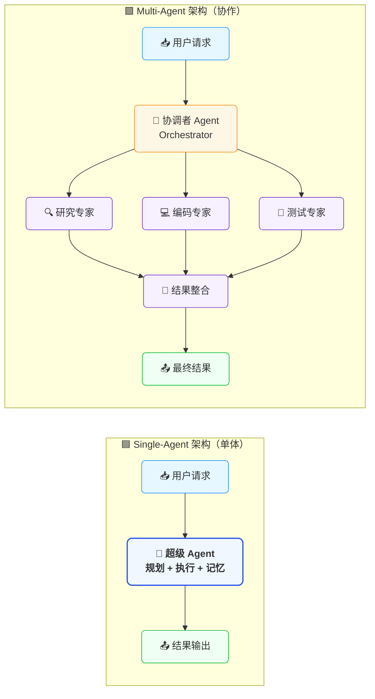
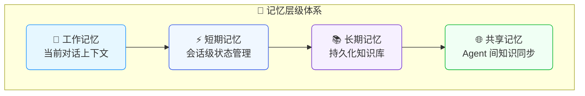
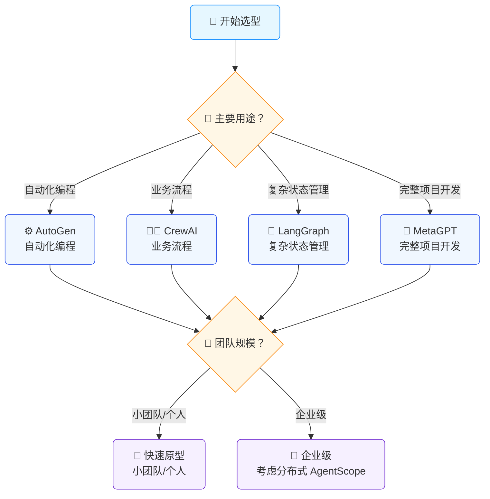

# 🎭 多智能体系统：当AI学会"团队协作"

## 1. 引言：从"单兵作战"到"集团军"


想象一下：你正在指挥一支特种部队。传统的AI应用就像一个全能士兵——既要侦察、又要射击、还要医疗救护。而Multi-Agent系统，则是让狙击手、医疗兵、通讯专家各司其职，通过精密配合完成任务。

这就是**Multi-Agent系统（MAS, Multi-Agent System）**的核心思想：不再追求一个"超级AI"，而是让多个专业化智能体（Agent）通过协作与通信，解决复杂问题。

> 💡 **为什么现在关注？** 随着GPT-4、Claude等大模型能力边界逐渐清晰，Single-Agent的能力天花板开始显现。而Multi-Agent架构正在成为突破这一瓶颈的关键路径。

---

## 2. 核心概念：什么是真正的Multi-Agent？

### 2.1 智能体（Agent）的定义

在Multi-Agent语境下，一个Agent通常具备：

| 特性 | 说明 |
|------|------|
| **自主性** | 能独立感知环境并做出决策 |
| **反应性** | 对环境变化实时响应 |
| **主动性** | 主动追求目标，而非被动执行 |
| **社交性** | 能与其他Agent交互协作 |

### 2.2 Multi-Agent vs Single-Agent




**关键差异**：

| 维度 | Single-Agent | Multi-Agent |
|------|-------------|-------------|
| 复杂度处理 | 适合简单、线性任务 | 擅长复杂、并行任务 |
| 专业化程度 | 通用但浅层 | 深度专业化 |
| 容错性 | 单点故障 | 部分Agent失效仍可运行 |
| 可扩展性 | 受限于上下文长度 | 可通过增加Agent扩展 |
| 调试难度 | 相对简单 | 通信调试复杂 |


### 2.3 应用场景

Multi-agent 将复杂的应用程序分解为多个协同工作的专业化Agent。与依赖单个Agent处理所有步骤不同，Multi-agent架构允许你将更小、更专注的Agent组合成协调的工作流。

Multi-agent系统在以下情况下很有用：

- 单个Agent拥有太多工具，难以做出正确的工具选择决策
- 上下文或记忆增长过大，单个Agent难以有效跟踪
- 任务需要专业化（例如：规划器、研究员、数学专家）

---

## 3. 主流架构模式：四种"团队协作"方式


### 3.1 层级式（Hierarchical）

像传统企业的组织架构，有一个"CEO Agent"负责战略分解，"部门经理Agent"分配任务，"执行Agent"具体实施。

**适用场景**：企业流程自动化、复杂项目管理

```
CEO Agent (战略规划)
    ↓
Manager Agents (任务分配)
    ↓
Worker Agents (具体执行)
```

### 3.2 平等协作式（Peer-to-Peer）

所有Agent地位平等，通过协商达成共识。类似开源社区的协作模式。

**适用场景**：头脑风暴、创意生成、多视角分析

### 3.3 市场竞价式（Market-Based）

Agent之间通过"竞价"获取任务，资源分配给报价最优的Agent。模拟自由市场经济。

**适用场景**：资源调度、负载均衡、云计算资源分配

### 3.4 混合式（Hybrid）

现代系统多采用混合架构。以**CrewAI**和**AutoGen**为例：

```python
# CrewAI 风格伪代码示例
from crewai import Agent, Task, Crew

# 定义专业Agent
researcher = Agent(
    role="高级研究员",
    goal="深入研究技术主题",
    backstory="你是一位拥有10年经验的技术专家...",
    llm="gpt-4"
)

writer = Agent(
    role="技术写作者", 
    goal="将技术概念转化为易懂内容",
    backstory="你擅长将复杂技术通俗化...",
    llm="claude-3"
)

# 定义协作流程
task = Task(
    description="撰写一篇关于Multi-Agent的技术文章",
    agents=[researcher, writer],
    context="需要技术深度但保持可读性"
)

crew = Crew(agents=[researcher, writer], tasks=[task])
result = crew.kickoff()
```

---

## 4. 关键技术挑战与解决方案

### 4.1 通信机制：Agent之间如何"对话"？

**挑战**：Agent间通信协议设计、消息格式标准化、通信效率优化。

**解决方案矩阵**：

| 通信模式 | 特点 | 适用场景 |
|---------|------|---------|
| **直接通信** | Agent点对点对话 | 小规模、紧耦合协作 |
| **黑板系统** | 共享工作区，Agent读写信息 | 需要全局状态共享 |
| **消息总线** | 通过中间件路由消息 | 大规模、松耦合系统 |
| **函数调用** | 结构化API式交互 | 需要精确控制的场景 |


### 4.2 任务分解与分配

将复杂任务拆解为可并行子任务是多Agent系统的核心能力。

```python
# 任务分解示例（概念性伪代码）
class TaskDecomposer:
    def decompose(self, complex_task: str) -> List[SubTask]:
        # 使用LLM进行智能分解
        prompt = f"""
        将以下复杂任务分解为3-5个可并行执行的子任务：
        任务：{complex_task}
        
        要求：
        1. 每个子任务有明确的输入输出
        2. 子任务间依赖关系清晰
        3. 考虑失败重试机制
        """
        return llm.generate(prompt)
```

### 4.3 冲突解决与一致性

当多个Agent对同一问题给出不同答案时，需要**仲裁机制**：

- **投票机制**：多数决
- **置信度加权**：根据Agent历史表现加权
- **元Agent裁决**：引入更高层Agent做最终决定
- **人机协同**：关键决策点引入人类判断

### 4.4 记忆与状态管理




**技术选型**：
- 向量数据库（Pinecone, Weaviate）存储长期记忆
- Redis管理实时状态
- 图数据库存储Agent关系网络

---

## 5. 实战案例：构建一个多Agent代码助手

让我们设计一个**智能编程助手团队**：

### 5.1 系统架构


```
┌─────────────────────────────────────┐
│           需求分析Agent              │
│    （理解用户需求，提取关键信息）       │
└─────────────┬───────────────────────┘
              ↓
┌─────────────────────────────────────┐
│           架构师Agent               │
│    （设计技术方案，选择技术栈）        │
└─────────────┬───────────────────────┘
              ↓
┌─────────────┴───────────────────────┐
│                                     │
│  ┌─────────┐  ┌─────────┐  ┌──────┐ │
│  │前端Agent │  │后端Agent │  │DBAgent│ │
│  └────┬────┘  └────┬────┘  └──┬───┘ │
│       └─────────────┴──────────┘     │
│              ↓                       │
│        ┌──────────┐                  │
│        │ 测试Agent │                  │
│        └────┬─────┘                  │
│             ↓                        │
│        ┌──────────┐                  │
│        │ 审查Agent │                  │
│        │(代码质量) │                  │
│        └──────────┘                  │
└─────────────────────────────────────┘
```

### 5.2 核心代码框架

```python
from typing import List, Dict, Optional
from dataclasses import dataclass
from enum import Enum

class AgentRole(Enum):
    REQUIREMENT_ANALYST = "需求分析师"
    ARCHITECT = "架构师"
    FRONTEND_DEV = "前端开发"
    BACKEND_DEV = "后端开发"
    TESTER = "测试工程师"
    REVIEWER = "代码审查员"

@dataclass
class Message:
    sender: str
    receiver: str
    content: str
    msg_type: str  # "task", "question", "response", "error"
    context: Dict = None

class BaseAgent:
    def __init__(self, role: AgentRole, llm_client):
        self.role = role
        self.llm = llm_client
        self.memory = []  # 对话历史
        self.skills = self._define_skills()
    
    def _define_skills(self) -> List[str]:
        """定义Agent专业能力"""
        skills_map = {
            AgentRole.REQUIREMENT_ANALYST: ["需求提取", "用户故事编写", "边界识别"],
            AgentRole.ARCHITECT: ["系统设计", "技术选型", "接口定义"],
            AgentRole.FRONTEND_DEV: ["React/Vue", "UI实现", "状态管理"],
            AgentRole.BACKEND_DEV: ["API开发", "数据库设计", "业务逻辑"],
            AgentRole.TESTER: ["测试用例", "自动化测试", "Bug报告"],
            AgentRole.REVIEWER: ["代码审查", "性能优化", "安全审计"]
        }
        return skills_map.get(self.role, [])
    
    def receive_message(self, msg: Message) -> Message:
        """处理接收到的消息"""
        self.memory.append(msg)
        
        # 根据消息类型和角色生成响应
        response = self._process(msg)
        
        return Message(
            sender=self.role.value,
            receiver=msg.sender,
            content=response,
            msg_type="response"
        )
    
    def _process(self, msg: Message) -> str:
        """核心处理逻辑 - 由子类实现或使用LLM"""
        prompt = f"""
        你是{self.role.value}，擅长：{', '.join(self.skills)}
        
        历史对话：{self.memory[-3:]}  # 最近3条
        收到消息：{msg.content}
        
        请基于你的专业角色回复。如果需要其他Agent协助，明确说明需要谁的帮助。
        """
        return self.llm.generate(prompt)

class MultiAgentSystem:
    def __init__(self):
        self.agents: Dict[AgentRole, BaseAgent] = {}
        self.message_bus = []  # 消息总线
        self.orchestrator = None  # 协调器
    
    def register_agent(self, agent: BaseAgent):
        self.agents[agent.role] = agent
    
    def execute_task(self, task_description: str) -> str:
        """主执行流程"""
        # 1. 需求分析
        req_agent = self.agents[AgentRole.REQUIREMENT_ANALYST]
        req_result = req_agent.receive_message(Message(
            sender="User",
            receiver=AgentRole.REQUIREMENT_ANALYST.value,
            content=task_description,
            msg_type="task"
        ))
        
        # 2. 架构设计（并行触发前后端）
        arch_agent = self.agents[AgentRole.ARCHITECT]
        arch_result = arch_agent.receive_message(req_result)
        
        # 3. 并行开发
        frontend_agent = self.agents[AgentRole.FRONTEND_DEV]
        backend_agent = self.agents[AgentRole.BACKEND_DEV]
        
        # 使用asyncio实现真正的并行
        frontend_task = frontend_agent.receive_message(arch_result)
        backend_task = backend_agent.receive_message(arch_result)
        
        # 4. 测试与审查
        test_agent = self.agents[AgentRole.TESTER]
        review_agent = self.agents[AgentRole.REVIEWER]
        
        # 整合结果...
        return self._integrate_results([frontend_task, backend_task])
```

---

## 6. 前沿框架与工具生态

### 6.1 主流框架对比


| 框架 | 核心特点 | 适用场景 | 学习曲线 |
|------|---------|---------|---------|
| **AutoGen** (Microsoft) | 对话编程、代码生成强 | 自动化编程、数据分析 | 中等 |
| **CrewAI** | 角色扮演、流程清晰 | 业务流程自动化 | 低 |
| **LangGraph** | 图结构工作流、状态管理 | 复杂状态机、循环流程 | 较高 |
| **MetaGPT** | 模拟软件公司组织架构 | 完整项目开发 | 中等 |
| **AgentScope** (阿里) | 中文优化、分布式支持 | 企业级应用 | 中等 |

### 6.2 选型建议




---

## 7. 未来趋势与思考

### 7.1 技术演进方向

1. **Agent即服务（AaaS）**：标准化Agent接口，像微服务一样部署和调用
2. **自主进化**：Agent能自我改进、学习新技能、甚至创建子Agent
3. **多模态协作**：文本、图像、语音Agent无缝协作
4. **可信AI**：解决Agent决策的可解释性和安全性问题

### 7.2 架构师的新挑战

- **组织设计**：如何划分Agent边界（类似微服务拆分）
- **通信模式**：同步vs异步，强一致vs最终一致
- **治理体系**：Agent权限管理、审计追踪、成本控制
- **人机边界**：哪些决策必须人类参与？

---

## 8. 结语：从"工具"到"团队"

Multi-Agent系统代表着AI应用架构的重大范式转移：

> 我们不再构建"更聪明的工具"，而是在构建"更高效的团队"。

每个Agent都是团队中的专家，它们有分工、有协作、有冲突也有共识。作为架构师，我们的任务从"设计算法"转变为"设计组织"——这既是挑战，也是令人兴奋的新领域。

**下一步行动建议**：
1. 从CrewAI或AutoGen开始，构建第一个双Agent协作原型
2. 在你的现有系统中识别适合Multi-Agent改造的场景
3. 关注Agent通信协议的标准化进展（如MCP协议）

---

## 参考资料

- [AutoGen Documentation](https://microsoft.github.io/autogen/)
- [CrewAI GitHub](https://github.com/joaomdmoura/crewAI)
- [Multi-Agent Reinforcement Learning: Foundations and Modern Approaches](https://www.marl-book.com/)
- [LLM Powered Autonomous Agents - Lil'Log](https://lilianweng.github.io/posts/2023-06-23-llm-agent/)
- [AgentScope: A Flexible and Robust Platform for Multi-Agent Systems](https://arxiv.org/abs/2402.14034)


**作者**: 一灰  
**日期**: 2026-03-14  
**标签**: [Multi-Agent, AI-Architecture, LLM, System-Design]
