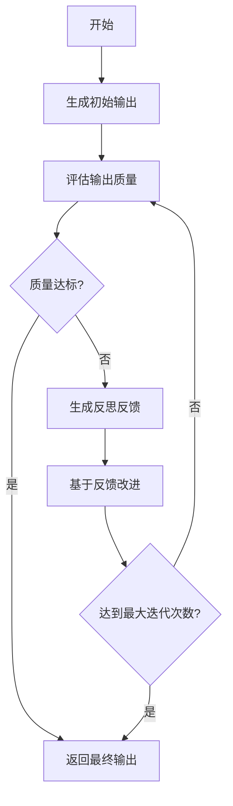

> 05.智能体四大设计模式之 Reflection（反思模式）：迭代优化的艺术


## 1. 引言

在 AI 智能体（Agent）的设计中，如何让机器像人一样"三思而后行"？**Reflection 模式**给出了一个优雅的答案：通过让智能体对自己的输出进行反思、评估和迭代改进，从而生成更高质量的结果。

这一模式的核心思想源自人类的认知过程——我们在写作时会反复修改，在编程时会调试优化，在决策时会权衡利弊。Reflection 模式将这种"自我改进"的能力赋予 AI，使其能够在不依赖外部反馈的情况下，自主提升输出质量。

本文将从理论基础、核心概念、实现流程、经典案例、适用场景和动手实现六个维度，为你呈现 Reflection 模式的完整图景。

## 2. 理论基础与起源

### 2.1 认知科学的启示

Reflection 模式的理论根基可以追溯到认知科学中的"元认知"（Metacognition）概念。元认知是指"对认知的认知"——即个体对自己思维过程的觉察、监控和调节。心理学家 John Flavell 在 1979 年首次系统性地阐述了这一概念，将其分为：

- **元认知知识**：关于自己认知能力的认知
- **元认知体验**：在认知过程中的主观感受
- **元认知监控**：对认知过程的主动调节

这一思想启发了 AI 研究者：如果人类能够通过反思来改进自己的思考和输出，那么 AI 是否也能做到？

### 2.2 从 Reflexion 到 Self-Refine


Reflection 模式在 AI 领域的正式确立，可以追溯到几个关键性的工作：

**Reflexion（2023）**：Shinn et al. 发表的论文 *"Reflexion: Language Agents with Verbal Reinforcement Learning"* 首次系统性地提出了语言智能体的"语言反馈"机制。其核心思想是：让智能体在任务执行失败后，用自然语言总结失败原因，然后将这些"反思"作为经验注入到下一次尝试中。

**Self-Refine（2023）**：Madaan et al. 提出的 Self-Refine 框架更加直接地展示了迭代优化的力量：让语言模型先生成初始输出，然后自我评估，最后根据评估结果进行改进。这一过程可以重复多次，直到达到满意的效果。

**Self-Review Framework（2025）**：进一步发展了自我评估与修订框架（Re5），强调通过外部评估工具进行有选择性的修正，避免无序反复修正。

**Experiential Reflective Learning（2026）**：ERL 框架将反思从"改进单次输出"提升到"积累可迁移的经验"——智能体反思任务轨迹和结果，提炼出可在不同任务间迁移的启发式规则。

### 2.3 四大设计模式的定位


在智能体的四大设计模式中（ReAct、Planning、Multi-Agent、Reflection），Reflection 占据着独特的位置：

| 模式 | 核心能力 | 适用场景 |
|------|----------|----------|
| ReAct | 推理 + 行动 | 需要工具调用的任务 |
| Planning | 规划 + 分解 | 复杂多步骤任务 |
| Multi-Agent | 协作 + 分工 | 需要多角色配合的任务 |
| **Reflection** | **反思 + 优化** | **对质量要求极高的任务** |

Reflection 模式通常与其他模式结合使用：在 ReAct 的行动之后进行质量评估，在 Planning 的执行后进行结果校验，在 Multi-Agent 的协作中进行相互评审。

## 3. 核心概念解析

### 3.1 Reflection 的定义

**Reflection 模式**是一种让 AI 智能体通过自我评估和迭代改进来优化输出的设计范式。其核心循环是：

```
生成（Generate）→ 评估（Evaluate）→ 反思（Reflect）→ 改进（Revise）→ 重复
```

这个循环的关键在于：智能体既是"作者"也是"评审"——它生成输出的同时，也能够站在批判者的角度审视自己的作品，并据此进行改进。

### 3.2 三大核心要素


#### 3.2.1 生成器（Generator）

生成器负责产生初始输出或改进后的版本。它可以是：
- 一个基础语言模型
- 一个专门优化过的生成模型
- 一个带有特定提示词的生成链

#### 3.2.2 评估器（Evaluator/Critic）

评估器负责审视生成器的输出，提供反馈。常见的评估方式包括：

- **自我评估**：让同一个模型从不同角度审视自己的输出
- **外部工具评估**：使用专门的验证工具（如代码的静态分析器）
- **专家模型评估**：使用专门训练的评估模型
- **规则引擎评估**：基于预定义规则进行检查

#### 3.2.3 控制器（Controller）

控制器管理整个反思循环，决定：
- 是否继续迭代
- 何时终止
- 如何处理异常情况

### 3.3 质量评估维度

一个完整的 Reflection 系统通常会从多个维度评估输出质量：

```python
class QualityScore:
    coherence: float      # 连贯性：逻辑是否清晰
    relevance: float      # 相关性：是否切题
    completeness: float   # 完整性：是否覆盖要点
    clarity: float        # 清晰度：表达是否清楚
    factuality: float     # 事实性：内容是否准确
```

每个维度可以独立打分，最终汇总为整体质量分数，用于判断是否需要继续迭代。

## 4. 实现流程详解


### 4.1 标准流程图



### 4.2 流程阶段详解

#### 阶段一：初始生成

```python
# 生成初始输出
initial_output = generator.generate(prompt, context)
```

这一阶段的目标是快速产出一个"初稿"，质量不是首要考量——因为后续会有迭代优化。

#### 阶段二：质量评估

```python
# 评估输出质量
quality_score = evaluator.evaluate(output, criteria)
feedback = evaluator.generate_feedback(output, quality_score)
```

评估器从预定义的维度对输出进行打分，并生成具体的改进建议。

#### 阶段三：反思生成

```python
# 基于评估结果进行反思
reflection = reflector.reflect(
    output=current_output,
    feedback=feedback,
    quality_score=quality_score
)
```

反思环节将评估结果转化为可执行的改进策略。这一步的关键是让 AI 理解"为什么不好"以及"如何改进"。

#### 阶段四：迭代改进

```python
# 基于反思改进输出
improved_output = generator.generate(
    prompt=original_prompt,
    context=context,
    feedback=reflection
)
```

生成器根据反思结果重新生成改进版本，完成一次迭代。

#### 阶段五：终止判断

```python
# 终止条件判断
def should_terminate(iteration, quality_score, improvement):
    # 条件1：质量达标
    if quality_score.overall >= target_quality:
        return True
    # 条件2：达到最大迭代次数
    if iteration >= max_iterations:
        return True
    # 条件3：改进幅度收敛
    if abs(improvement) < convergence_threshold:
        return True
    # 条件4：质量退化
    if improvement < -convergence_threshold * 2:
        return True
    return False
```

终止条件的设计至关重要——既要避免无限循环，也要防止过早退出。

## 5. 经典案例分析

### 5.1 LangGraph Reflection Agent

LangGraph 提供了一个优雅的 Reflection 实现，采用"双代理"架构：一个生成代理负责产出内容，一个评审代理负责评估和反馈。

```python
from langgraph.graph import MessageGraph

# 构建生成器图
assistant_graph = (
    StateGraph(MessagesState)
    .add_node(call_model)
    .add_edge(START, "call_model")
    .add_edge("call_model", END)
    .compile()
)

# 构建评审器图
judge_graph = (
    StateGraph(MessagesState)
    .add_node(judge_response)
    .add_edge(START, "judge_response")
    .add_edge("judge_response", END)
    .compile()
)

# 组合成 Reflection 图
reflection_app = create_reflection_graph(assistant_graph, judge_graph).compile()

# 运行
result = reflection_app.invoke({"messages": example_query})
```

LangGraph 的 **Reflection 模式** 核心定义：
> 将**生成回答**和**评审/修正回答**拆分为两个独立子图，通过官方工具自动组合，让模型先生成答案 → 再自我评审/优化 → 循环迭代直到满足要求。

上面的实现完美匹配这个架构：
1. **`assistant_graph`**：生成器（负责生成初始回答）
2. **`judge_graph`**：评审器（负责检查、批判、修正回答）
3. **`create_reflection_graph`**：**LangGraph 官方专门用于实现反思模式的封装函数**
4. 最终组合的 `reflection_app`：自动完成「生成 → 评审 → 修正」循环

这个实现的特点是：
- **职责分离**：生成和评估由不同的代理负责
- **循环迭代**：评审发现问题后会触发新一轮生成
- **自动终止**：当评审认为输出合格时自动退出

### 5.2 LlamaIndex Introspective Agent

LlamaIndex 的 `llama-index-agent-introspective` 包提供了生产级的 Reflection 实现：

```python
from llama_index.agent.introspective import SelfReflectionAgentWorker
from llama_index.agent.introspective import IntrospectiveAgentWorker

# 创建反思代理
self_reflection_agent_worker = SelfReflectionAgentWorker.from_defaults(
    llm=llm,
    verbose=True
)

# 创建自省代理（主代理 + 反思代理）
introspective_agent_worker = IntrospectiveAgentWorker.from_defaults(
    reflective_agent_worker=self_reflection_agent_worker,
    main_agent_worker=None,
    verbose=True
)

# 组装代理
chat_history = [ChatMessage(content=system_prompt, role=MessageRole.SYSTEM)]
introspective_agent = introspective_agent_worker.as_agent(
    chat_history=chat_history,
    verbose=True
)
```

关键类的作用:
① `SelfReflectionAgentWorker` **= 反思器 / 评审器**
- 对应你 LangGraph 代码里的：`judge_graph`
- 负责：检查回答、挑错、提修改建议

② `IntrospectiveAgentWorker` **= 主代理 + 反思代理 的组合器**
- 对应你 LangGraph 代码里的：`create_reflection_graph()`
- 负责：把「生成回答」和「反思修正」串成自动循环

③ 最终 `introspective_agent` **= 可直接运行的反思代理**
- 对应 LangGraph 的：`reflection_app`


这段代码的运行逻辑
```
用户提问
   ↓
主代理 → 生成回答
   ↓
反思代理 → 检查、批判、修改
   ↓
主代理 → 根据反思重新生成
   ↓
循环直到满足质量要求
```

LlamaIndex 官方把它叫做：**Introspective Agent（自省代理）**

它包含两层能力：
1. **Self-Reflection（自我反思）** → 检查自己的答案
2. **Self-Correction（自我修正）** → 自动优化答案


### 5.3 Context-Engineering Self-Refinement Lab

一个更加完善的实现来自 Context-Engineering 项目，它展示了多维度质量评估和收敛检测：

```python
class SelfRefinementPipeline:
    def refine_context(self, initial_context, query=None, target_quality=None):
        current_context = initial_context.copy()
        current_quality = self.assessor.assess_quality(current_context, query)
        
        for iteration in range(self.max_iterations):
            # 终止条件1：达到目标质量
            if current_quality.overall >= target_quality:
                break
            
            # 执行改进
            refined_context = self.refiner.refine_context(
                current_context, current_quality, query
            )
            refined_quality = self.assessor.assess_quality(refined_context, query)
            
            # 计算改进幅度
            improvement = refined_quality.overall - current_quality.overall
            
            # 终止条件2：收敛检测
            if abs(improvement) < self.convergence_threshold:
                break
            
            # 终止条件3：质量退化检测
            if improvement < -self.convergence_threshold * 2:
                break
            
            current_context = refined_context
            current_quality = refined_quality
        
        return {
            "final_context": current_context,
            "final_quality": current_quality,
            "iterations_completed": iteration + 1,
            "convergence_achieved": abs(improvement) < self.convergence_threshold
        }
```

这个实现的亮点在于：
- **多维度评估**：同时考量连贯性、相关性、完整性、清晰度和事实性
- **收敛检测**：当改进幅度低于阈值时自动停止
- **退化保护**：当质量反而下降时及时止损

## 6. 适用场景分析

### 6.1 最佳适用场景

Reflection 模式在以下场景中表现出色：

**1. 内容创作**
- 文章写作、报告撰写
- 需要多次润色和优化的场景
- 对文风、逻辑、准确性要求极高的内容

**2. 代码生成**
- 自动编程、代码优化
- 需要通过测试或静态分析验证的代码
- 复杂逻辑的正确性保证

**3. 决策支持**
- 风险评估、方案选择
- 需要多角度权衡的复杂决策
- 对结果可靠性要求极高的场景

**4. 知识整理**
- 信息抽取、摘要生成
- 需要准确性和完整性的知识提取
- 跨源信息的综合与验证

### 6.2 不适用场景

以下场景不适合使用 Reflection：

**1. 简单查询**
- 答案明确的问题（如"1+1=？"）
- 不需要迭代优化的任务

**2. 实时响应**
- 对延迟敏感的交互场景
- 用户期望即时反馈的对话

**3. 创意发散**
- 头脑风暴、创意激发
- 需要多样性而非精确性的场景

### 6.3 成本效益分析

使用 Reflection 模式需要权衡成本和收益：

| 因素 | 影响 |
|------|------|
| API 调用成本 | 每次迭代都需要额外的 API 调用 |
| 响应时间 | 多次迭代增加延迟 |
| 输出质量 | 通常显著提升 |
| 一致性 | 减少随机性带来的质量波动 |

建议：
- 对质量要求高、可接受一定延迟的任务使用 Reflection
- 设置合理的最大迭代次数（通常 3-5 次）
- 使用收敛检测避免无效迭代

## 7. 手把手实现指南

### 7.1 基础版本：最简 Reflection 循环

让我们从一个最简单的实现开始：

```python
import openai
from dataclasses import dataclass
from typing import Optional

@dataclass
class ReflectionResult:
    """反思结果"""
    content: str
    iterations: int
    quality_score: float

class SimpleReflector:
    """简单的反思代理"""
    
    def __init__(self, model: str = "gpt-4", max_iterations: int = 3):
        self.model = model
        self.max_iterations = max_iterations
        self.client = openai.OpenAI()
    
    def generate(self, prompt: str, feedback: Optional[str] = None) -> str:
        """生成内容"""
        messages = [{"role": "user", "content": prompt}]
        if feedback:
            messages.append({"role": "assistant", "content": "上次输出"})
            messages.append({"role": "user", "content": f"请根据以下反馈改进：{feedback}"})
        
        response = self.client.chat.completions.create(
            model=self.model,
            messages=messages
        )
        return response.choices[0].message.content
    
    def evaluate(self, content: str, criteria: str) -> tuple[float, str]:
        """评估内容质量"""
        eval_prompt = f"""请评估以下内容的质量，按照标准：{criteria}

内容：
{content}

请返回：
1. 质量分数（0-100）
2. 改进建议

格式：分数|建议"""
        
        response = self.client.chat.completions.create(
            model=self.model,
            messages=[{"role": "user", "content": eval_prompt}]
        )
        
        result = response.choices[0].message.content
        score_str, feedback = result.split("|", 1)
        return float(score_str.strip()), feedback.strip()
    
    def reflect(self, prompt: str, criteria: str, target_score: float = 80) -> ReflectionResult:
        """执行反思循环"""
        current_content = self.generate(prompt)
        
        for iteration in range(self.max_iterations):
            score, feedback = self.evaluate(current_content, criteria)
            
            print(f"迭代 {iteration + 1}: 分数 {score}")
            
            if score >= target_score:
                return ReflectionResult(
                    content=current_content,
                    iterations=iteration + 1,
                    quality_score=score
                )
            
            current_content = self.generate(prompt, feedback)
        
        return ReflectionResult(
            content=current_content,
            iterations=self.max_iterations,
            quality_score=score
        )

# 使用示例
reflector = SimpleReflector()
result = reflector.reflect(
    prompt="写一篇关于气候变化的短文",
    criteria="准确性、逻辑性、可读性、数据支撑",
    target_score=85
)
print(f"最终内容（经过 {result.iterations} 次迭代，分数 {result.quality_score}）：")
print(result.content)
```

### 7.2 进阶版本：多维度评估

```python
from dataclasses import dataclass, field
from typing import List, Dict
from enum import Enum

class QualityMetric(Enum):
    """质量评估维度"""
    COHERENCE = "coherence"      # 连贯性
    RELEVANCE = "relevance"      # 相关性
    COMPLETENESS = "completeness" # 完整性
    CLARITY = "clarity"          # 清晰度
    FACTUALITY = "factuality"    # 事实性

@dataclass
class QualityScore:
    """多维度质量分数"""
    coherence: float = 0.0
    relevance: float = 0.0
    completeness: float = 0.0
    clarity: float = 0.0
    factuality: float = 0.0
    
    @property
    def overall(self) -> float:
        """计算综合分数"""
        return (
            self.coherence * 0.25 +
            self.relevance * 0.25 +
            self.completeness * 0.20 +
            self.clarity * 0.15 +
            self.factuality * 0.15
        )
    
    def to_dict(self) -> Dict[str, float]:
        return {
            "coherence": self.coherence,
            "relevance": self.relevance,
            "completeness": self.completeness,
            "clarity": self.clarity,
            "factuality": self.factuality,
            "overall": self.overall
        }

@dataclass
class RefinementIteration:
    """单次迭代记录"""
    iteration: int
    content: str
    quality: QualityScore
    feedback: str
    improvement: float

class AdvancedReflector:
    """高级反思代理"""
    
    def __init__(
        self, 
        model: str = "gpt-4",
        max_iterations: int = 5,
        convergence_threshold: float = 2.0
    ):
        self.model = model
        self.max_iterations = max_iterations
        self.convergence_threshold = convergence_threshold
        self.client = openai.OpenAI()
        self.history: List[RefinementIteration] = []
    
    def assess_quality(self, content: str, context: str = "") -> QualityScore:
        """多维度质量评估"""
        prompt = f"""请从以下5个维度评估内容质量，每个维度0-100分：

1. 连贯性（coherence）：逻辑是否清晰，前后是否一致
2. 相关性（relevance）：是否切题，是否回应了核心问题
3. 完整性（completeness）：是否覆盖了关键要点
4. 清晰度（clarity）：表达是否清楚，是否易于理解
5. 事实性（factuality）：内容是否准确，是否有错误

内容：
{content}

背景/问题：
{context}

请严格按以下JSON格式返回：
{{"coherence": 分数, "relevance": 分数, "completeness": 分数, "clarity": 分数, "factuality": 分数}}"""

        response = self.client.chat.completions.create(
            model=self.model,
            messages=[{"role": "user", "content": prompt}],
            response_format={"type": "json_object"}
        )
        
        import json
        scores = json.loads(response.choices[0].message.content)
        return QualityScore(**scores)
    
    def generate_feedback(self, content: str, quality: QualityScore) -> str:
        """生成详细的改进建议"""
        # 找出最弱的维度
        weak_areas = []
        if quality.coherence < 70:
            weak_areas.append(f"连贯性({quality.coherence:.0f})")
        if quality.relevance < 70:
            weak_areas.append(f"相关性({quality.relevance:.0f})")
        if quality.completeness < 70:
            weak_areas.append(f"完整性({quality.completeness:.0f})")
        if quality.clarity < 70:
            weak_areas.append(f"清晰度({quality.clarity:.0f})")
        if quality.factuality < 70:
            weak_areas.append(f"事实性({quality.factuality:.0f})")
        
        prompt = f"""请为以下内容提供具体的改进建议。

内容：
{content}

当前质量评估：
- 综合分数：{quality.overall:.1f}
- 弱项：{', '.join(weak_areas) if weak_areas else '无明显弱项'}

请提供：
1. 具体的问题描述
2. 针对性的改进建议
3. 示例修改（如适用）"""

        response = self.client.chat.completions.create(
            model=self.model,
            messages=[{"role": "user", "content": prompt}]
        )
        return response.choices[0].message.content
    
    def refine_content(self, content: str, feedback: str, context: str = "") -> str:
        """基于反馈改进内容"""
        prompt = f"""请根据以下反馈改进内容。

原始内容：
{content}

改进建议：
{feedback}

背景/要求：
{context}

请输出改进后的完整内容："""

        response = self.client.chat.completions.create(
            model=self.model,
            messages=[{"role": "user", "content": prompt}]
        )
        return response.choices[0].message.content
    
    def reflect(
        self, 
        initial_content: str,
        context: str = "",
        target_quality: float = 80.0
    ) -> Dict:
        """执行反思循环"""
        current_content = initial_content
        current_quality = self.assess_quality(current_content, context)
        
        self.history = []
        
        for iteration in range(self.max_iterations):
            # 终止条件1：达到目标质量
            if current_quality.overall >= target_quality:
                return {
                    "success": True,
                    "content": current_content,
                    "iterations": iteration + 1,
                    "final_quality": current_quality.to_dict(),
                    "history": self.history
                }
            
            # 生成改进建议
            feedback = self.generate_feedback(current_content, current_quality)
            
            # 改进内容
            refined_content = self.refine_content(current_content, feedback, context)
            refined_quality = self.assess_quality(refined_content, context)
            
            # 计算改进幅度
            improvement = refined_quality.overall - current_quality.overall
            
            # 记录迭代
            self.history.append(RefinementIteration(
                iteration=iteration + 1,
                content=refined_content,
                quality=refined_quality,
                feedback=feedback,
                improvement=improvement
            ))
            
            # 终止条件2：收敛检测
            if abs(improvement) < self.convergence_threshold:
                return {
                    "success": True,
                    "content": refined_content,
                    "iterations": iteration + 1,
                    "final_quality": refined_quality.to_dict(),
                    "reason": "converged",
                    "history": self.history
                }
            
            # 终止条件3：质量退化
            if improvement < -self.convergence_threshold * 2:
                return {
                    "success": False,
                    "content": current_content,  # 返回上一版本
                    "iterations": iteration + 1,
                    "final_quality": current_quality.to_dict(),
                    "reason": "degradation_detected",
                    "history": self.history
                }
            
            current_content = refined_content
            current_quality = refined_quality
        
        return {
            "success": True,
            "content": current_content,
            "iterations": self.max_iterations,
            "final_quality": current_quality.to_dict(),
            "reason": "max_iterations_reached",
            "history": self.history
        }

# 使用示例
reflector = AdvancedReflector(max_iterations=5, convergence_threshold=3.0)

# 先生成初始内容
initial = """人工智能正在改变世界。它有很多应用，比如自动驾驶、医疗诊断等。
但是也有一些问题，比如就业影响、隐私问题。总的来说，AI是未来的发展方向。"""

# 执行反思循环
result = reflector.reflect(
    initial_content=initial,
    context="写一篇关于人工智能影响的分析文章，要求深度分析、数据支撑、平衡观点",
    target_quality=85
)

print(f"优化完成：{result['iterations']} 次迭代")
print(f"最终质量：{result['final_quality']}")
print(f"最终内容：\n{result['content'][:500]}...")
```

### 7.3 完整版本：双代理架构


```python
from typing import TypedDict, List
from langchain_core.messages import HumanMessage, AIMessage, SystemMessage
from langchain_openai import ChatOpenAI
from langgraph.graph import StateGraph, END

class AgentState(TypedDict):
    """代理状态"""
    messages: List[HumanMessage | AIMessage]
    iteration: int
    feedback: str

class ReflectionAgent:
    """双代理 Reflection 系统"""
    
    def __init__(
        self,
        generator_model: str = "gpt-4",
        critic_model: str = "gpt-4",
        max_iterations: int = 3
    ):
        self.generator = ChatOpenAI(model=generator_model)
        self.critic = ChatOpenAI(model=critic_model)
        self.max_iterations = max_iterations
        self.graph = self._build_graph()
    
    def _build_graph(self) -> StateGraph:
        """构建反思图"""
        workflow = StateGraph(AgentState)
        
        # 添加节点
        workflow.add_node("generate", self._generate)
        workflow.add_node("critique", self._critique)
        
        # 设置入口
        workflow.set_entry_point("generate")
        
        # 添加边
        workflow.add_conditional_edges(
            "generate",
            self._should_continue,
            {
                "continue": "critique",
                "end": END
            }
        )
        workflow.add_edge("critique", "generate")
        
        return workflow.compile()
    
    def _generate(self, state: AgentState) -> AgentState:
        """生成节点"""
        messages = state["messages"].copy()
        
        # 如果有反馈，加入反馈
        if state.get("feedback"):
            messages.append(SystemMessage(
                content=f"请根据以下反馈改进你的输出：\n{state['feedback']}"
            ))
        
        response = self.generator.invoke(messages)
        
        return {
            "messages": messages + [response],
            "iteration": state.get("iteration", 0) + 1,
            "feedback": ""
        }
    
    def _critique(self, state: AgentState) -> AgentState:
        """评估节点"""
        last_response = state["messages"][-1].content
        
        critique_prompt = f"""请评估以下输出的质量，并提供改进建议。
如果输出已经很好，请回复 "APPROVED"。
否则，请详细说明需要改进的地方。

输出内容：
{last_response}"""
        
        response = self.critic.invoke([HumanMessage(content=critique_prompt)])
        
        return {
            "messages": state["messages"],
            "iteration": state["iteration"],
            "feedback": response.content
        }
    
    def _should_continue(self, state: AgentState) -> str:
        """判断是否继续"""
        feedback = state.get("feedback", "")
        
        # 条件1：评审通过
        if "APPROVED" in feedback.upper():
            return "end"
        
        # 条件2：达到最大迭代次数
        if state["iteration"] >= self.max_iterations:
            return "end"
        
        return "continue"
    
    def run(self, prompt: str) -> str:
        """运行反思循环"""
        initial_state = {
            "messages": [HumanMessage(content=prompt)],
            "iteration": 0,
            "feedback": ""
        }
        
        result = self.graph.invoke(initial_state)
        
        return result["messages"][-1].content

# 使用示例
agent = ReflectionAgent(max_iterations=3)
result = agent.run("解释量子计算的基本原理")
print(result)
```

## 8. 最佳实践与注意事项

### 8.1 设计建议

**1. 评估标准要明确**
- 定义清晰的质量维度
- 为每个维度设定可衡量的标准
- 避免模糊的评估指令

**2. 反馈要具体**
- 指出具体的问题
- 提供改进的方向
- 包含示例（如适用）

**3. 终止条件要合理**
- 设置质量阈值
- 设置最大迭代次数
- 实现收敛检测
- 添加退化保护

### 8.2 性能优化

**1. 缓存中间结果**
- 避免重复评估相同内容
- 缓存历史迭代结果

**2. 并行评估**
- 多维度评估可以并行执行
- 使用异步调用减少等待时间

**3. 增量改进**
- 不需要每次都重新生成全文
- 可以只针对问题部分进行改进

### 8.3 常见陷阱

| 陷阱 | 解决方案 |
|------|----------|
| 无限循环 | 设置最大迭代次数 + 收敛检测 |
| 过度优化 | 设置合理的质量阈值，避免追求完美 |
| 质量退化 | 实现退化检测，保留最佳版本 |
| 成本失控 | 监控 API 调用量，设置预算限制 |
| 评估偏差 | 使用多维度评估，避免单一标准 |

## 9. 总结

Reflection 模式通过引入"自我反思"的能力，让 AI 智能体能够迭代优化自己的输出。这一模式的核心价值在于：

1. **质量提升**：通过多次迭代，输出质量显著提高
2. **自主改进**：无需外部反馈，智能体可以自我完善
3. **灵活应用**：可与其他模式结合，适应多种场景

关键要点：
- 理解 Generate → Evaluate → Reflect → Revise 的核心循环
- 设计多维度的评估体系
- 实现智能的终止条件
- 权衡成本和收益

掌握 Reflection 模式，你就掌握了让 AI 输出从"能用"到"好用"的关键技术。

## 参考资料

| 参考资料 | 访问地址 |
| --- | --- |
| Reflexion: Language Agents with Verbal Reinforcement Learning | https://arxiv.org/abs/2303.11366 |
| Self-Refine: Iterative Refinement with Self-Feedback | https://arxiv.org/abs/2303.17651 |
| Self-Review Framework (Re5) | https://arxiv.org/abs/2507.05598 |
| Experiential Reflective Learning (ERL) | https://arxiv.org/abs/2603.24639 |
| LangGraph Reflection Examples | https://github.com/langchain-ai/langgraph-reflection |
| LlamaIndex Introspective Agent | https://pypi.org/project/llama-index-agent-introspective/ |
| Context-Engineering Self-Refinement Lab | https://github.com/davidkimai/Context-Engineering/blob/main/00_COURSE/02_context_processing/labs/self_refinement_lab.py |
| LangChain Reflection Agents Blog | https://blog.langchain.com/reflection-agents/ |

> **作者**：一灰
> **日期**：2026-03-28
> **标签**：#AI Agent #设计模式 #Reflection #自省 #迭代优化
