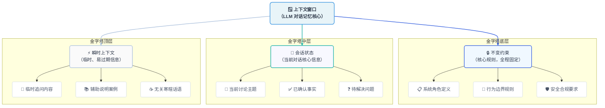
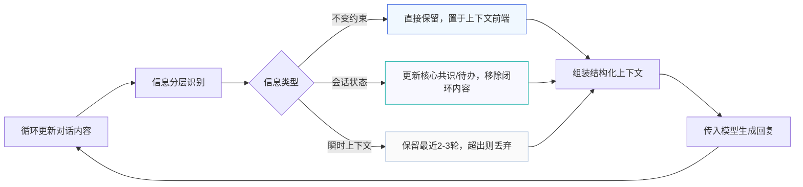

在上一章中，我们已经明确否定了一种做法：

> **把上下文当作“无限可用的记忆容器”。**

在大模型应用给开发时，上下文窗口的限制是一个不得不考虑的问题，不管是哪个模型，终究是有一个长度上限，显然有上限那么就不可能满足无限轮次的对话存储，因此一个更难、也更重要的问题也就出来了：

> **在有限的上下文窗口里，哪些信息值得被保留？**

首先我们的明确，这不是大模型需要关注的事情，而是我们这种基于大模型做应用开发的苦逼码农需要重点考虑的**系统设计决策** —— 它的具体设计，直接决定了多轮对话中系统的稳定性、准确性，甚至是用户对我们产品的信任度

---

### 7.1 技术决策的第一步：承认信息是有“等级”的

在企业知识库助手、智能客服、私域助手等真实对话场景中，并不是所有信息都同等重要。如果我们不主动对信息进行区分，模型就会被迫“平均对待”，从而导致核心规则被冗余内容所稀释

从工程化实践角度出发，我们至少需要区分三类信息，它们的优先级和保留策略完全不同：




#### 1.不变约束（最高优先级）

指系统必须始终遵守的核心规则，不随对话内容变化而改变。

例如：

 - *系统角色定义（“你是 XX 公司的内部知识库助手，不对外提供服务”）*
 - *行为边界（“仅回答员工手册、财务制度中的内容，超出范围需明确拒绝”）*
 - *安全规则（“禁止泄露员工个人信息、未公开的业务数据”）*

这类信息必须**永远保留在上下文窗口中**，且位置要尽可能靠前（减少注意力衰减影响）,不可也不应该被压缩或删除

#### 2.会话状态（中高优先级）

指当前对话中形成的关键共识、未完成的任务或用户的核心意图，是维持对话连贯性的基础。

例如：

- *当前讨论主题（“用户正在咨询 2025 年新版差旅报销政策”）*
- *已确认事实（“用户是销售部员工，经常出差至华东地区”）*
- *待解决问题（“需确认‘高铁一等座是否可报销’”）*

这类信息需要**持续维护和更新**，实时同步对话进度，移除已闭环的内容，保留未完成事项和核心共识，确保大模型能准确识别到“当前阶段”


#### 3. 瞬时上下文（低优先级）

指对话中的临时交互、举例说明或过渡性内容，对长期连贯性影响较小。例如：

- 用户的临时追问（“那二等座呢？”）
- 辅助说明（“比如我上次去上海的高铁票是一等座”）
- 无关寒暄（“谢谢，我再看看”）

这类信息可以**按需保留最近几轮（通常是2-3轮）**，超出范围后可直接丢弃，避免占用上下文和分散注意力

---

接下来我们通过一个模拟的对话案例，来辅助说明一下

**对话场景**：销售部员工小李咨询差旅报销政策，过程中穿插寒暄和临时追问。

**未分层上下文管理（反面案例）**：

```
小李：“你好，我是销售部的小李，想问问2025年差旅报销政策~” (含「会话状态」：销售部员工、核心需求报销政策；「瞬时内容」：寒暄)

助手：“你好！请问具体想了解哪方面内容？” （未抓取「会话状态」，仅回应寒暄，对话无推进）

小李：“我经常去华东出差，高铁一等座能报销吗？对了，我上次去上海的票就是一等座。” （「会话状态」：华东出差、高铁一等座报销；「瞬时内容」：上海车票举例）

助手：“销售部员工出差华东地区，高铁一等座可报销，需提供购票凭证和出差审批单。” （偶然抓取部分会话状态，但未固化）

小李：“好的谢谢，那飞机经济舱呢？” （延续「会话状态」：差旅交通报销；「瞬时内容」：感谢）

助手：“飞机经济舱可报销，不过提醒你，我是内部助手，不对外提供服务哦~” （「问题1」：「不变约束」（内部助手）被瞬时内容挤压，冗余重复提醒；「问题2」：未衔接「销售部+华东出差」的会话状态，回答断裂）
```

**问题分析**：未分层导致“系统角色”（不变约束）被瞬时内容挤压，需重复提醒；同时未聚焦“销售部+华东出差”（会话状态），对话连贯性差。


**已分层上下文管理（正面案例）**：

```
小李：“你好，我是销售部的小李，想问问2025年差旅报销政策~” （「分层操作」：提取「会话状态」（销售部、2024报销政策）；忽略「瞬时内容」（寒暄））

助手：“你好小李！销售部差旅报销可优先参考2025年新版政策，请问具体想了解交通、住宿还是餐饮方面？” （「分层操作」：锚定「会话状态」并回应，引导需求聚焦；「不变约束」（内部助手）前置留存，无需重复提醒）

小李：“我经常去华东出差，高铁一等座能报销吗？对了，我上次去上海的票就是一等座。” （「分层操作」：强化「会话状态」（华东出差、高铁一等座）；过滤「瞬时内容」（上海车票举例））

助手：“销售部员工出差华东地区，高铁一等座可报销，需提供购票凭证和出差审批单（你上次上海的一等座票可按此流程报销）。” （「分层操作」：紧扣「会话状态」作答，兼顾用户举例但不被带偏；「不变约束」持续生效，无冗余内容）

小李：“好的谢谢，那飞机经济舱呢？” （「分层操作」：延续「会话状态」（差旅交通报销）；忽略「瞬时内容」（感谢））

助手：“飞机经济舱可报销，同样需搭配出差审批单；若航程超过4小时，可申请升级至超级经济舱。” （「分层操作」：基于现有「会话状态」延伸作答，补充关联规则；全程不提及已固化的「不变约束」）
```

> **上下文失控的本质，不是信息太多，而是信息没有被分层。** 
> 
> 让低优先级的内容挤占了高优先级信息的 “生存空间”。

---

### 7.2 为什么“直接摘要历史”并不是银弹？

在意识到上下文有限后，很多小伙伴的第一直觉就是：

> *那就把历史对话总结一下，再塞回去。*

这个思路的方向是对的（减少冗余信息），但如果不区分信息等级，简单做 “全量摘要”，会引入新的系统风险：

- 约束信息被压缩：比如原系统提示中的 “5 条核心规则” 可能被摘要简化为 “遵守公司规定”，丢失关键细节。
- 错误结论被固化：如果某轮回答存在错误（比如 “年假可累计 15 天” 实际应为 10 天），摘要可能会保留这个错误并持续传递。
- 决策过程被抹平：用户曾明确拒绝的方向（比如 “我不想了解北京的政策”）可能在摘要中被忽略，导致模型重复无效信息。


以差旅报销助手为例，对比两种方式的上下文处理结果：

| **全量摘要（错误示范）** |  **结构化状态（正确示范）**|
| --- | --- |
| 摘要内容：“销售部小李咨询2024年差旅报销政策，关心华东地区高铁一等座和飞机经济舱报销问题，助手已告知可报销，需提供凭证。”<br/>**问题**：未保留“高铁一等座仅限华东地区”“飞机经济舱4小时以上可升舱”等关键会话状态，也未体现“逾期报销需补报”的不变约束，后续对话易出错。 | 【不变约束】：差旅报销需在返程后7天内提交，逾期走补报流程；仅回答2024年新版政策。 <br/>【会话状态】：用户小李（销售部），核心需求为华东地区差旅交通报销；已确认高铁一等座可报销（需凭证+审批单）；待补充飞机经济舱升级规则。<br/> 【瞬时上下文】：忽略“上次上海一等座票”“寒暄问候”等内容。| 


这意味着：

> **我们需要的不是“一个摘要”，而是“结构化状态”。** —— 即针对不同等级的信息，设计专门的保留和更新策略。


一个常见的结构化状态管理流程如下




---

### 7.3 本章小结：上下文开始变成工程对象

到这里，你应该已经意识到：

上下文不再是自然增长的聊天记录，而是一个**需要被主动设计、分层管理、动态维护的系统状态**

多轮对话的可靠性，从来不取决于“上下文窗口有多大”，而取决于“高优先级信息是否能稳定地影响模型决策”。不变约束的坚守、会话状态的精准同步、瞬时内容的合理舍弃，三者共同构成了上下文管理的核心工程逻辑。

这一步认知转变，会直接引出下一个问题：

> **既然信息需要被分层管理，那“记忆”是否也应该分层？**

这正是下一章要探讨的核心问题 —— 如何通过短期记忆、长期记忆的分层设计，实现上下文管理的工程化落地，让 LLM 应用具备更稳定、更智能的多轮对话能力。


#### 思考题

1. 在你的 LLM 应用场景中，哪些信息属于“不变约束”？如何确保这些信息不被压缩或丢失？

2. 针对“会话状态”的更新，你会设计哪些规则来判断“内容是否已闭环”？

3. 如果上下文窗口极度紧张（如仅 4k  tokens），你会优先舍弃哪类信息，如何平衡准确性与连贯性？

> （注：文档部分内容可能由 AI 生成）

