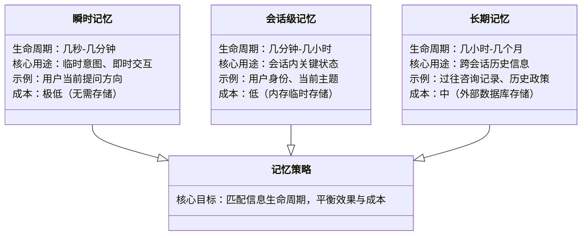
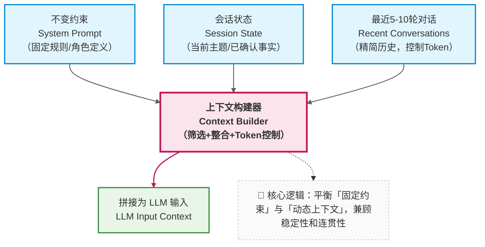
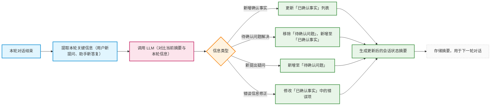
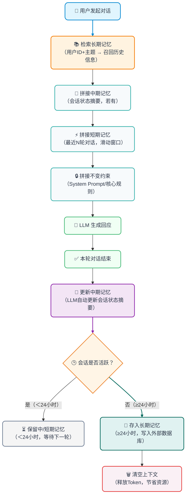

在前两章中，我们已经完成了两个关键决策：

- 否定“无限上下文”的幻想：明确上下文窗口存在硬性约束，无法承载无限制的对话信息；
- 接受“信息必须被分层管理”：将信息划分为不变约束、会话状态、瞬时上下文，优先保障高优先级信息的有效性。

接下来，我们需要面对一个更系统级的问题，当然这也是很多小伙伴在具体落地时，最容易困惑的地方

> **“记忆”是否应该只有一种实现方式？**

答案显然是否定的，就像人类会用“瞬时回忆”记住刚说的话、用“短期记忆”记住当天的任务、用“长期记忆”记住过往的经验一样，大模型应用的“记忆”也需要分层设计


**那么为什么不能用一种记忆搞定所有场景？**

> 答：短期能用，但无法规模化、稳定化。
>
> 比如我们实现了一个公司差旅助手，初期用“全量历史+摘要”的单一记忆方式，上线后很容易出现
>   1. 员工跨周期咨询时，如上一次一个月前让助手定了一张机票，输入了一些关键信息，但是没有走完流程；这一次准备让助手帮忙订机票，助手可能就直接基于上一次的输入来订机票了，而员工实际上却是要去另一个地方
>   2. 多员工并发咨询时，不同人的报销信息混杂，模型给出错误答复。
> 
> 本质是“单一记忆”无法适配“瞬时、会话、长期”三种不同的信息需求，最终导致用户体验崩塌。


---

### 8.1 技术决策视角：记忆不是功能，而是策略组合

在很多产品讨论中，“给系统加记忆” 常被当作一个简单的功能点（比如 “让模型记住之前说过的话”）。

但从工程角度看，记忆是**一组需要根据场景动态调整的策略** 

—— 不同的信息生命周期（几秒、几小时、几天）、不同的重要性，需要匹配不同的记忆方式。

比如：

- *用户当前的提问意图（“我在问报销流程”）需要 “即时记忆”，确保下一句回应不跑偏；*
- *已确认的用户身份（“市场部员工”）需要 “会话级记忆”，在整个对话过程中保持一致；*
- *三个月前用户咨询过的 “差旅政策” 需要 “长期记忆”，在用户再次提问时能快速关联。*

这些不同场景的需求，无法通过单一的 “记忆功能” 满足，必须设计分层的记忆策略。

下面用一张示意图，直观理解不同记忆策略的适配场景：




---

### 8.2 短期记忆：受控的上下文拼接（什么时候足够用）

最基础、成本最低的记忆策略是 “短期记忆”，适用于单一会话内的近期交互（通常持续几分钟到 1 小时）。

其核心设计是：

- 只保留最近 N 轮对话（N 的值根据模型窗口大小确定，通常为 5-10 轮）；
- 明确区分 `system` / `state` / `recent messages` 三个层级，按优先级拼接上下文
- Token 控制：实时统计拼接后的 Token 数量，接近窗口上限时，优先丢弃最早的瞬时对话内容，保留高优先级信息




这个策略的工程价值在于：

- **行为可预测**：由于只保留有限内容，token 数量可控，不会突然触发截断；
- **成本可控**：避免了全量历史导致的 token 爆炸，调用成本稳定，尤其适合中小规模应用；
- **实现简单**：无需复杂的存储或摘要逻辑，仅需维护一个滑动窗口，开发成本低、上线快。

但它很快会遇到边界，这也是很多开发同学会踩的坑：

> **当对话跨越更长时间或主题切换频繁时，仅靠短期记忆会导致状态丢失**

例如，用户上午9点咨询“年假政策”，告知助手“自己入职满3年”，助手确认“入职满3年可休10天年假”；下午2点，用户继续在同一个会话中咨询“年假是否可以拆分休”，此时短期记忆的滑动窗口已丢弃上午的对话，助手再次追问“请问您入职满几年？”，用户体验极差。

此时，就需要引入第二种记忆策略——中期记忆，来解决“会话级关键信息持久化”的问题。


> **高频问答：短期记忆的滑动窗口 N 怎么确定？**
> 疑问：短期记忆的“最近N轮”，N设为5还是10？有没有统一标准？
> 回复：没有统一标准，核心取决于两个因素：
>   1. 模型的上下文窗口大小（窗口越大，N可适当增大；如4k窗口建议N=3-5，16k窗口建议N=5-10）
>   2. 单轮对话的Token长度（如果用户每轮提问都很长，N需减小，避免Token溢出）
> 核心原则：确保“不变约束+会话状态+最近N轮”的总Token数，不超过窗口上限的70%（预留30%给模型回应）。

---

### 8.3 中期记忆：由 LLM 维护的状态摘要（为什么要引入）

为了避免重要状态被挤出窗口，企业知识库助手通常会引入 “中期记忆” —— 通过“会话状态摘要”来持久化关键信息，确保在对话持续数小时或主题切换时，核心状态不丢失。

请注意，这里有一个关键误区：很多开发同学会把“会话状态摘要”和“对话内容摘要”混淆，其实两者完全不同：


|类型|核心目的|内容特点|示例|
|---|---|---|---|
|对话内容摘要|总结对话的整体内容，方便用户回顾|非结构化，侧重“过程描述”|用户咨询差旅报销，先问了高铁，再问了住宿，助手告知了相关政策。|
|会话状态摘要|持久化关键决策信息，供模型后续参考|结构化，侧重“结果确认”|用户：张三（市场部，入职3年）；已确认：高铁二等座可报销、一线城市住宿上限800元/晚。|


简单来说会话状态摘要的核心不是 “总结对话内容”，而是**记录 “已确认的决策信息”**，格式通常是结构化的键值对或列表。

```text
【会话状态摘要】
- 当前用户：张三（市场部，入职时间2021年3月）
- 讨论主题：2025年新版差旅报销政策
- 已确认事实：
  1. 国内差旅住宿上限为一线城市800元/晚，二线600元/晚
  2. 高铁二等座可全额报销，一等座需部门负责人审批
- 待确认问题：
  1. 海外差旅是否适用此政策？
  2. 报销时效是否仍为3个月？
```

这类摘要的维护机制通常是：**每轮对话结束后，调用 LLM 对比新内容与当前摘要，自动更新关键信息**（新增确认项、移除已解决问题、修正错误）。

这个流程可以通过示意图直观理解：




它的核心价值是：**将分散在多轮对话中的关键信息 “浓缩固化”，避免被短期记忆的滑动窗口 “挤出”**。

即使短期记忆只保留最近 5 轮，状态摘要也能确保 “用户身份”“已确认规则” 等信息持续影响模型决策。

> 这不是对话摘要，而是**决策状态的持久化**。

---

### 8.4 长期记忆：为什么不能继续塞进上下文？

当对话场景扩展到以下情况时，仅靠短期和中期记忆（依赖上下文窗口）就会变得不现实——它们的核心局限是“无法脱离上下文窗口存在”，而窗口容量和单一会话的限制，决定了它们无法应对“跨时间、跨规模”的记忆需求：

- **跨天对话**：用户今天咨询一半，明天继续（此时会话可能已被重置，中期记忆的摘要也会丢失）；
- **多任务切换**：用户同时处理 “报销”“年假”“绩效” 多个主题（每个主题有独立的关键信息，塞进同一个上下文会导致信息混杂，模型混淆）；
- **多用户并发**：同一个助手服务多个员工，需要区分每个人的历史。

此时，继续将所有信息塞进上下文窗口会导致两个问题：

1. 窗口容量有限，无法容纳多天的状态摘要；
2. 不同用户 / 任务的信息混杂，导致模型混淆。

因此，我们需要一种 “移出上下文但可按需召回” 的记忆机制 —— 这正是**长期记忆**的核心价值。

长期记忆的实现通常依赖外部存储（如数据库、向量数据库），其核心逻辑是：

- 将不活跃的会话状态（如 24 小时未更新）从上下文移出，存入外部存储；
- 当用户再次激活对话时，通过检索（如基于用户 ID、主题关键词）将相关历史状态重新导入上下文。

以企业助手为例，具体的实现步骤通常有下面四步：

1. 存储：将不活跃的会话状态（如 24 小时未更新的会话）、用户历史咨询记录，从上下文移出，存入外部存储（向量数据库优先，方便后续关键词检索）；存储时需关联“用户ID、主题关键词、时间戳”，便于后续召回；
2. 检索：当用户再次激活对话（如第二天继续咨询）或切换主题时，模型先提取当前对话的“用户ID、主题关键词”（比如“张三、海外差旅”），通过检索工具查询外部存储，找到相关的历史记忆；

3. 召回：将检索到的历史记忆（如张三上次未完成的“海外差旅政策”咨询记录、已确认的“入职年限”），精简后重新导入上下文，结合短期、中期记忆，生成回应；

4. 更新：本轮对话结束后，更新长期记忆中的相关记录，确保历史信息的时效性（比如补充新确认的“海外差旅住宿上限”）。


> **长期记忆的核心不是 “记住一切”，而是 “在需要时，能把正确的信息带回上下文”** —— 它解决的是 “跨时间、跨规模” 的记忆问题。

此时，一个新的技术出现了：这正是`向量检索`、`RAG`等机制存在的根本原因。

### 8.5 短中长记忆协同工作流程

在实际的项目工程中，上面提到的短期、中期、长期三种记忆策略通常不是独立使用的、而是协同工作，形成完整的记忆体系，下面是一个典型的示意图




---

### 8.6 本章小结：记忆层次决定系统上限

通过本章的分析，我们可以明确：企业知识库助手的 “记忆” 是分层的策略组合，不同层次解决不同问题，三者协同，才能构建稳定、高效、用户体验好的记忆体系：

- 短期记忆：通过受控的上下文拼接，解决 “当前几轮对话的连贯性”；
- 中期记忆：通过状态摘要，解决 “会话级关键信息的一致性”；
- 长期记忆：通过外部存储与检索，解决 “跨时间、跨任务的信息召回”。

这三层记忆共同构成了系统在时间维度上的可靠性基础。但还有一个关键问题尚未解决：

> *当用户的问题超出模型自身的知识范围（比如最新的公司政策），仅靠记忆策略如何保证回答准确？*

而这自然引出了下一部分的讨论主题：我们将深入探讨 RAG（检索增强生成）技术如何与上下文工程结合，让系统的知识边界可控、可扩展。


**扩展思考**

1. 你所开发的 LLM 应用，会话持续时间通常是多久？如果是跨天对话，长期记忆的“不活跃阈值”（如24小时）如何设定更合理？

2. 中期记忆的会话状态摘要，每轮都调用 LLM 更新会增加成本，如何设计“更新触发条件”（比如仅当有新的确认项时才更新），平衡成本与效果？

3. 如果没有向量数据库，能否用“关键词匹配”替代向量检索，实现长期记忆的召回？这种方式的局限性是什么？
